## nnnn姓名（资料）

适合所有人的历史读物。每天了解一个历史人物、积累一点历史知识。三观端正，绝不戏说，欢迎留言。  

### 成就特点

- ​
- ​

### 生平

【1983年3月3日】十分之一的兵力坚守衡阳的47天，投降归来的英雄方先觉去世

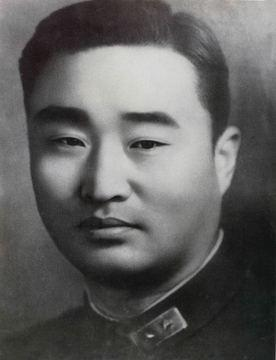

【想当律师的黄埔军长】

1905年11月22日，方先觉出生，今安徽萧县人。15岁考入徐州中学，立志成为一名律师。1924年（19岁），考入上海法政大学法律系。入学不久，接触到三民主义，决定投笔从戎，考入黄埔军校第三期。

军校毕业后，先后任排长、连长、营长。全面抗战爆发后，1939年（34岁），任预10师副师长的方先觉在安徽的青阳与贵池间，与日军展开了激烈的争夺，在阵地坚守五昼夜，升任师长。

1941年12月，日军第三次向长沙进犯，预10师参与防守，奋力打退了日军的围攻。1942年3月28日，方先觉于被提拔为第10军军长。

【保卫衡阳的1万5千人】

1944年春，日军在太平洋战场的失利，导致日军的海上交通补给线接近瘫痪。因此，日军急于打通一条大陆交通线。日军的计划是：打通粤汉、湘桂以及京汉铁路南部。6月，第四次长沙会战结束，长沙沦陷，醴陵、湘潭、株洲等地也相继失守。

第10军军长方先觉率领部队进驻衡阳，麾下有3个师，炮兵连，全军1万5千人。空军第4大队抽调出25架P-40战斗机，支援衡阳战场。

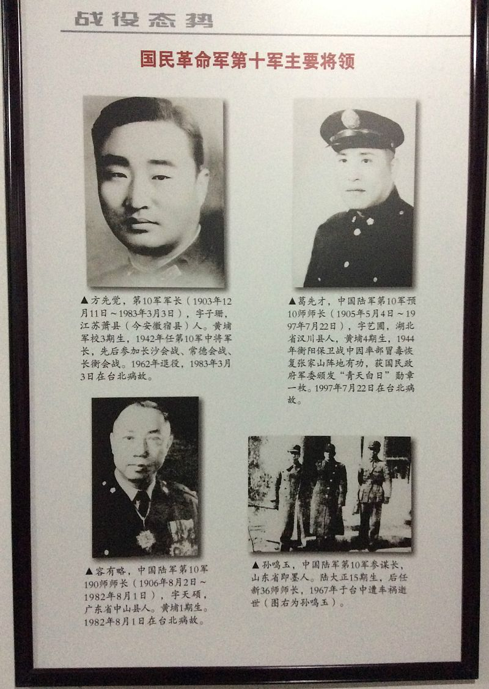

【日军的3次疯狂总攻】

6月27日——7月2日，日军发动第一次总攻击，被歼数千人，无功而返。

7月11日——7月19日，日军集结兵力，发起第二次总攻击，向衡阳城垣倾泻大量炸弹、燃烧弹和毒气弹。日军付出惨重代价，仅夺取少部分外延阵地，无所进展，只得再次停止进攻。

8月4日——8月8日，日军聚集第40、58、68、116师团及13师团一部，共11万人，发动第三次总攻。以飞机大炮向核心阵地和市区狂轰滥炸，衡阳守军，伤亡惨重，弹尽援绝。

8月8日，日军派代表入城谈判，承诺保全守军官兵安全，双方同意停战。方先觉军长与其他师长被俘，衡阳沦陷。日军指挥横山勇，授与方先觉“先和军司令”职位。

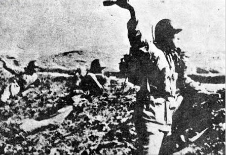

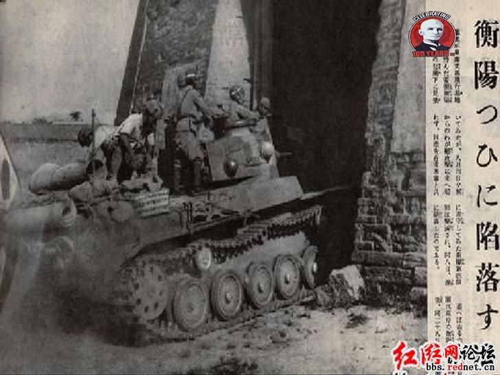

（日军攻入衡阳的报道）

【东方的莫斯科保卫战】

最终伤亡统计，方先觉的第10军，伤亡15000余人，其中阵亡约5600人，被俘约4600人；日军伤亡约70000余人，其中阵亡约48000余人。

这是中国抗日战争后期，最惨烈的一场城市争夺战，被誉为“东方的莫斯科保卫战”。也是日本战史中记载的唯一一次日军伤亡超过中国军队的战例。日方称“中日八年作战中，唯一苦难而值得纪念的攻城之战”。

8月20日，蒋介石电令全国部队向衡阳阵亡守军致敬。

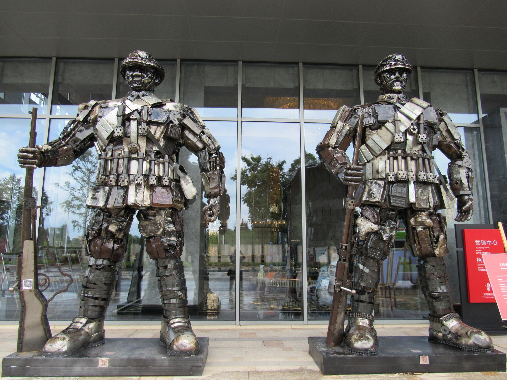

【我们的英雄回来了】

衡阳沦陷后，方先觉和众师长被囚禁于衡阳城外的天主堂。11月，方先觉在军统局特工的帮助下逃离衡阳，抵达重庆。方先觉受到各界人士的热烈欢迎，各大报纸争先报道。方先觉被任命为第36集团军中将副总司令，他和第十军各师师长均获颁青天白日勋章。

12月13日，《大公报》发表《向方先觉军长欢呼！》称：“方军长打了抗战以来最艰苦的硬仗，他最后也没失掉中华军人的节操，所以我们特别欢呼：‘我们的英雄回来了！我们的抗战精神回来了！’……语云‘知耻近乎勇’，军人最应知耻。顶天立地汉子一定要脸，方军长及第十军的将士们就是知耻有勇的标准军人。”

12月25日，延安《解放日报》发表关于方先觉投敌问题指出：“此等叛国逆贼，居然在重庆大受欢迎，被誉为‘中国军人之模范’，蒋介石对他们则‘慰勉有嘉’”。

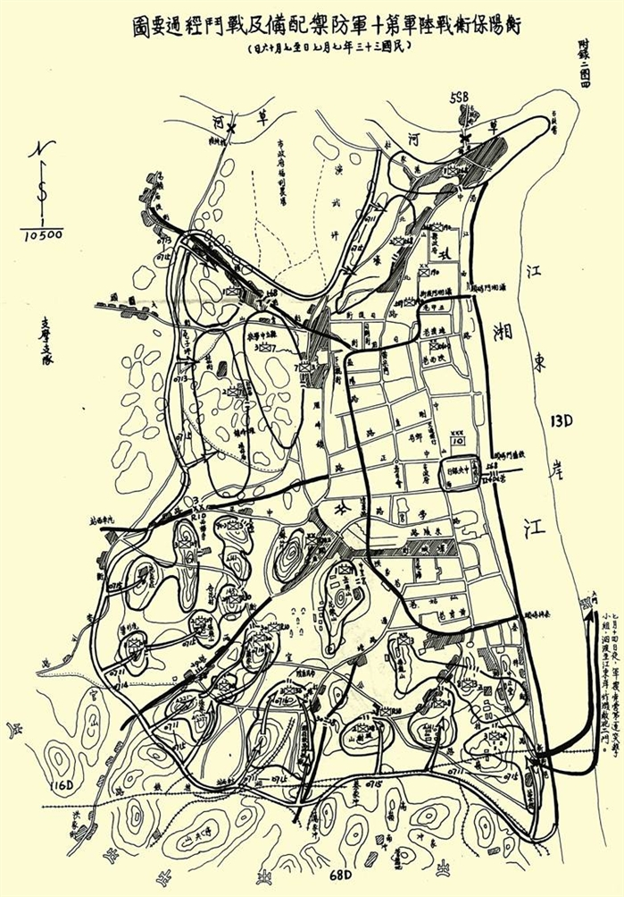

【一骂成名天下闻】

1945年5月，中国国民党第六次全国代表大会召开，在审议军事报告时，已加入中国共产党的国民党右派王昆仑提出质询意见：“第十军方某，在衡阳兵败被俘，只身回渝，招摇过市，据说是负有特殊使命，被敌方有意放回来的，现在道路传言，报章争载，也希望军事当局有个明白回答，以释群疑。”

王昆仑的质询激起会场一片喧哗，蒋介石回应：“你王昆仑是不明真相，还是蓄意攻击？你污蔑我方军长，就是污蔑我们全体抗日将士……你现在是国民党的中央委员，你公然在国民党的大会上，替共产党说话，你像国民党的代表吗？”蒋介石连骂一个多小时。台下应声围攻王昆仑，高喊：“拉出去枪毙！”王昆仑昂首步出会场。

此事轰动全社会，于右任曾作诗云：“十年中委无人知，一骂成名天下闻。”

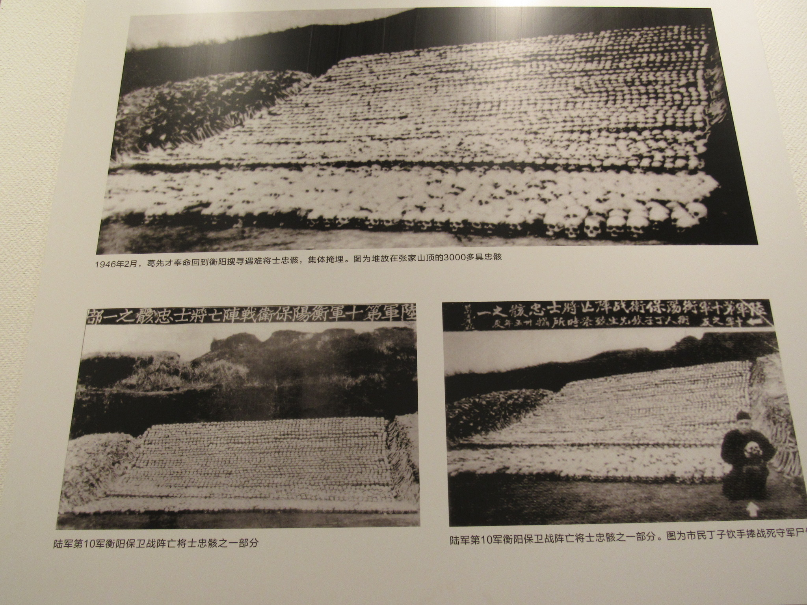

【喋血英雄中华楷模】

1947年8月10日，衡阳抗战纪念城举行奠基典礼时，蒋介石颁训词：“我第十军残余部队，喋血苦守此兀然孤城者，历时48日之久，此为全世界稀有之奇绩，而我中华固有道德之表现与发扬，亦以此为最显著。”

1949年后到台湾，曾任澎湖防卫司令部副司令官、第一军团副司令。1968年退役，后在家修身养性，勤习书画。1983年3月3日，在台北病逝，享年78岁。

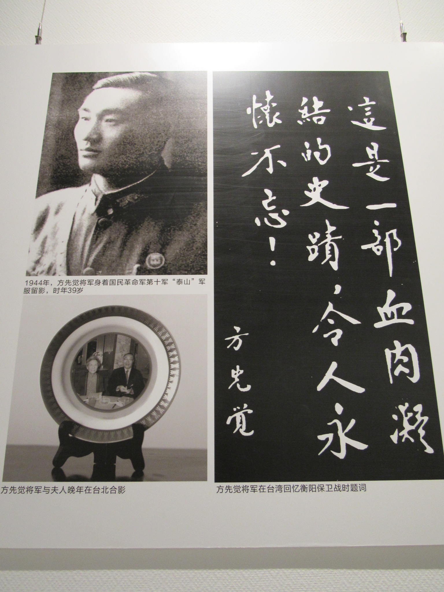

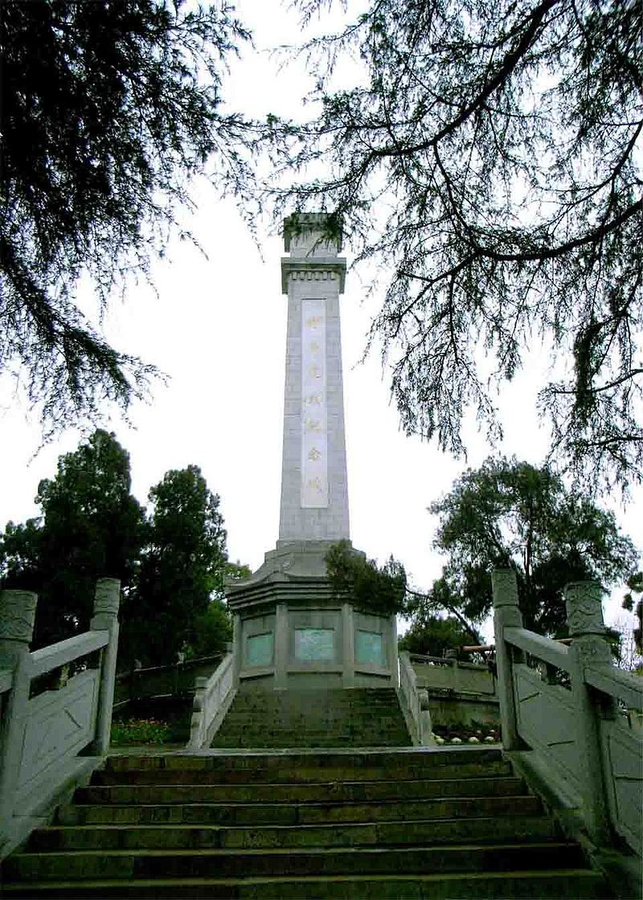

【】

### 照片

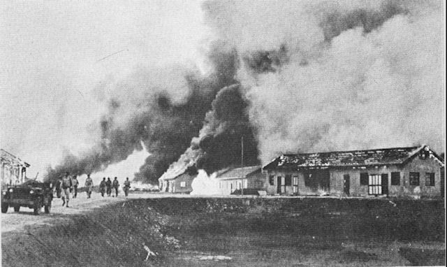

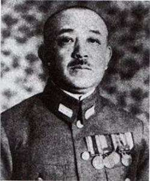

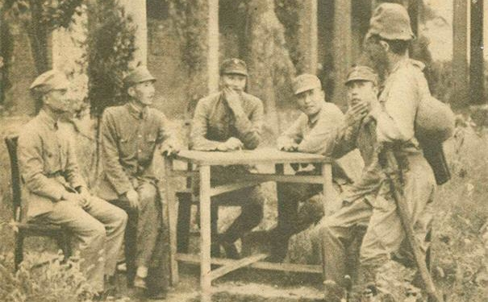

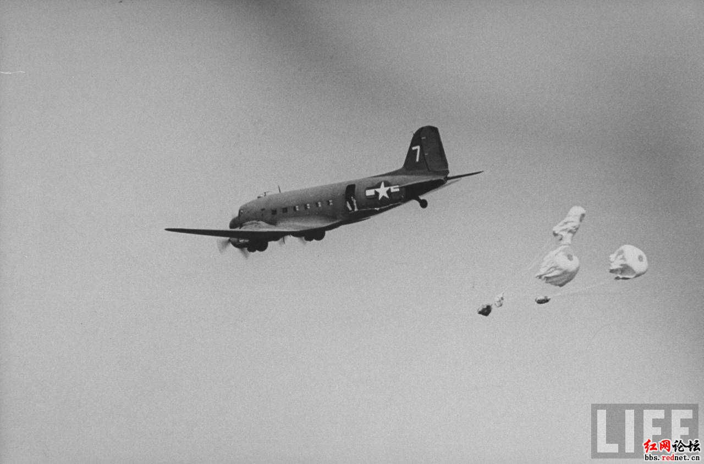

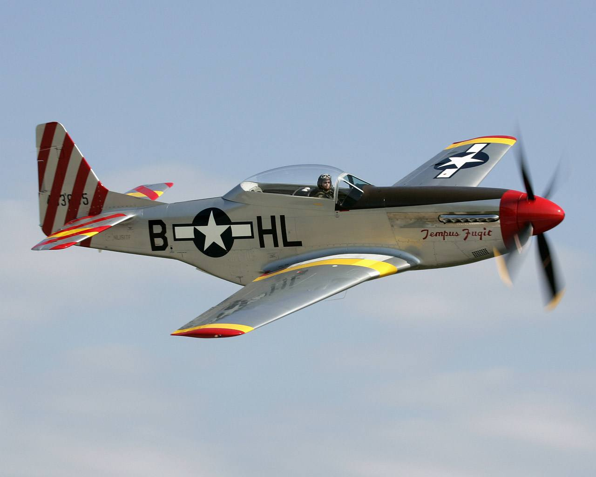

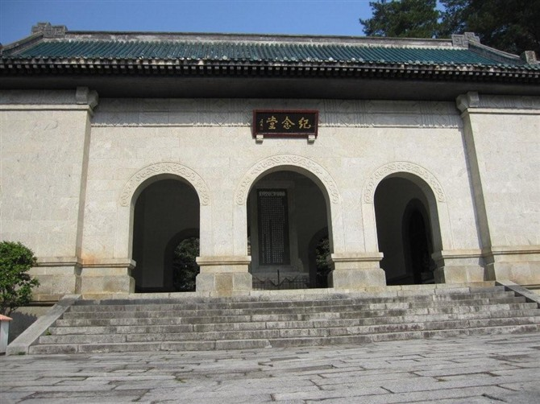

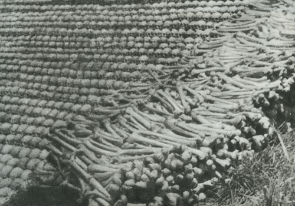

