## nnnn姓名（资料）

适合所有人的历史读物。每天了解一个历史人物、积累一点历史知识。三观端正，绝不戏说，欢迎留言。  

### 成就特点

- ​
- ​

### 生平

白求恩小传：我是一个高尚的、纯粹的、有道德的、脱离了低级趣味的、有益于人民的人

【1890年3月4日】128年前的今天，毫不利己、专门利人的国际共产主义战士白求恩出生于加拿大

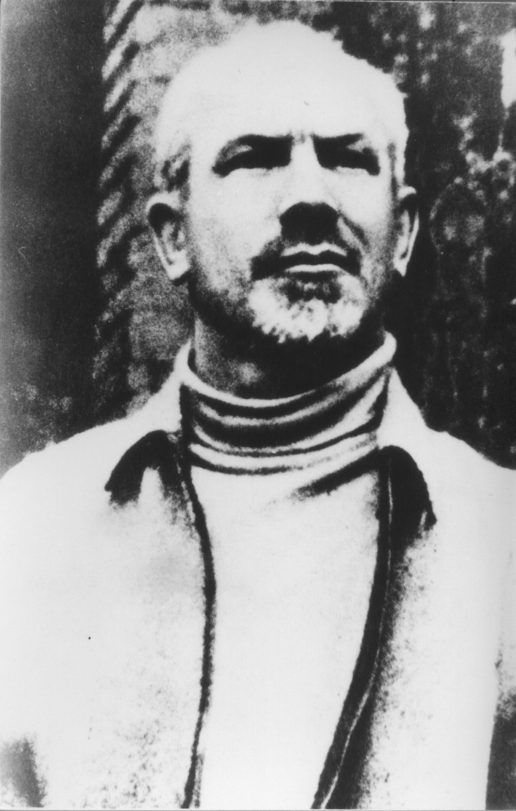

白求恩（1890年3月4日－1939年11月12日）

【结婚又离婚】

1890年3月4日，白求恩出生于加拿大的安大略省，祖先是苏格兰人。1916年（26岁），从加拿大多伦多大学医学院毕业，获得医学博士学位。同年，加入加拿大皇家海军成为一名中尉军医，参加第一次世界大战。

一战后，白求恩在美国底特律行医。1923年（33岁），到苏格兰爱丁堡参加英国外科医学会会员考试时，结识了当地的22岁的弗兰西丝，二人相恋。1924年结婚，定居底特律。

1926年，白求恩患肺结核，认为不能把病传染给妻子，独自前往纽约的疗养院治疗，妻子回到爱丁堡，一年后离婚。

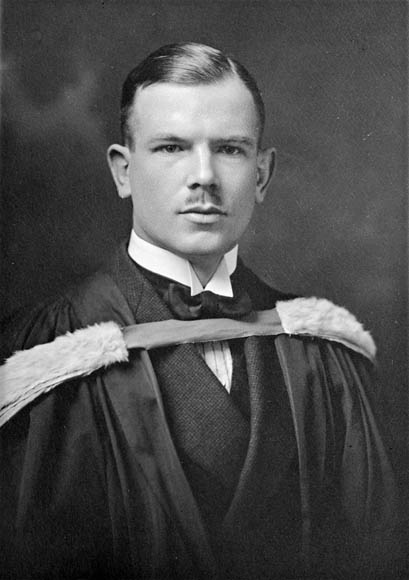

【复婚又离婚】

白求恩在自己身上试验“人工气胸疗法”，并发明了一系列的胸外科手术器械，如“白求恩肋骨剪”。康复后，他给弗兰西丝去信，二人于1928年在蒙特利尔复婚。

白求恩在蒙特利尔任胸外科医生，开始接触了共产主义思想。1931年1月，白求恩在《加拿大医生》杂志发表一篇文章《从医疗事业中清除私利》：“穷人有穷人的肺结核，富人有富人的肺结核。穷人得了它就会死去，而富人却能活下来。”

由于白求恩过于专注工作，1933年与弗兰西丝再次离婚。两人没有子女，但仍然保持着通信联系。

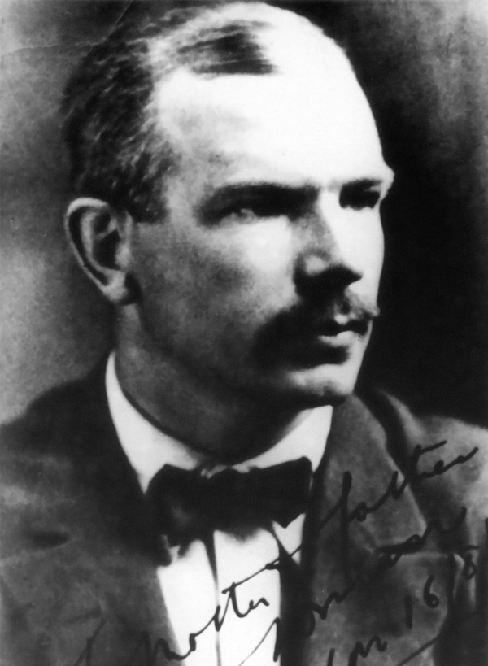

【愿意去中国的反法西斯志愿者】

1935年10月，白求恩加入了加拿大共产党。

1936年10月29日至1937年5月，白求恩作为反法西斯志愿者，率领一支加拿大医疗队，投身西班牙内战。他创办了一个移动的伤员急救系统，是日后被广泛采用的移动军事外科医院的雏形。为了抢救失血过多的伤员，他发明了世界上第一种运输血液的方法。

1937年7月30日，白求恩参加美国洛杉矶医疗局举行的欢迎“西班牙人民之友”宴会，遇到了中华全国各界救国联合会的陶行知。陶行知介绍了中国的抗日战争形势，白求恩当即表示：“如果需要，我愿意到中国去！”

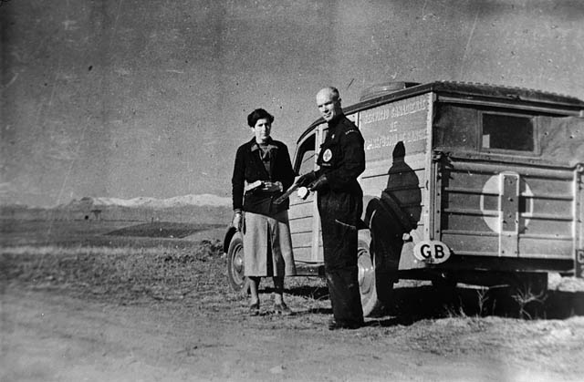

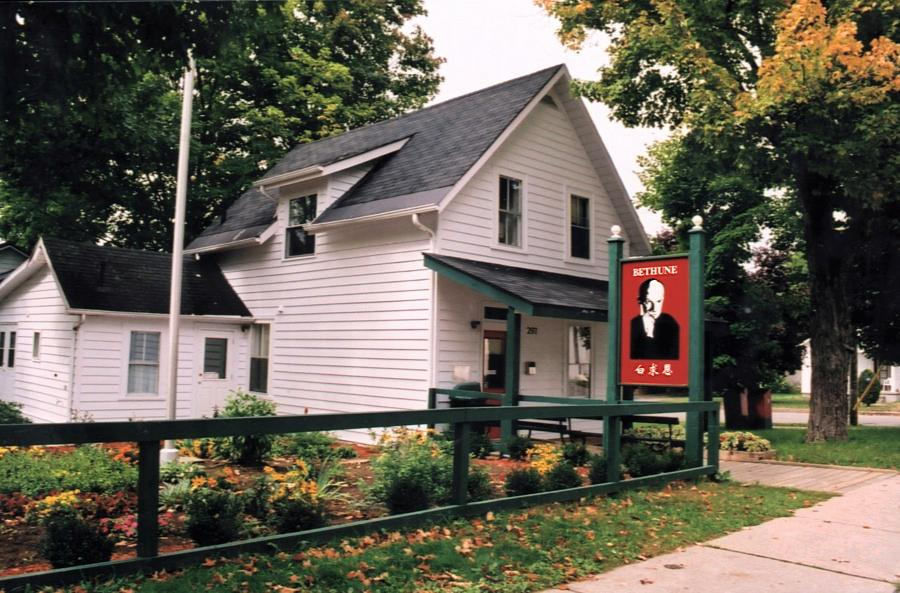

【十辆大车的医疗物资】

1937年12月，受美国共产党和加拿大共产党的派遣，受国际援华委员会的资助，白求恩组建了加美医疗队。医疗队共三人，除白求恩外，有加拿大籍女护士简·伊文，美国外科医生帕森斯。

1938年1月，加美医疗队携带一批药品和手术器材，抵达中国。医生帕森斯留在了武汉国统区，而白求恩决定去帮助中国共产党。2月，经周恩来安排，白求恩与伊文和运送医疗物资的数十辆大车离开武汉，经战乱中的河南、陕西，运到了临汾附近的八路军总部。

3月31日，白求恩抵达延安。第二天，会见毛泽东。

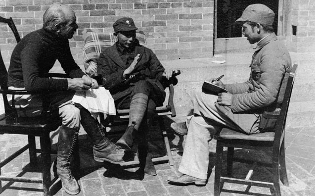

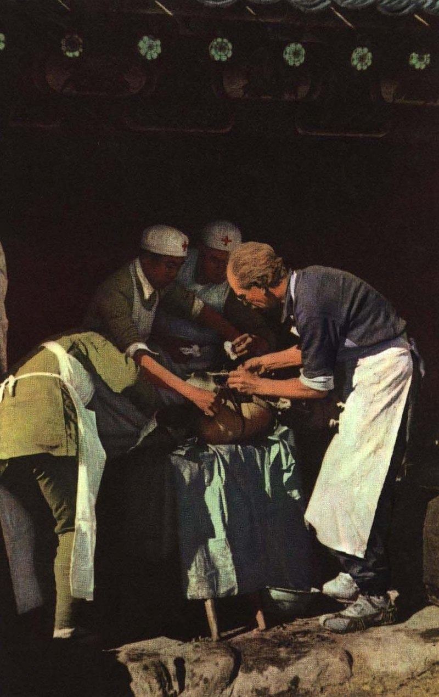

【留在中国的土地里】

1938年5月，白求恩率一批医护人员离开延安，前往晋察冀边区，成了一名战地医生。而简·伊文留在了陕甘宁晋绥边区，后于1939年初赴皖南新四军总部工作半年。

1939年10月29日，在涞源县摩天岭战斗中，为一名腿部受重伤的伤员做手术，一片碎骨刺破了白求恩的中指。3天后，白求恩为一名颈部患丹毒合并蜂窝组织炎的伤员做手术，手指伤口遭到感染。11月12日，因败血症在河北省唐县黄石口村去世。

白求恩在中国共1年9个月17天，曾创下冀中齐会战斗中，在69个小时内为115名伤员动手术的纪录。1939年12月1日，延安举行了白求恩追悼大会。他的遗体葬在唐县，1949年迁葬到石家庄的华北军区烈士陵园。

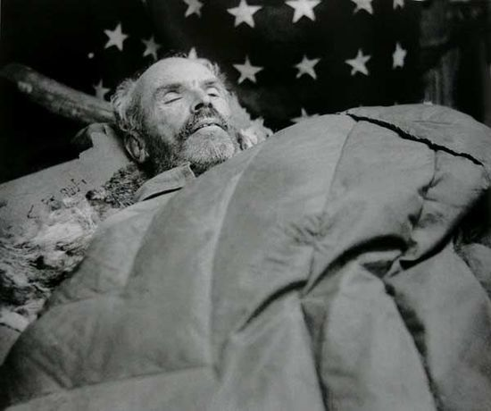

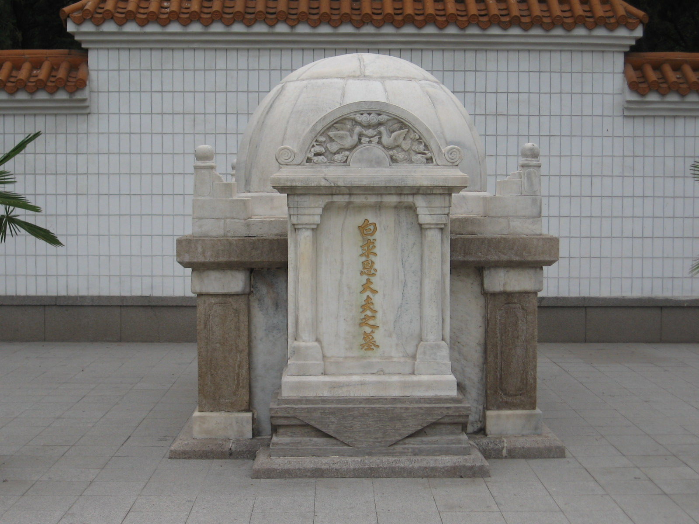

【留在中国人的心中】

1939年12月21日，毛泽东为八路军政治部、卫生部将于1940年出版的《诺尔曼白求恩纪念册》专门写了一篇文章《纪念白求恩》。文中说：“我们大家要学习他毫无自私自利之心的精神。从这点出发，就可以变为大有利于人民的人。一个人能力有大小，但只要有这点精神，就是一个高尚的人，一个纯粹的人，一个有道德的人，一个脱离了低级趣味的人，一个有益于人民的人。”

这篇文章后来和毛泽东的另外两篇文章《为人民服务》和《愚公移山》，一起成了所有中国人都要背诵的“老三篇”。白求恩的名字也因此而家喻户晓。

他在加拿大远不如在中国有名。1970年，中加建交，加拿大政府购下他的旧居，布置成了“白求恩纪念馆”。1996年，白求恩故居被列入加拿大国家文化遗产。白求恩被列入加拿大医学名人堂。

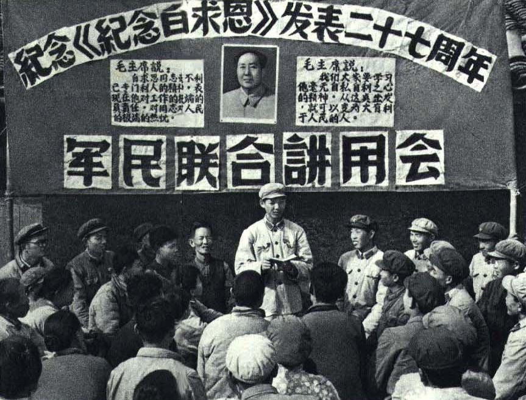

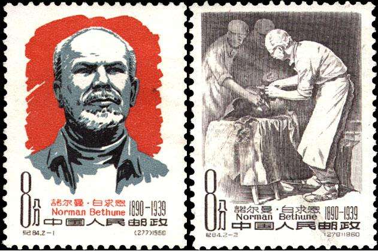

