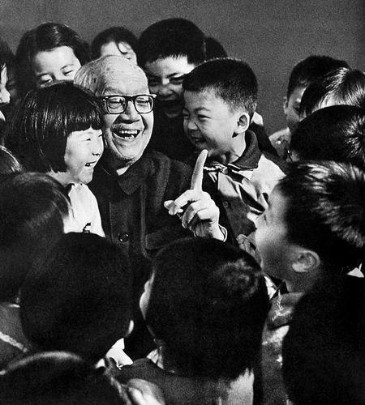
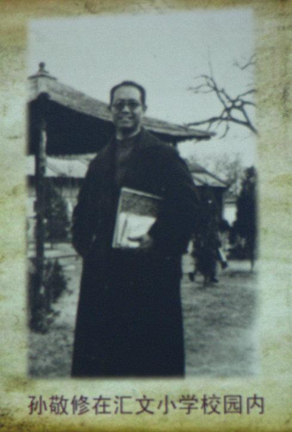
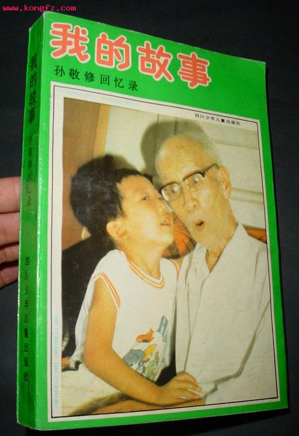
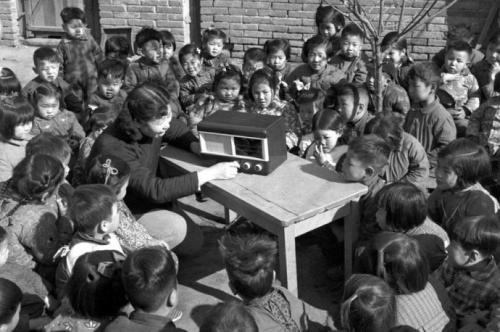
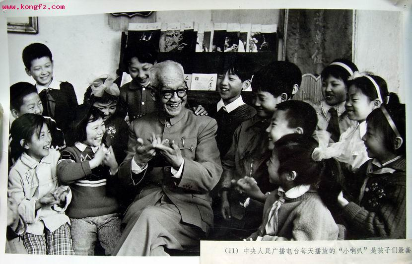
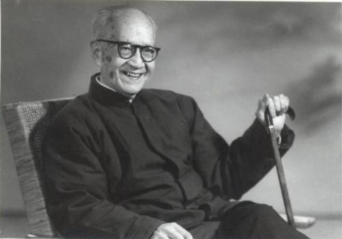
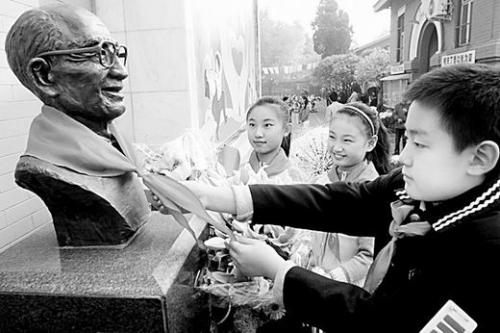
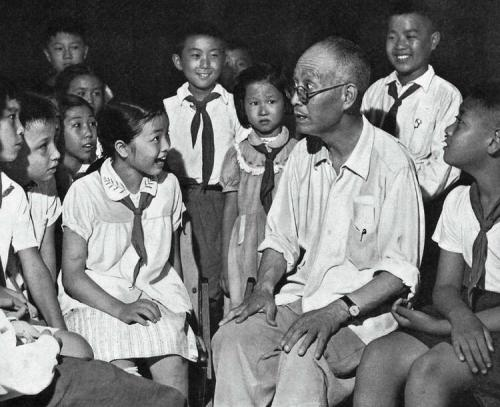
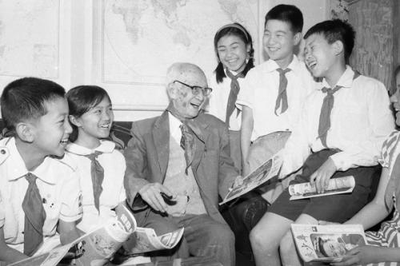

## nnnn姓名（资料）

适合所有人的历史读物。每天了解一个历史人物、积累一点历史知识。三观端正，绝不戏说，欢迎留言。  

### 成就特点

- ​
- ​

### 生平

孙敬修小传：小喇叭开始播音了，今天讲一讲我自己的故事

【1990年3月5日】28年前的今天，讲了60年故事，陪伴几代人童年的故事爷爷孙敬修去世

孙敬修（1901年10月12日－1990年3月5日），他播讲的故事伴随几代人度过了童年时光，被称为故事爷爷。

【为了上学的基督徒】

1901年10月12日，孙敬修生于北京南城一个贫民家庭中，父母是早年逃荒来的河北农民。5岁时，父亲前往非洲打工3年。回国后，父亲在胡同里摆起书摊，给居民说书讲故事为生。这段经历，对孙敬修有着非常深刻的影响。

然而1年后，父亲病重不治，母亲和9岁的孙敬修接受洗礼，成为基督徒。孙敬修得以进入教会开办的汇文大学附属小学。1916年（15岁），孙敬修小学毕业，进入师范学校——京兆师范学校。

【什么课都教的故事爷爷】

1921年，孙敬修从师范学校毕业后，先后在几个学校短期任教，最后稳定在了北平汇文第一小学。他在这里任教长达35年，教过国文、算术、美术、音乐、自然、历史和地理，先后担任过初级部主任、教导主任、代理校长等职务。周末常给住校的学生讲故事。

1931年（30岁），孙敬修应北平教育局的邀请，在广播电台录制给少儿讲故事的节目。这天中午，一个《狼来了》的故事通过广播在北平上空传播。从此，他的人生开始了一个全新的起点。在此后的60年里，孙敬修的故事通过电波传遍了中国大地，成为一代又一代孩子心中的故事爷爷。

【小喇叭开始播音了】

1937年，北平沦陷，孙敬修以柳稚心的名字，继续在日伪控制的广播电台，继续制作和播出儿童故事、童谣等节目。

1951年5月1日（50岁），孙敬修进入新成立的中央人民广播电台，在儿童节目“小喇叭”中面向全中国的小朋友播讲故事。小喇叭节目的开始曲和孙敬修爷爷娓娓动听的故事，成为了很多人童年最美好的回忆。

1957年，孙敬修离开了汇文一小，调到北京市少年宫任辅导员，专职给小朋友讲故事，直到1966年退休。

【改名入党的79岁老人】

1966年8月24日，孙敬修在自家楼下写了张大字报，题目是“更名启事”，他改掉了自己用了65年的名字。他在日记中郑重地写道：“经电台同志们同意，我改名为“孙灭修”，已在派出所登记。”那段封闭而冷漠的岁月几乎使孙敬修绝望。

文革中，孙敬修离开了播音话筒，直到1978年才又回到电台讲故事。1980年，79岁的孙敬修加入中国共产党。1987年，获全国热爱儿童荣誉奖。

1990年3月5日，孙敬修病逝，葬于北京香山万安公墓，享年89岁。陪伴他的，除了老伴儿外，还有一条孩子们送给他的红领巾。

【几代人童年的最美时光】

孙敬修一生讲了上万个故事。他讲的故事生动有趣，声情并茂，深受孩子们的喜爱，影响了几代青少年。孩子们称他为“故事爷爷”。

除自己创作之外，他广泛借鉴古今中外民间故事的优秀素材，按照儿童好奇的心理特点，改写了大量趣味横生的故事。由孙敬修播讲的系列儿童故事《西游记》，是最有代表性的系列故事之一。

他还用自己的积蓄设立了孙敬修儿童故事研究基金会，培养了包括鞠萍在内的一大批儿童节目主持人。

### 

