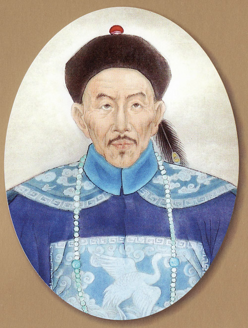
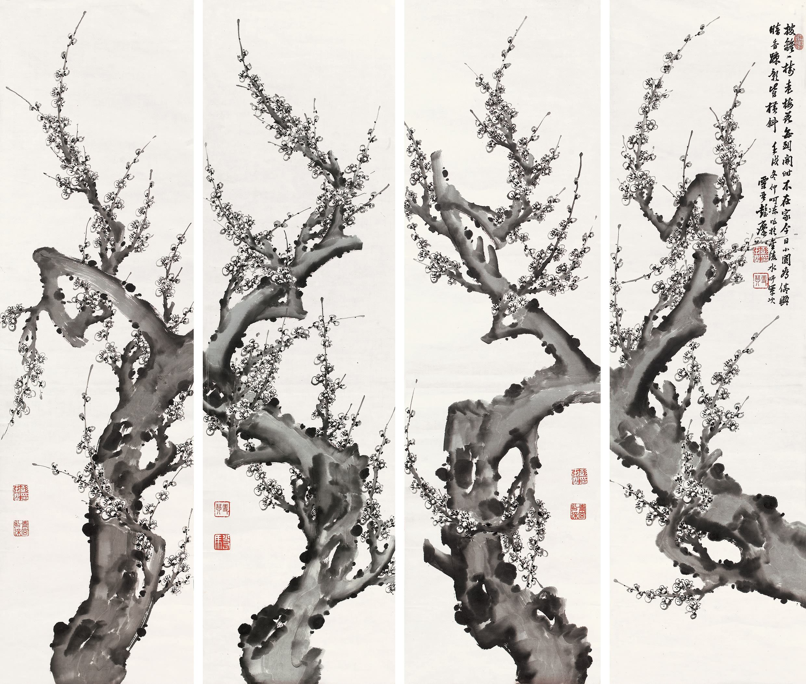
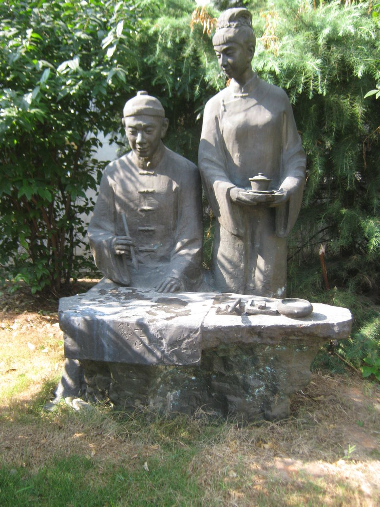
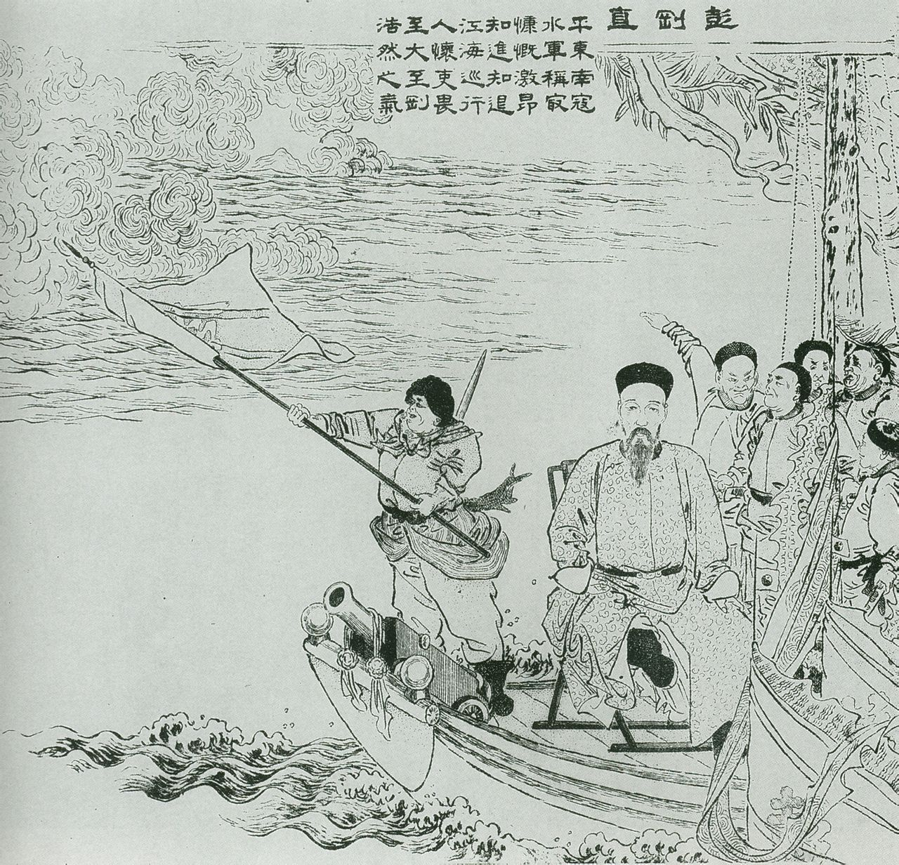
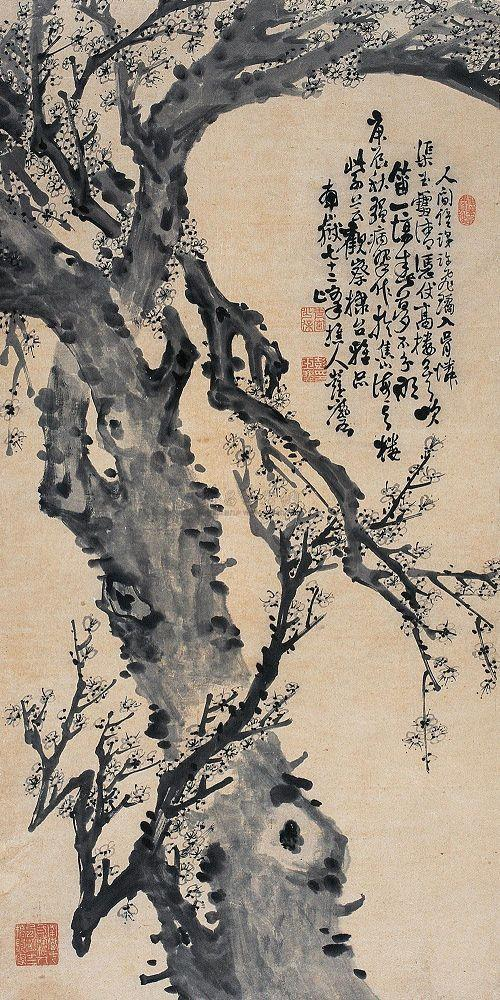
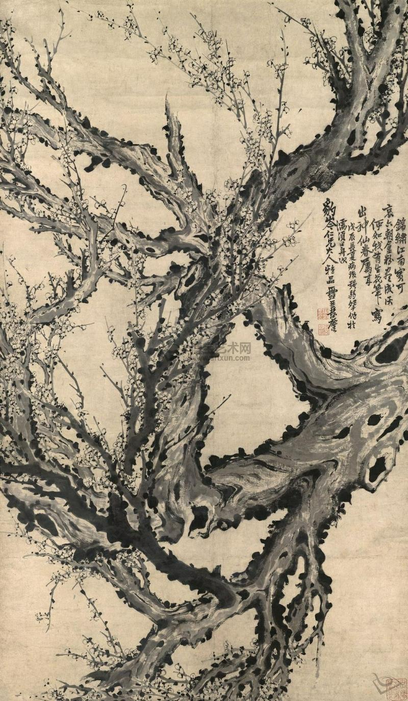
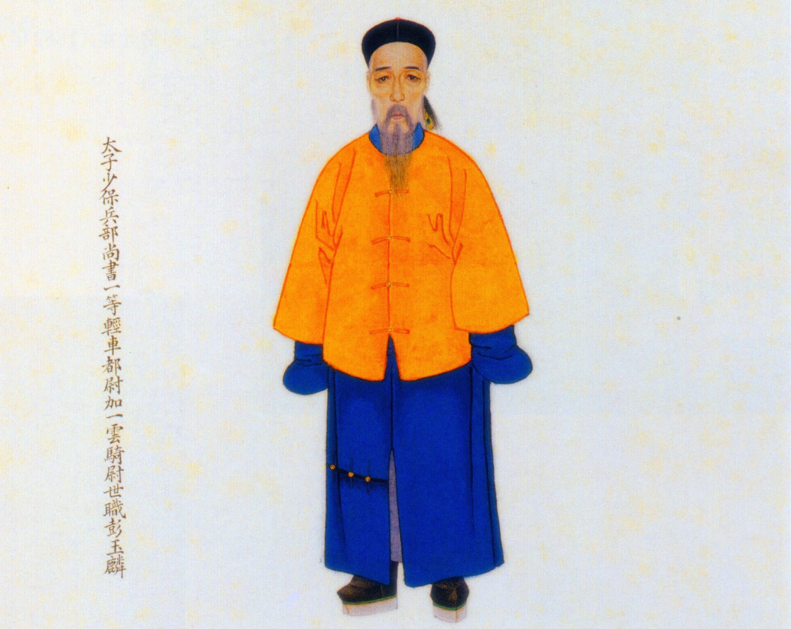
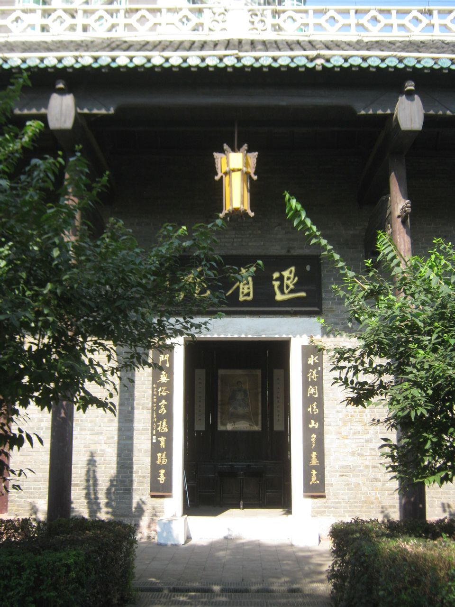

## nnnn姓名（资料）

适合所有人的历史读物。每天了解一个历史人物、积累一点历史知识。三观端正，绝不戏说，欢迎留言。  

### 成就特点

- ​
- ​

### 生平

【1890年3月6日】128年前的今天，为初恋情人画一万幅梅花的大清三杰之一彭玉麟去世

彭玉麟（1816年12月14日－1890年3月6日），祖籍湖南衡阳渣江。湘军水师创建者，是击败太平天国的重要力量，堪称中国近代海军奠基人。彭玉麟与曾国藩、左宗棠并称大清三杰。又与曾国藩、左宗棠、胡林翼并称大清“中兴四大名臣”。

他一生画梅花上万幅，只是为了怀念初恋情人。他6次辞去高官，解甲归田。他刚直清廉，嫉恶如仇，民间流传：“彭公一出，江湖肃然。

【一万幅梅花图怀念初恋】

1816年12月14日，彭玉麟出生，祖籍湖南衡阳渣江。7岁时，父亲去世，家产被族人霸占，母子只得避居衡州。彭玉麟少年时，在汉军绿营衡州协标临时写文书，养家糊口。知府无意见到他的文章，很惊奇，将他招入府署读书。

1843年（27岁），因舅舅病故，彭玉麟将外祖母接到衡阳一起居住。外祖母带有一年龄相仿的养女，名叫梅姑，两人相恋。因辈分关系，两人不能结婚。两年后，梅姑出嫁，彭玉麟也与他人结婚。后来，梅姑因难产而死，彭玉麟一生画梅，以怀念梅姑。

彭玉麟一生画了上万幅梅花图，并题上咏梅诗，寄托他对梅姑的思念。尤其他的“墨梅图”更是冠绝，与郑板桥的墨竹齐名，被称为“清代书画二绝”。2008年，央视《寻宝》节目录制《寻宝：走进衡阳》特辑，彭玉麟的一幅墨梅图被评为“衡阳民间国宝”。

【所向披靡的巴图鲁】

1850年（34岁），彭玉麟随同衡州协标兵镇压农民起义，开始崭露头角。1853年（37岁），彭玉麟受曾国藩邀请，加入湘军，在衡州创办湘军水师。1854年2月25日，曾国藩发布《讨粤匪檄》，督湘军水师、陆师共计一万七千余人，自衡州启程，开始北伐。

4月28日，彭玉麟在湘潭大败太平军水营。随后攻陷岳阳，清廷赏彭玉麟同知衔，并赏戴花翎。随后又在武汉、田家镇连败太平军水师，烧毁四千多艘战船，清廷赏彭玉麟巴图鲁名号。

【湘军水师的分分合合】

湘军趁胜追击，进入九江，部分水师冲入鄱阳湖内，被太平军切断归路。自此，湘军水师分为内湖和外江两部分。1855年，太平军再占武汉，彭玉麟率外江的湘军水师烧毁太平军船只三百余艘，重新占领武汉。

不久，彭玉麟因伤回衡州养病。在曾国藩屡次催促下，他伪装成游学乞食者，敝衣徒步七百里，到达南昌，统领内湖水师。1857年10月，彭玉麟率湘军内湖水师攻克湖口，湘军内湖水师和外江水师，时隔两年半后，重新会合。

1858年5月，攻克九江府城，清廷赏彭玉麟布政使衔。

【切断太平天国的命脉】

1860年6月，彭玉麟率湘军水师，攻克安庆外围重镇枞阳。10月，攻克江西都昌县。1861年9月，攻克湖北黄州府。1862年5月，攻克安徽太平府，进抵天京江宁护城河口。1863年11月，攻陷江苏高淳县、溧水县。至此，太平天国首都天京的所有物资补给线全部被切断。

1864年，清军攻克天京，太平天国失败，清廷封彭玉麟一等轻车都尉世职，并赏加太子少保衔。

【六辞高官的大清三杰】

第1次：1861年（45岁），曾国藩任两江总督，任彭玉麟为安徽巡抚。他却一连三次辞谢，理由是自己长在军营，不善于民政。朝廷只好收回成命，改任兵部侍郎，依旧留在前线督带水师，他才坦然接受。

第2次：1865年（49岁），朝廷任命他署漕运总督。漕运总督掌管鲁、豫、苏、皖、浙、赣、湘、鄂八省的漕政，是众人垂涎的天下一流肥缺。但他又两次谢绝，理由是不懂漕政，性情褊急、见识迂愚，不会与各方圆通相处。朝廷只得作罢。

第3次：1868年六月（52岁），上疏请辞已当了七年的兵部侍郎。原因是当年从军时，三年母丧只守了一年，现在国家安定，他理应解甲归田，将剩下的两年补满。这次朝廷没有挽留，答应了他的请辞。

第4次：1872年（56岁），彭玉麟离职休养四年后，朝廷又任命为兵部侍郎，兼任光绪帝大婚庆典宫门弹压大臣。庆典结束后，他再次请辞兵部侍郎。朝廷接受后，任命他每年巡视长江水师。后来长江水师被李鸿章全盘接收，成为北洋水师最主要力量。彭玉麟堪称近现代中国海军的创始人。

第5次：1881年七月（65岁），朝廷任命他为两江总督，兼南洋通商大臣。两江辖地广阔，物产丰茂，南洋通商大臣更是权大责重，朝中重臣曾国藩、李鸿章等人都曾任过此职。彭玉麟两次请辞，朝廷无奈，只好把这个职位交给了左宗棠。

第6次，1882年，朝廷任命彭玉麟为兵部尚书。与过去一样，他接旨后即请辞，但朝廷未准。不久，中法战争爆发，他不再推辞，奉旨到广东组织备战。1885年，率老将冯子材抗击法军，取得镇南关大捷。他多次上疏主战，反对和议，但未得到支持。

中法战争胜利结束后，便上疏请辞兵部尚书，朝廷未予接受。他又于这年八月、第二年八月、第三年七月、第四年六月，接连四次上疏请求辞职，朝廷只得最终接受。

1890年3月6日，病逝于衡州退省庵，享年74岁。赐太子太保，谥刚直，并建专祠。

【刚直清廉的彭公】

彭玉麟是有名的“清官”，他带领水军期间，本应得养廉银二万一千五百余两，全数上交国库充作军饷。他的刚直清廉，与曾国藩的家书理学齐名。

1864年，曾国藩的心腹犯事，彭玉麟将他割耳撤职，气得曾国藩去信责问：“重责割耳，谓非有意挑衅，其谁信之？……此等举动，若他人以施之阁下，阁下能受之乎？”

彭玉麟晚年巡视长江，曾先后弹劾官吏一百余人，毫不留情面。当时民间流传：“彭公一出，江湖肃然。

（彭玉麟老年居住的衡阳退省庵）

