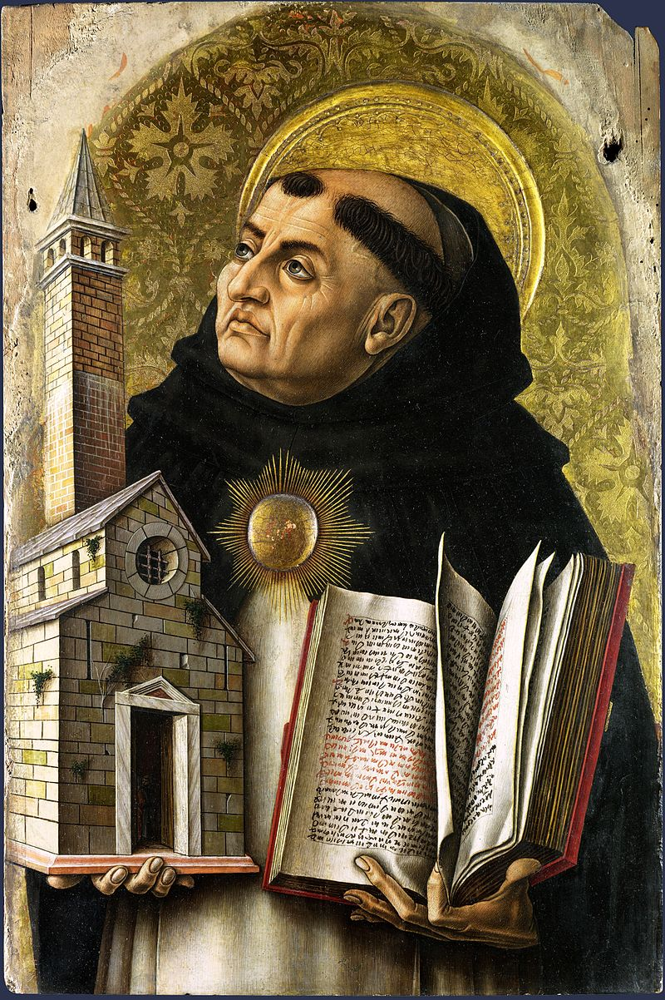
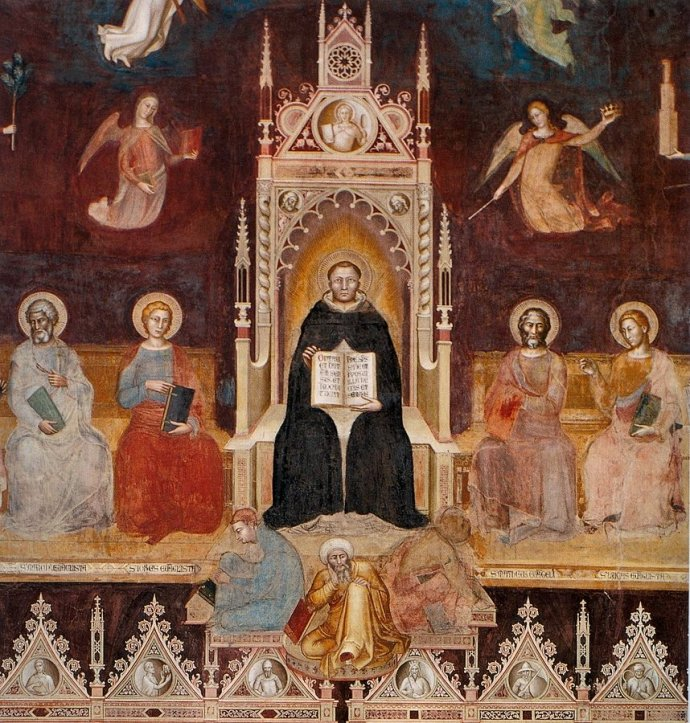
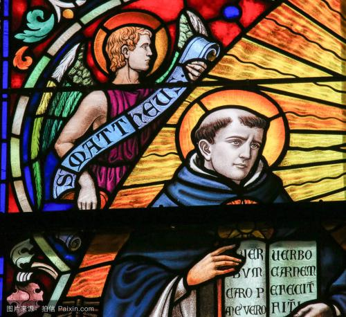
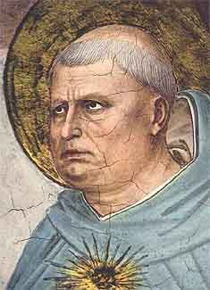
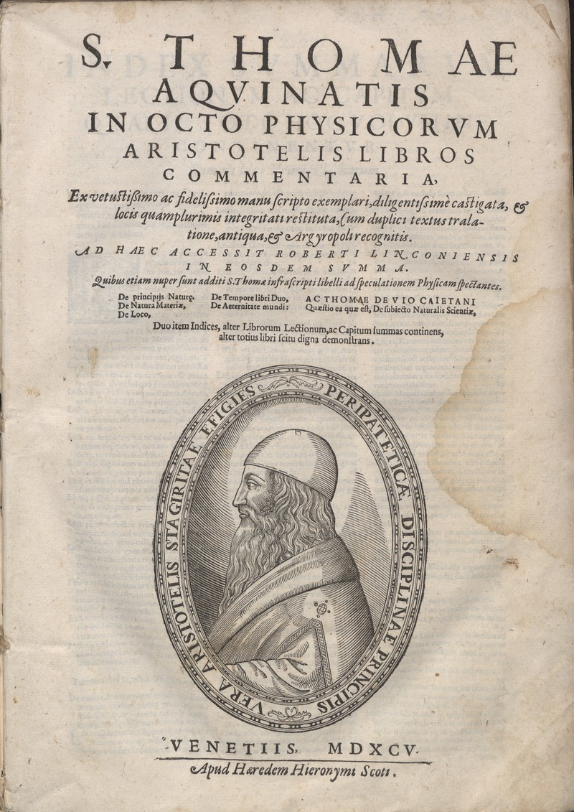
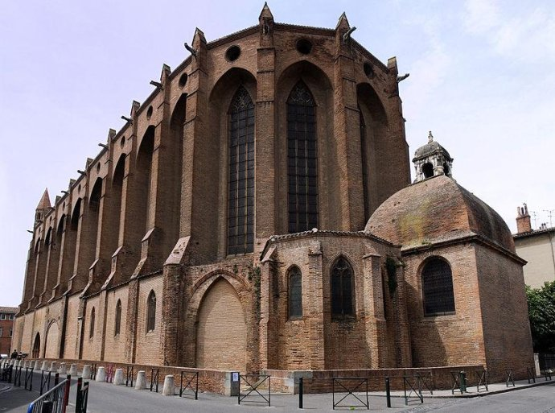
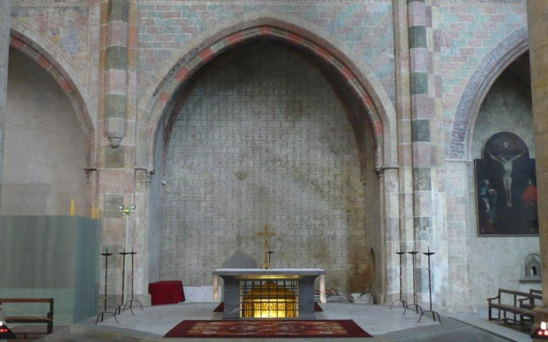
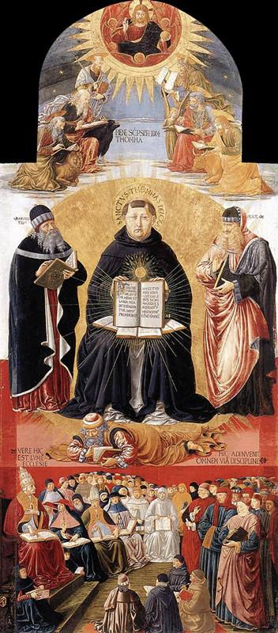
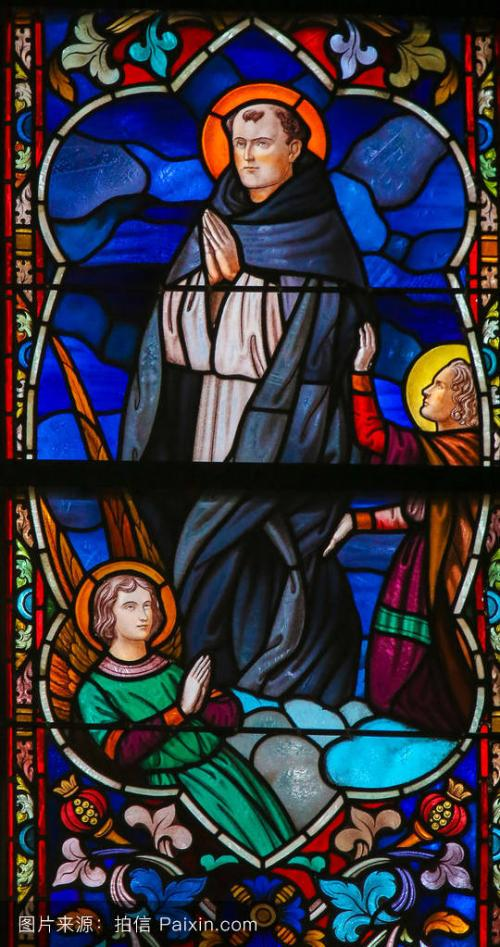
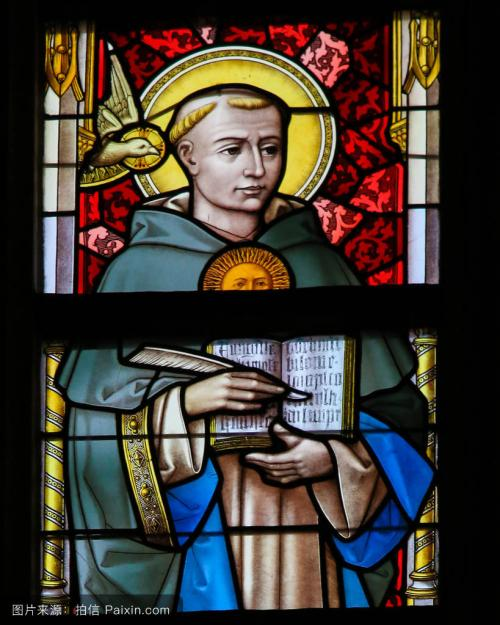

## nnnn姓名（资料）

适合所有人的历史读物。每天了解一个历史人物、积累一点历史知识。三观端正，绝不戏说，欢迎留言。  

### 成就特点

- ​
- ​

### 生平

【1274年3月7日】744年前的今天，5种方法证明上帝存在，将神学和科学融合的神学之王阿奎那去世

圣托马斯·阿奎那（St. Thomas Aquinas，约1225年－1274年3月7日）欧洲中世纪经院派哲学家和神学家。他撰写的著作《神学大全》，逻辑严密，将神学和科学融合，成为天主教哲学的重要基础。他用5种逻辑方法，证明上帝的存在。

天主教会认为他是史上最伟大的神学家，将其评为35位教会圣师之一，也被称作神学之王、天使博士或全能博士。

【清心寡欲的黑衣修士】

1225年，阿奎那出生于意大利那不勒斯王国的罗卡塞卡。他的父亲是该地的领主，叔叔是本笃会修道院的院长。阿奎那5岁进入修道院学习，计划继承叔叔的职业。16岁，进入那不勒斯大学，在那里出乎意料地加入了多明我会。

多明我会是天主教托钵修会的主要派别之一。会士均披黑色斗篷，因此被称为“黑衣修士”。托钵修会主张，不建立任何修院与教堂，他们以乞食为生，专注于宗教工作，热心布道，甘愿过清心寡欲的生活。

家人因此非常不高兴，在去罗马的路途中，阿奎那被兄弟逮住，押送回城堡，监禁了一两年。最后在教皇诺森四世的干预下，家人妥协了，阿奎那多明我会的会服。

【亚里士多德的神学博士】

1244年（19岁），他被送到科隆的多明我神学院，师从大阿尔伯特学习哲学和神学。1245年，他跟随大阿尔伯特去巴黎大学三年。期间，他卷入了大学与天主教修士之间有关教学自由的纠纷，阿奎那作为辩护者，击败了当时相当知名的大学校长圣阿穆尔，大获全胜。

1248年，他获得神学的学士学位，返回科隆担任讲师。与哲学家大阿尔伯特的共事经历，将他造就成为睿智的学者，并终身跟从亚里士多德的哲学方法论。

1252年（27岁），阿奎那前往巴黎攻读硕士，1256年取得学位和教职，后来他又取得神学博士学位。

【神不让写《神学大全》】

在随后的20年里，阿奎那在巴黎、罗马和一些意大利城市之间，频繁地旅行、讲学和传教。他写下许多的训诫、问答集、以及授课笔记，并撰写他的大作《神学大全》。

1273年12月6日（48岁），在一次弥撒仪式中，阿奎那称自己看见了神迹，停止了写作。当被问及为何封笔时，阿奎那答道：“我写不下去了……与我所见和受到的启示相比，我过去所写的一切犹如草芥。”

【天堂第4层的天使博士】
所有与阿奎那相识的人都对他印象深刻。据同时代的人描述，阿奎那是个大块头，肥胖而且皮肤黝黑，头颅硕大，发髻很高。他很有教养，举止端正，温文尔雅，令人如沐春风。在争论中，他保持克制，用人格魅力和渊博的学识赢得对手的尊重。他能够系统、清晰和简明地表达他人的意见，思想兼容并包。

1274年3月7日，阿奎那在旅途中病情恶化，他无法抵达多明我会的教堂，只好在一座熙笃会的教堂里，经历七周的病痛煎熬后去世了。1369年，阿奎那的遗体移至法国的雅各宾教堂安葬。

他获得了教会赐予的“天使博士”的头衔。但丁在《神曲》中，将阿奎那布置在第四层天堂，与其他伟大的宗教思想家并列一堂。1323年6月18日，天主教教会正式宣布将阿奎那封为圣人。

【哲学与神学都来自上帝】

阿奎那的《神学大全》被教会视为最重要的著作之一，甚至与圣经和教谕（Decretal）并列。1879年8月4日，教皇通谕指出：阿奎那的神学是构成天主教思想的关键著作，所有的天主教学院和大学都必须教导阿奎那的理论。1880年，阿奎那被封为所有天主教教育机构的主保圣人。

阿奎那认为，知识有两种。一种是“求得的知识”、“本性的知识”，就是哲学，是来自自然界的；另一种是“启示的知识”、“超性的知识”，就是神学。超性知识的接纳是信仰，本性知识的获得是理性。超性的知识与本性的知识都是真理，相辅相成，彼此毫无冲突。所以，哲学与神学并不矛盾，因为两者均由上帝而来，而上帝本身即是永恒的真理，真理与真理不可能相互矛盾。

【论证上帝的存在】

阿奎那在《神学大全》中，提出了五种逻辑论证上帝存在的方法。

1、初始的推动者论证：

任何一个运动的物体，必然是由另一个运动的物体推动的。而这另一个运动的物体，又必然是被另一个运动的物体推动。然而，这种关系不能推至无穷，因此必定有一个初始的推动者。这个初始的推动者，不由其他者推动，它就是神。

2、第一因论证：

根据因果关系，任何一个物体，都是另一个物体作为“因”，所产生的“果”。同样，这种关系不可能推至无穷。因此，必定有一个初始的“因”，那就是神。

3、偶然性论证：

许多事物的存在，只是偶然的。但是，不可能所有的事物都是偶然存在的，否则必然会在某种情况下，所有的事物都不存在。这样之后，任何事物都无法存在了。这是荒谬的。因此，必然有一个事物是必然存在的，那就是神。

4、最高级的论证：

不同的事物的性质，是有差异的，是有等级分别的。那么什么东西，是最“高级”、最完美的呢？那就是神。

5、目的因论证：

任何事物都有它的目的，比如，天空下雨是由于动植物需要成长，人生有眼睛是由于要看见外界。然而，这些事物的运动是没有智慧的，但有目的的运动只能够是由于智慧而产生。因此，必然有一个智慧引导着万物向它们的目的运动，这就是神。

