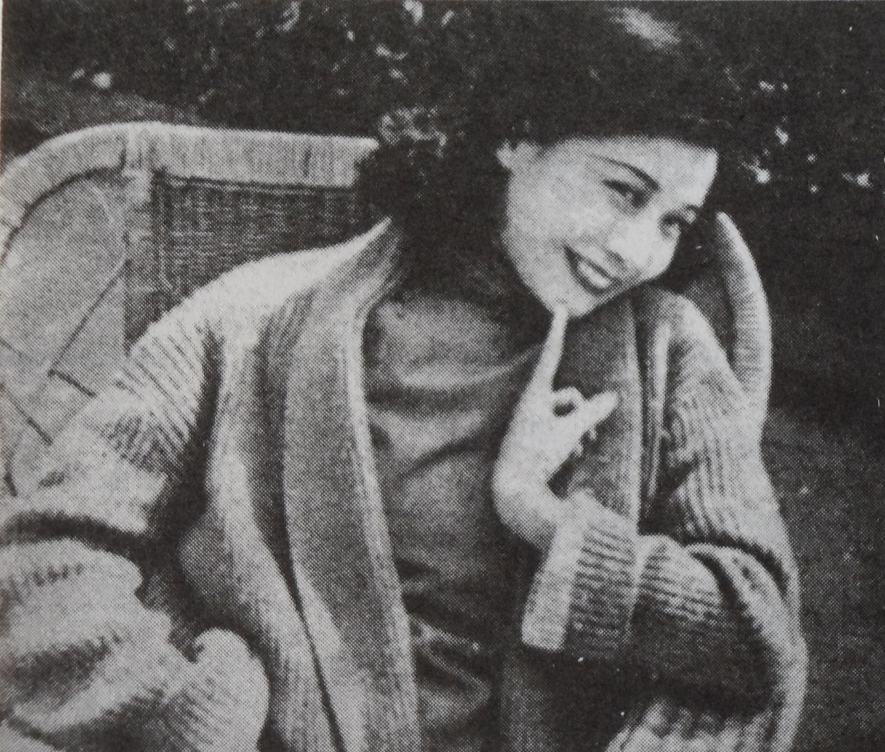
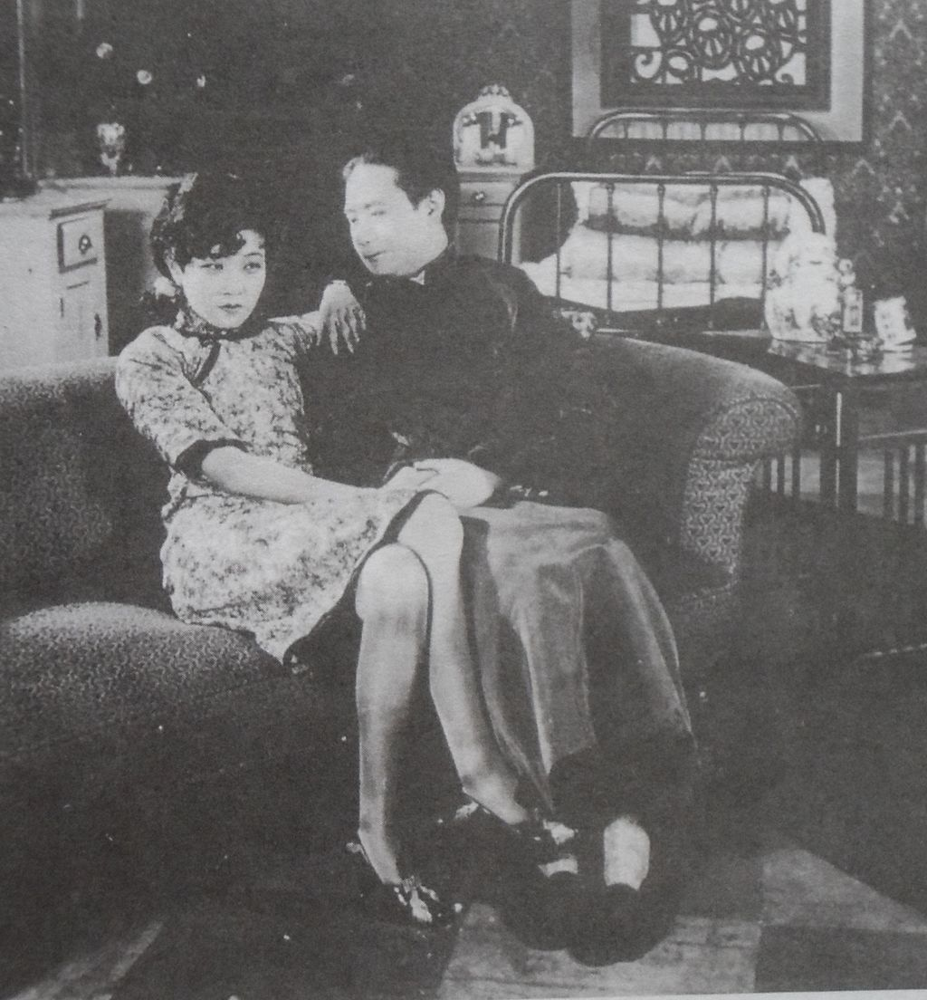
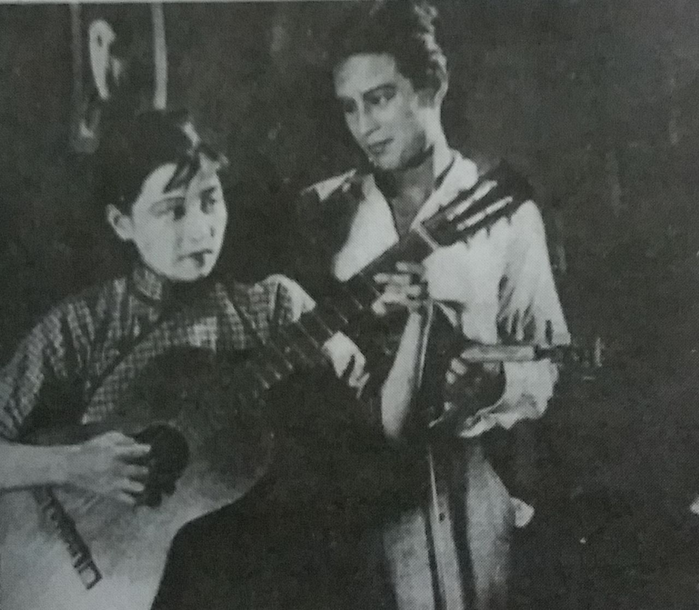
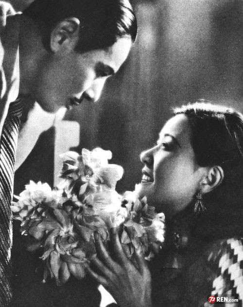
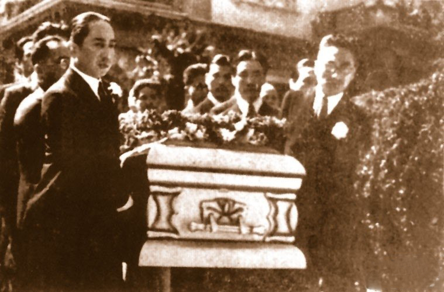
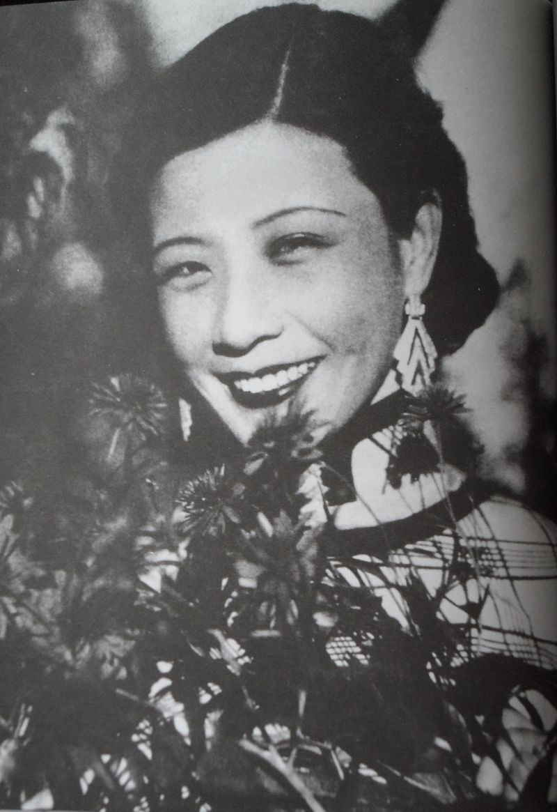
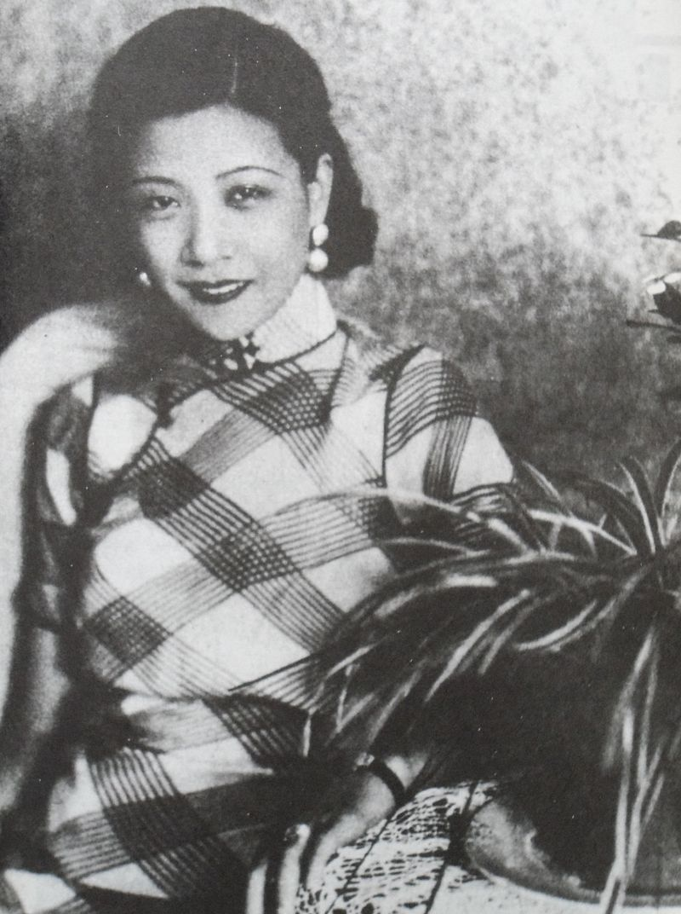
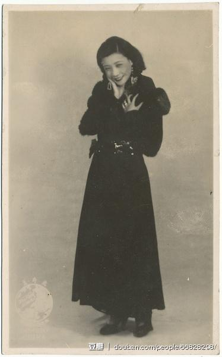

## nnnn姓名（资料）

适合所有人的历史读物。每天了解一个历史人物、积累一点历史知识。三观端正，绝不戏说，欢迎留言。  

### 成就特点

- ​
- ​

### 生平

【1935年3月8日】83年前的今天，红极一时的女星阮玲玉自杀而死，30万人送葬

阮玲玉（1910年4月26日－1935年3月8日），上海的默片演员，是1930年代中国影坛最突出的明星之一。因感情纠纷，年仅25岁就自杀而死，轰动全国。几名粉丝当即自杀，电影界大腕抬棺，多达30万人送葬。美国《纽约时报》报道：“近代国际的最大葬礼”。此后，男朋友又伪造遗书，更是闹得沸沸扬扬。

阮玲玉的自杀，被视作中国电影的一个时代象征。

【贫家女与富家少爷的爱情】

1910年4月26日，阮玲玉出生于上海，祖籍广东中山。父亲是工厂工人，在阮玲玉6岁时去世。母亲做女佣，拉扯着多病的阮玲玉，艰难度日。8岁时，在东家张老爷的帮助下，阮玲玉得以进入崇德女校读书。

1925年，15岁的阮玲玉与大几岁的张家四少爷张达民相识，两人热恋。张家知道后，极力反对，赶走了阮玲玉母女。张达民瞒着家里，将走投无路的阮玲玉母女安置下来，两人同居，阮玲玉退学。

（《古都春梦》剧照）

【电影界崛起的女明星】

一开始，生活费用全靠张达民从家里拿的月份钱。不久，张达民回归到花天酒地的生活圈子，母女生活艰难。在张家大少爷的介绍下，1926年阮玲玉进入明星影片公司，开始电影生涯。

她主演了《挂名夫妻》等5部电影。1928年，转入大中华百合影片公司，主演《情欲宝鉴》等6部电影。1930年转入联华影业公司，主演《野草闲花》（饰演卖花女）一举成名，轰动上海滩，奠定了她在影坛的地位。

（《野草闲花》剧照）

【三个男人一台戏】

联华影业公司的大股东之一唐季珊，是个事业有成，已有妻室的中年男子。阮玲玉和唐季珊开始了新的同居生活。张达民得知后，纠缠不清，耍起了无赖。而唐季珊更是玩弄女性的“好手”，同时与多名女子同居。

被后人称为“中国现实主义电影的奠基人”的蔡楚生（代表作《一江春水向东流》、《渔光曲》），正要拍一部进步电影《新女性》，阮玲玉为主演。两人陷入情网，但有妇之夫的蔡楚生顾忌家庭与名誉，最终选择放手。

就在阮玲玉和这三个男人感情纠葛时，电影《新女性》又遭到了小报记者的攻击，矛头直接指向扮演女主角的阮玲玉，阮玲玉承受着巨大的心理压力。

【30万人送葬的葬礼】

1935年3月8日，妇女节当天半夜两点，阮玲玉在上海新闸路沁园村的住宅服安眠药自杀。同居的唐季珊发现后，担心自己名誉受损，没有送到邻近的大医院，而是送到偏远的日本福民医院。但夜间没有医生，又再送到朋友的私人医院，但医院不愿收留。第二天上午11时送往中西疗养院，已错过最佳抢救时间，于下午6时38分香消玉殒，年仅25岁。

消息一出，全国震惊，人人惋惜。当天有三位女影迷为她自尽，留下“阮玲玉既然已去，我们也没理由活在这世上”的遗书。

1935年3月14日，她的灵柩从万国殡仪馆移往闸北的联义山庄墓地。下午1时10分，由金焰、孙瑜、费穆、郑君里、吴永刚、蔡楚生、黎民伟等十二位电影界大腕将灵柩抬上灵车。这天送葬的队伍排成长龙，灵车所经之处，沿途夹道致哀者多达30万人。美国《纽约时报》报道：“近代国际的最大葬礼”。

【人言可畏的假遗书】

关于阮玲玉自杀的原因，外间众说纷纭。鲁迅曾写下《论人言可畏》一文指：“她的自杀，和新闻记者有关，也是真的。”

1935年4月1日，联华影业公司出版的《联华画报》上，唐季珊称，阮玲玉生前留下“人言可畏”、“我很对不起你，令你为我受罪”的两封遗书。

4月26日《思明商学报》上，登载了一篇题为《真相大白唐季珊伪造遗书》一文。文中揭露，阮玲玉自杀当晚，确写遗书两封，但不是唐季珊拿出来的两封。而发表在《联华画报》上的两封遗书，是唐季珊指使演员梁赛珍的妹妹梁赛珊写的。梁赛珊后为良心谴责，说出真情，并将原遗书交出。

【感情暴力下的真遗书】

1935年4月26日，《思明商学报》刊登的遗书 。

其一

达民：我已被你迫死的，哪个人肯相信呢？你不想想我和你分离后，每月又津贴你一百元吗？
你真无良心，人们一定以为我畏罪？其实我何罪可畏，我不过很悔悟不应该做你们两人的争夺品，但是太迟了！不必哭啊！我不会活了！也不用悔改，因为事情已到了这种地步。

其二

季珊：没有你迷恋“XXX”，没有你那晚打我，今晚又打我，我大约不会这样做吧！我死之后，将来一定会有人说你是玩弄女性的恶魔，更加要说我是没有灵魂的女性，但那时，我不在人世了，你自己去受吧！
过去的织云（唐季珊前女友），今日的我，明日是谁，我想你自己知道了就是。我死了，我并不敢恨你，希望你好好待妈妈和小囡囡（阮玲玉的养女）。
还有联华欠我的人工二千零五十元，请作抚养她们的费用，还请你细心看顾她们，因为她们惟有你可以靠了！
没有我，你可以做你喜欢的事了，我很快乐。

— 玲玉绝笔

【妖媚的人物特征】

她一生共主演29部电影。目前仅有《恋爱与义务》、《桃花泣血记》、《小玩意》、《再会吧，上海》、《神女》、《新女性》、《一翦梅》、《归来》、《国风》9部存有拷贝，其他均已损毁。

1992年，由张曼玉主演的电影《阮玲玉》公映，在国际影坛引起反响。当时就有人问张曼玉：“你在演阮玲玉的时候，你一定是研究过阮玲玉的，你觉得阮玲玉这个人的特征是什么？”张曼玉说：“我觉得阮玲玉的骨子里有一种讲不出来的妖媚。”

