## nnnn姓名（资料）

适合所有人的历史读物。每天了解一个历史人物、积累一点历史知识。三观端正，绝不戏说，欢迎留言。  

### 成就特点

- ​
- ​

### 生平

安妮小传：13岁起，我写了两年日记，便成了世界最有影响力的人之一

【1945年3月9日】73年前的今天，600万受迫害犹太人的代表，15岁的小女孩安妮病逝集中营

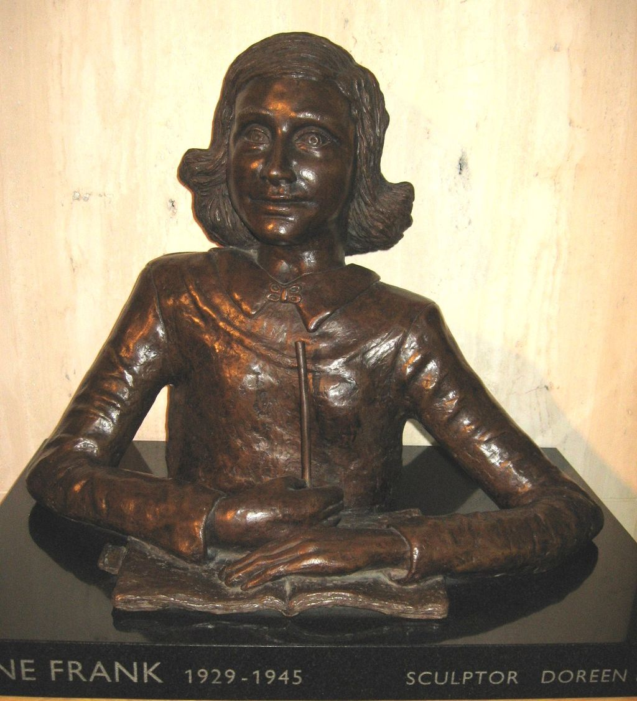

（伦敦大英图书馆中真人大小的安妮·弗兰克半身像）

安妮·弗兰克（1929年6月12日－1945年3月9日），二战犹太人大屠杀中最著名的受害者之一，15岁死于集中营。

安妮在13岁生日礼物日记本中，写下了从1942年6月12日到1944年8月1日之间，在荷兰的生活日记，成为二战期间纳粹德国灭绝犹太人的著名见证。《安妮日记》是全世界发行量最大的图书之一，被多次改编为戏剧和电影。

1999年，入选《时代杂志》“20世纪全世界最具影响力的100个人”，一颗编号为5535的小行星以她的名字命名。2004年，在最伟大的荷兰人投票当中，排名第八。

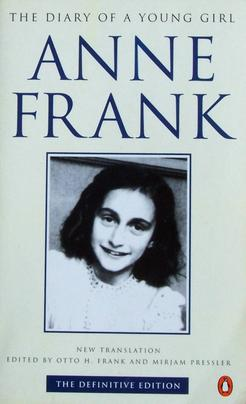

（1995年发行的“最终版”安妮日记英译本，封面是安妮1941年的照片）

【在荷兰的德国犹太人】

1929年6月12日，安妮出生于德国法兰克福，犹太人。父亲奥托在德国政府任职，安妮有个大3岁的姐姐，名叫玛戈。

1933年3月13日，希特勒领导的纳粹党胜出，反犹太主义迅速兴起。1934年，奥托觅得机会在荷兰开设公司，全家都迁到阿姆斯特丹。安妮入读了一所蒙特梭利教育学校，在阅读和写作上比较优异。

1940年5月，德军入侵并占领荷兰，新成立的纳粹政府对犹太人，实施限制性和歧视性法律。1941年夏天，安妮姐妹不得不转入犹太人学校就读，在此期间安妮开始写日记。

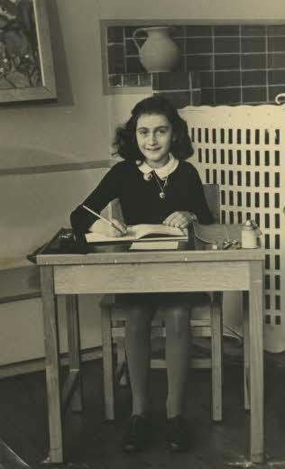

（1940年的安妮）

【13岁的生日礼物】

1942年6月12日，安妮13岁生日时，父亲送给她一本记事本，作为生日礼物。她兴奋地开始记录生活中的一切，包括自己、家人和朋友、校园生活、甚至与一些男孩嬉戏的情况。

7月，由于纳粹党对犹太人的不断迫害，安妮全家迁到公司办公大楼秘密增建的“后宅”，以书柜挡住出入口以避开耳目，开始过着隐蔽的生活。狭小的房子里，住了10几个人，非常拥挤。安妮在日记中，记录了她与其他人的冲突和矛盾，以及与16岁男孩的初吻。

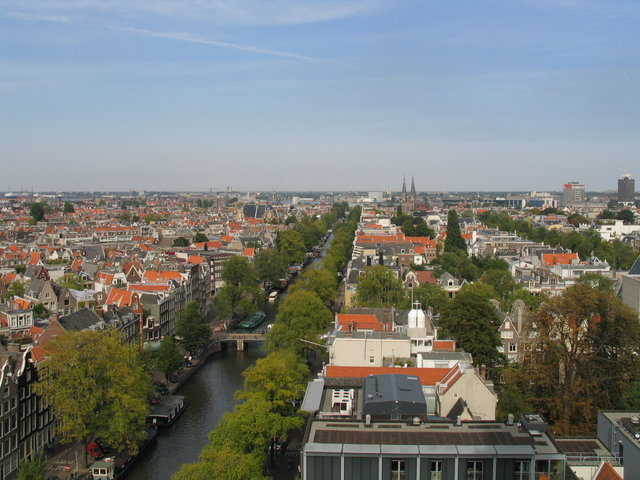

（2004年拍摄，图中右下方是安妮所种的树，而橙色屋顶浅色墙壁就是秘密的“后宅”）

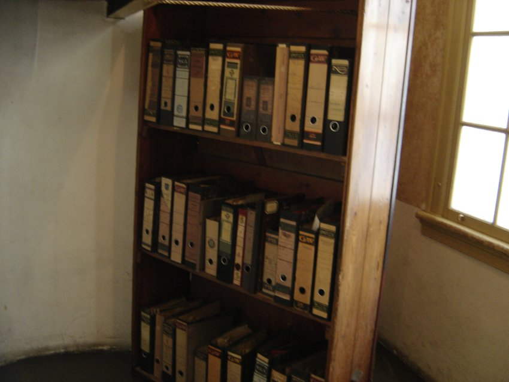

（战后重新放置的书架，用作遮蔽后宅的出入口）

【每一个人都有假名字】

安妮大部分的时间都花在了阅读和学习上，她除了记录日常事件，她还写了她的感受、信念和抱负，对世界人生的思考，以及有些不能跟任何人讨论的事。

1944年3月，安妮听电台广播，说会在战后建立一个公共纪录。安妮决定到时候交出她的日记，因此她开始对日记进行编辑和修正，并给所有人编了假名字。

她一直都定期地写，直至1944年8月1日的最后一篇为止。

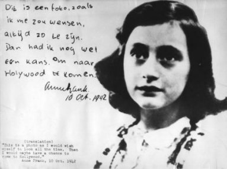

（安妮·弗兰克的笔迹，意思是：“我希望可以永远保持着这张相片中的样子，这样我便可有机会到好莱坞了。”）

【姐妹葬身集中营】

1944年8月4日早上，德国秩序警察从告密者得到线报，冲进“后宅”，将所有匿藏者都逮捕，送到荷兰的韦斯特博克集中营。两个非犹太裔的朋友，回到后宅，发现安妮的日记页散落一地，便将它拾回，连同家庭相簿一同保存。

9月3日，大家被运往奥斯威辛集中营。1,019人当中的549人被直接送到毒气室杀害，包括15岁以下的小孩。由于当时安妮已经15岁零3个月，所以侥幸保住性命。10月，安妮和姐姐感染疥癣，迁到伯根-贝尔森集中营。由于大量的人被送入集中营，死亡率很高。有人形容安妮：“秃头，瘦弱，又在颤抖。”

1945年3月，斑疹伤寒在营中散播，17,000人因此死亡。3月9日，玛戈和安妮相继死去。几个星期后，英军于4月15日解放这个集中营。解放后，营地被烧毁，以防止疾病蔓延，玛戈和安妮被埋葬于万人冢，下落不明。

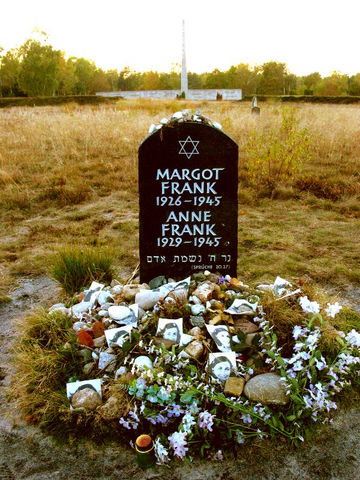

（安妮与玛戈位于伯根-贝尔森集中营旧址的纪念碑）

【无人不知的安妮日记】

父亲奥托在奥斯威辛集中营幸存下来，战后回到阿姆斯特丹，拿到了安妮写的日记。他决定把日记公开出版。他删去某些段落，其中大多数是用不敬的词语批评她的父母，和一些有关性欲的篇章。

1947年，日记在荷兰出版，名为《秘室》。1950年，在德国和法国出版。1952年，在英国和美国出版，名为《安妮·弗兰克：一个少女的日记》。日记在法国、德国、美国都大受欢迎，但奇怪的是在英国却未能吸引读者，1953年便已停印。

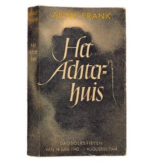

（1947年《安妮日记》的初版，书名意为“密室”）

1955年10月5日，根据日记改编的舞台剧在纽约首次公演，大获成功，后来赢得了普利策戏剧奖。1959年，根据日记而拍成的电影《安妮日记》，让每个人都知道了这个小女孩。

1957年5月3日，安妮日记中的公司大楼 (后宅)，改建为“安妮弗兰克之家博物馆”，成为阿姆斯特丹的一个重要的旅游景点之一。

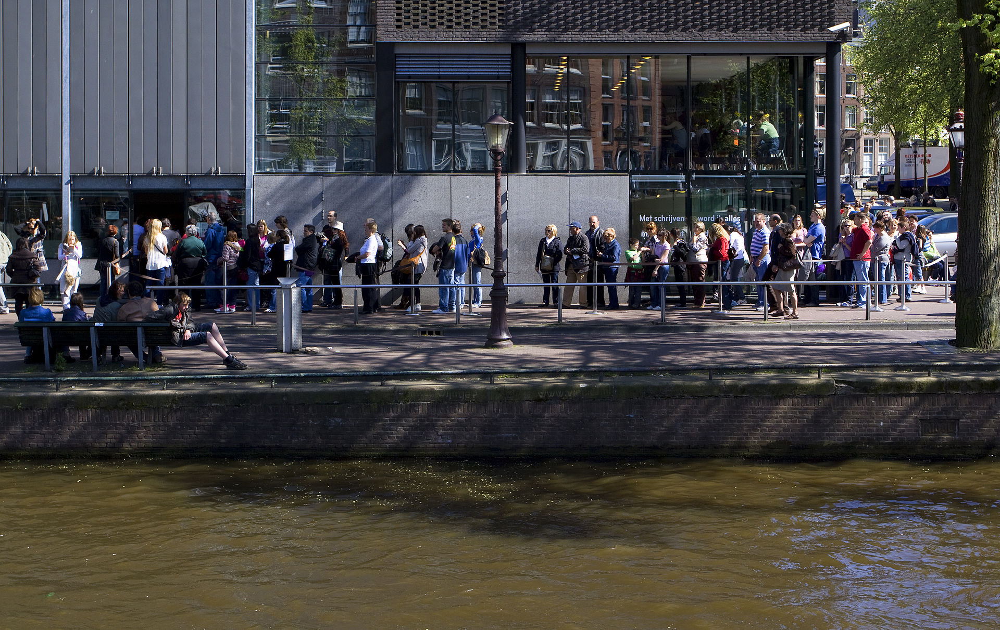

（安妮弗兰克之家博物馆外，人们排队等候参观）

【最具影响力的人物之一】

安妮被视为纳粹大屠杀和当时受迫害的代表人物。苏联作家写道：“代表着600万犹太人的声音，不是一位圣人或诗人，而是一个普通小女孩的声音。”

无数人受到该日记的影响，如曼德拉说在狱中读过安妮的日记，“并从中获得更多的鼓励”。

1980年，在奥托·弗兰克去世，终年91岁。死后，安妮的日记手稿，被转交给荷兰国家战争文件研究所。1986年，荷兰司法部对日记进行司法科学鉴定，证实了日记的真实性。让所有对日记质疑的人都闭上了嘴。

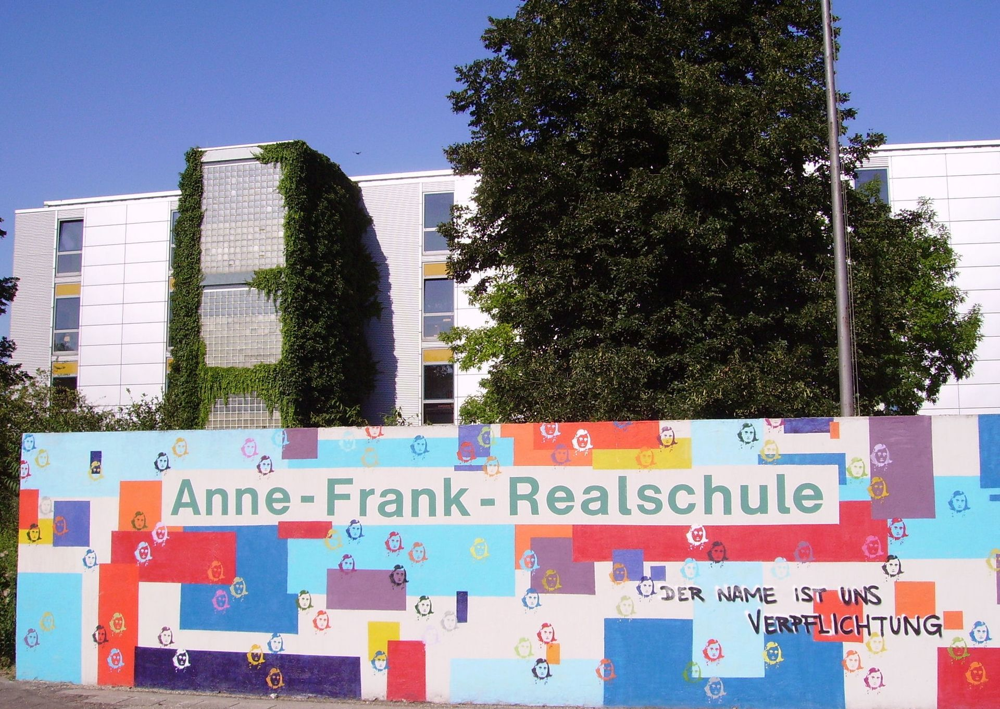

（纪念安妮·弗兰克的涂鸦墙）

1999年6月，《时代杂志》发表了一期特别版，题目是“时代100大人物：本世纪最具影响力的人物”，安妮获选为“英雄偶像”。编者评价说：“书中的激情，使安妮的地位上升到高于大屠杀、犹太教、少女时期，甚至是善良，更成为了现世代最具代表性的人物。”

同时，一颗编号为5535的小行星，被命名为“安妮弗兰克之星”。

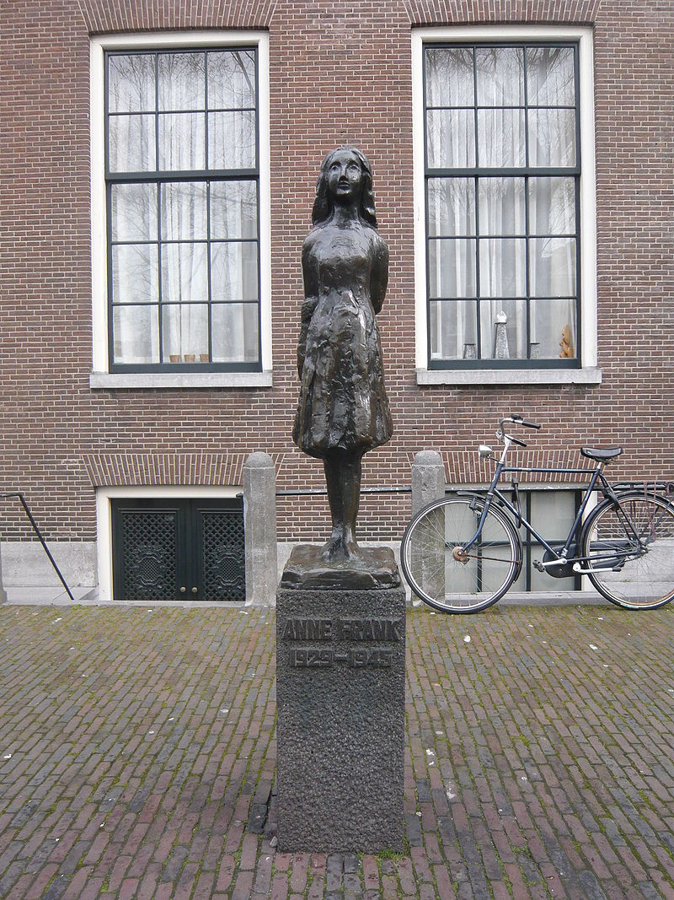

（位于阿姆斯特丹西教堂外的安妮·弗兰克纪念石像）

【】

### 照片

