## nnnn姓名（资料）

适合所有人的历史读物。每天了解一个历史人物、积累一点历史知识。三观端正，绝不戏说，欢迎留言。  

### 成就特点

- ​
- ​

### 生平

【1924年3月10日】94年前的今天，81岁攻读研究生的武侠小说泰斗金庸出生

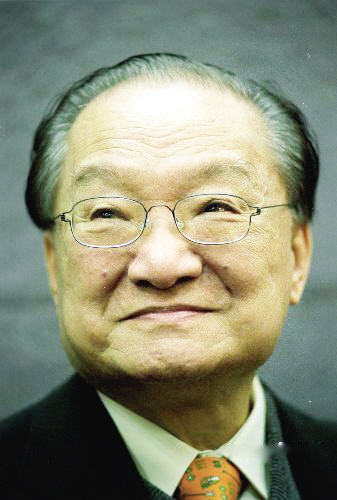

金庸（1924年3月10日－），本名查良镛，浙江海宁人，中国新派武侠小说泰斗。50年代起，15年间创作了15部脍炙人口的武侠小说，如《射雕英雄传》、《神雕侠侣》、《倚天屠龙记》、《天龙八部》、《笑傲江湖》、《鹿鼎记》等，极大地丰富了中国人的业余生活。与古龙、梁羽生合称为“中国武侠小说三剑客”。

他创办《明报》，“左手写社评，右手写小说”，公司在香港上市，成为亿万富翁，成为文人致富的典范，被称为“香港四大才子”之一。他背景关系复杂，曾参与香港基本法的制定。81岁高龄，赴英国剑桥大学深造，取得历史硕士、博士学位，令人叹服。

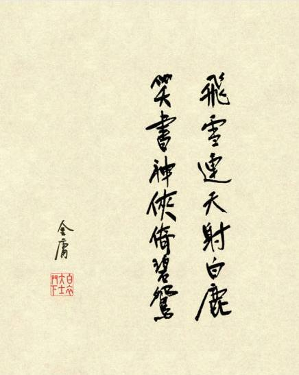

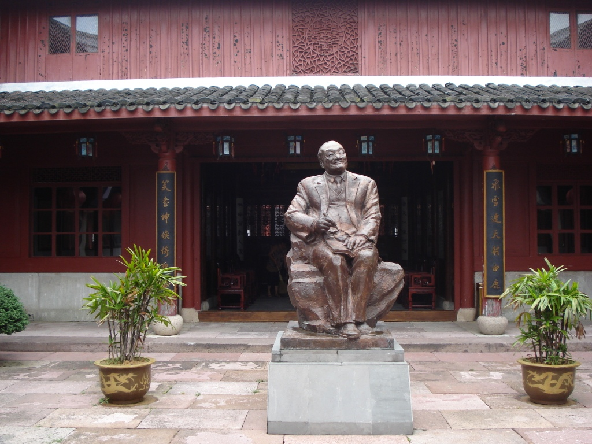

（浙江桃花岛上的金庸铜像）

【初中写书的不安分者】

1924年3月10日，金庸出生，本名查良镛，书香门第，世居浙江海宁县袁花镇。5岁，入读小学。1936年（12岁），入嘉兴一中读初中。1937年，因抗战，随学校辗转各地。1939年，读初三的他与同学合编了一本指导学生升初中的参考书——《给投考初中者》，这是金庸出版的第一本书，收效不凡。

1941年，因在黑板报上讽刺训导主任被学校开除，校长介绍他转学去了衢州中学。1942年，中学毕业。1944年（20岁），考入重庆中央政治大学外交系，期间因对校内学生党员行为不满，向校方投诉，结果勒令退学。后在中央图书馆挂职，得以阅读大量书籍。

1945年，抗战胜利后返乡，在杭州《东南日报》暂任外勤记者。1946年秋，进入上海《大公报》任翻译。1948年调往香港分社。新中国成立后，1950年，曾到北京，向外交部求职未果，于是重回《大公报》。

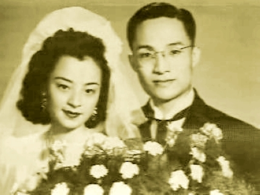

【15部小说的侠之大者】

1952年，调入《新晚报》编辑副刊，与同事梁羽生相识。1954年1月17日，香港白鹤派掌门人陈克夫与太极派掌门人吴公仪，在澳门擂台比武，该新闻轰动一时。总编便安排梁羽生写《龙虎斗京华》，金庸写《书剑恩仇录》，在报纸副刊连载，开创了“新派武侠”。

从此，金庸一发不可收拾，15年写了15部精彩的武侠小说。金庸曾把小说的首字，编成一副对联：飞雪连天射白鹿，笑书神侠倚碧鸳（见《鹿鼎记·新序》）。其中，1970年的《越女剑》未入对联。

金庸的武侠作品，融合了武术、悬疑、言情、历史等风格，打破旧武侠的束缚，塑造了全新的武侠形象。因此，金庸被一些评论者称为“侠之大者”。

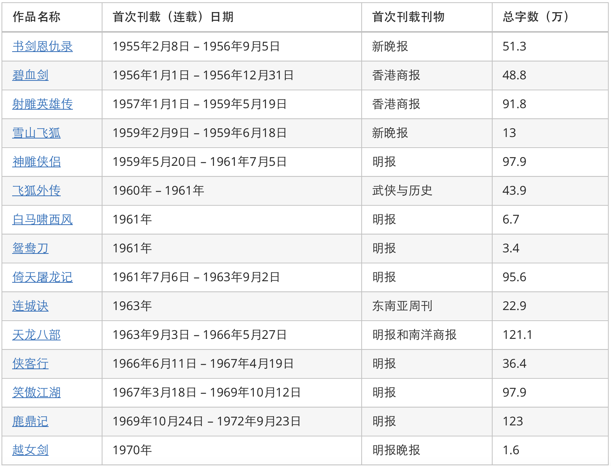

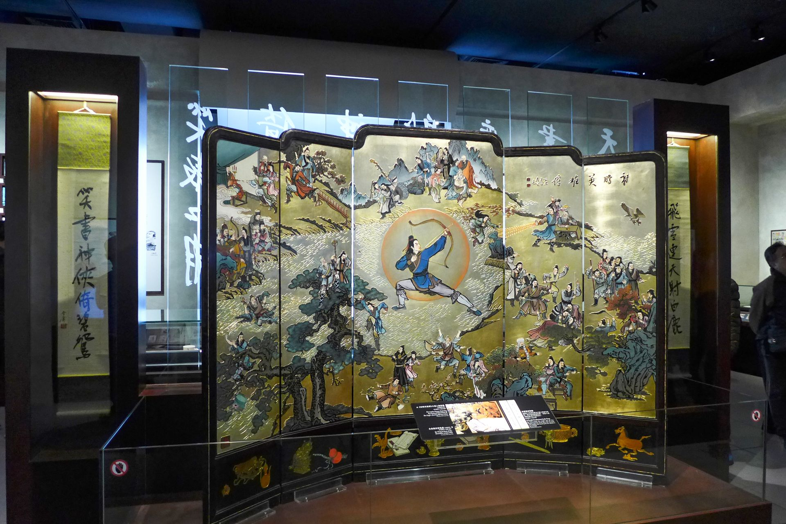

【要裤子不要核子的明报】

1959年，金庸等人在香港创办《明报》。他撰写社评二十余年，以“左手写社评，右手写小说”传为美谈。

1960年代，由于中苏交恶，中国大陆积极发展研究核武器。陈毅在1963年提出了“核裤论”：“当了裤子也要造核子！”。查于1964年在《明报》发表《要裤子不要核子》社评，反对在贫穷情况下造原子弹。

结果引发《大公报》、《文汇报》、《新晚报》等，以“反共反华”、“亲英崇美”、“背叛民族立场”回应。直到最后陈毅出面制止了左派的攻击。金庸也被香港左派分子骂为“汉奸”、“走狗”、“豺狼镛”；更曾受死亡恐吓，一度离开香港暂避。

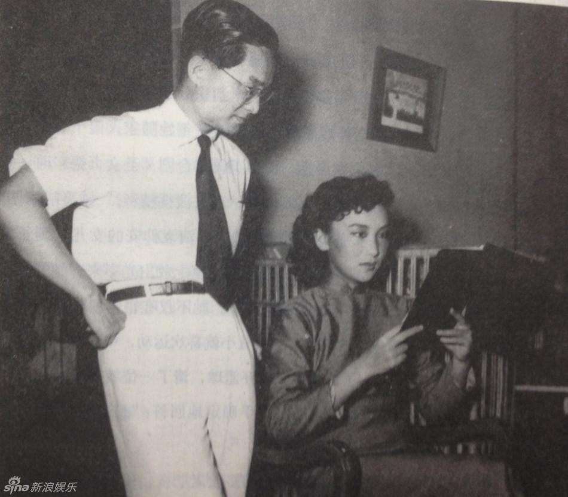

（金庸与梦中情人女演员夏梦）

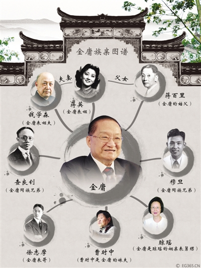

（金庸复杂的族亲关系图谱）

【香港基本法的负责人】

1973年春，金庸应台湾政府的邀请，前往与蒋经国见面会谈。1981年与1984年，金庸到中国大陆访问，先后与邓小平和胡耀邦会谈。1985年，香港特别行政区基本法起草委员会成立，金庸是委员之一，任基本法政治体制起草小组的港方负责人。

基本法中的政治体制方案，是最核心，争议最大的问题，一直未能成型。1988年，金庸与查济民提出了备受争议的“政制协调方案”（又称“双查方案”、主流方案）。该方案比较保守，但最终在香港获得投票通过。金庸回到香港，还有针对他的示威抗议发生。

1989年5月，金庸辞去基本法草委、咨委职务，结束了从政生涯。

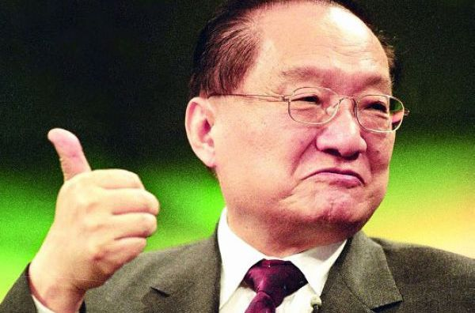

【成为亿万富翁的才子】

1989年，在《明报》创办三十年庆祝茶会上，宣布卸下社长职务，只担任集团董事长。1991年，注册成立“明报企业有限公司”，并在香港联合交易所上市。

明报集团1991年度的盈利接近一亿元，金庸在《香港华人亿万富豪榜》上，名列中排第64位，被誉为文人致富的典范。

上市后，他从此周游列国、教书、静修、游山玩水、研经……

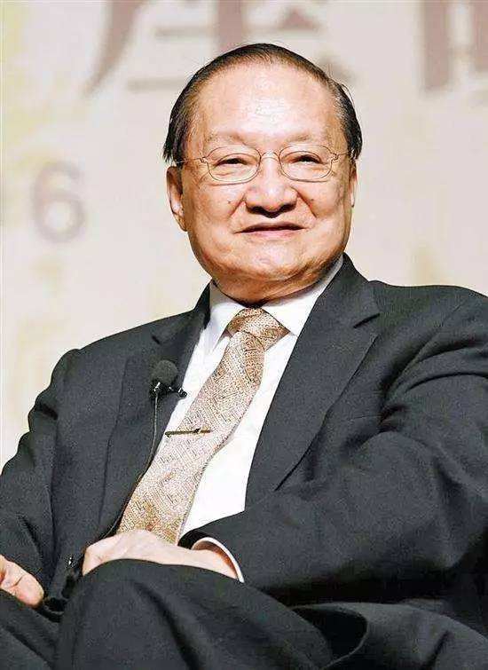

【80岁的博士生】

2001年，国际天文学会将一颗由北京天文台发现的编号10930的小行星，以“金庸”命名。

2005年10月，已经81岁高龄的金庸，前往英国剑桥大学，攻读历史学硕士学位。2006年12月，他完成硕士论文《初唐皇位继承制度》。2010年，完成博士论文《盛唐皇位继承制度》，获得博士学位。

2009年开始，他注册入读北京大学中文系博士课程，网上曾一度流传其2013年的毕业证书照片。但根据北京大学图书馆论文检索，并没有找到金庸的博士论文。

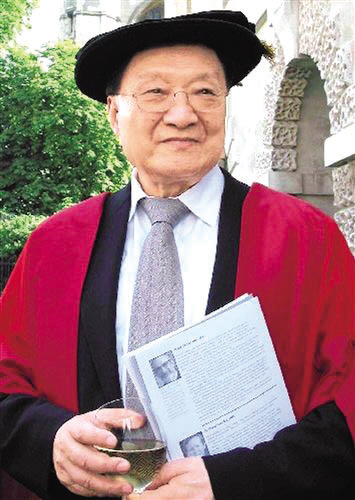

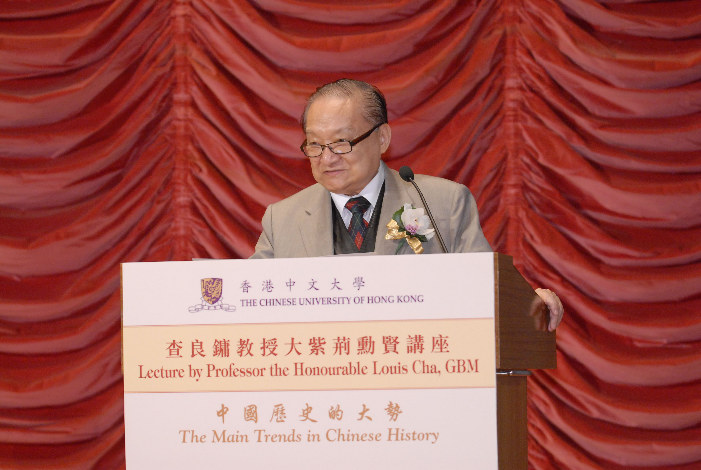

