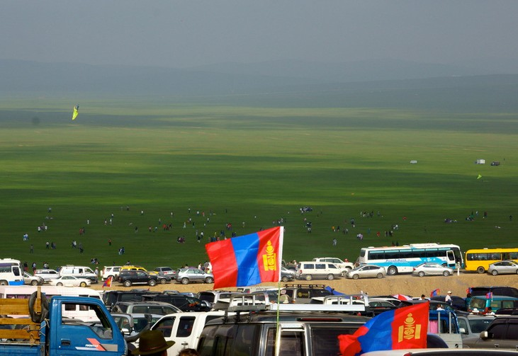
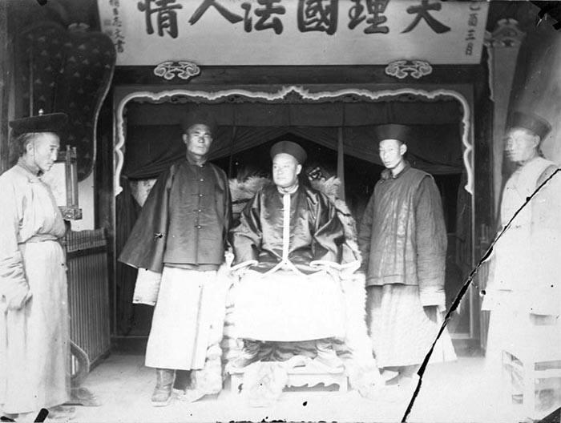
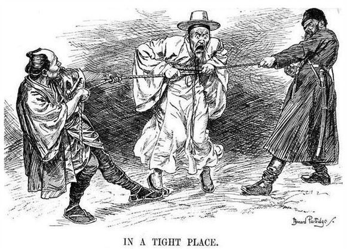
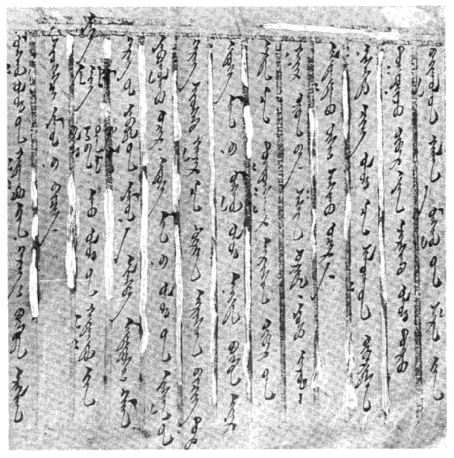
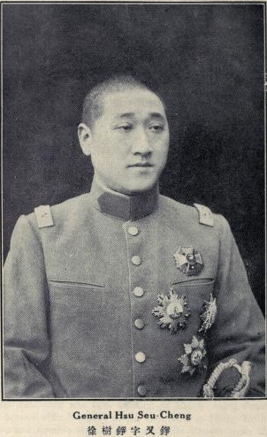
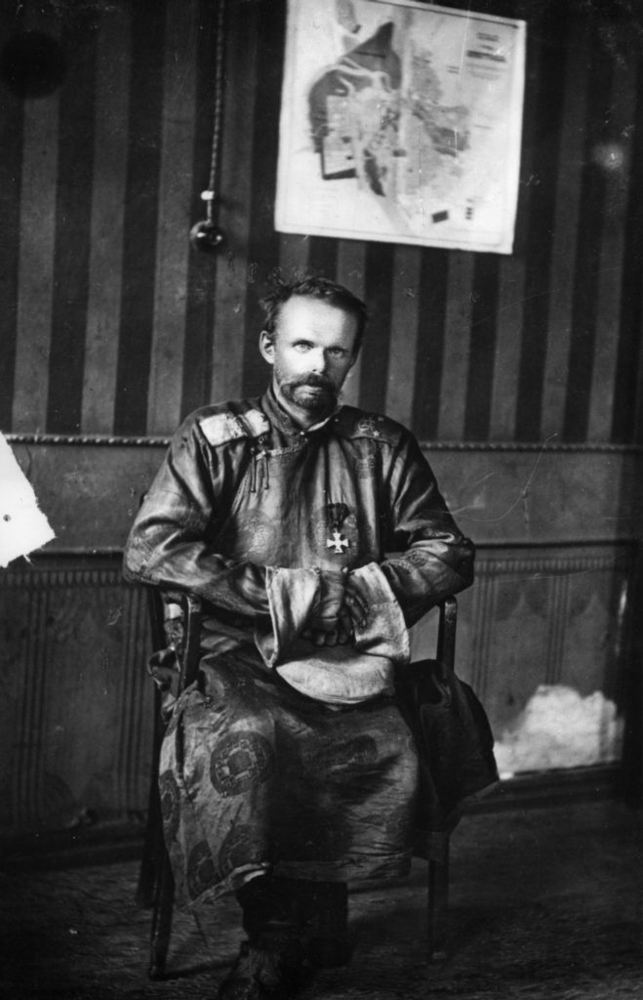
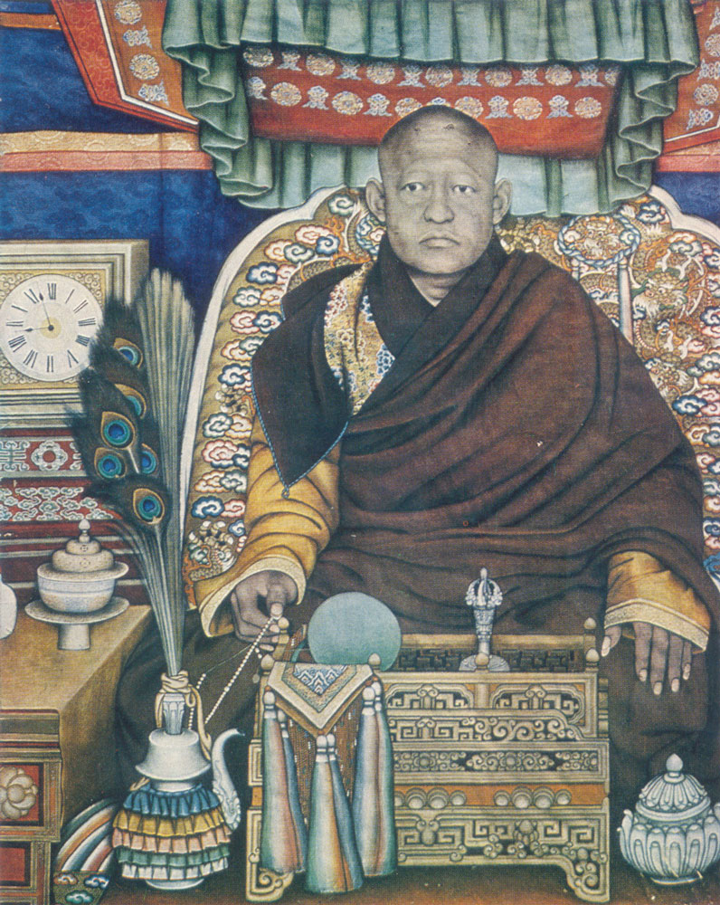
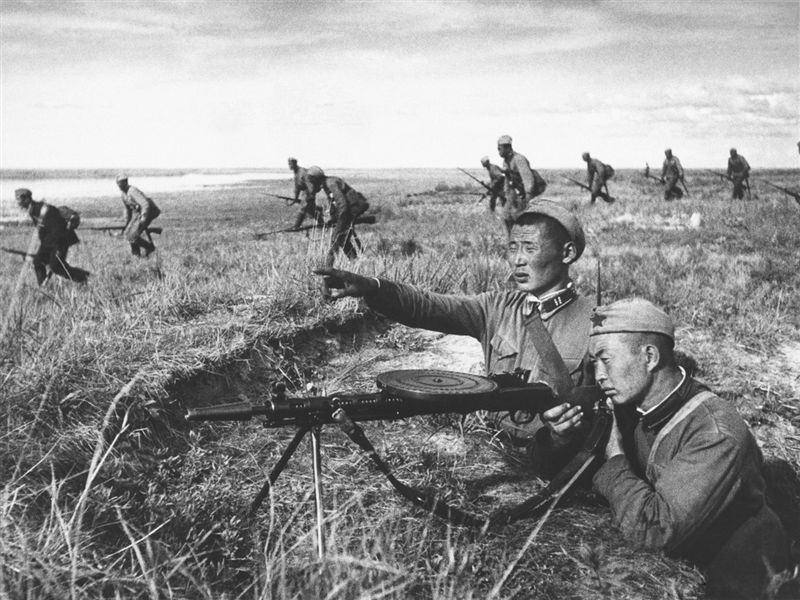
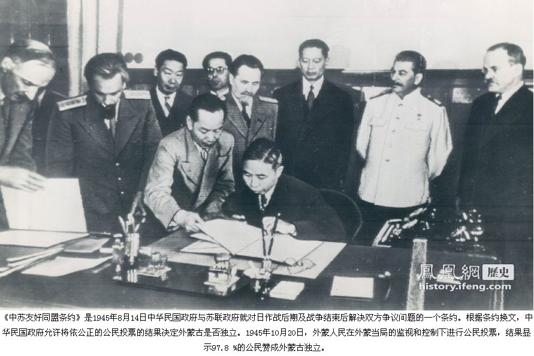
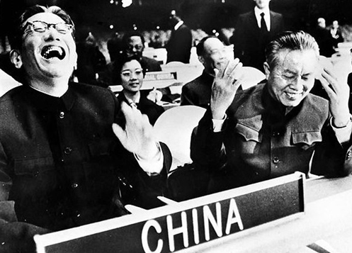

## nnnn姓名（资料）

适合所有人的历史读物。每天了解一个历史人物、积累一点历史知识。三观端正，绝不戏说，欢迎留言。  

### 成就特点

- ​
- ​

### 生平

【】

【1921年3月13日】97年前的今天，蒙古在苏俄红军的支持下，赶走中国人，宣布独立

1921年3月13日，蒙古人民党军队在苏俄红军的支持下，向买卖城的中国军队，发动进攻。中国守军被击败，撤出买卖城，从此中国在外蒙古的势力完全消失。3月13日，被蒙古定为“独立日”。

（在买卖城的清朝官员）

【日俄瓜分蒙古】

清朝将蒙古分为内属蒙古（纳入行政管理）和外藩蒙古（由贵族世袭统治）。外藩蒙古又分为内蒙古和外蒙古。内蒙古归附清朝较早，多与皇室联姻，是今天内蒙古自治区的主体。外蒙古是清朝康熙、乾隆年间，征伐准噶尔部时内附或投降的，是今天蒙古国的主体。

1905年，日俄战争爆发。1907年，两国和好，签订密约，俄国承认日本在朝鲜的“优越地位”，日本承认俄国在外蒙古的“一切权利”。

1910年，日本吞并朝鲜。1912年，日俄签订密约，设立内蒙古东西分界线，俄国承认东内蒙为日本势力范围，日本承认西内蒙为俄国势力范围，以东经116度27分为日俄界线。

（日俄争夺朝鲜半岛与中国东北的漫画）

【第一次宣布独立】

1911年，辛亥革命爆发。12月，外蒙古王公喇嘛在俄军支持下，赶走清朝官员，在库伦（今乌兰巴托）宣布独立。拥立外蒙古第八世活佛为皇帝，自称“日光皇帝”，年号共戴，建立“大蒙古国”政府。这次独立，清政府和中华民国都不予承认。

1912年11月，俄国与“大蒙古国”签订《俄蒙协约》，无视中国主权。经过谈判，1913年9月，中华民国同俄国达成《中俄声明文件》，中国不在外蒙驻兵、设官，承认外蒙自治，俄国承认中国在外蒙的宗主权。

1915年6月，中俄蒙三国签定《恰克图协定》。外蒙古正式宣布取消独立，实行自治，中华民国大总统袁世凯册封第八世活佛为“呼图克图汗”，赦免独立运动人士。

（1912年11月18日，蒙古国宣告独立的照会）

【徐树铮武力收复外蒙古】

1917年，俄国爆发十月革命，苏维埃俄国宣布废除沙俄与中国签订的不平等条约，但实际上仍支持外蒙古独立。1919年，“泛蒙运动”兴起，主张内外蒙古联合独立，并在海拉尔建立政府。苏维埃俄国发表声明，称外蒙古是一个独立的国家，要求建立外交关系。

10月，外蒙古自治政府派特使，带着63条《外蒙撤治善后条例》到北京，表示希望有条件撤治，恢复前清旧制。皖系军阀徐树铮立刻率军攻入库伦，软禁了外蒙王公喇嘛。随后，中华民国取消《中俄声明》和《恰克图协定》，取消外蒙古自治，设立“中华民国西北筹边使公署”，由徐树铮部驻防。

【不择手段赶走中国人】

外蒙古无法忍受徐树铮，同时联络苏俄红军、帝俄白军（恩琴）及日本，寻求援助把中国人赶出外蒙。1920年7月，爆发直皖战争，徐树铮率军返回内地，库伦仅留守少量兵力。

1921年2月11日，帝俄白军恩琴在日本关东军的支持下，攻入库伦，中国驻军撤离。第八世活佛再次被推举为“大蒙古皇帝”。

3月1日，第三国际支援外蒙革命，帮助成立蒙古人民党。3月13日，蒙古人民党军队在苏俄红军的支持下，向买卖城的中国军队，发动进攻。不久，中国守军被击败，撤出买卖城，从此中国在外蒙古的势力完全消失。

3月13日，被蒙古定为“独立日”。

（帝俄白军、号称疯狂男爵的恩琴）

【没有活佛的人民共和国】

1921年7月，苏俄红军攻占库伦，恩琴被俘，成立君主立宪制的蒙古独立国。北洋政府下令命张作霖收复外蒙，张作霖不予理睬。

1923年1月，孙中山和苏联代表越飞，在上海秘密签订《孙文越飞宣言》，同意苏军留驻外蒙。

1924年，第八世活佛逝世，蒙古人民党宣布废除君主立宪制，成立蒙古人民共和国。但中华民国不予承认。

（第八世哲布尊丹巴呼图克图尊者法像）

【日本和苏联的再次较量】

1935年1月24日，日本主张呼伦贝尔以南的哈尔哈庙属于满洲国，外蒙古不该派兵屯驻，苏日爆发第一次边界冲突。苏联、日本、满洲国、外蒙古四方代表在哈尔滨争执不休，直至第二年12月苏联才让步。

1939年，爆发诺门罕战役。表面上是满洲国与外蒙古为了领土而交战，但实际上则是日本关东军与苏联远东军的较量。最终，苏联以惨重的代价获得胜利。

经过半个世纪，直到1992年苏联解体后，苏联军队才彻底从蒙古国撤走，蒙古才真正获得独立。

（诺门罕战役中参战的外蒙古军）

【换取东北和新疆的条约】

1945年8月，中华民国政府与苏联政府签订《中苏友好同盟条约》。苏联同意出兵东北击败日本后，三个月内撤兵；不干涉新疆的内部事务；中华民国同意蒙古人民共和国举行全民公决投票。

10月20日，外蒙举行公民投票，投票结果显示，100%的公民赞成外蒙古独立。

1946年1月5日，中华民国发布公告承认蒙古人民共和国独立。

1949年10月1日，中华人民共和国成立，16日即和蒙古人民共和国建交。

（1945年的雅尔塔会议）

【不承认蒙古独立的中华民国】

1952年，中华民国向联合国控告苏联违反《中苏友好同盟条约》，联合国大会以25票赞成，9票反对，24票弃权，通过联合国大会505号决议谴责苏联，是为“控苏案”。

10月13日，蒋介石在国民党的中央会议上，沉重地检讨说：“承认外蒙独立的决策，虽然是中央正式通过一致赞成的，但我本人愿负其全责。这是我个人的决策，是我的责任，亦是我的罪愆”。

1953年2月23日，中华民国政府宣布《中苏友好同盟条约》失效，不承认外蒙古的独立。

【加入联合国的交易】

1961年，得到苏联和非洲支持的蒙古人民共和国申请加入联合国。中华民国作为联合国安理会常任理事国拥有否决权，可以阻止蒙古入联合国。

然而，美国政府担心激怒非洲国家，导致他们转而支持中华人民共和国进入联合国，于是给中华民国施压。10月25日，联合国安理会通过决议，接受蒙古国加入联合国。

12月，联合国通过决议：中华人民共和国入联合国一案成为“重要问题”，即要三分之二多数同意才能通过。直到10年后，1971年中华人民共和国才得以加入联合国。

（1971年，中国成功加入联合国）

【包含蒙古的中华民国全图】

直到1991年，台湾官方出版的《中华民国全图》，都宣称法理的中华民国疆域包括外蒙古。

2002年，经中华民国立法院投票，重新承认蒙古国为独立国家，是最后一个承认外蒙古政权的地区。目前官方已不再发行《中华民国全图》，台湾市面上发售的中国地图，均已将外蒙古排除在中国之外。

（1947年中华民国全图，标注“外蒙古已经我国承认其独立”）

