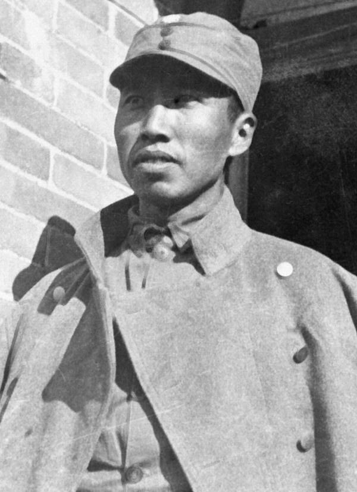
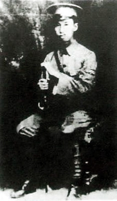
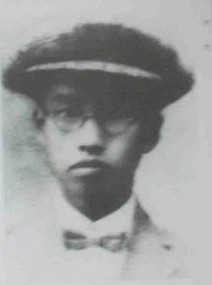
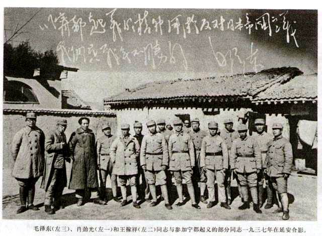
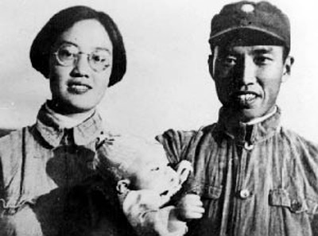
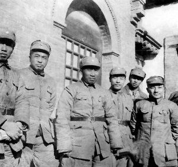
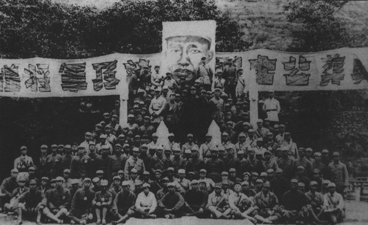
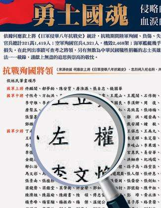

## nnnn姓名（资料）

适合所有人的历史读物。每天了解一个历史人物、积累一点历史知识。三观端正，绝不戏说，欢迎留言。  

### 成就特点

- ​
- ​

### 生平

【1905年3月15日】113年前的今天，抗日战争中牺牲的八路军最高将领左权出生

【不安分的学生】

1905年3月12日，左权出生于湖南醴陵的一个贫民家庭。8岁入私塾读书，中间几次辍学，17岁考入县立中学，关心社会革命。1923年12月（18岁），奔赴广州。第二年，考入广州陆军讲武学校，再转入黄埔军校，成为黄埔第一期学生。

 1925年1月（20岁），加入中国共产党，参加国民革命军第一次、第二次东征。同年，被派往苏联莫斯科中山大学学习。1927年9月，入伏龙芝军事学院，时逢苏联肃反，左权被批评“行为不检”，受到党内警告处分。

（1925年，黄埔军校时的左权）

（左权入莫斯科中山大学学习前夕的留影）

【留党察看的红军军长】

1930年，左权从苏联回国，到闽西苏区，任红军军官学校第1分校教育长。12月初，任新红十二军军长。

1931年12月，前往宁都，协助筹划国民革命军第二十六路军倒戈，发动宁都起义，为革命增加了一支强有力的生力军。起义后，部队改编第一方面军第五军团。左权任红五军团第十五军军长兼政委。

1932年，在肃反运动中，有人告发称左权收藏了“托陈取消派”的文件；因而被撤职，留党察看半年，随后调至红军学校任教官。

（1937年，毛泽东与宁都起义部分同志在延安合影）

【第一军团的参谋长】

1933年1月，在第四次反围剿中，调任总参谋部第一局作战参谋。9月，任粤赣军区司令员。12月，左权调任红一军团参谋长（林彪任军团长），参加第五次反围剿战争。

1934年10月，随红军主力长征，参加指挥湘江战役、攻占遵义、四渡赤水、强渡大渡河等战斗。

1935年10月，率部到达陕北，随后向东进攻山西阎锡山部。1936年年5月，由于林彪调任红军大学校长，左权代理红一军团军团长。

,左权(左一)等红军部分将领合影.jpeg)

（1936年，聂荣臻(左三)，左权(左一)等红军部分将领合影）

【剪得断的爱恨情仇】

1937年8月，全面抗战开始，红军主力改编为八路军，左权任副参谋长，进入华北作战。1939年4月16日（34岁），经朱德介绍，左权与北平来的22岁的女大学生刘志兰（1917-1992）结婚。

1940年2月，任八路军第二纵队司令员。8月，与彭德怀等一同指挥了百团大战，突破日军“囚笼政策”，取得巨大战果。

1942年5月，日军向太行山区发动大扫荡，对八路军总部形成合围；5月25日，左权率部掩护总部突围，在山西辽县，左权被炮弹击中而阵亡。成为八路军在抗日战争中阵亡的最高级别的指挥官。

（左权与妻子刘志兰合影）

（1938年，山西洪洞县马牧村八路军总部合影，左一为左权）

【当之无愧的勇士国魂】

1942年，全军为他举行隆重葬礼，辽县也改名为左权县。1950年，迁葬于邯郸晋冀鲁豫烈士陵园。1951年，毛泽东专程到左权墓前脱帽致哀。1957年，周恩来也到左权墓前凭吊。

左权去世后，刘志兰多次要求取消左权的留党察看处分，一直到1982年，中共中央终于出具书面文件，对左权予以平反、取消处分。

2014年，台湾出版以纪念抗战胜利七十周年为主题的“勇士国魂”月历，左权作为唯一的八路军将领入选。

（1942年，八路军总部为左权举行追悼大会）

（台湾为纪念抗战出版的《勇士国魂》月历名单）

### 

