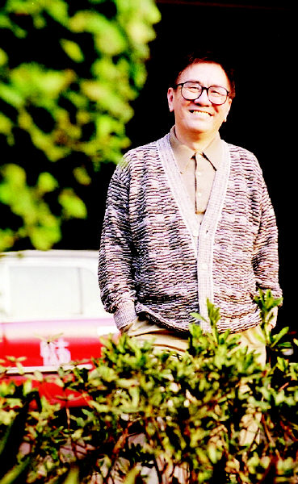
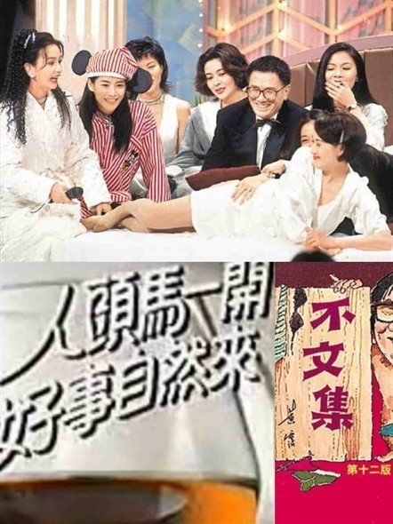
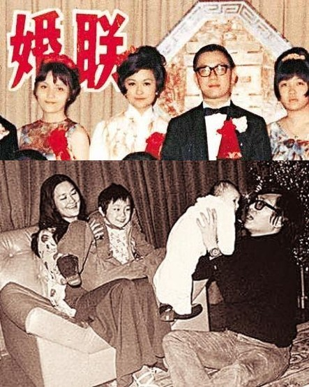
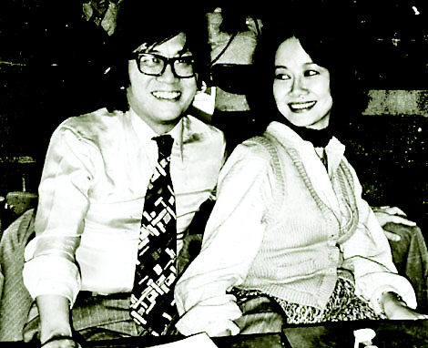
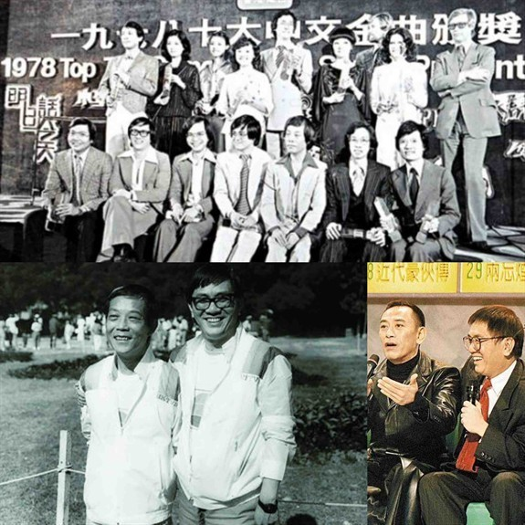
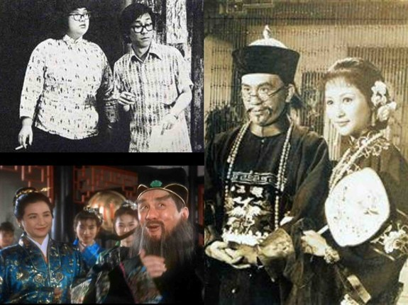
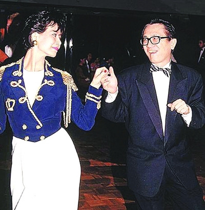
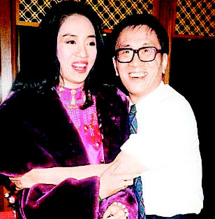
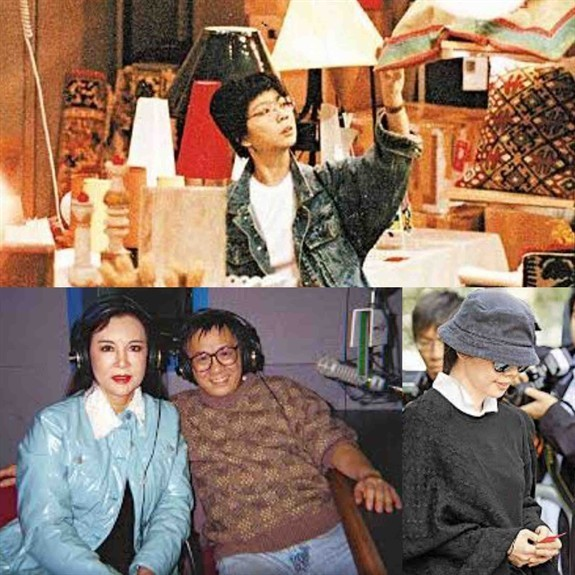
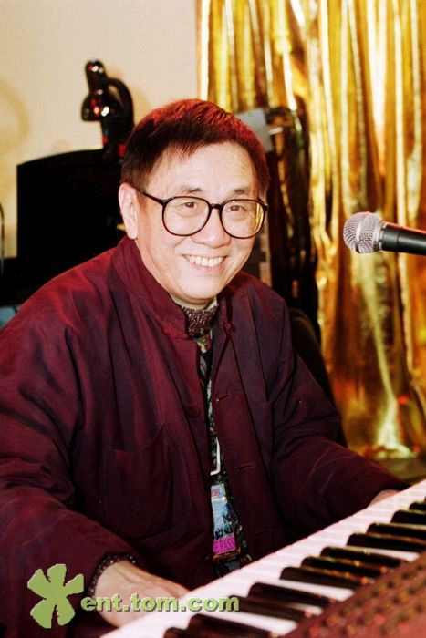

## nnnn姓名（资料）

适合所有人的历史读物。每天了解一个历史人物、积累一点历史知识。三观端正，绝不戏说，欢迎留言。  

### 成就特点

- ​
- ​

### 生平

【1941年3月16日】77年前的今天，沧海一声笑的香港四大才子之一黄霑出生

黄霑（1941年3月16日－2004年11月24日），华人资深作曲家和填词人，投身乐坛数十载，创作出无数脍炙人口的作品。代表作包括：上海滩、沧海一声笑、男儿当自强、倩女幽魂、长路漫漫伴你闯、我的中国心等等。

他同时身兼广告人、作家、主持人等多种身份，被视为香港跨媒体的代表人物。他与金庸、倪匡、蔡澜一起，获“香港四大才子”的美誉。

【逃难香港的广东人】

1941年3月16日，黄霑出生于广东省广州市，籍贯广东番禺。为庶母所生，在八兄弟姊妹中排行第六。1949年，亲国民党的黄家逃难到香港，落户深水埗区。

11岁，拜在口琴家梁日昭门下学艺，认识了许多大师，从此开启了音乐世界的大门。1960年，他升读香港大学中文系。毕业后，在天主教培圣中学任教两年，转行投身广告界，受聘于英美烟草公司。

（黄霑最喜欢的“音乐毛毯”）

【主持、作词、写作、拍电影】

1965年，进入“丽的”电视台任主持。1967年（26岁），黄霑与歌星华娃结婚。1970年，转投华美广告公司，出任联合创作总监。人头马广告语“人头马一开，好事自然来”，就是他的创意。

1972年，黄霑首次和编曲家顾嘉煇合作，为音乐舞台剧《白娘娘》编写曲词。1973年，撰写成人笑话集《不文集》。1974年，自编自导电影《天堂》，位列该年香港电影票房排行榜前十位 。

（黄霑与华娃婚礼和家人合影）

【与李小龙的嫂子“劈腿”】

1975年，黄霑受邀为迪士尼乐园写粤语版歌词，其中《世界真细小》成为了脍炙人口的经典儿歌。1976年，他写的香港首部华文武侠剧《射雕英雄传》的主题曲《谁是大英雄》，传遍大江南北。黄霑成为70年代中期，粤语流行曲振兴的关键人物。

1976年，黄霑与李小龙的嫂子女作家林燕妮相恋。当时，华娃正怀着第三个孩子，她毅然与黄霑离婚，独自抚养孩子。黄霑与林燕妮开办了黄与林广告有限公司。两人在《东方日报》开设“一题两写”的专栏，每日以一个主题，各写一篇几百字的短文，同版刊登。两人一个文风大胆、一个措辞正经，两相对照，颇受欢迎。

（黄霑与情人知己林燕妮）

【千山我独行，不必相送】

1977年，他写的电视剧《家变》主题曲，被视为香港哲理歌的发源，其中警句“变幻原是永恒”，家户喻晓。

1978年，黄霑正式签约无线，与顾嘉煇合作，创作的多首作品都流行一时，得名“煇黄”。当年，香港电台“第一届十大中文金曲”中，竟有三首由黄霑填词（《誓要入刀山》、《倚天屠龙记》、《鳄鱼泪》）。

1979年，作词《楚留香》主题曲。3年后，《楚留香》在台湾播映，收视率奇高，主题曲也跟着传颂一时。因歌词有“千山我独行，不必相送”一句，成为了民间热门的葬礼歌曲。

（1978年，香港十大中文金曲的“煇黄”）

【上海滩上我的中国心】

1980年，时为中英谈判早期，他在《明报周刊》执笔写《数风云人物》，访问了香港十位名人，后来出版成书，销量甚佳，1981至1985年就印行了十八版。

1980年（39岁），电视剧《上海滩》取得空前的成功，他作词的主题曲《上海滩》，也成为粤语流行曲的经典。1984年，中央电视台春节联欢晚会上，由张明敏演唱黄霑作词的《我的中国心》，一举成名。

（黄霑在《唐伯虎点秋香》里演华太师）

【倩女幽魂沧海一声笑】

黄霑依靠自学，逐渐通晓作曲配乐。1987年（46岁），与戴乐民合作，给《倩女幽魂》配乐。他采用当年新兴的电子合成器，营造出诡异的气氛。其中的三首歌《路随人茫茫》、《道》、《黎明不要来》的词曲，也由他创作。

1989年，他跟倪匡和蔡澜主持半夜成人节目《今夜不设防》，访问娱乐圈名人，尺度大胆无所不谈，口碑载道创收视佳绩。1990年，主持世界杯直播节目，虽然对足球一窍不通，但善于活络气氛，主持效果奇佳。

（黄霑与林燕妮翩翩起舞）

1990年，他与林燕妮分手，几近崩溃，转向佛学。

同年，完成续作《倩女幽魂II：人间道》，并受邀为《笑傲江湖》配乐，创作主题曲《沧海一声笑》取得极大回响，被视为中国流行音乐的典范。

（黄霑熊抱梅艳芳）

【男儿当自强】

1991年（50岁），两人继续合作为《黄飞鸿》配乐，主题曲《‎男儿当自强》流唱一时。1992年，为《笑傲江湖II东方不败》写主题曲，名为《只记今朝笑》，曲风活泼清新。同年，给周星驰电影《武状元苏乞儿》创作插曲《长路漫漫伴你闯》。

1993年，与雷颂德合作，给《青蛇》配乐，也是经典代表作。1994年，给电影《梁祝》配乐，获得第14届香港电影金像奖最佳电影配乐。

1995年（54岁），黄霑与助手陈惠敏，在美国拉斯维加斯注册结婚，非常低调。

（黄霑与助手陈惠敏的低调婚姻）

【再度辉煌的集体回忆】

1998年（57岁），他与顾嘉煇两人在香港、广州和东南亚地区举办了29场音乐会。他们的歌曲是一代人的集体回忆，反应热烈，“煇黄”再度“辉煌”，成为当年的焦点。此后，黄霑多活跃于电视台担任主持人。

晚年患有癌症，2003年9月，获香港大学哲学博士学位。2004年11月24日，因肺癌病情恶化，在香港沙田仁安医院去世，享年63岁。

（黃霑）

