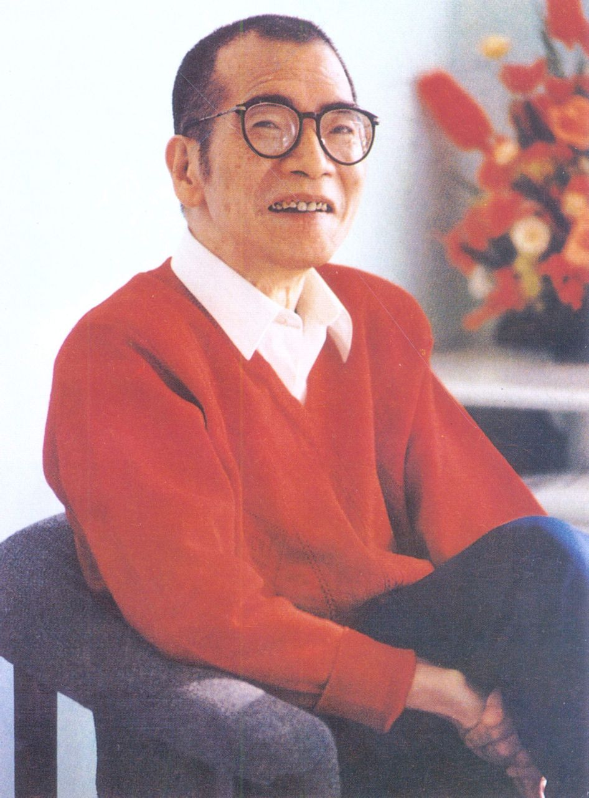
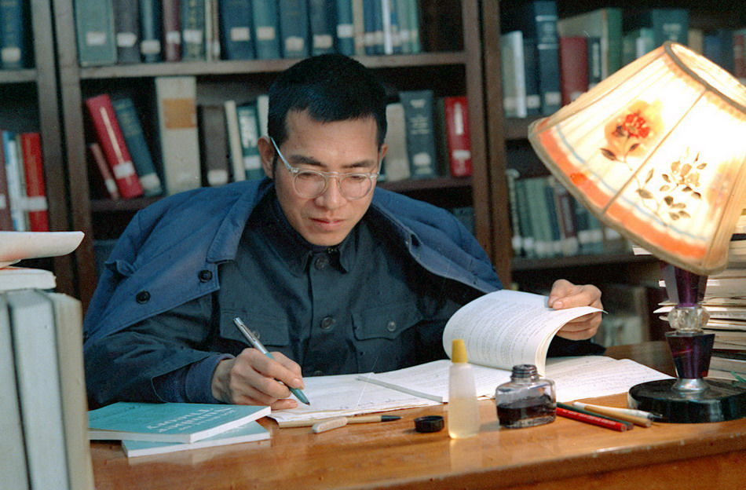
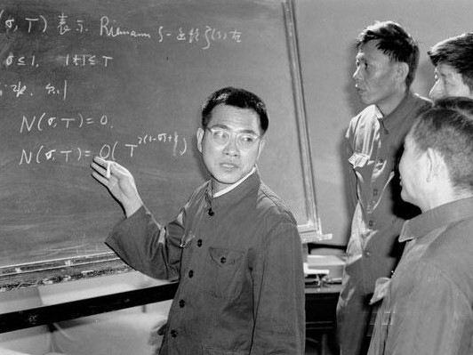
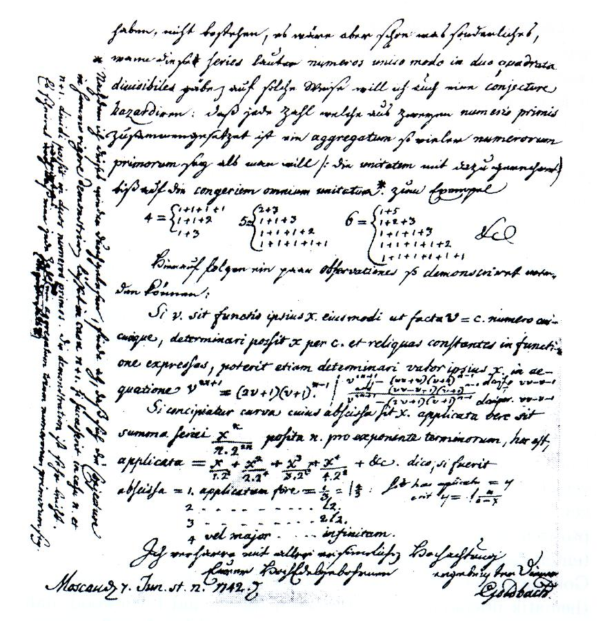
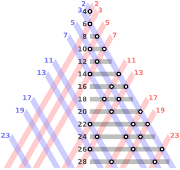
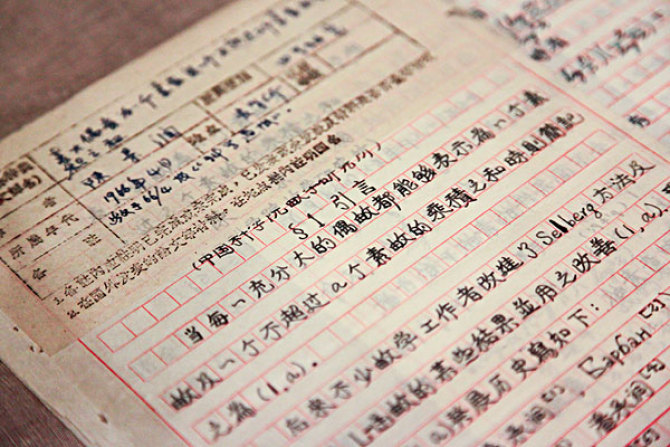
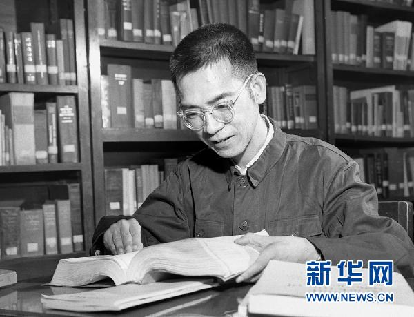
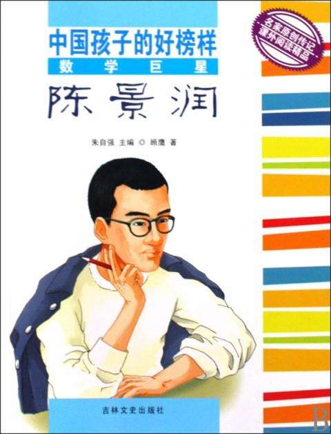
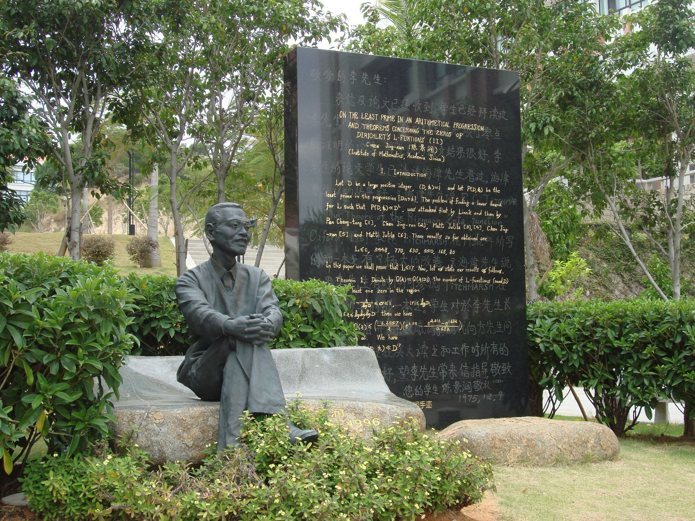
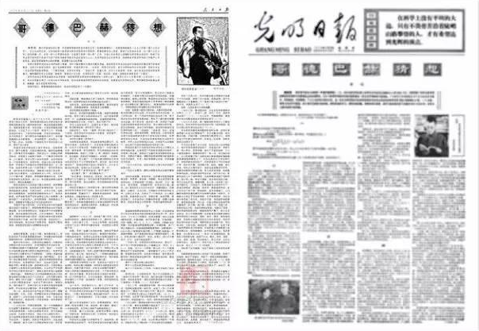

## nnnn姓名（资料）

适合所有人的历史读物。每天了解一个历史人物、积累一点历史知识。三观端正，绝不戏说，欢迎留言。  

### 成就特点

- ​
- ​

### 生平

【1996年3月19日】22年前的今天，证明1+2，毛泽东批示要抢救的数学家陈景润去世

陈景润（1933年5月22日－1996年3月19日），福建福州人，中国数学家，证明了哥德巴赫猜想“1+2”（陈氏定理）。

【口齿不清的数学老师】

1933年5月22日，陈景润出生于福建省福州市仓山区城门镇胪雷村。高中就读于福州英华高中，大学毕业于厦门大学数学系。1953年（20岁），被分配到北京市第四中学任教。因口齿不清，不让上台讲课，只可批改作业，不久停职回家乡养病。

1954年2月，厦门大学校长王亚南了解到他的情况，安排他回厦门大学任资料员、担任助教，研究数论。1957年9月，在华罗庚的安排下，把陈景润调入中国科学院数学研究所，任实习研究员、任助理研究员。

【200年前的伟大猜想】

哥德巴赫猜想是数论中存在最久的未解问题之一。这个猜想最早出现在1742年哥德巴赫与数学家欧拉的通信中。用现代的数学语言，哥德巴赫猜想可以陈述为：“任一大于2的偶数，都可表示成两个素数之和。截至2014年，数学家已经验证了4*10^18以内的偶数，没有反例。

1966年，证明了“1+2”（陈氏定理），即“一个偶数可以表示成一个素数及一个不超过两个素数乘积之和”，论文由王元审核后在《科学通报》上发表。

（哥德巴赫信件的手稿，原文用德文和拉丁文写成）

（将一个偶数用两个素数之和表示的方法）

【1+2的详细证明】

文化大革命期间，被视为“资产阶级黑线人物”和“白专道路的典型”，被关了起来，但陈景润继续在简陋的条件下钻研数学。1973年2月，陈景润完成了“1+2”的详细证明，并改进了1966年的数值结果。

他向数学所业务处处长罗声雄汇报，然后向中国科学院军代表汇报，又报告给了中国科学院党组。1973年4月，中国科学院主办的《中国科学》杂志，公开发表了陈景润的论文《大偶数表为一个素数及一个不超过两个素数的乘积之和》。

（陈景润手稿）

【毛泽东批示要抢救】

在中国科学院《科学工作简报》第七期，概括地介绍了陈景润的这项研究成果。中央某领导看了这份简报，要求将陈景润的论文写一份详细摘要。1973年4月20日，中国科学院将陈景润的“1+2”论文放大印制在八开纸上，报送中央。

随后，新华社记者就陈景润的情况采访了数学所领导，赶写出两篇新华社内参。文中说陈景润的腹膜结核病情危险，急需抢救。并引用了一段被采访者的话：“如何对待陈景润这样的知识分子……，请中央表个态。”

江青看到内参后，写道：“主席，此事还是请你过问一下为好，至少要先把他的病治好。”毛泽东看了后圈阅，并批示：“要抢救。请文元同志办。”

1973年4月27日，中科院与数学所领导亲自安排陈景润到清华大学医院会诊，到解放军第309医院住院，几个月后病情稳定出院。

【周恩来提议当代表】

1973年，英国数学家海尼·哈伯斯坦姆与德国数学家汉斯-埃贡·黎希特合作撰写的《筛法》正在付印，看了从香港邮来陈景润论文的复印件后，两人给《筛法》一书又增加了新的一章——《陈氏定理》，并在这一章的首页写道：“我们本章的目的是为了证明陈景润下面的惊人定理，我们是在前十章已经付印时才注意到这一结果的；从筛法的任何方面来说，它都是光辉的顶点。”

1974年，周恩来提议陈景润出任第四届全国人民代表大会代表，被安排在天津代表团。此后，陈景润连续出任第五届，第六届代表。1977年，破格被提升为研究员。

（位于厦门大学内的陈景润铜像）

【邓小平授意的报告文学】

1978年，在邓小平的授意下，作家徐迟发表报告文学《哥德巴赫猜想》，引发全国轰动，陈景润声名鹊起。

（1978年，全国科学大会上受邓小平接见）

（人民日报、光明日报转载徐迟的《哥德巴赫猜想》）

从1978年开始，他从事培养硕士及博士研究生的工作。1980年当选中科院物理学数学学部委员（院士）。先后受聘担任贵州民族学院、河南大学、厦门大学、青岛大学、华中工学院、福建师范大学等校兼职教授。1992年获得华罗庚数学奖。

陈景润体质很差，患有帕金森综合症。1996年3月19日，因肺炎并发症去世，遗体捐献给医院解剖，享年63岁。

（老年陈景润和家人）

