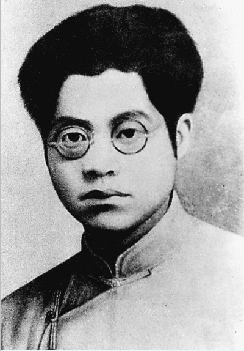
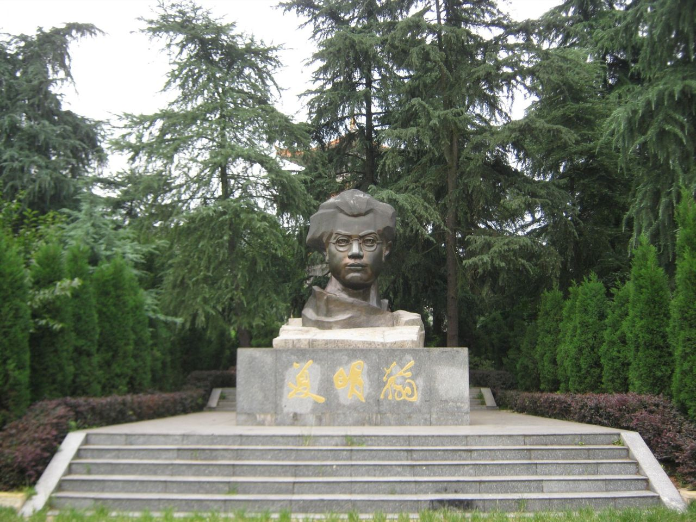
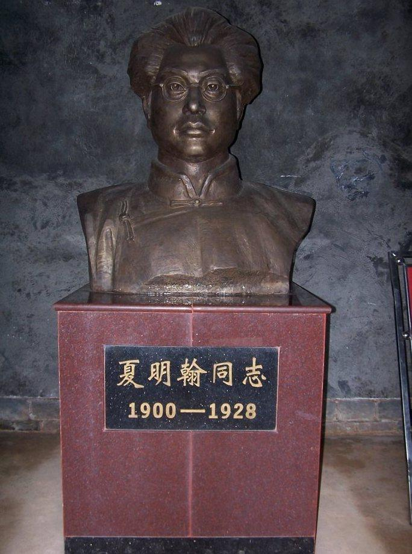
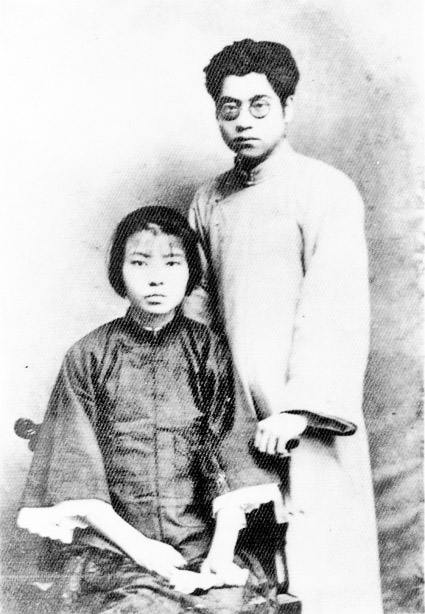
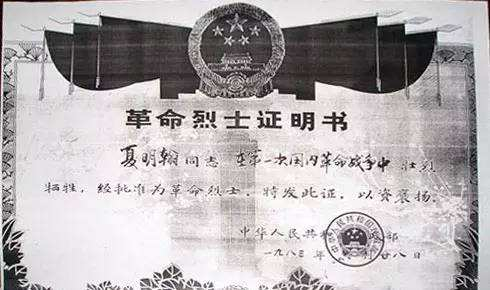
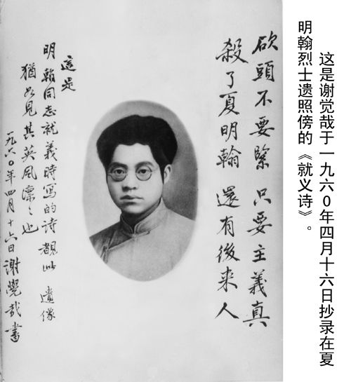

## nnnn姓名（资料）

适合所有人的历史读物。每天了解一个历史人物、积累一点历史知识。三观端正，绝不戏说，欢迎留言。  

### 成就特点

- ​
- ​

### 生平

【1928年3月20日】90年前的今天，毛泽东的秘书，砍头不要紧的夏明翰被杀牺牲

夏明翰（1900年8月1日－1928年3月20日）

【毛泽东介绍的共产党员】

1900年8月1日，夏明翰出生于湖北秭归，祖籍湖南衡阳。1917年春（17岁），夏明翰考入位于衡阳的湖南省立第三甲种工业学校。1919年，五四运动波及湖南，夏明翰响应湖南省学联的号召，举行罢课等活动。

1920年秋，夏明翰在何叔衡的帮助下来到长沙，成为毛泽东创办的湖南自修大学的第一批学员，开始接触共产主义思想。1921年冬，经毛泽东、何叔衡介绍，夏明翰加入中国共产党。

（衡阳市西湖公园内的夏明翰雕塑）

【毛泽东的秘书】

此后，夏明翰在长沙从事工人运动，领导和组织长沙人力车工人罢工。

1924年，夏明翰担任中共湖南区委委员、农民部长，经常化装成农民，在长沙、平江、湘潭等地做农村调查，培养农运干部。

1927年2月，夏明翰被调到武汉工作，担任全国农民协会秘书长，并兼任毛泽东和中央农民运动讲习所秘书。

【越杀胆越大，杀绝也不怕】

1927年4月12日，蒋介石在上海发动清党，搜捕共产党。夏明翰闻讯后写道：“越杀胆越大，杀绝也不怕。不斩蒋贼头，何以谢天下！”

6月，参加中共的第五次全国代表大会后，夏明翰被调回湖南，任湖南省委委员兼组织部长。此时，长沙刚经历了“马日事变”，中共的组织崩溃，被迫转入地下活动。

（1927年春，夏明翰与妻子郑家均在武昌）

【弟弟和妹妹的牺牲】

八七会议后，毛泽东从武汉回到湖南，发动秋收起义。夏明翰主要负责联络工作，他扮成农民、商人，到长沙周边各地，组织民兵。他的两个弟弟和一个妹妹参加起义，先后阵亡牺牲。

9月，毛泽东退向井冈山后，夏明翰留下继续组织农民运动。10月，夏明翰任平（江）浏（阳）特委书记，领导发动了平江、浏阳的农民暴动，对井冈山根据地的建立起到了推动作用。

（夏明翰的革命烈士证明书）

【杀了夏明翰，还有后来人】

1928年初，夏明翰被调到湖北，任中共湖北省委常委，配合湖北省委书记郭亮工作。3月18日，遭叛徒背叛，夏明翰在武汉被捕。3月20日清晨，他被押送到汉口余记里刑场，英勇就义，年仅28岁。

1960年，谢觉哉回忆夏明翰时，在夏明翰的遗照的左右两旁亲笔写下了：“

砍头不要紧，只要主义真。杀了夏明翰，还有后来人。

这是明翰同志就义时写的诗，见此遗像犹如见其英风凛凛也。一九六零年四月十六日谢觉哉书”。

从此，夏明翰的就义诗传遍了中国。

![