## nnnn姓名（资料）

适合所有人的历史读物。每天了解一个历史人物、积累一点历史知识。三观端正，绝不戏说，欢迎留言。  

### 成就特点

- ​
- ​

### 生平

【1885年3月21日】133年前的今天，直接导致英法联军火烧圆明园的巴夏礼去世

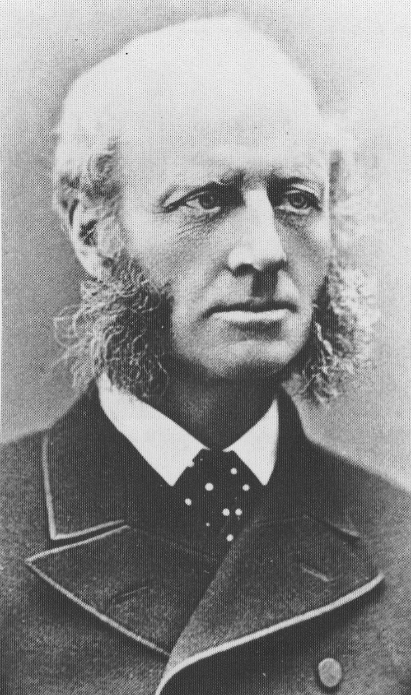

巴夏礼（1828年2月24日－1885年3月21日），13岁来到中国，是第二次鸦片战争的关键人物。由于在与清朝和谈中被俘虏，直接导致英法联军进入北京，火烧圆明园。香港九龙巴夏礼街以他为名。

【13岁来到中国】

1828年2月24日，巴夏礼出生于英格兰。5岁时，父母先后去世，成为孤儿，由曾是海军军官的伯父收养。1840年，英国与清朝的第一次鸦片战争爆发。

1841年6月，年仅13岁的巴夏礼乘船前往中国，抵达澳门，居住于表姐家。巴夏礼学习中国话，准备接替马儒翰的职位。马儒翰是英国驻华全权公使及商务总监砵甸乍的翻译和秘书。

1842年，砵甸乍率英国舰队北上，巴夏礼担任砵甸乍的随从。不久，清军战败，双方签署了南京条约，将广州、厦门、福州、宁波和上海五个港口开放为通商口岸。

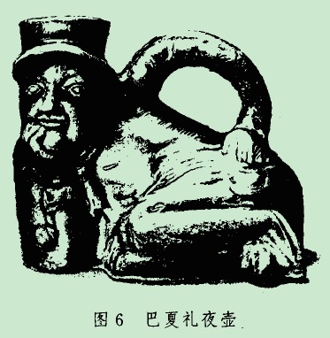

【通商口岸的翻译官】

1843年，巴礼夏通过了英国领事馆的中文水平测验，先后在福州、厦门、上海、广州等地担任领事翻译等职。1853年，升任广州副领事，1854年任厦门领事。1855年，他作为秘书，跟随港督宝宁前往暹罗（今泰国），签订条约，这时暹罗第一次与西方国家缔结条约。

随后，他返回英格兰，获得维多利亚女王接见。1856年元旦，在伦敦结婚，不久携带妻子重返中国，担任广州领事。

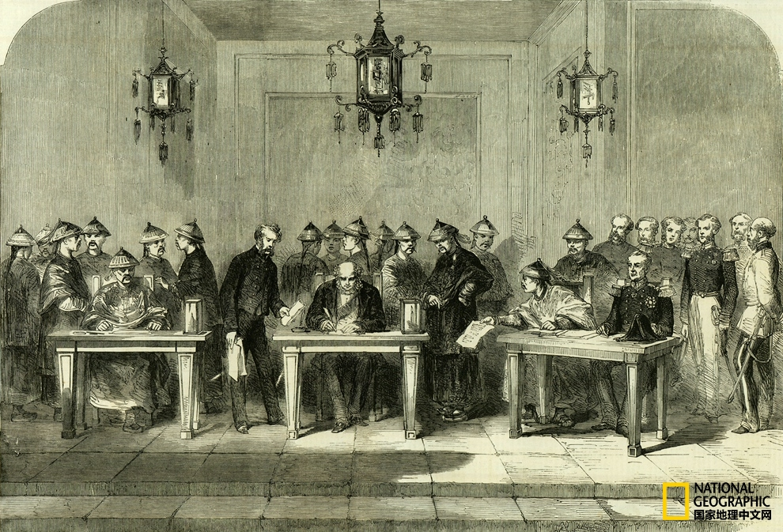

【广州成为殖民地】
在1856年10月8日，老闸船亚罗号进入珠江后，被清军拦截，12名华籍水手被捕，英国国旗被取下。巴夏礼以英国国旗被降下为由，与两广总督叶名琛争执不下，第二次鸦片战争爆发。10月29日，英国海军炮轰广州城。因人数太少，不足以占领广州，退回到香港。

1957年11月，英国派来增援军队，额尔金被任命为驻华全权代表。12月12日，巴夏礼发出最后通牒。1858年1月，英军攻破广州，俘虏了叶名琛。

英军在广州建立委员会，进行统治。委员会由两个英国人组成，巴夏礼为其中之一。巴夏礼通晓华语，成为委员会事实首领。委员会建立法庭，组建警察，开放广州港口。

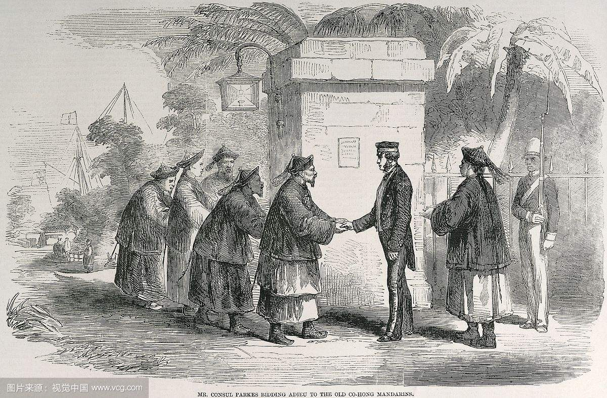

【导致火烧圆明园的俘虏】

1860年8月，英法联军袭击大沽炮台，进逼北京。巴夏礼随军参加在通州与清朝的和谈，结果被被清军扣押俘虏。随后，英法联军以5人死亡的微弱代价，大败清军僧格林沁的骑兵。10月6日，攻入北京城。10月8日，巴夏礼等七人获得释放。

不久，数千名法军士兵冲入圆明园，展开抢劫，英军随后跟进。10月17日，联军司令部正式下令可入园自由劫掠。

随后，英军在园中发现《泰晤士报》随军记者被肢解的尸体，10月18日联军下令放火烧园，以作为对清廷的惩罚。圆明园大火持续烧了三天三夜，300多名太监和宫女葬身火海。

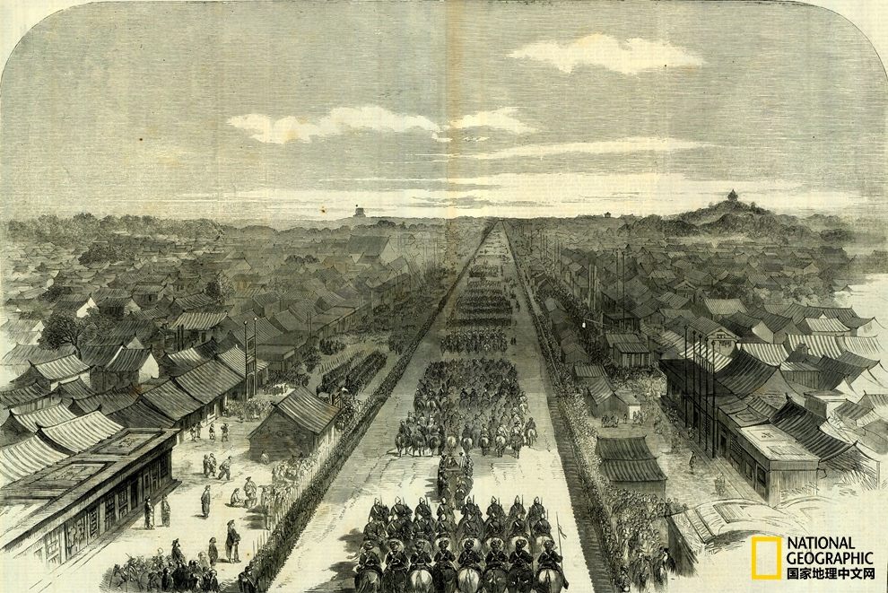

【与太平天国擦肩而过】

1861年，巴夏礼回到广州担任原职，处理接收九龙的事宜。不久，他随海军沿江而行，在镇江、九江与汉口设立领事馆，并试图与南京的太平天国建立联系。巴夏礼向洪秀全提出，协助太平天国叛军打败清朝，事成后平分中国，但最终未能达成一致。

1862年1月，他回到英格兰，因被俘虏一事，使他变得全国知名。1862年5月19日，他获得了巴斯爵级司令勋章。

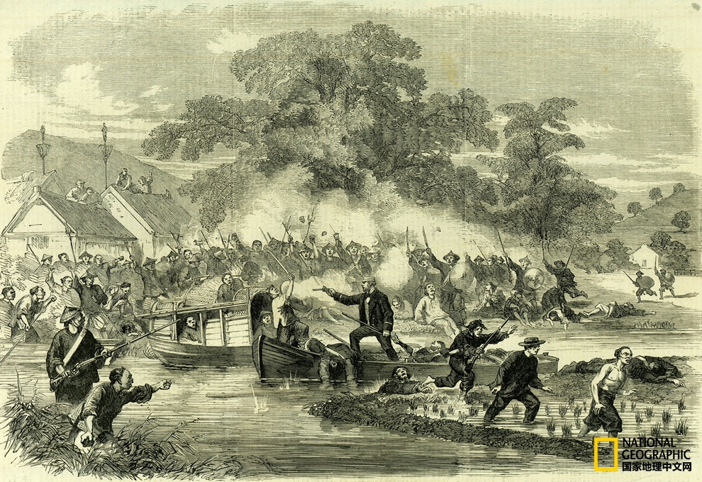

【日本、朝鲜和中国】

1865年5月，巴夏礼被任命为驻日特命全权公使与领事。这个职位他担任了18年，在任内，他支持日本的自由派。他向幕府的对手示好，对明治政府有影响力。因为他支持改革派，守旧派曾三次试图刺杀他。巴夏礼夫人因在1867年攀登富士山而变得知名，这是第一次有非日本妇女攀登富士山。

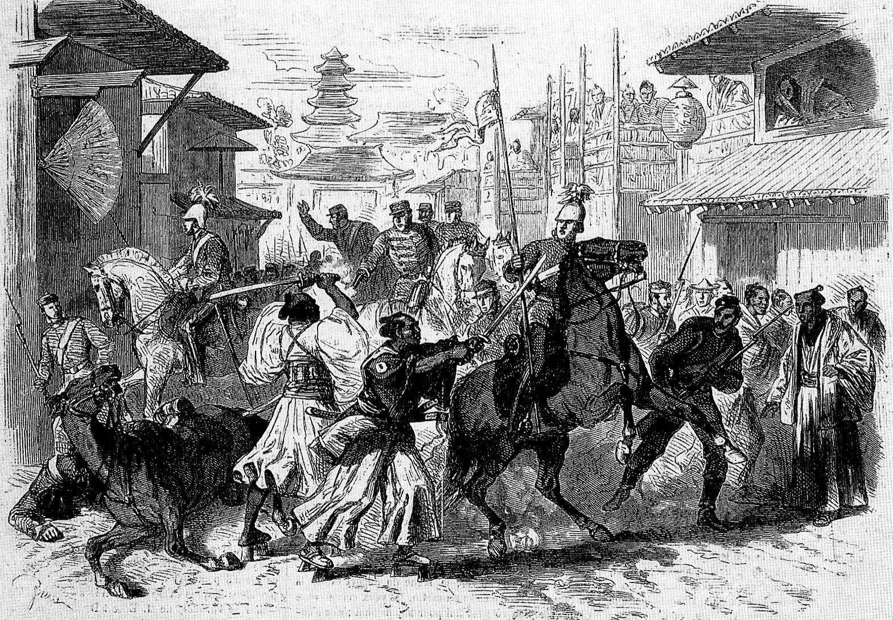

1883年至1884年间，任驻朝鲜公使。他代表英国与朝鲜王朝谈判，签署了朝英通商条约。条约生效后，他成为了第一个驻朝外交代表。

这时，他的健康变差，1885年3月21日，因疟疾发热，在北京病逝。1890年4月，干诺公爵为他在上海外滩竖立纪念碑，但在二战时被日军移除。

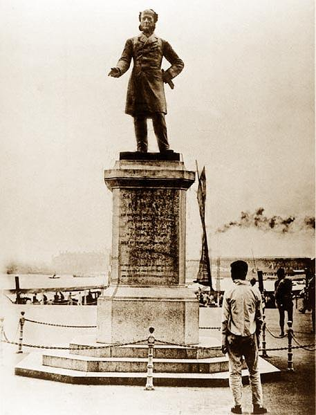

（巴夏礼铜像）

【】

### 照片

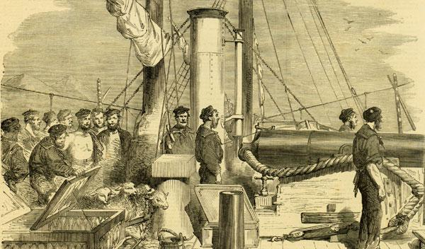

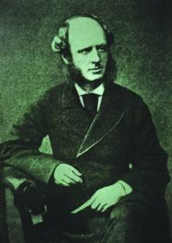

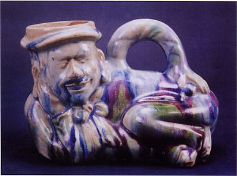

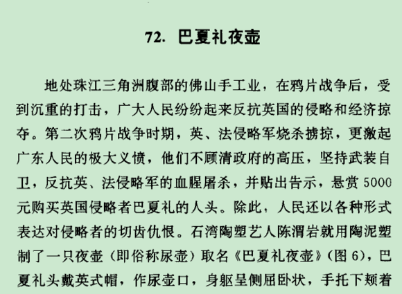

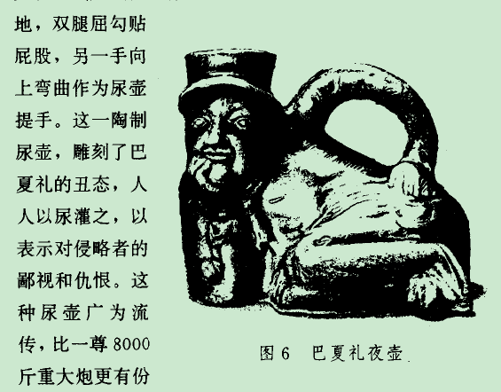

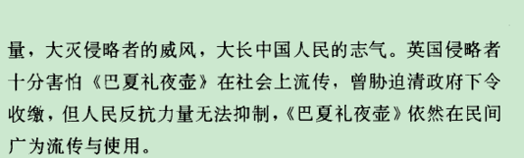

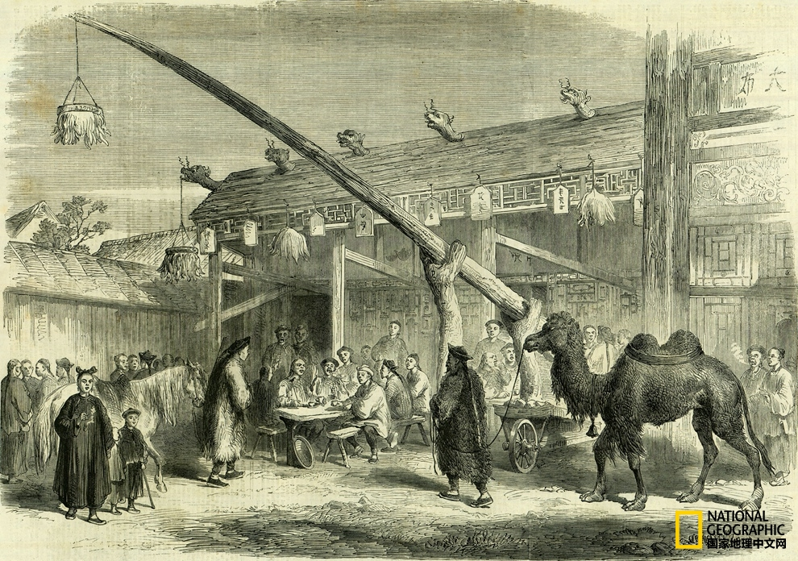

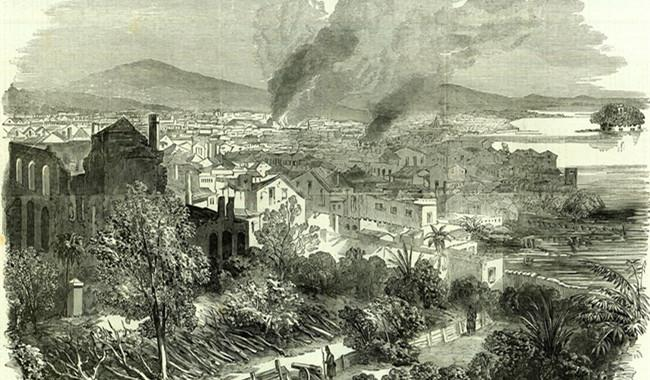

