## nnnn姓名（资料）

适合所有人的历史读物。每天了解一个历史人物、积累一点历史知识。三观端正，绝不戏说，欢迎留言。  

### 成就特点

- ​
- ​

### 生平

【1913年3月22日】105年前的今天，为中国宪法牺牲的第一人宋教仁被刺身亡

宋教仁（1882年4月5日－1913年3月22日），湖南桃源人，笔名渔父。华兴会和同盟会的革命元老，筹建了国民党。当国民党在国会大选中，大获全胜，将要组织内阁时，在上海火车站，被抢手刺杀而死，年仅31岁。孙中山认为，宋教仁“乃为中国宪法而牺牲之第一人”。

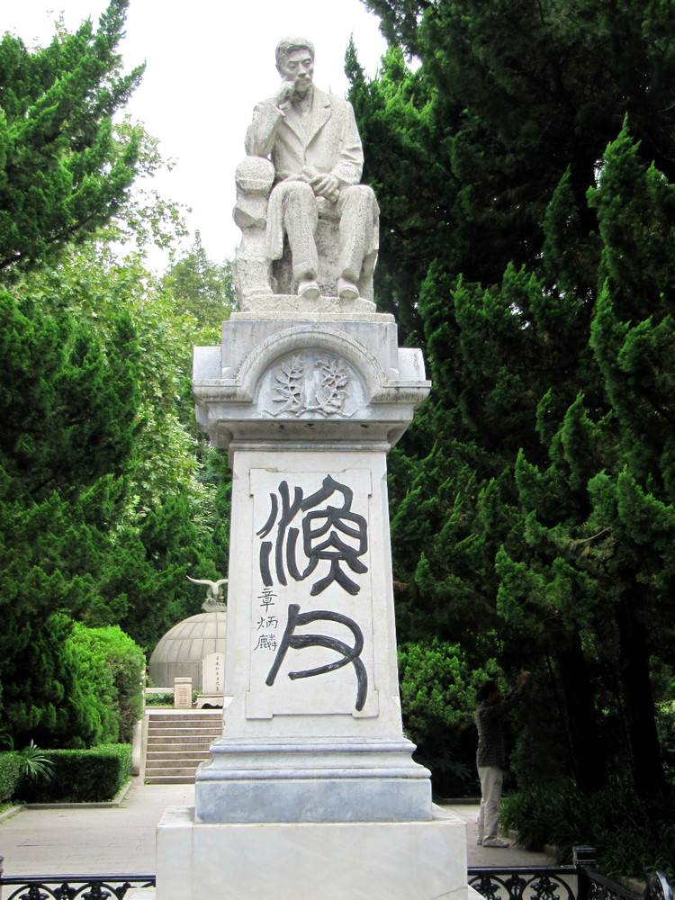

【讨论时政的狂妄学生】

1882年4月5日，宋教仁出生于湖南省桃源县的一家书香门第。1899年3月（17岁），进入桃源漳江书院，不喜欢读经书，却爱讨论中西政治得失，古今用兵成败。大家都视他为狂妄学生，不予接近，宋教仁视而不见，不久离开。1901年，考中秀才。

1902年，赴武昌考入美国圣公会中国差会文华书院（现华中师范大学）。在校期间，他参与吴禄贞等人组织的革命团体聚会，议论时政。8月，黄兴到武昌，两人相识。不久，黄兴因激烈的反清言论，被驱逐出武昌，回到长沙。宋教仁也回到湖南。

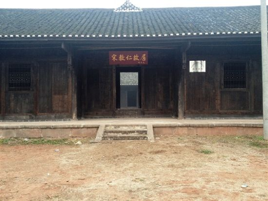

【驱除鞑虏的华兴会】

1904年2月25日，以“驱除鞑虏、恢复中华”的政治口号，正式在长沙成立华兴会，黄兴担任会长，宋教仁为副会长。不久，宋教仁回到武昌，组织成立科学补习所。

11月，为筹集款项，宋教仁回到长沙，却发现华兴会已被政府查封。宋教仁只好追随黄兴，逃亡到日本。

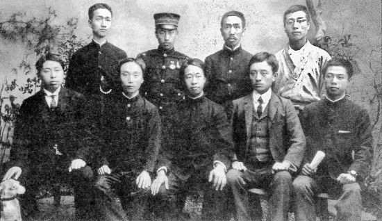

（1905年，日本东京华兴会部分成员合影。黄兴（前排左一）、宋教仁（前排左四））

【渗透长江流域的同盟会】

1905年，他与友人合办刊物《二十世纪之支那》，入读日本法政大学。8月，支持孙中山在日本东京成立中国同盟会，但任司法部检事长。11月，创立《民报》，为中国同盟会机关报。

同盟会在组织多次起义失败后，1911年，宋教仁与谭人凤、陈其美等在上海组建同盟会中部总会，将革命势力往长江流域发展。10月10日，武昌起义爆发，与此有相当的关联。

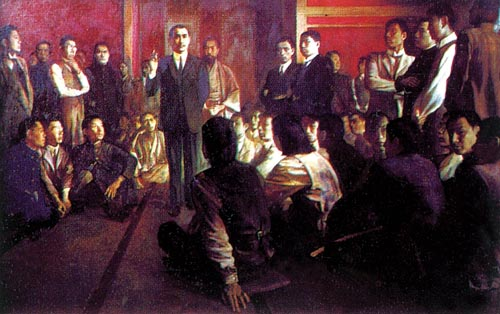

（油画：同盟会成立）

【第一大党的国民党】

1912年1月1日，中华民国在南京成立，宋教仁但任法制局局长，起草了一部宪法草案《中华民国临时政府组织法》。4月，出任唐绍仪内阁的农林总长。7月，因不满袁世凯破坏《临时约法》，辞去农林总长之职。

7月，中国同盟会举行全体大会，宋教仁当选为总务部主任干事，主持同盟会工作。8月，他联合统一共和党、国民共进会、共和实进会、国民公党等，成立国民党。宋教仁当选为理事，并代理理事长。国民党成为第一大党。

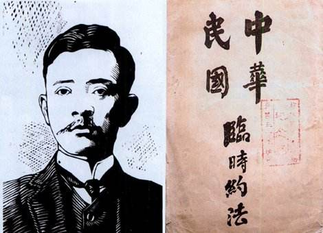

【即将上任的内阁总理】

宋教仁主张“责任内阁制”，认为“内阁不善而可以更迭之，总统不善则无术变易之，如必欲变易之，必致动摇国本”。他极力推崇议会制度，当时政坛上都给他取了个绰号为“议会迷”。

1913年，国会大选，国民党大获全胜，获压倒性多数席次。按照“内阁制”惯例，宋教仁将以党魁身份组阁，成为民国内阁总理。

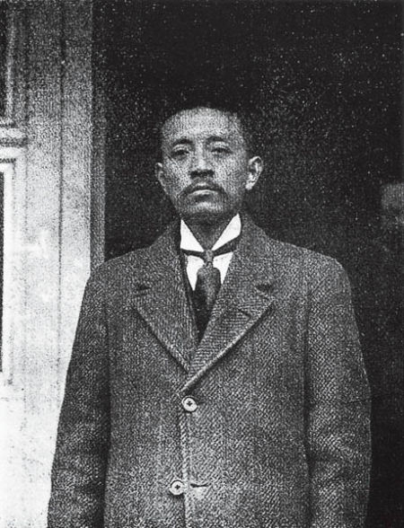

【上海火车站的枪击事件】

3月20日晚上10点，受袁世凯邀请，宋教仁与若干国会议员打算北上北京，在步入上海车站（老北站，现上海铁路博物馆）时，遭杀手袭击，腰部中弹，凶手开枪后逃逸。

在火车站送行的黄兴、于右任、廖仲恺等，将宋教仁送往沪宁铁路医院急救。在医院他授意黄兴电报袁世凯，原文如下：“北京袁大总统鉴：仁本夜乘沪宁车赴京，敬谒钧座。十时四十五分在车站突被奸人自背后施枪弹，由腰上部入腹下部，势必至死。窃思仁自受教以来，即束身自爱，虽寡过之未获，从未结怨于私人。清政不良，起任改革，亦重人道、守公理，不敢有毫权之见存。今国基未固，民福不增，遽尔撒手，死有余恨。伏冀大总统开诚心、布公道，竭力保障民权；俾国家得确定不拔之宪法，则虽死之日，犹生之年。临死哀言，尚祈见纳。宋教仁。”

3月22日凌晨4时48分，宋教仁不治身亡，年仅31岁。

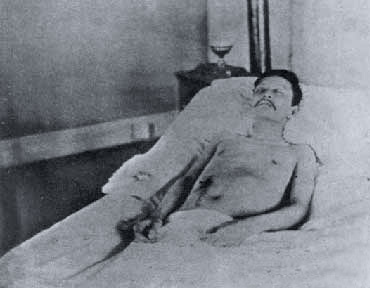

（宋教仁的赤身遗照）

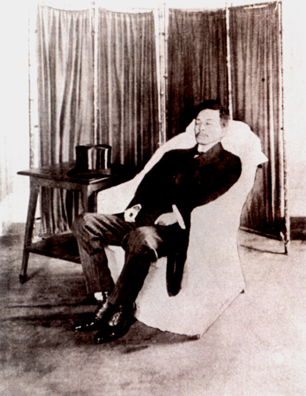

（宋教仁的正装遗照）

【自下而上的凶手嫌疑人】

案发后，上海各地悬赏缉捕。3月23日，古董字画商王阿法到英租界捕房报称：一周以前因卖字画曾去巡查长应桂馨家，应桂馨拿出一张照片，要他谋办照片上的人，愿出酬金1000元。照片上的人正是宋教仁。

搜查应桂馨家宅，又搜得手枪一柄，枪内余弹两枚，经检验与宋教仁体内取出的弹头匹配。并捕获开枪凶手武士英（真名吴福铭）。并查获他与国务总理赵秉钧的秘书洪述祖之间的电报往来，如：“毁宋酬勋，相度机宜，妥筹办理。”

由此，洪述祖、赵秉钧和袁世凯成为幕后凶嫌。

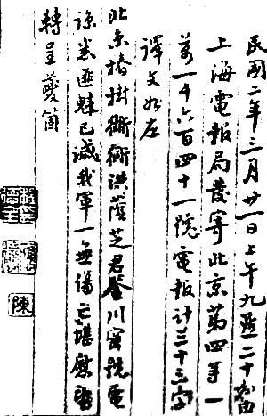

（应桂馨向洪述祖报告任务已完成的密电）

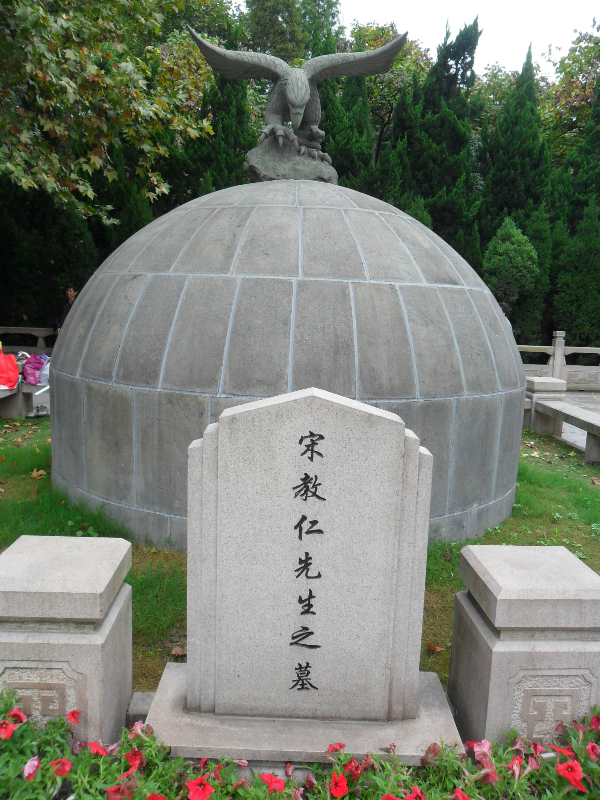

（宋教仁墓）

【死无对证的意外死亡】

5月1日，赵秉钧被迫辞去国务总理一职，改任直隶都督（驻天津）。经和英法领事交涉，应桂馨、武士英从上海公共租界移交到国内监狱。不久，武士英吃了毒馒头，暴毙狱中。而应桂馨在一次劫狱事件逃出，到青岛躲避。

国民党讨袁的二次革命失败后，应桂馨开始显露行迹，公开发出请“平反冤狱”的通电，公然从青岛到达北京。1914年1月，在开往天津的火车上，应桂馨被京畿军政执法处人员乱刀砍死。一个月后，赵秉钧在天津督署内突然暴毙。从此，死无对证。

关于凶手，全国议论纷纷。黄兴写有挽联：“前年杀吴禄贞，去年杀张振武，今年又杀宋教仁；你说是应桂馨，他说是赵秉钧，我说却是袁世凯。”孙中山认为，宋教仁“乃为中国宪法而牺牲之第一人”。

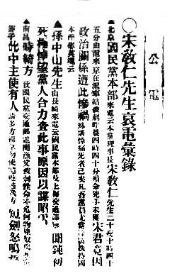

（上海《民主报》发表的孙中山电文）

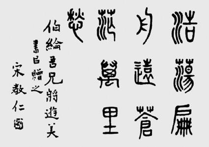

（宋教仁书法：浩荡扁舟远，苍茫万里愁）

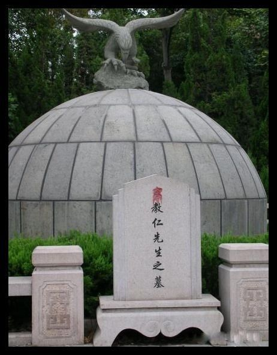

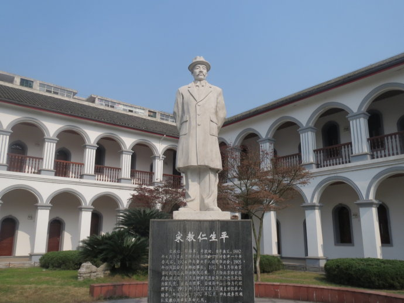

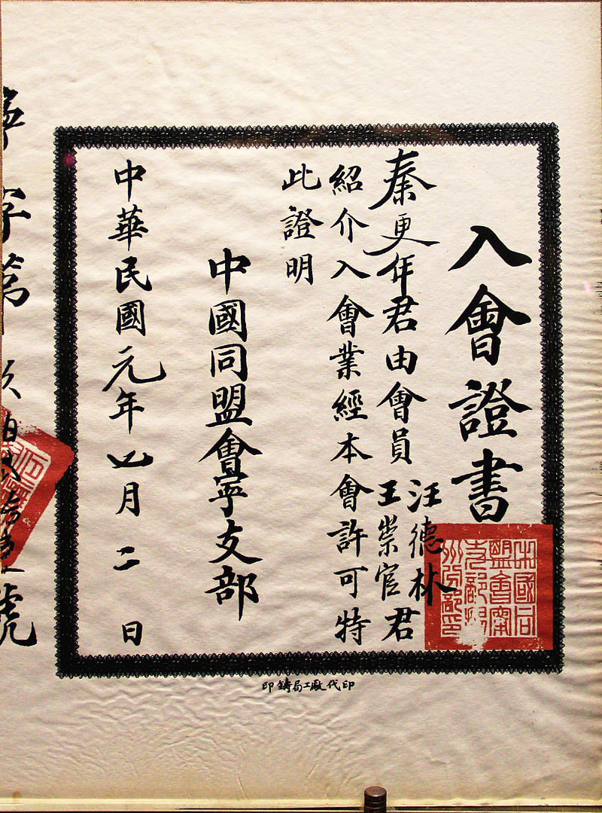

