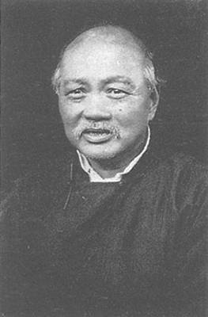
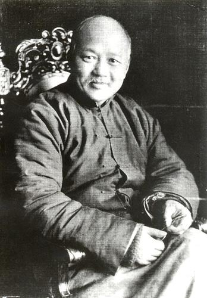
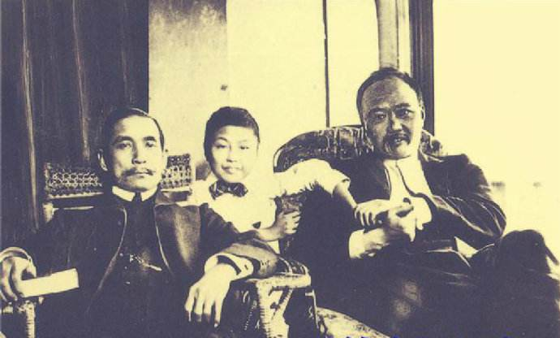
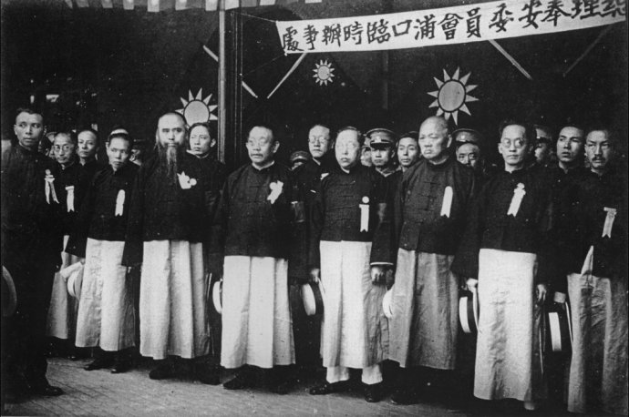
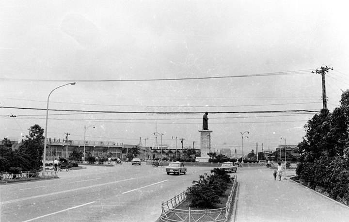
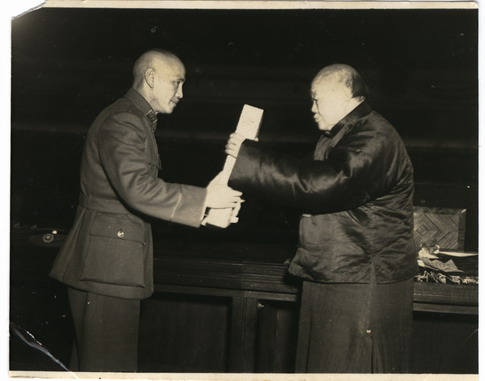
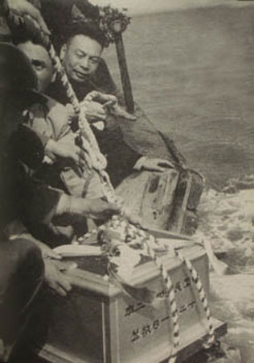
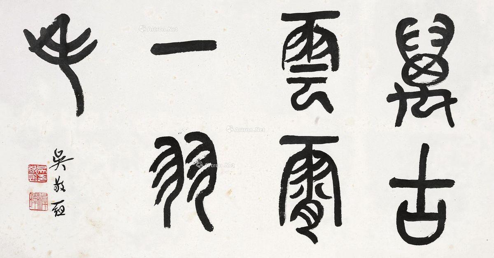

## nnnn姓名（资料）

适合所有人的历史读物。每天了解一个历史人物、积累一点历史知识。三观端正，绝不戏说，欢迎留言。  

### 成就特点

- ​
- ​

### 生平

【1865年3月25日】153年前的今天，不愿当国家主席的国民党开国元老吴稚晖出生

吴稚晖（1865年3月25日－1953年10月30日），江苏武进人，原名吴敬恒。

【苏报案的”假告密者“】

1865年3月25日，吴稚晖出生于江苏武进，原名吴敬恒。1891年（26岁），考中举人。1898年（33岁），到南洋公学任教。1903年，在《苏报》撰文抨击清廷，痛骂当时执政的慈禧太后是“娼妓淫妇”。

1903年初，全国普遍爆发的学潮，《苏报》聘章士钊为主笔，章太炎、蔡元培等撰稿人，发表邹容《革命军》和章太炎的《驳康有为论革命书》，成为国内反清革命舆论的重要阵地。清政府要求关闭《苏报》，从而引发苏报案。当时有人以为吴稚晖是告密者。

1904年5月21日，经过会审轻判，邹容监禁二年，章太炎监禁三年。“苏报案”是中国近代新闻史上第一个因言论罪被政府告上法庭的报案。也开了近代革命派报刊为唤起舆论而无所顾忌、放言激烈的办报风气。《苏报》案发后，吴稚晖经香港去伦敦。

【推行国语注音的大佬】

1905年冬，参加同盟会。1906年，在巴黎参与组织世界社，1907年刊行《新世纪》周刊及《世界画刊》，鼓吹无政府主义。

1911年（46岁），辛亥革命后，多从事文化运动。1913年，任教育部读音统一会议长，提倡国语注音与国语运动。他积极推行的“注音符号”，今天仍在台湾和华侨间通行。

（1909年，吴稚晖和孙中山在英国）

【留法勤工俭学运动】

1913年（48岁），参与孙中山发起的反袁世凯政权的二次革命，失败后再赴欧洲。在这段时间，吴稚晖创办了里昂中法大学，并发起留法勤工俭学运动，呼吁中国青年以半工半读方式留学，如周恩来、邓小平等都因此得以出国留学。

1924年（59岁），吴稚晖等人在上海创办中华粥会。至今中华粥会仍在台湾运作，每月集会吃粥，以纪念吴稚晖。1925年，孙中山去世，吴稚晖国民党内部极右派西山会议派成员之一。

（1929年，孙中山移灵中山陵时，吴稚晖与国民党元老迎灵）

【不当国家主席的反共先锋】

1927年，任中国国民党中央监察委员，极力支持蒋介石“清党”，成为蒋介石的御用心腹智囊。在长达20多年的国共斗争中，吴稚晖一直扮演着积极反共的角色。

1943年（78岁），国民政府主席林森病逝，蒋介石力邀吴稚晖担任国家主席。吴稚晖推辞说：“我平常的衣服穿得很随便很简单，做元首要穿燕尾服、打领结领带，我觉得不自在；我脸长得很丑，不像一个大人物的模样；我这个人爱笑，看到什么会不自主地笑起来，哪天外国使节来递国书，会不由得笑起来，不雅。”

以后，吴稚晖也基于此“三不”，不任任何官职。

（位于台北的吴稚晖铜像）

【中华民国宪法的制定人】

1946年，国民政府宣布结束训政阶段，在南京召开的制宪国民大会，确立了《中华民国宪法》，吴稚晖担任制宪代表主席。吴稚晖亲手将《中华民国宪法》递交给蒋介石，这张照片被载入台湾历史教科书。因此，很多台湾人对他的印象是“制宪大老”。

1949年（84岁），蒋介石派专机“美龄号”将吴稚晖从广州接到台北。

（吴稚晖将《中华民国宪法》交给蒋介石）

【海葬金门的书法家】

1953年10月30日，吴稚晖病逝台北，享年89岁。蒋介石题词“痛失师表”。12月1日，按照遗嘱，蒋经国将他的遗骨用渔船运到金门，“葬于厦门南面海底”。

1954年，高达四米的吴稚晖铜像树立在台北，成为当时台北市地标之一。直到90年代，该铜像才被拆除移走。

吴稚晖精于小篆，与操隶书的胡汉民、楷书的谭延闿、草书的于右任，并誉为“民国四大书法家”。

（蒋经国（右）为吴稚晖主持海葬）

（吴稚晖书法：万古云霄一羽毛）

