## nnnn姓名（资料）

适合所有人的历史读物。每天了解一个历史人物、积累一点历史知识。三观端正，绝不戏说，欢迎留言。  

### 成就特点

- ​
- ​

### 生平

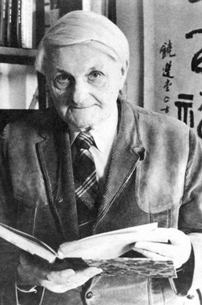

李约瑟（1900年12月9日－1995年3月24日）

【化学胚胎学之父】

1900年12月9日，李约瑟生于伦敦。入读于剑桥大学，1921年获文学学士学位，1925年10月获哲学博士学位。1924年，被聘为剑桥大学教授，研究胚胎学。

1924年，李约瑟与大学同学，中文名李大斐（1896年9月22日－1987年12月22日）结为伉俪，两人齐头并进，都成为享誉世界的胚胎生化学家，双双当选为英国皇家学会会员。

1931年，他出版了《化学胚胎学》、《生物化学形态学》和《胚胎学史》，被科学界誉为“化学胚胎学之父”。

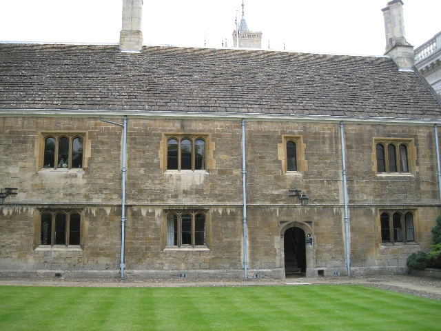

【和中国女学生的婚外恋】

1937年，三个中国人来到剑桥大学攻读学位。其中，鲁桂珍（1904年7月22日－1991年11月28日），一个来自南京金陵女子大学的毕业生，和李约瑟发生了婚外恋。

奇怪的是，李大斐接受他们两人的恋情，三人在同一屋檐下融洽共处长达50年，直到1987年李大斐病逝，两年后李约瑟迎娶了鲁桂珍。

鲁桂珍向李约瑟介绍中国的“科学发明”和医药学，给身处“西方中心论”环境中的李约瑟带来很大的心灵震动。从此之后，李约瑟对中国科学发生极大兴趣，开始学习汉语、文言文。

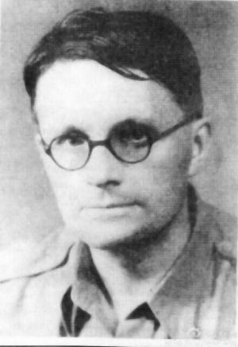

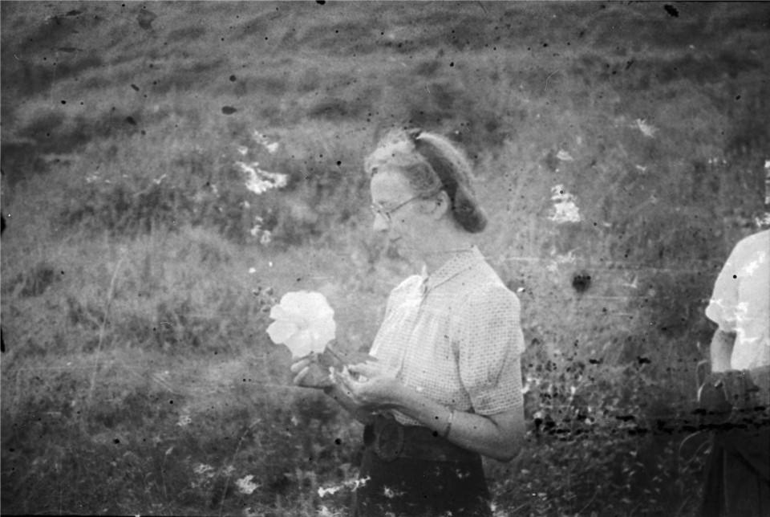

【中国的科学与文明】

1941年，李约瑟获选为英国皇家学会院士。1942年，他来到中国，在重庆任中英科学合作馆馆长，并结识了竺可桢、傅斯年等中国学者。他游历了敦煌、云南等地，收集了大量文献和资料，直到1946年回国。之后，他赴巴黎任联合国教科文组织自然科学部的第一位部长。

他开始写《中国的科学与文明》（即《中国科学技术史》）。1954年，完成第一卷，大受欢迎。他一开始只打算写一卷，结果越写越多。1956年出版第二卷，1959年出版第3卷。其他科学家也加入进来，即使在他去世后，也在继续出版。目前已有7卷27册，已有中译本10几册。

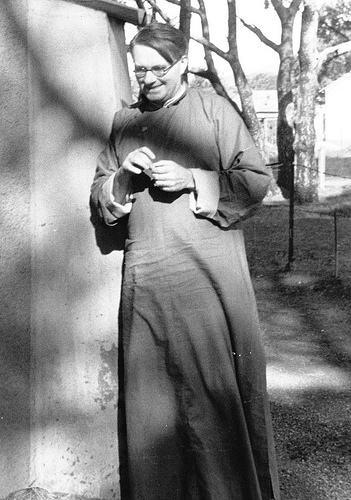

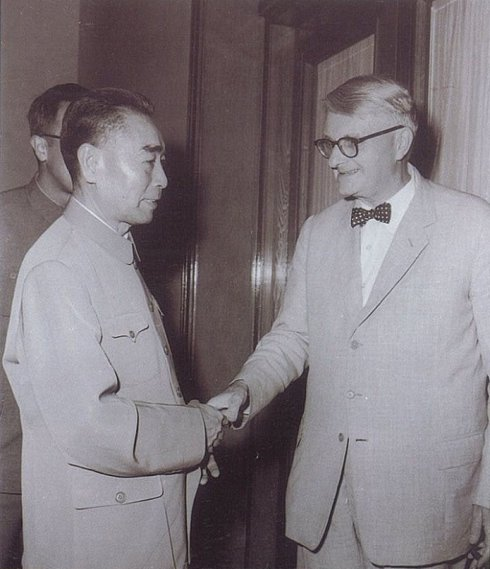

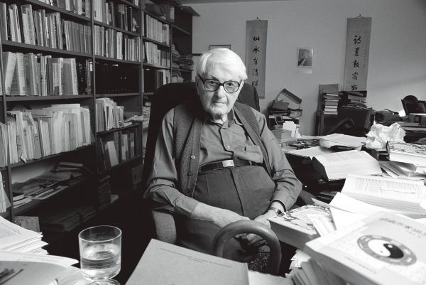

【确信中国能够再度崛起】

1983年，李约瑟主持撰写的《中国科学技术史》获中国国家自然科学奖一等奖。

1994年，李约瑟当选为中国科学院外籍院士。1995年，在剑桥寓所辞世，享年94岁。骨灰安葬在研究所门前的菩提树树下。

李约瑟临终前的观点：“（我）确信中国能够再度崛起，一个拥有如此伟大的文化的国家，一个拥有如此伟大的人民的国家，必将对世界文明再次做出伟大贡献。”

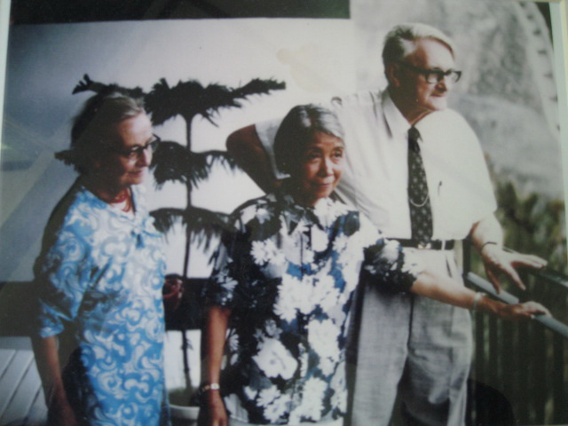

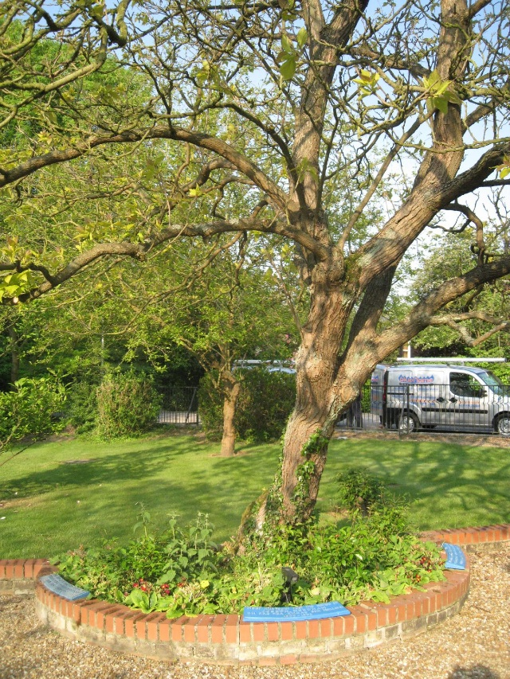

【难解的李约瑟难题】

李约瑟改变了国际社会对中国只会农业和艺术的观感，使得国际社会对中国科技史研究开始重视，成为重要的国际学术。他提出了一个重要话题：尽管中国古代对人类科技发展做出了很多重要贡献，但为什么科学和工业革命没有在近代的中国发生？这个问题被称为”李约瑟难题“。

他的个人见解是：秦统一后，中央集权的需要，“官僚制度”的建立，使得“重农抑商”，成为科技的发展的阻力。因为中国所处的地理环境，独有的水利问题（尤其是黄河），需要整体集中治理。而水利网超出了任何一个封建领主的领地，因而不得不让位给中央集权的、官僚式的文明。

最后他做出结论：“如果中国人有欧美的具体环境，而不是处于一个广大的、西面被沙漠切断，北面是寒冷的雪山，南面是丛林，东面是宽广的海洋的这样一个地区，那情况将会完全不同。那将是中国人，而不是欧洲人发明科学技术和资本主义。”

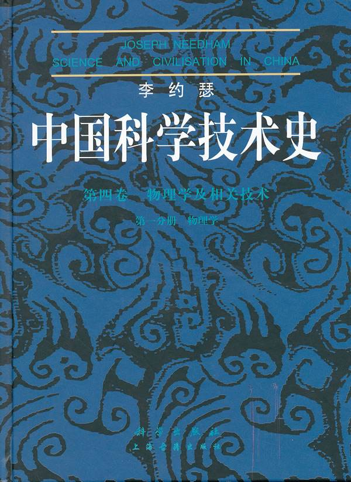

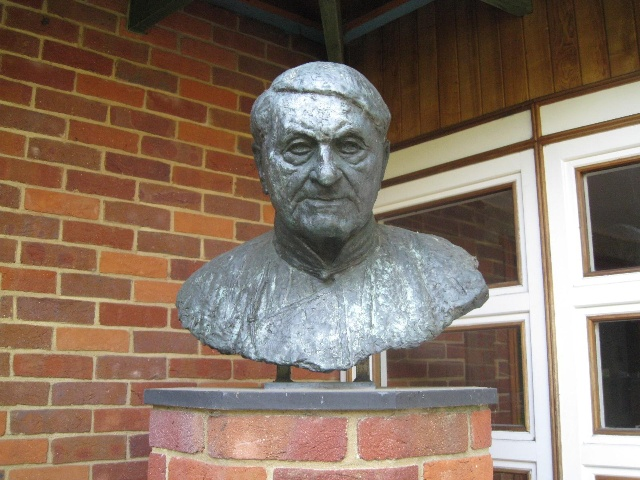

