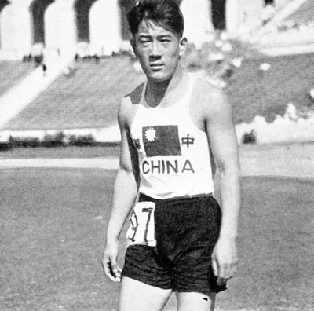
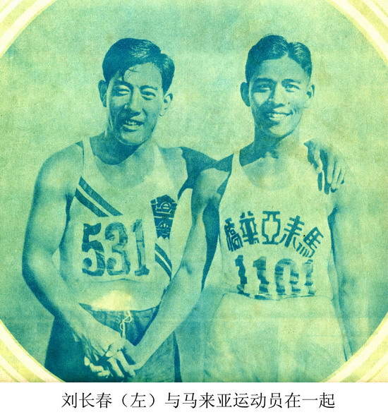
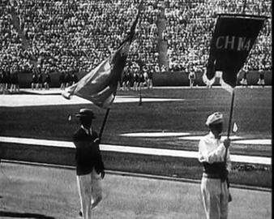
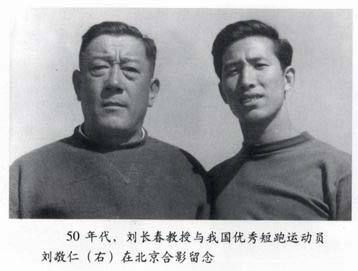
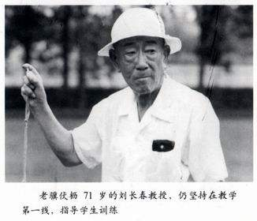
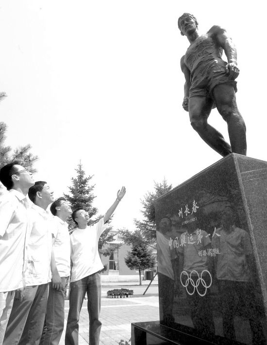
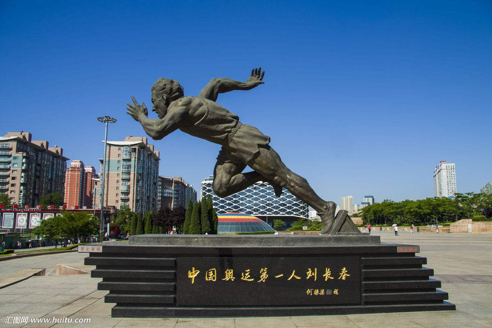

## nnnn姓名（资料）

适合所有人的历史读物。每天了解一个历史人物、积累一点历史知识。三观端正，绝不戏说，欢迎留言。  

### 成就特点

- ​
- ​

### 生平

【1983年3月25日】35年前的今天，不代表满洲国参赛的中国奥运第一人刘长春去世

刘长春（1909年11月25日－1983年3月25日），今辽宁大连，短跑运动员，是代表中国参加奥林匹克运动会的第一人。

【打破三项记录的小飞侠】

1909年11月25日，刘长春出生于今辽宁大连。从小身体素质出众，就读于东北大学体育系。

1929年5月（20岁），参与在沈阳举行的第14届华北运动会，一举打破了100米、200米和400米三个短跑项目全国记录，轰动全国。尤其在100米决赛中，跑出了10秒80佳绩，平了1928年第九届奥运会百米冠军的成绩，令人震惊。

【不代表满洲国参赛的运动员】

1931年，九一八事变后，日本控制中国东北，扶植成立满洲国。满洲国政府在报纸上宣称：刘长春将代表满洲国参加第十届洛杉矶奥运会。

1932年5月，刘长春在《大公报》发表声明：“本人为中华民族炎黄子孙，中国人绝不代表伪‘满洲国’出席第十届奥林匹克运动会。”本来，中华民国政府没有计划参加奥运会。经张学良资助8000银圆，发紧急电报给奥委会，为刘长春报了名。

【铩羽而归的奥运会】

1932年7月，刘长春从上海启程，乘威尔逊总统号邮船去美国参加奥运会。经过21天的海上长途航行，于7月29日抵达洛杉矶。第二天，7月30日，第十届奥运会正式开幕，开幕式上，临时拼凑的中国代表队排在第8位入场。

7月31日，比赛正式开始，刘长春参加了当天的百米预赛，被分在第二小组，有6名运动员参加，取头3名。比赛结果，刘长春在日记中写到：“第一名为星卜森，胜余有4码，成绩10秒9，余居第5，当在11秒左右。……原因毕业考试一个月，航行劳顿，缺少练习所致。”

刘长春原本报名3个项目，他只参加100米和200米，400米则因体力不支，没有出场比赛。参加的两个项目，都未能晋级。8月21日，刘长春起程回国，9月16日返抵上海，受到上海市民的热烈欢迎。

【再次铩羽而归的奥运会】

1933年，第5届全国运动会上，刘长春再创100米10秒7和200米22秒的两项全国纪录，并获冠军，成绩接近世界水平，保持长达25年之久才被打破。

1936年，刘长春再次代表中华民国参加第11届柏林奥运会。69人代表团经过27天的海浪颠簸，抵达德国，再次在100米预赛中遭淘汰。

1950年，刘长春回到大连，开始长期供职于大连工学院（现大连理工大学）。1980年，刘长春开始编写《短跑运动》。1983年3月25日，刘长春因病去世，享年74岁。

【没有遗憾的遗愿】

刘长春留下的遗愿有两个：一是中国人能在奥运会上夺得金牌，二是中国有朝一日能举办奥运会。

在1984年奥运会上，许海峰夺得50米手枪慢射金牌，实现中国奥运会金牌“零的突破”。

2008年6月13日，其母校东北大学新落成的体育馆，命名为刘长春体育馆。8月5日，大连市为刘长春建立的塑像，由中国奥委会名誉主席何振梁亲笔题写“中国奥运第一人刘长春”。

2008年8月8日，北京奥运会开幕，刘长春的遗愿终于得以实现。

【】

### 照片

