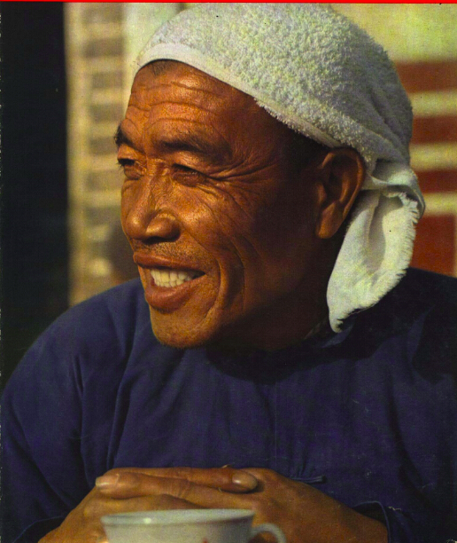
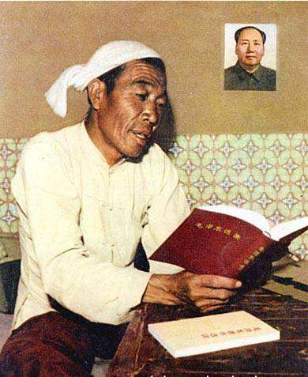
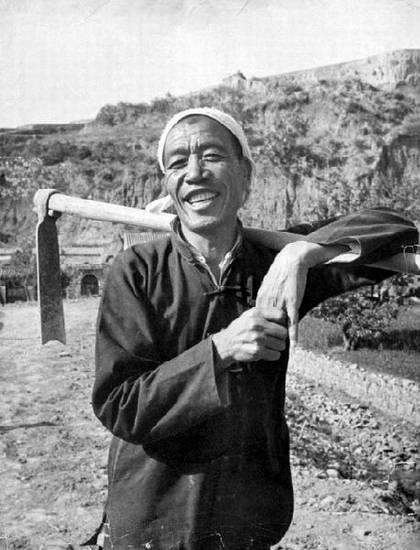
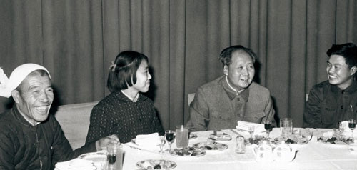
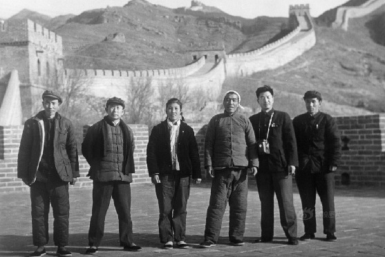
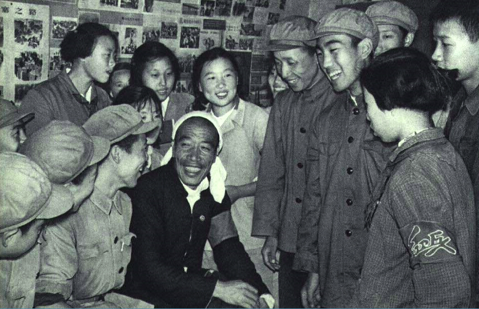
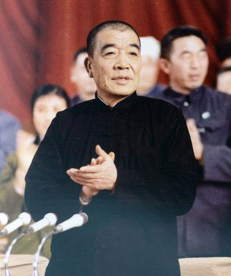
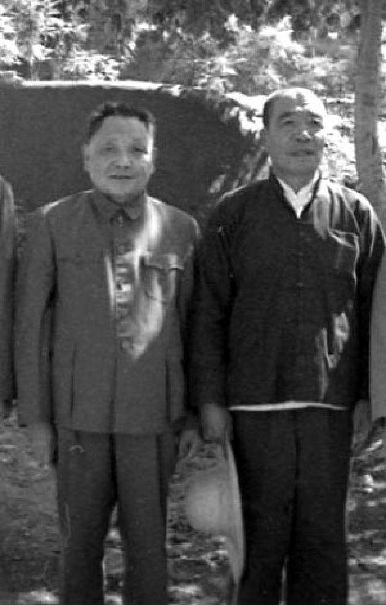
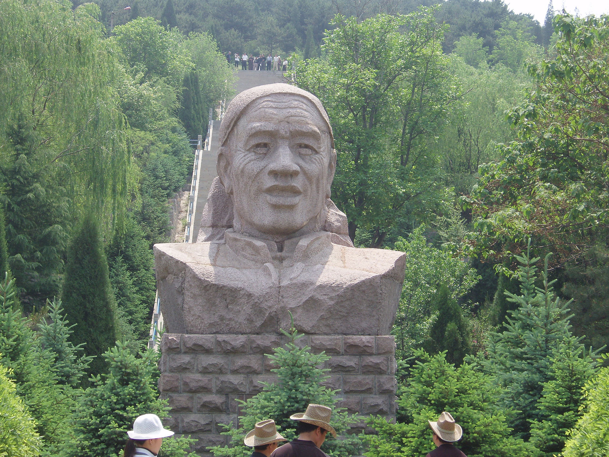

【1986年3月26日】32年前的今天，当上国家副总理的“文盲”农民陈永贵逝世

陈永贵（1915年2月14日－1986年3月26日），中国山西昔阳大寨人，贫农出身，没有受过正规教育。抗战期间，曾经参加日伪组织，被拘留。后担任大寨书记，在“工业学大庆，农业学大寨”的旗帜下，成为全国榜样。他也“火箭”飙升为中央领导，任国务院副总理，直至改革开放。

（陈永贵在学习《毛泽东选集》）

【从“活地狱”出来的贫农】

陈永贵出生于1915年，不知道具体是哪一天。后来，他给自己定为正月初一，也就是阳历的2月14日情人节。6岁时，随父亲迁居大寨。不久，父亲自缢身亡，他便寄居在一寡妇家中，靠当长工为生。陈永贵从未受过正规教育。

抗日战争期间，1942年（27岁），他被推选为大寨村日伪组织“维持会”代表，后加入日伪组织“兴亚会”。然而，他并不太配合，1943年，他被日伪军关进“留置场”一年，几乎丢了性命。留置场是日军在中国建造的法西斯集中营，被称为“活地狱”。

日本投降之后，昔阳全县掀起了反奸复仇、清算血债的群众运动。陈永贵被拘留，最后定为“一般历史问题”。在土改运动中，陈永贵以“受压迫者”身份带领大寨的贫雇农分掉了地主的土地。1948年，陈永贵加入了中国共产党。

【农业学大寨的全国榜样】

1952年（37岁），陈永贵出任大寨支部书记。在环境非常恶劣的、被石山包围的大寨村，他带领农民在土石山上开沟造地，平整田地，蓄水保粮，抗旱防涝，改良土壤，使粮食产量逐年上升。1952年亩产237斤，1962年增至亩产774斤。

1963年8月，大寨遭受特大暴雨，冲垮100条大石坝，颗粒无收的耕地180亩，冲塌了113孔窑洞，倒塌房屋77间。灾情十分严重，但大寨人没有气馁，他们自力更生，艰苦奋斗，仅用一年时间就医治了这场毁灭性的灾害。

大寨大队向国家交售粮食175万斤（每户平均2000斤），这在当时困难重重、粮食产量普遍不高的情况下，非常突出。他的事迹被中央政府肯定，毛泽东号召全国要“工业学大庆、农业学大寨”，成为全国的榜样。

（1964年12月26日，毛泽东的生日宴邀请陈永贵（左一）参加）

（1965年，大寨人陈永贵、郭凤莲等在北京八达岭长城留影）

【成为国家领导人的红卫兵】

1966年（51岁），文化大革命开始后，周恩来接见陈永贵时授意“你们也可以组织自己的红卫兵嘛”。于是陈永贵同已经被打倒的原中共山西省委书记刘格平等人，组织自己的造反组织，名为“晋中野战军”，同另一派“总司派”展开大规模武斗。

（1966年，陈永贵和红卫兵）

1969年，陈永贵被选为中国共产党第九次全国代表大会代表、中共中央委员会委员，开始进入中央政治领导层。1973年，在中共十大上，为了弥补林彪等人遗留的空缺，陈永贵等人被选为中共中央政治局委员，成为了副国级“党和国家领导人”。

【管不好农业的副总理】

1975年1月，陈永贵被选为国务院副总理，并史无前例地从上到下同时担任山西省革命委员会副主任、中共晋中地委书记、昔阳县委书记、大寨大队党支部委员。他请求在工作期间，以1/3时间到全国调查、1/3时间回大寨务农、1/3时间在中央工作，得到毛泽东的批准和肯定。

（1975年9月15日，邓小平与陈永贵在大寨合影）

他负责中国农业，以自己的经验为准，无明显建树。他在全国实行“革资本主义尾巴”：取消自留地，生产核算权放在大队一级等。在邓小平主导实行改革开放后，陈永贵的路线都被取消。他对新政策很抵触，拒绝在大寨执行。1980年9月，他被迫辞职，之后在北京东郊农场担任顾问。

1986年3月26日，陈永贵在北京因肺癌去世。按其遗嘱，骨灰安放回大寨。

（大寨人在陈永贵墓前立的石像）

