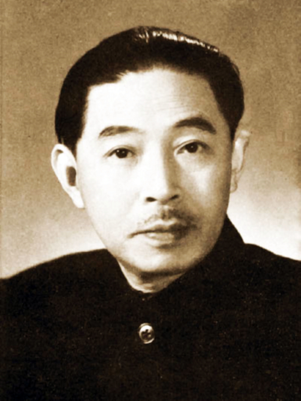
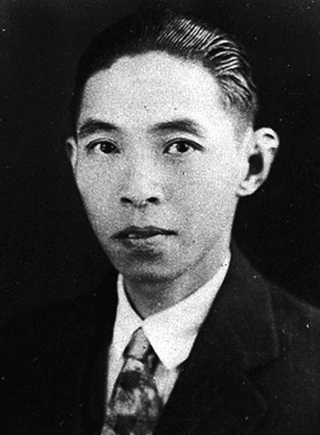
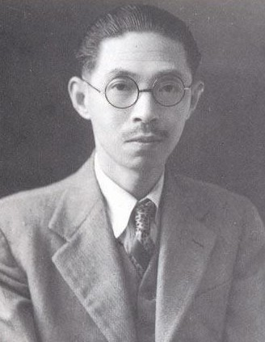
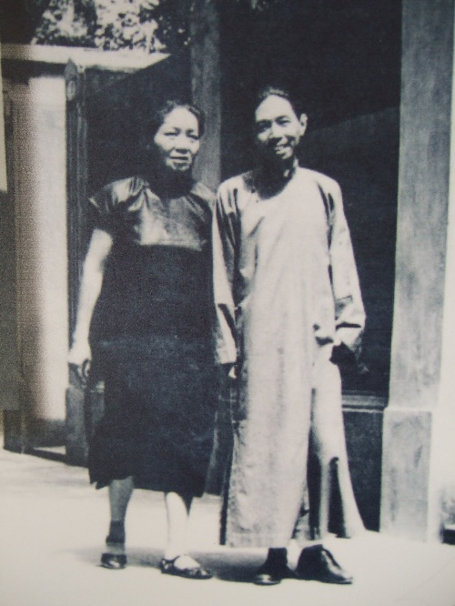
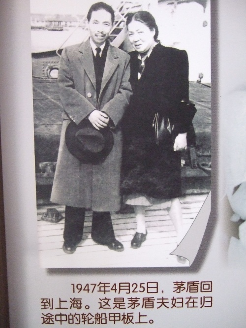
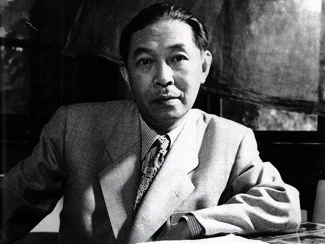
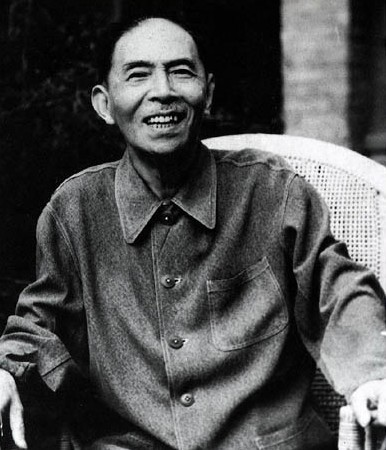
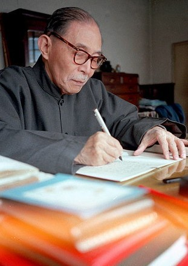
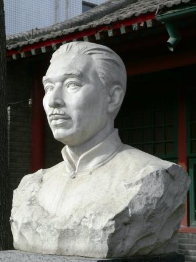

【1981年3月27日】37年前的今天，最早入党、死后再追认入党的大文豪茅盾逝世

茅盾（1896年7月4日－1981年3月27日），原名沈雁冰，浙江嘉兴桐乡人，著名文学家。

【中国共产党的第一批党员】

1896年7月4日，茅盾生于浙江省桐乡县乌镇，原名沈德鸿，字雁冰。童年时，父亲去世，母亲是他的启蒙老师。先后就读于乌镇立志书院、省立二中、杭州私立安定中学。

1914年，考入北京大学预科第一类（文科）。毕业后，进入商务印书馆编译所工作。期间，他与陈独秀等一道参加了上海共产主义小组。1921年7月，中国共产党成立，他是第一批党员。

【幻灭、动摇和追求】

1921年，他与郑振铎等人发起成立了文学研究会，开始负责主编《小说月报》。他以主编的身份为掩护，从事党中央联络员工作，为革命事业培养干部。

1923年，他辞去《小说月报》主编，在上海大学任教。1925年，被选为出席广州国民党第二次全国代表大会代表。

1927年，赴武汉，任中央军事政治学校武汉分校教官，并任《民国日报》主编。他以茅盾为笔名，先后发表《蚀》三部曲：《幻灭》、《动摇》、《追求》。

【脱党后林家铺子的子夜】

国共关系破裂，南昌起义失败，他便和党组织失去了联系。1928年7月，避居日本，自动脱党。继续从事创作，完成长篇小说《虹》，论文《读<倪焕之>》等。

1930年4月，回上海，不久加入中国左翼作家联盟，任左联行政书记。1932年，发表《林家铺子》、《春蚕》。1933年，《子夜》正式出版发行，创作《秋收》、《残冬》（农村三部曲）并发表。

1937年2月，曾与周恩来相遇，但党员身份已不明确。参与编辑《救亡日报》、《呐喊》（后改名《烽火》）。年底，上海沦陷，茅盾离开上海。

【颠沛流离的白杨礼赞】

1938年2月，全家到香港，主编《立报·言林》和《文艺阵地》，成为当时有重大影响的抗战刊物。3月，中华全国文艺界抗敌协会成立，被选为理事。12月，应杜重远的邀请赴新疆迪化（今乌鲁木齐），在新疆学院任教。

1940年4月，离开新疆，经兰州、西安抵达延安。在延安鲁迅艺术文学院、陕甘宁边区文化协会处讲学。10月，到达重庆，任郭沫若主持的文化工作委员会常委。此时，陆续完成优秀散文《风景谈》《白杨礼赞》等。

1941年，离开重庆到香港，任《大众生活》编委；开始创作《腐蚀》，写下长篇《霜叶红似二月花》。1942年底，再赴重庆。1945年，6月，文艺界为纪念茅盾创作活动二十五周年举行庆祝会。1946年，赴苏联访问一年。

【追认党员的文化部部长】

1949年7月，被选为中国文联副主席和中国文学工作者协会（后改为中国作家协会）主席。10月，任中央人民政府文化部部长职务，主编《人民文学》杂志。

1965年，不再担任文化部部长。1979年，当选为全国文联名誉主席、中国作家协会主席。

1981年3月27日，因病医治无效，于北京逝世。3月31日，中共中央根据茅盾生前的请求，决定恢复他的党籍，党龄从1921年算起。

【遗嘱捐建的茅盾文学奖】

1981年3月14日，茅盾立下遗嘱：“为了繁荣长篇小说的创作，我将我的稿费25万元捐献给作协，作为设立一个长篇小说文艺奖的基金，以奖励每年最优秀的长篇小说。我自知病将不起，我衷心祝愿我国社会主义文学事业繁荣昌盛！”
茅盾逝世后，10月，中国作家协会遵照茅盾遗愿，启动茅盾文学奖。茅盾文学奖是目前中国文学界的最高荣誉之一。

