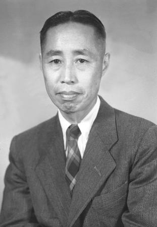
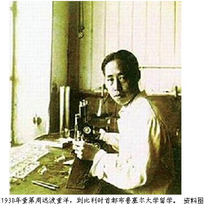
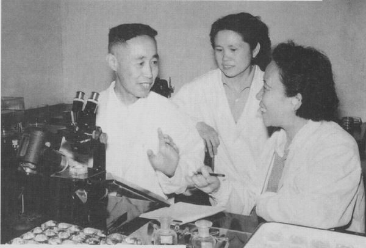
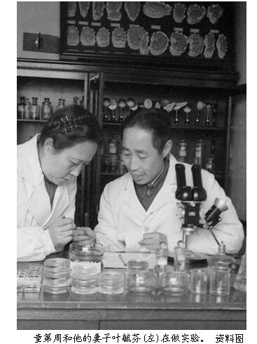
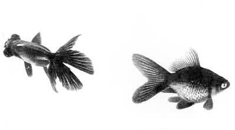
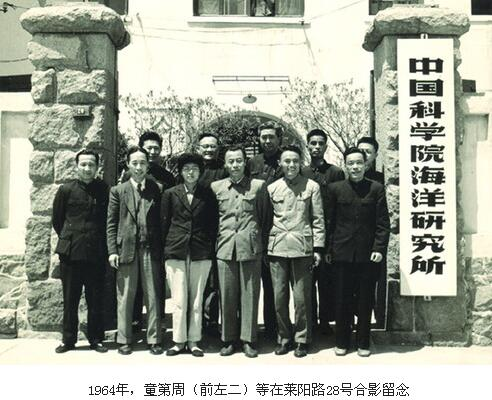
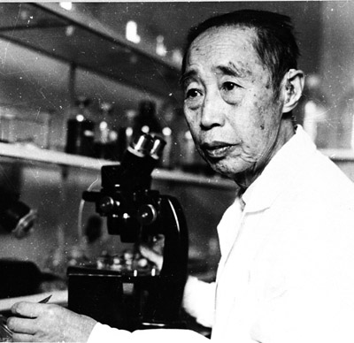
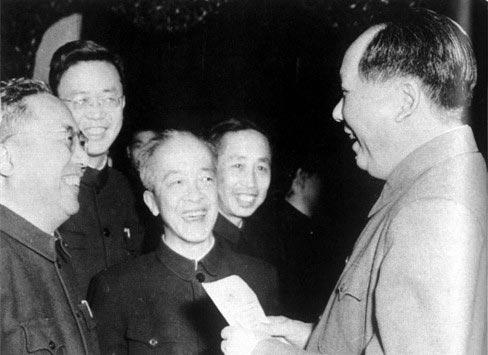

## nnnn姓名（资料）

适合所有人的历史读物。每天了解一个历史人物、积累一点历史知识。三观端正，绝不戏说，欢迎留言。  

### 成就特点

- ​
- ​

### 生平

【1979年3月30日】39年前的今天，从倒数第一到顺数第一的励志科学家童第周病逝

童第周（1902年5月28日－1979年3月30日）

【从倒数第一到第一】

1902年5月28日，童第周出生于今浙江宁波鄞州。17岁时以插班生最后一名身份进入宁波效实中学就读，经过刻苦努力，最终以第一名的成绩毕业，考入复旦大学哲学系心理学专业。

1927年（25岁），大学毕业后，任中央大学生物系助教。1930年，由亲友资助到比利时布鲁塞尔自由大学学习，在布拉舍(A. Brachet)实验室开始了胚胎学的研究工作，成绩非凡。1934年，获博士学位。

小学语文课文《一定要争气》，讲述了童第周青少年时期勤奋学习、刻苦钻研的故事。

【三进山东大学】

1934年（32岁），回国后，童第周担任山东大学生物系教授。抗日战争爆发，童第周随学校内迁到四川万县。1938年，山东大学解散，他先后在中央大学医学院、同济大学和复旦大学任教。

1946年（44岁），抗战胜利，山东大学在青岛复校，童第周再任生物系教授、系主任。1948年，当选为中央研究院院士，应邀到美国耶鲁大学任客座研究员。

1949年（47岁），他再次回到山东大学，担任动物系主任。1951年，任山东大学副校长。1955年，当选为中国科学院学部委员（院士），先后任青岛海洋生物研究所所长、中科院生物学部主任。

【第一位“克隆”鱼的科学家】

童第周在对海鞘早期发育的研究中，证明在受精卵子中已经存在着器官形成物质，精子的进入对此没有决定性的影响。这项研究具有开创性，也使他成为了中国实验胚胎学的创始人之一。

童第周将提纯过的鲫鱼卵的核酸注入到金鱼受精卵的细胞质内。这些动过手术的受精卵长大后，在320条幼鱼中，有106条由双尾变成了单尾。这说明，并不只是细胞核控制生物的遗传性状，细胞质也起着非常重要的作用，进而提出核质关系理论。后来国际生物学界命名这种鱼为——“童鱼”。

（童鱼与普通鲫鱼对比）

1963年，童第周应用细胞核移植技术，把金鱼的细胞核移植到去细胞核的角皮鱼卵内，鱼长大后有些性状介于二种鱼之间。他成为第一位“克隆”鱼的科学家，也为动物育种提出一个新的、可能的途径。

（童第周与妻子合影）

【打扫卫生的先进工作者】

文革期间，在学院担任卫生打扫工作。1977年，任中科院动物所细胞遗传学研究室主任。1978年，在全国科学大会上，童第周被授予全国科学技术先进工作者称号。同年，任中国科学院副院长。

1979年3月30日，在北京逝世。

（毛泽东会见童第周等科学家）

