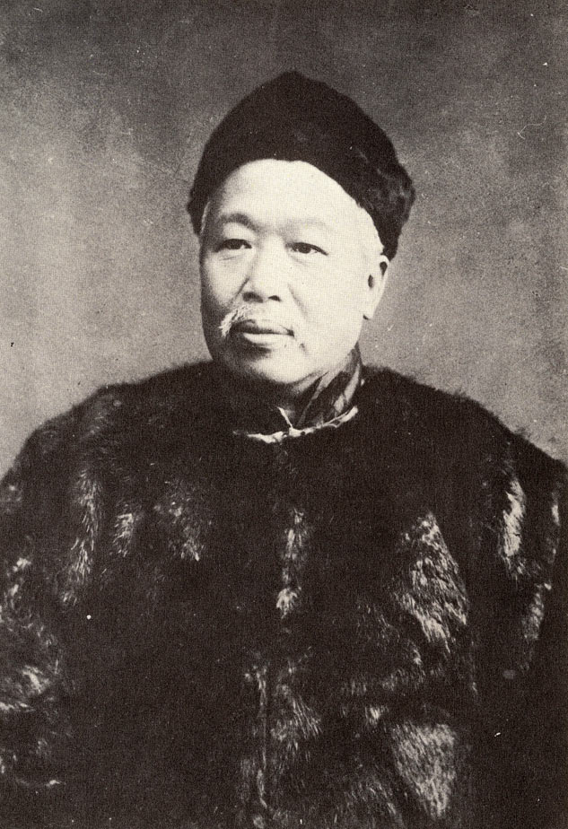
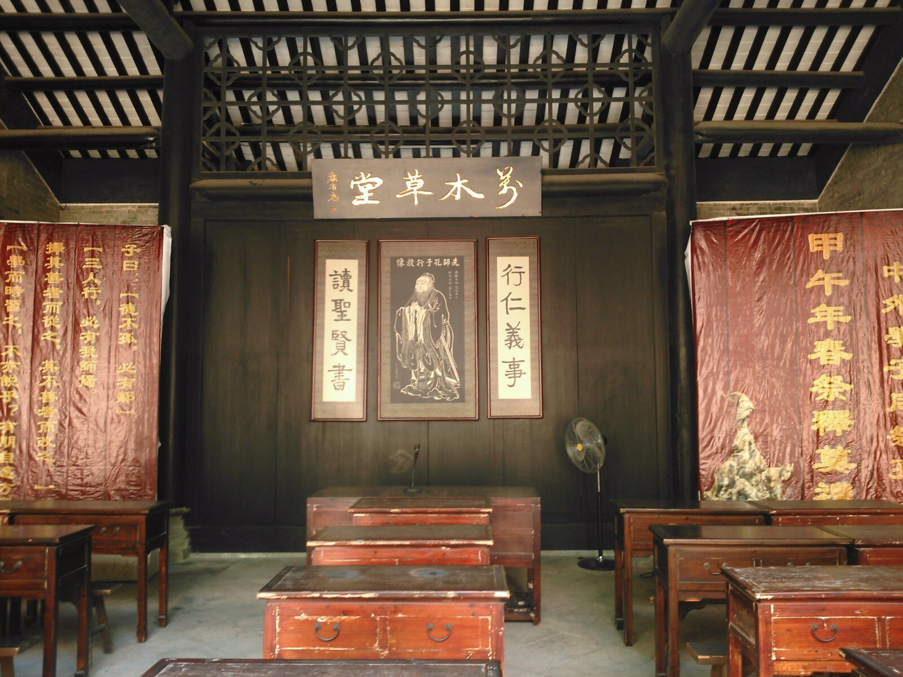
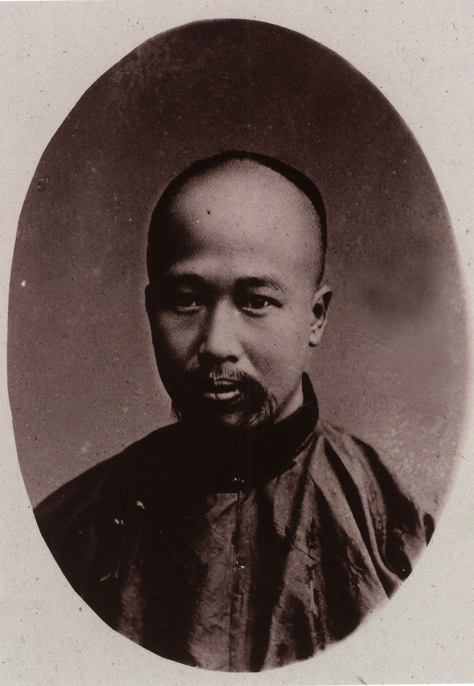
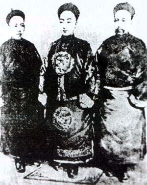
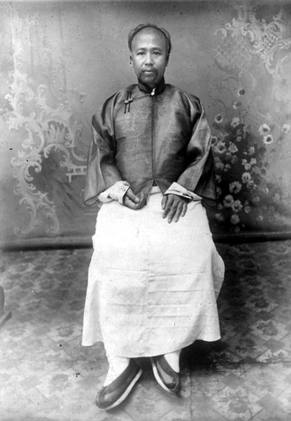
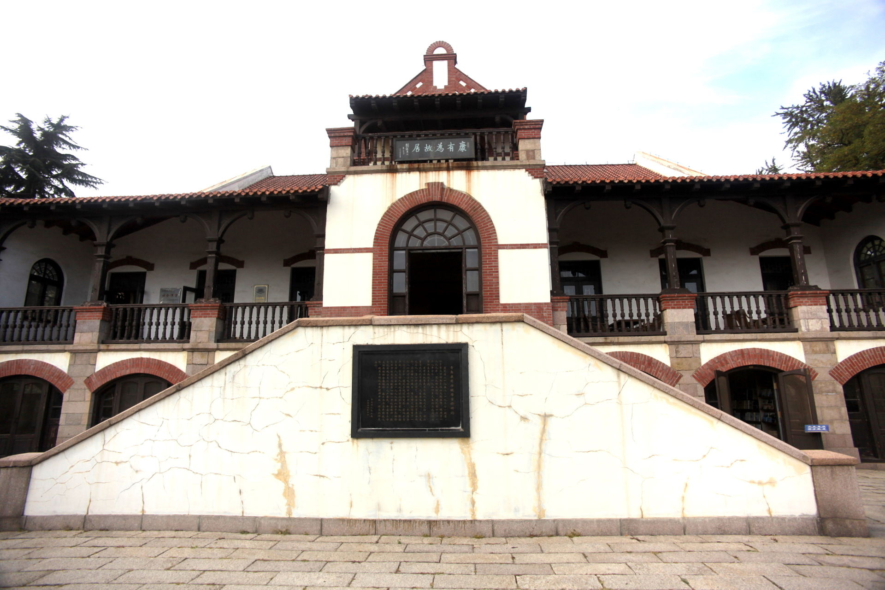
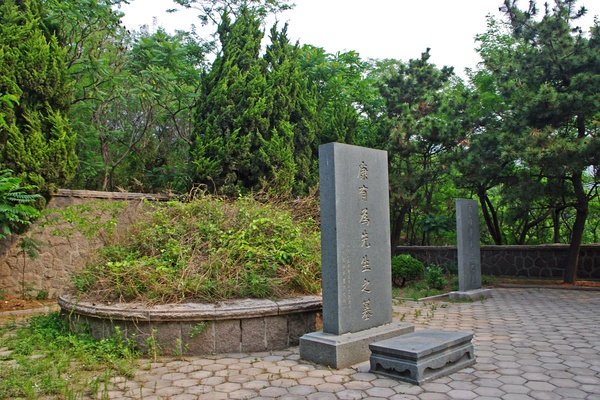
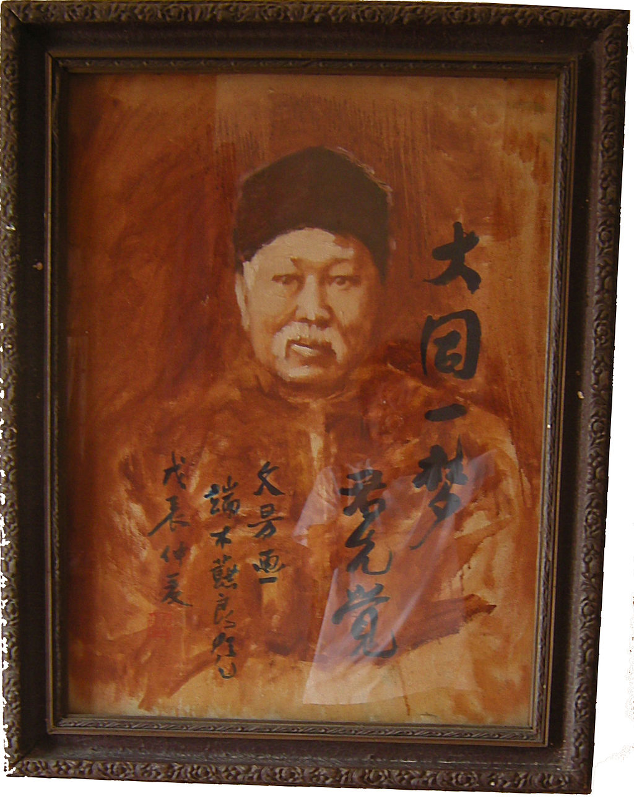

## nnnn姓名（资料）

适合所有人的历史读物。每天了解一个历史人物、积累一点历史知识。三观端正，绝不戏说，欢迎留言。  

### 成就特点

- ​
- ​

### 生平

【1927年3月31日】91年前的今天，提议中、美、英、日联合建国的维新领袖康有为食物中毒而死

康有为（1858年3月19日－1927年3月31日），清末维新变法的主要发起者。

【科举落榜的维新派】

1858年3月19日，康有为出生于广东省南海县。自幼学习儒家经典。1882年（24岁），到北京乡试未中，返回时途径上海，购买了大量西方书籍，吸取了西方的政治观点，初步形成维新的思想体系。

1891年（33岁），他在广州设立万木草堂，招收弟子讲学。知名弟子有梁启超、陈千秋等人。

【虚张声势的公车上书】

1895年（37岁），康有为到北京参加科考，得知《马关条约》签订，联合其他举人连署，向皇帝上万言书，史称“公车上书”，名动全国。但万言书实际未能上达到光绪皇帝。

据历史学家茅海建研究认为，康有为组织“公车孝廉连署上书”，其实只有八十人参加连署，其他十八省没有参与；而真正成功的上书是由翁同龢等京城高官发动组织的。

不久，康有为殿试位列二甲，考取进士。7月，他和梁启超创办《中外纪闻》，不久又在北京组织强学会。

【学习日俄的戊戌变法】

1897年，德国占领胶州湾，康有为上书请求变法。第二年，他向光绪呈上《日本明治变政考》、《俄罗斯大彼得变政记》两书。6月，光绪帝在颐和园召见康有为，任命他为总理衙门章京，筹备变法事宜，史称戊戌变法。

变法实际上是得到了慈禧的支持，因为根据清宫档案记录，光绪帝的每笔奏折，都是要送慈禧审阅的。

康有为提出变法核心为“立制度局、新政局”。制度局效仿的是日本明治维新，只负责议政而不涉足具体的行政。中央制度局由皇帝主持，地方则设十二专局。他认为中国的国民素质，不足以设立议会，应由皇帝专权。

（康有为与光绪帝的合影）

【中美英日联合建国的构想】

戊戌变法期间，日本前首相伊藤博文到中国访问。英国传教士李提摩太向康有为建议，聘请伊藤为顾问。并按照李提摩太的建议，打算将中美英日四国建立联合政体，以对抗俄国。

9月19日，慈禧太后从颐和园回到紫禁城，获知此事，惊觉事态严重，便当机立断发动政变，结束了戊戌变法。

【逃到国外的保皇会】

戊戌政变后，康有为逃至天津，在李提摩太的协助下，经上海、香港逃往加拿大。他自称持有皇帝的衣带诏，在1899年7月，在英属哥伦比亚省组织保皇会，又名中国维新会。

1900年，康有为曾参与自立军起义。1906年，清政府宣布实行预备立宪，康有为遂宣告保皇会任务完成。第二年，保皇会改组为帝国宪政会。

（保救大清皇帝会加拿大成员一览，康有为是主要领袖）

【试图复辟的大“忠臣”】

辛亥革命后，康有为于1913年回国，定居上海辛家花园，主编《不忍》杂志，宣扬尊孔复辟。

1917年6月28日，康有为秘密进京，与北洋军阀张勋发动复辟，拥立溥仪登基。但不久即在北洋政府总理段祺瑞的讨伐下宣告失败。

1921年，迁居愚园路“游存庐”。1923年，迁居青岛（今青岛康有为故居）。康有为始终宣称忠于清朝皇帝，1924年溥仪被冯玉祥逐出紫禁城后，他曾亲往天津，到溥仪居住的张园觐见探望。

（约1920年，流亡中的康有为）

（青岛市康有为故居）

【被掘墓鞭尸的保皇派】

1927年3月29日，在青岛参加同乡宴，宴后呕吐。两天后，31日七窍流血猝死，葬于青岛。基本确认是食物中毒而死，但是食物不干净所致，还是有意谋害，说法不一。

文革期间，康有为被视为“中国历史上最大的保皇派”。1966年8月，被红卫兵掘墓鞭尸，把带有白发的颅骨游街示众。

后来康有为的颅骨，被市博物馆研究员以“造反有理”实物展览为名，收入馆中，才得以保存。1985年12月27日，迁墓至崂山区（现青岛大学之北）并立碑。

（康有为先生之墓）

（康有为书法：绮云楼）

【提倡种族通婚的大同书】

康有为的理想和政治主张主要在他撰写的《大同书》中得到体现。康有为把世界人种按优劣分为白黄棕黑四种，白种人最上等，黄种人次之。他认为，要实现大同，首先要人种大同。

应该让黄种人和白种人通婚，使黄种人逐渐变成白种人。棕色人种生性愚昧，与黑人接近，需要先和黄种人通婚变黄种人，再变白人。要设立奖赏制度，奖赏愿意和棕色人种通婚的白黄种人。至于黑种人，至蠢极愚，很难改良。应该重赏愿意和黑人通婚的白黄种人，对于一些性情太恶、状貌太恶或有疾病的应以药绝其种。

（青岛康有为故居内的康有为晚年画像）

