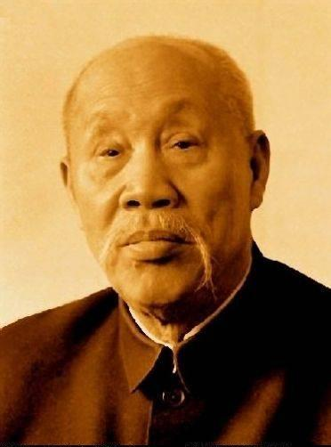
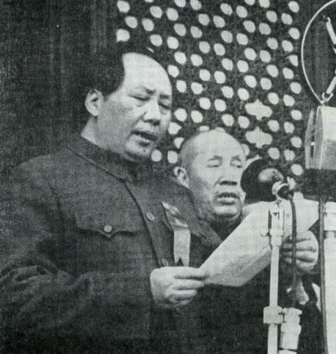
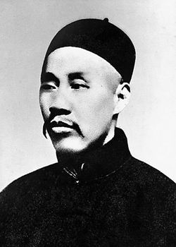
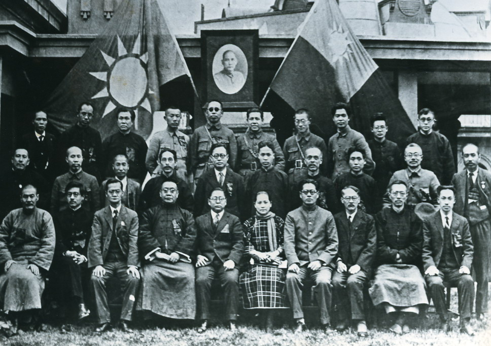
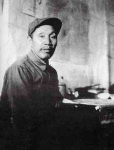
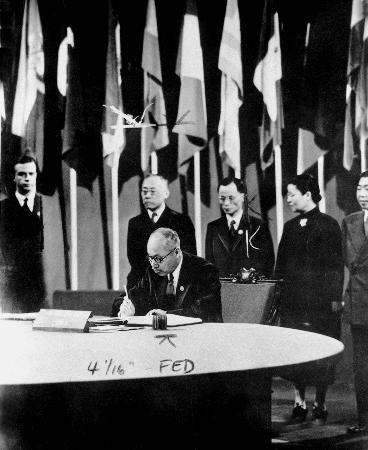
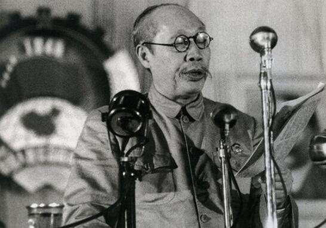
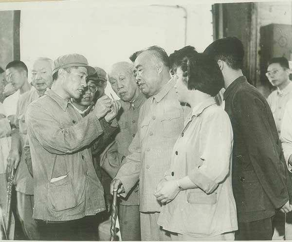
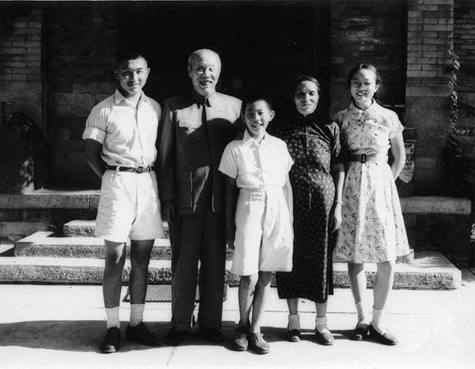
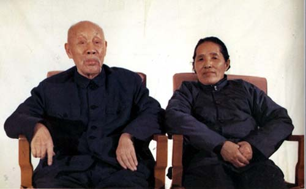

## nnnn姓名（资料）

适合所有人的历史读物。每天了解一个历史人物、积累一点历史知识。三观端正，绝不戏说，欢迎留言。  

### 成就特点

- ​
- ​

### 生平

【1886年3月5日】132年前的今天，唯一和毛泽东参加开国大典的中共一大代表董必武出生

董必武（1886年3月5日－1975年4月2日），湖北红安人，中华人民共和国开国元勋。在中共一大代表中，只有董必武和毛泽东，在新中国担任中共的高层领导。

（1949年，开国大典上的中共一大代表毛泽东和董必武）

【被无故殴打的秀才】

1886年3月5日，董必武出生，今湖北红安县人。1903年（17岁），赴武昌参加乡试，考中秀才。因好奇朝衙门内张望，被衙役殴打一顿，自称“从此恨死当官人”。1905年，考入湖北文普通学堂，5年后毕业，任教员。

1911年，董必武参加辛亥革命，并加入中国同盟会。1914年，留学日本“私立日本大学”学习法律，加入孙中山创立的中华革命党。1915年5月，回国从事反袁活动，被捕入狱。出狱后，再赴日本。1918年回国，参加护法运动。1919年，在上海参加五四运动，创办武汉中学，教授国文。

【共产党的一大代表】

1920年，与陈潭秋在武汉建立中国共产党早期组织。1921年7月，作为武汉小组代表，出席中国共产党第一次全国代表大会。在中共一大代表中，只有他和毛泽东在新中国成立后，依然担任中共的高层领导。会后，董必武建立和发展了湖北省的中共党组织。

1924年，第一次国共合作，董必武领导筹建了国民党湖北省党部，并任省农工厅厅长。1928年大革命失败后，他赴莫斯科中山大学、列宁学院学习。

（1927年3月，中国国民党二届三中全会。毛泽东（二排右三），董必武（二排左二））

【停止肃反的长征老兵】

1932年回国，在中央苏区历任中央党校校长、党务委员会书记、最高法院院长等职。1934年10月，董必武参加长征。董必武是长征中年龄最大的同志之一。

长征到陕北后，立即成立由董必武为主任的5人党务委员会，负责调查陕北“肃反”。随即中央党务委员会宣布释放刘志丹、高岗、习仲勋等18名陕甘苏区团以上干部，避免了“肃反”运动的扩大。

（1936年6月，任中共中央党校校长的董必武）

【联合国的创始人之一】

董必武继续任中央党校校长，并任陕甘宁边区政府代理主席。在延安，董必武、林伯渠、徐特立、谢觉哉、吴玉章五人被尊称为“延安五老”。抗日战争胜利后，董必武是中国共产党同国民政府谈判的代表之一。

1945年，董必武作为解放区代表加入中国代表团，参加旧金山联合国制宪会议，在《联合国宪章》上签字。董必武逝世后，联合国秘书长专门发电悼念，称他为联合国的创始人之一。

（1945年，董必武在联合国宪章上签字）

【最高人民法院的院长】

中华人民共和国成立后，董必武历任财政经济委员会主任、副总理、政治法律委员会主任。1954年9月，董必武出任最高人民法院院长。1954年，出任全国政协副主席。1955年，出任中共中央监察委员会书记。

董必武是新中法制建设的奠基人之一。董必武表示，政治运动“有副作用，应当以依法治国代替运动治国”，“国家没有法制，就不能成为一个国家”。

【退出一线的国家副主席】

1959年，庐山会议上，在会议批判彭德怀时，董必武表示：“我思想觉悟低，没有看出彭德怀同志反党”，并申请退出一线。毛泽东同意后，董必武与宋庆龄一起当选为共和国副主席。

文化大革命期间，共和国主席刘少奇被打倒，林彪命丧外蒙古后，董必武被宣布为中华人民共和国代主席。1975年，修改宪法，国家主席和副主席职务正式废除，董必武当选为人大常委会副委员长。

（1964年7月，朱德、董必武等视察工厂车间）

【卧床苦无梦的老人】

文化大革命爆发后，董必武的幼子董良翮是一名红卫兵领导人，曾两次遭到逮捕。董必武在《闻酉儿于北京车站被捕》一诗中写道：“闻尔重入狱，吾衰心更惊！卧床苦无梦，食饭竟忘盛。试飞曾折翼，语频或失声。恢恢天网大，疏释望新生。”

1975年4月2日，董必武在北京病逝，享年90岁。

（董必武和家人）

（董必武和夫人何连芝合影）

