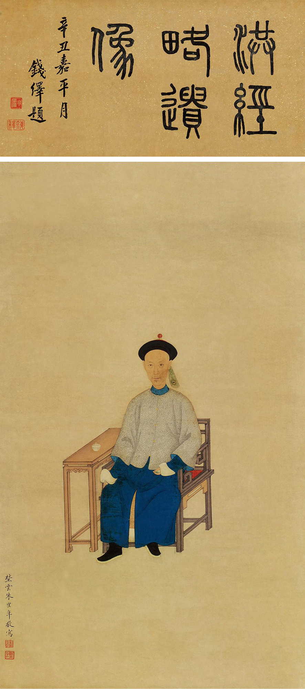
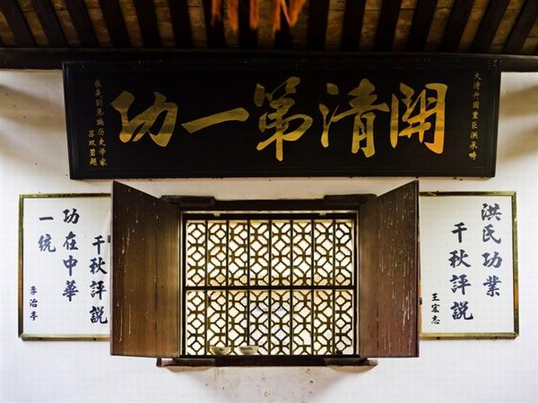
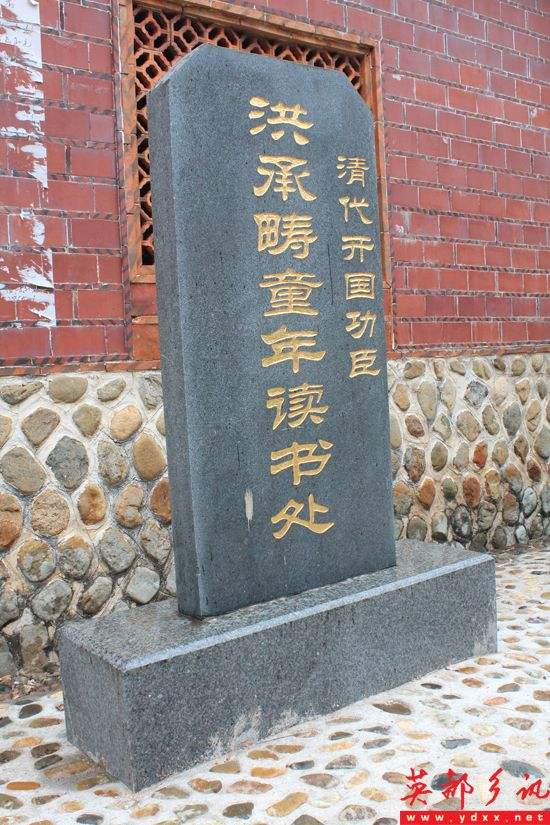
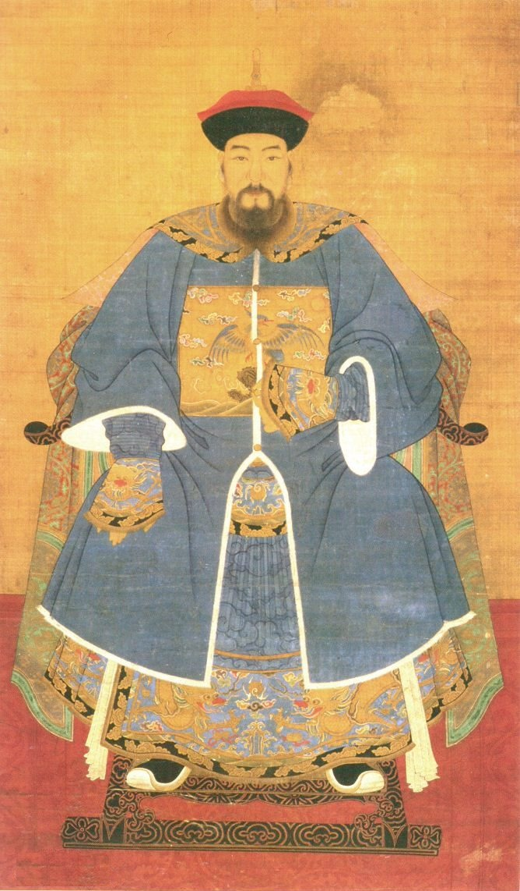
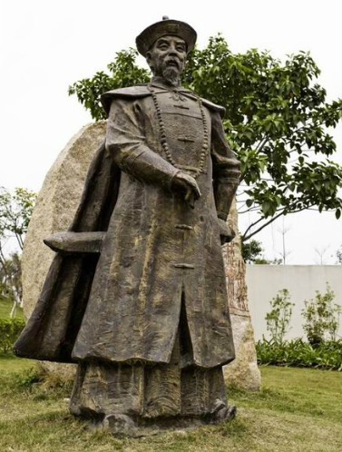
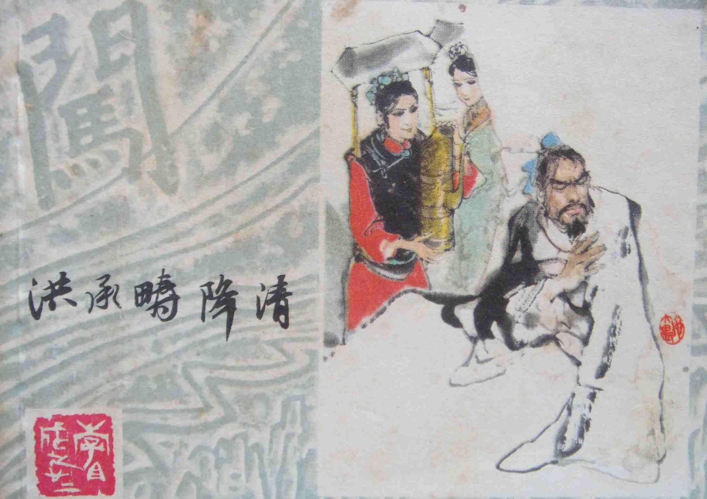
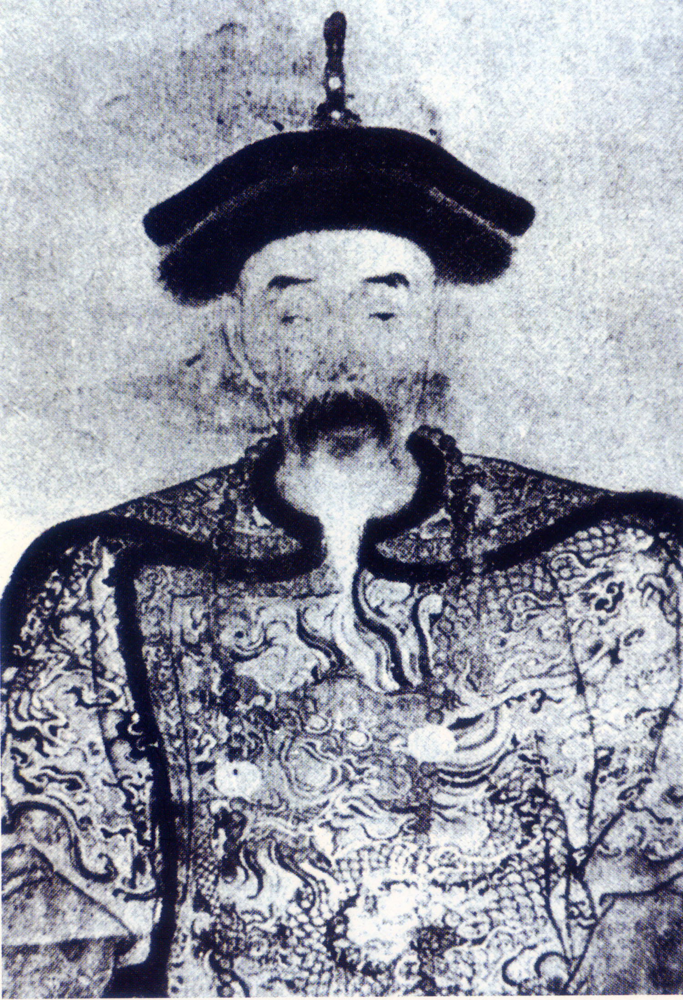
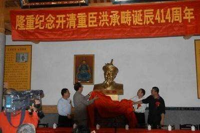

## nnnn姓名（资料）

适合所有人的历史读物。每天了解一个历史人物、积累一点历史知识。三观端正，绝不戏说，欢迎留言。  

### 成就特点

- ​
- ​

### 生平

【1665年4月3日】353年前的今天，投降清军的“国防部长”，明朝第一汉奸洪承畴去世

（清·朱鹤年所绘的《洪承畴像》）

洪承畴（1593年10月16日－1665年4月3日），福建泉州南安人。崇祯时，多次大败农民起义军，俘虏了闯王高迎祥，李自成仅以18骑败走。后任兵部尚书、蓟辽总督，在松锦之战被俘虏，投降清军，成为清朝首位汉人大学士。

洪承畴以谋略闻名，为清朝献计甚多，大多被信纳。除了多尔衮、范文程外，他是清兵入关后，建立并加强满清统治的关键推手。他曾多次讨伐南明政权，但最终未得到清朝认可，在乾隆年间被编入官方的《明季贰臣传》。

【卖豆干的失学儿童】

1593年10月16日，洪承畴出生于明朝，今福建泉州南安市人。早年家贫，以帮助母亲兜售豆干为生，11岁辍学。后在族叔的帮助下，重新入学。

1615年（22岁），考中举人，次年中进士。1622年，升任浙江提学、浙江布政使参议。1627（34岁），升陕西督道参议。

（洪承畴读书处溪益学馆）

【战无不胜的“洪兵”】

1630年（37岁），北方流寇大起，韩城被农民起义军围攻。洪承畴带数百由家丁、仆人、伙夫拼凑的军队，首赴沙场，解围韩城，斩杀五百余人。此后，这支称为“洪兵”的军队，连战连捷。

1931年（38岁），洪承畴任延绥巡抚，授陕西三边总督。1934年，加太子太保、兵部尚书，兼督河南、山西、陕西、四川、湖广等处军务，镇压农民起义。1635年，接任五省总督，组织围剿卓有成效，将起义军压缩至洛阳附近。

【俘虏闯王的大功臣】

这时，起义军召开“荥阳大会”，在高迎祥、李自成的统一指挥下，兵分三路，一路往山西，一路往湖广，一路往凤阳，开始流动作战。明朝也改变策略，分区防守，重点进攻，洪承畴负责专治西北。

1636年（43岁），洪承畴在临潼大破起义军，不久又俘虏了闯王高迎祥，送到北京处死。同年，东北的皇太极建立清国。1638年，洪承畴大破李自成，李自成仅以18骑败走，起义转入低潮。

【投降清军的“国防部长”】

1639年（46岁），清军进攻辽东，名将卢象升战死。1640年，任洪承畴为蓟辽总督，负责东北边防，防卫清军。

1641年，洪承畴率八总兵、13万人，在锦州迎战清军。结果被皇太极切断粮道，形成大包围态势。洪承畴主张决战，各总兵决议突围。在突围途中，明军不听号令，争先退走，大败。洪承畴率万人残兵坐困松山城，第二年城陷，洪承畴兵败被俘。史称松锦之战。

洪承畴被俘后，曾绝食要效忠明朝。皇太极将他关在狱中，费尽心思招降，甚至传说曾派庄妃前去狱中探望。最终，洪承畴投降了满清。而崇祯皇帝，以为洪承畴已死，携百官在京城设坛祭拜，恸哭流涕。

【平定天下的大学士】

1643年，皇太极去世，由多尔衮摄政。1644年（51岁），李自成攻陷北京，崇祯帝自尽，明朝灭亡。清军入关后，洪承畴不遗余力，向多尔衮献计，“出其不意，从蓟州、密云近京处，疾行而进”，直趋北京，结果大败起义军。

进京后，顺治皇帝任他为太子太保、兵部尚书，并授秘书院大学士，他是清朝首位汉人大学士。1945年，洪承畴任“招抚江南各省总督军务大学士”，他绥靖招安为主，但也镇压忠于明朝义士，遭天下唾骂。

【遭到冷遇的明朝贰臣】

1647年（54岁），父亲去世，回乡守丧一年。第二年，奉召返京，继续为多尔衮倾心任用。1654年，任内翰林弘文院大学士、兵部尚书，出师征讨南明永历政权。1659年，平定云南，永历帝逃亡缅甸。洪承畴以年老体衰、目疾加剧请求返回北京，回京后却遭冷遇。

1661年，顺治帝逝世，康熙帝即位。洪承畴请求退休，朝廷几经争论，授以三等阿达哈哈番（轻车都尉）世袭。1662年6月， 永历帝被吴三桂绞杀于昆明。1665年，洪承畴卒，年73岁，谥文襄。

1776年（乾隆41年），命国史馆编纂《明季贰臣传》。洪承畴以“不能为其主临危授命，辄复畏死刑生，腼颜降附”的理由被列入《明季贰臣传》中。

（洪承畴后人的纪念活动）

