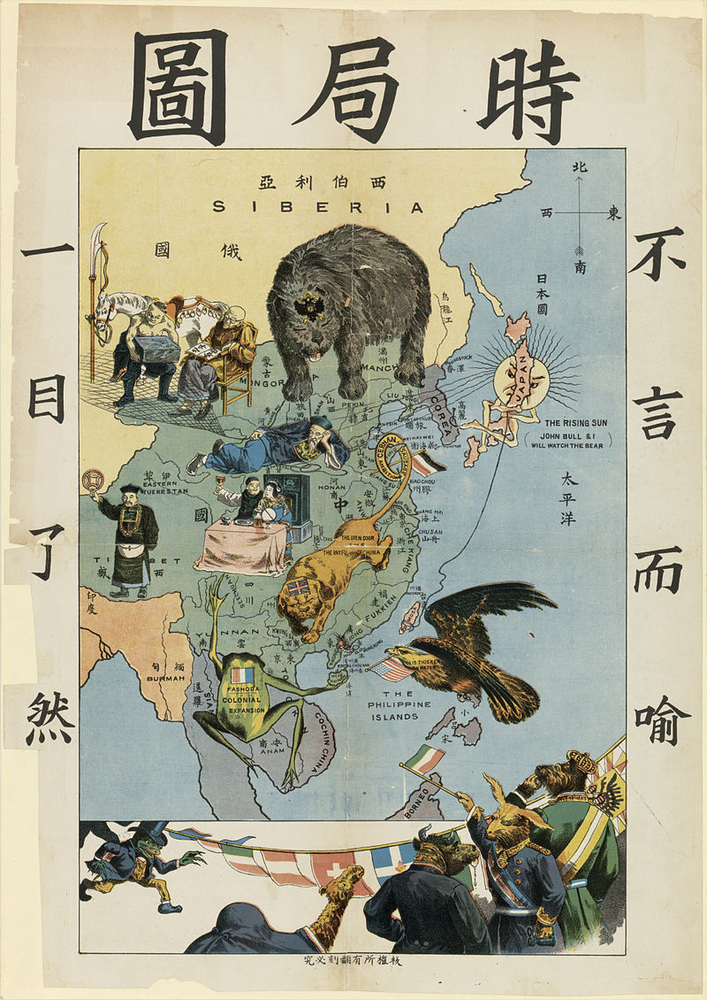
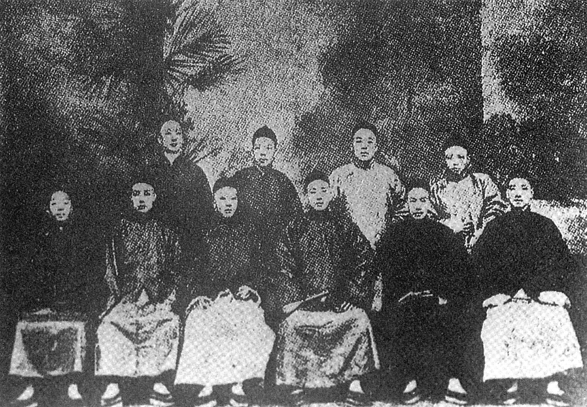
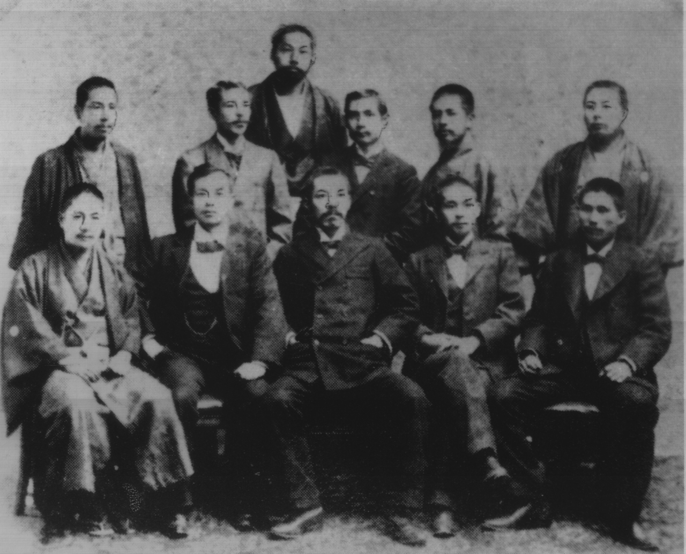
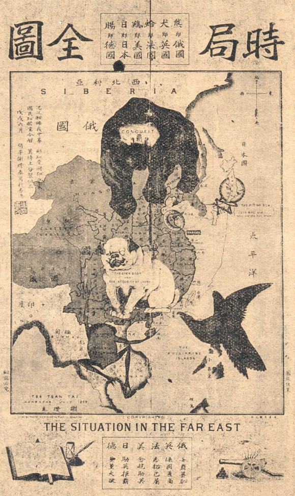
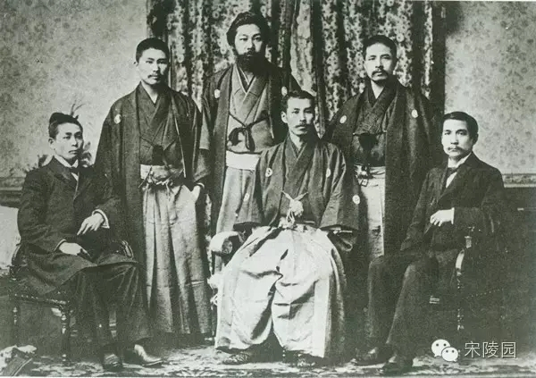

## nnnn姓名（资料）

适合所有人的历史读物。每天了解一个历史人物、积累一点历史知识。三观端正，绝不戏说，欢迎留言。  

### 成就特点

- ​
- ​

### 生平

【1938年4月4日】80年前的今天，设计中国号飞艇，画出时局图的革命元老谢缵泰逝世

谢缵泰（1872年5月16日－1938年4月4日），他与杨衢云等人创立了香港最早的革命组织“辅仁文社”，后与孙中山创立的“兴中会”合并，孙中山只能当秘书。他绘制出传遍中国的时事漫画《时局图》，设计了中国第一个飞艇。他与洪秀全的侄子试图建立大明顺天国。

他写了《中华民国革命秘史》，对孙中山多有批评。因此，尽管他在早期革命中扮演重要角色，但在国民党的历史纪录中，几乎没有他的存在。

（新版《时局图》）

【香港最早的革命组织】

1872年5月16日，谢缵泰出生于澳洲悉尼，祖籍广东开平。1887年（15岁），随家人到香港，就读于中央书院（皇仁书院的前身），与杨衢云等人相识。毕业后，在香港政府工务局内任文员近十年。

1892年，他和杨衢云等人创立了香港最早的革命组织“辅仁文社”。1895年，孙中山到香港，将在檀香山设立的兴中会与辅仁文社合并。合并后仍称为兴中会，杨衢云为会长，孙中山为秘书。

10月，计划武装起义，攻打广州。由于计划泄露，尚未发难，便已失败。孙中山、杨衢云分别逃到日本，谢缵泰则留在香港办理善后事宜。

（1892年，杨衢云与谢缵泰等在香港成立辅仁文社）

【中国的第一辆飞艇】

谢缵泰擅长数学和手工技艺。西方飞艇的成功，引起他研究飞艇的兴趣。他从1894年开始研制，到1899年设计成“中国”号飞艇。这艘飞艇采用铝为主要材料，他是中国第一位飞艇的设计者。

设计完成后，他欲献给当时的清朝政府，但遭到冷遇。他曾把飞艇设计图纸寄给著名枪炮专家马克沁，当时世界上许多报刊刊登了他的飞艇设计方案，轰动一时。

1900年1月，由于与孙中山矛盾，杨衢云辞去兴中会会长一职，改由孙中山担任。同年杨衢云从日本回到香港，发动惠州起义失败。1901年，杨衢云在香港遭刺杀身亡。谢缵泰将他葬于跑马地香港坟场，立无字碑。

.jpeg)

（谢缵泰设计的"china"(中国号)）

【大明顺天国的构想】

1901年8月，谢缵泰结识原太平天国天王洪秀全的侄子洪全福，在李纪堂提供军费支持下，计划攻夺广州，建立大明顺天国，并推举容闳为临时政府大总统。

然而，起义的前两三天，有人向香港警厅告密，起义消息走漏。香港和广州警方，四处搜捕，洪全福把胡子剃掉，化装逃脱。起义再次失败。

大明顺天国参与分子几乎全为基督徒，且大多参与三合会、兴中会。这是中国首次具体提出建立民主政权制度的革命。

（1898年，杨衢云、孙中山等人与日本友人的合影）

【瓜分中国的时局图】

1898年7月，谢缵泰绘制《时局图》刊登于《辅仁文社社刊》上。1903年，在蔡元培主编的上海报纸《俄事警闻》转载，漫画已经过多次修改，改名叫《瓜分中国图》。

该画背景是一幅中国地图，画中的野兽分别暗示着当时瓜分中国的帝国列强，形象又夸张地描绘出清政府任人宰割、国家处于危急存亡关头的现实。

《时局图》是美术界公认为我国第一幅具有近代意义的漫画，也是最著名的一幅时事漫画。

（原版《时局图》）

【得不到承认的革命秘史】

1903年，谢缵泰在香港创办《南华早报》，致力于革命宣传工作。

1924年，他在《南华早报》发表了英文日记体裁的回忆录《中华民国革命秘史》，记述了兴中会的有关活动，对孙中山有颇多批评。这也导致，虽然他在早期革命中扮演重要角色，但在国民党的历史纪录中，几乎没有他的存在。

1938年4月4日，病逝于香港，终年66岁。

（1900年，孙中山与日本友人在东京合影）

