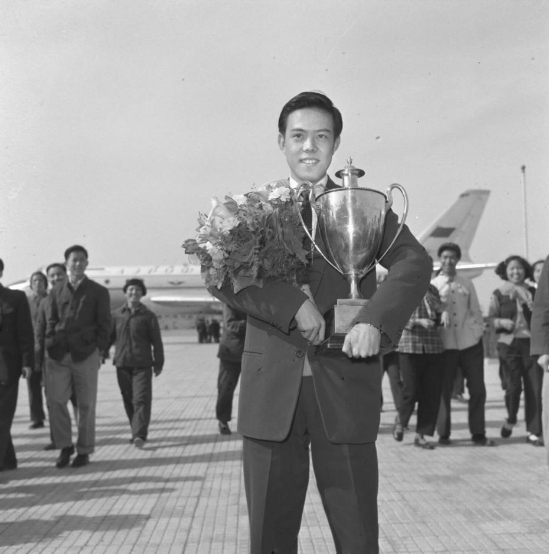
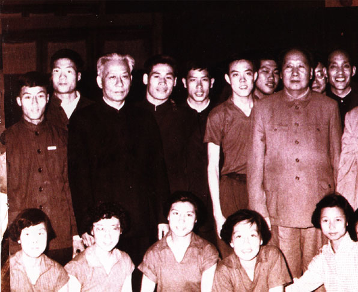
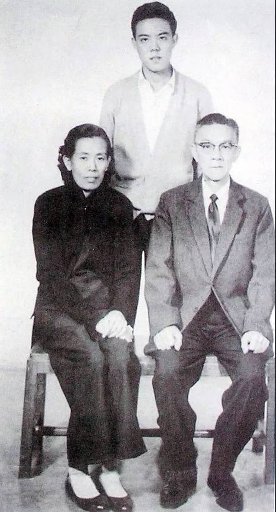
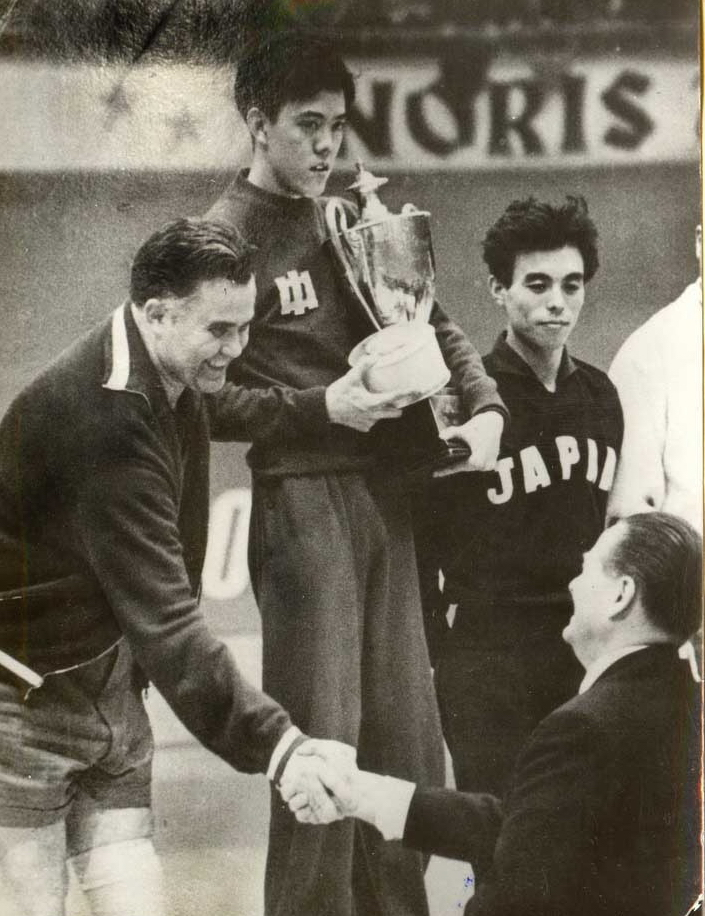
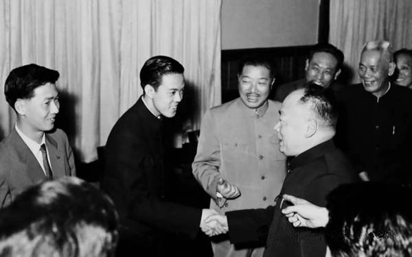
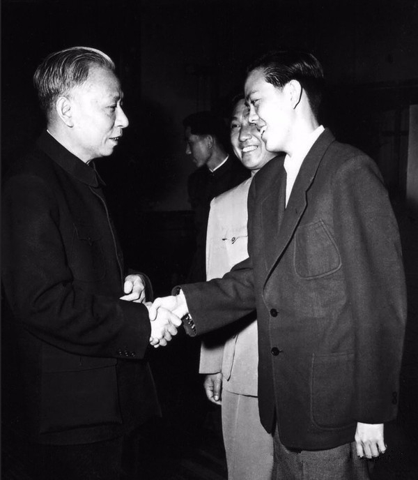
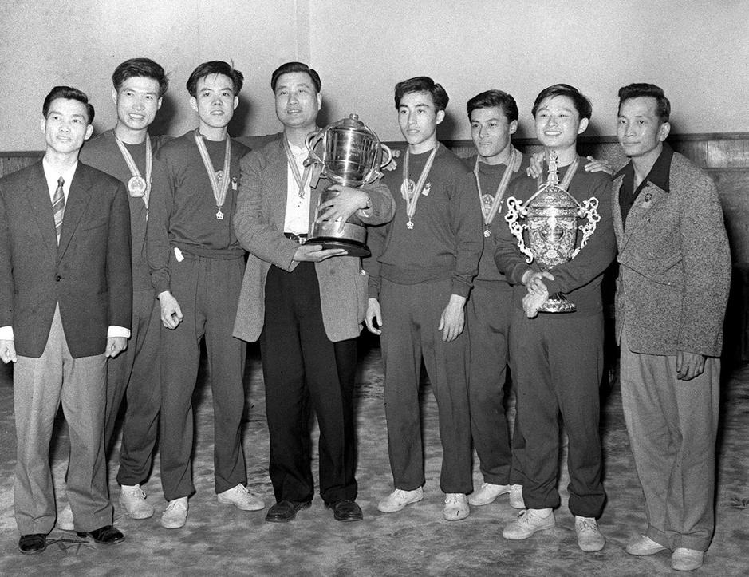
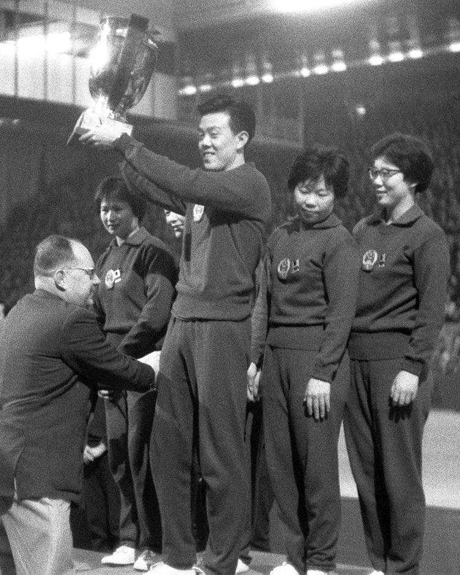

## nnnn姓名（资料）

适合所有人的历史读物。每天了解一个历史人物、积累一点历史知识。三观端正，绝不戏说，欢迎留言。  

### 成就特点

- ​
- ​

### 生平

【1959年4月5日】59年前的今天，打乒乓球的容国团赢得新中国的第一个世界冠军

容国团（1937年8月10日－1968年6月20日），生于香港，获得新中国第一个世界冠军。分别夺得中国的第一个乒乓球男单冠军，男团冠军，女团冠军。文化大革命期间遭到批判，自杀身亡。

（毛泽东、刘少奇接见容国团等人）

【香港的街头球王】

1937年8月10日，容国团生于香港的贫民家庭，与著名经济学家张五常为儿时好友。他从小喜爱打乒乓球，凭借自创的“直拍四法门”，成为“街头球王”。

1952年（15岁），代表香港工会乒乓球队参加比赛。1954年，在香港乒乓球埠标赛获得冠军。1956年，战胜23届世乒赛日本新科状元荻村伊智朗，一战成名。

（容国团和父母合影）

【三年夺取冠军的誓言】

1957年11月，容国团前往内地，进广州体育学院学习。容国团在广州体委的一次大会上，立下“三年夺取世界冠军”的誓言，引起轰动。

1958年，被选入广东省乒乓球队，同年参加全国乒乓球锦标赛，获男子单打冠军，随后被选为国家集训队队员。他所研究出来的快速抽击，打破了当时主导欧洲和日本的花巧式打球方法。

【新中国的第一个世界冠军】

1959年4月5日，在德国第二十五届世界乒乓球锦标赛上，容国团以3：1战胜匈牙利名将悉多，为新中国夺得了第一个乒乓球男子单打世界冠军，也是新中国10年来第一个世界冠军。

比赛结束后，副总理贺龙亲自到机场接机、献花。他还受到毛泽东、周恩来多次接见。有外国政要来访，容国团时常被邀为座上宾。外形俊朗的容国团迅速成为中国年轻人的偶像，信件堆满了乒乓球队的传达室。

【男团冠军和女团冠军】

1961年，在北京举行第二十六届世界乒乓球锦标赛上，他帮助中国队第一次夺得了男子团体冠军，并奠定了中国在乒乓球坛的霸主地位。庄则栋赢得单打冠军，并蝉联了三届冠军。

（容国团与队友夺得男团世界冠军）

1964年，容国团担任中国乒乓球女队教练。1965年，中国女队在南斯拉夫第二十八届世界乒乓球锦标赛上，击败当时女乒的霸主日本队，获得了中国的第一个女子团体冠军。

（容国团带领女队夺得世界冠军）

【自杀的乒坛三杰】

在文化大革命期间，贺龙遭受批斗，容国团被指为贺龙派系的人，同遭迫害，被造反派揪斗，侮辱和毒打。

同样来自香港的傅其芳、姜永宁，都是被称当代的中国乒坛三杰。1968年4月16日，国家队乒乓球教练傅其芳自缢身亡。5月16日，姜永宁自缢于先农坛体育场。

1968年6月20日清晨，容国团也上吊自杀。因被指反革命畏罪自杀，容国团没有葬礼。1978年，国家体委为容国团恢复名誉，并补开了追悼会。

（容国团之墓）

