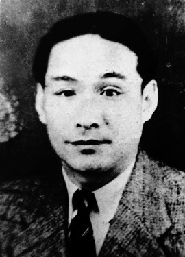
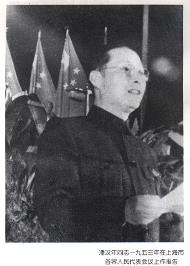
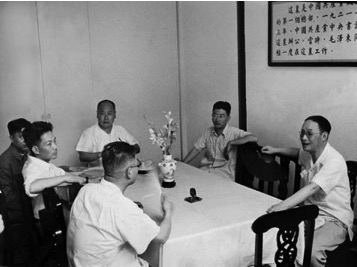
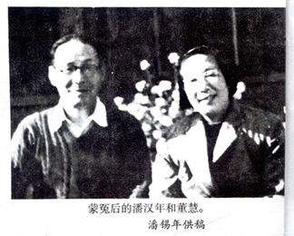
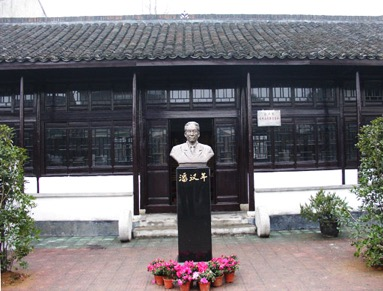

40年前的今天，抗日战争中拜会过汪精卫的传奇红色特工潘汉年病逝

（万象特约作者：一一）

 

 

潘汉年（1906年1月18日－1977年4月14日），江苏宜兴人，传奇红色特工。

早年加入中国共产党，领导左联工作。顾顺章叛变革命后，潘汉年成为特科第二科科长，开始负责情报工作。抗战期间任华中局社会部长，获悉多种战略情报。曾秘密拜会汪精卫，并与日军取得互不侵犯的默契。

解放后任上海市副市长，1955年以“内奸”罪嫌遭逮捕，1963年判刑15年，1977年蒙冤而死，1982年获得平反，被中共中央评定为“优秀忠诚的共产党员”。

 

 

【左联“小开”】

1906年1月18日，潘汉年出生于今江苏宜兴。早年在和桥镇彭城中学和武进县延陵公学读中学。1924年秋到无锡国学专修馆学习。1925年闯上海，参加创造社，与人合编杂志，因批评执政当局，屡次遭勒令停刊。

1925年11月，加入中国共产党，国共分裂后赴上海。1930年，中共中央下令筹组中国左翼作家联盟（左联），选出鲁迅、钱杏邨、沈瑞先为主席团，潘汉年担任团书记。

由于工作需要，他西装革履，风度翩翩，便有了代号“小开”（上海话大老板公子的意思）。

【特科科长】

1931年，中共中央地下组织特科首脑顾顺章被捕叛变，导致数千人被杀被捕。中共中央情报组织旋即改组，潘汉年担任中央情报组特科第二科科长。

1933年夏，潘汉年进入江西中央苏区，1934年1月，前往香港。长征过程中他和陈云先后离开队伍前往苏联恢复和共产国际联系。1935年8月，他和陈云一起经海参崴到达莫斯科。1936年8月返回延安，参与了西安事变的策划和解决。

 

【与汪精卫的会面】

1937年9月，任八路军驻上海办事处主任。期间，为首版《毛泽东自传》题写书名。上海沦陷后，撤往香港。1938年9月，潘汉年回延安，任中共中央社会部副部长。

抗战期间，在李士群安排下与汪精卫会面，并与日军取得互不侵犯的默契。由于潘汉年事后，未将与汪精卫会面的情况上报，这一事件日后成为毛泽东判定其有“内奸”罪行的重要依据。

1940年，获悉德偷袭苏俄的巴巴罗萨计划。1944年，提早获得日军增兵五十万攻击中国的一号作战计划。

1945年4月，参加中共七大，会后留延安中央社会部工作。1946年9月，赴香港，组织民主党派人士通过香港转移到解放区，策动国民党政府资源委员会和上海海关起义。

 

（潘汉年在上海开会）

【被捕入狱】

中华人民共和国成立后，先后任中共中央华东局社会部部长和统战部部长、中共上海市委副书记和第三书记、上海市人民政府副市长（1949年5月至1955年）。

1955年4月2日，向陈毅谈了当年会见汪精卫一事，陈毅将此事报告毛泽东，毛当即批示“此人从此不能信用”。4月3日，潘汉年遭毛泽东下令秘密逮捕。

1962年1月13日，毛泽东在扩大的中央工作会议上的讲话：“有个潘汉年，此人当过上海副市长，过去秘密投降了国民党，是个CC派人物，现在关在班房里头，我们没有杀他。像潘汉年这样的人，只要杀一个，杀戒一开，类似的人都得杀。”

1963年2月3日送往北京市公安局团河劳改农场，1963年6月因“内奸”、“反革命”被判处有期徒刑15年。判刑后不久，潘汉年被“假释”出狱。1967年3月重新收监。

 

 【恢复名誉】

1975年5月29日，潘汉年和董慧一起被押往湖南茶陵米江茶场（也称湖南省第三劳改农场）。1976年1月，正式宣判“无期徒刑”，并永久开除中国共产党籍，此时潘汉年已患肝癌。

1977年4月14日，潘汉年病逝，骨灰被埋放在长沙市火葬场金盆岭西侧半山腰墓地。墓碑上写着：“肖淑安之墓，1977年4月14日病故，妻董慧立。碑号：77—625。”

1982年8月23日，中共中央正式发出了《关于为潘汉年同志平反昭雪恢复名誉的通知》红头文件，指出：“潘汉年同志几十年的革命实践充分说明，他是一个坚定的马克思主义者，卓越的无产阶级革命战士，久经考验的优秀共产党员，在政治上对党忠诚，为党和人民的事业作出了重要贡献”，为其公开恢复名誉。

潘汉年夫妇合影

 