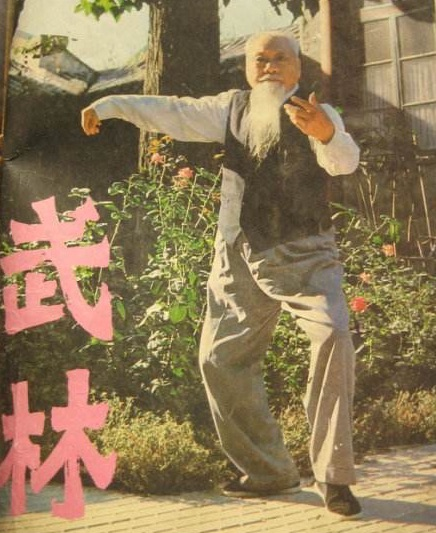
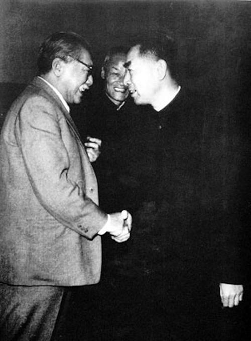
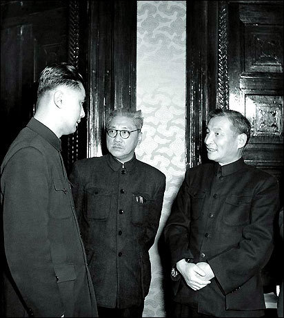
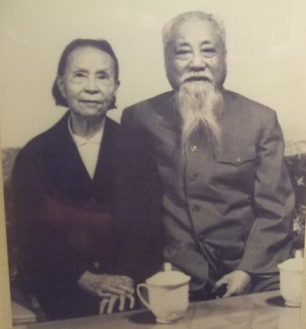
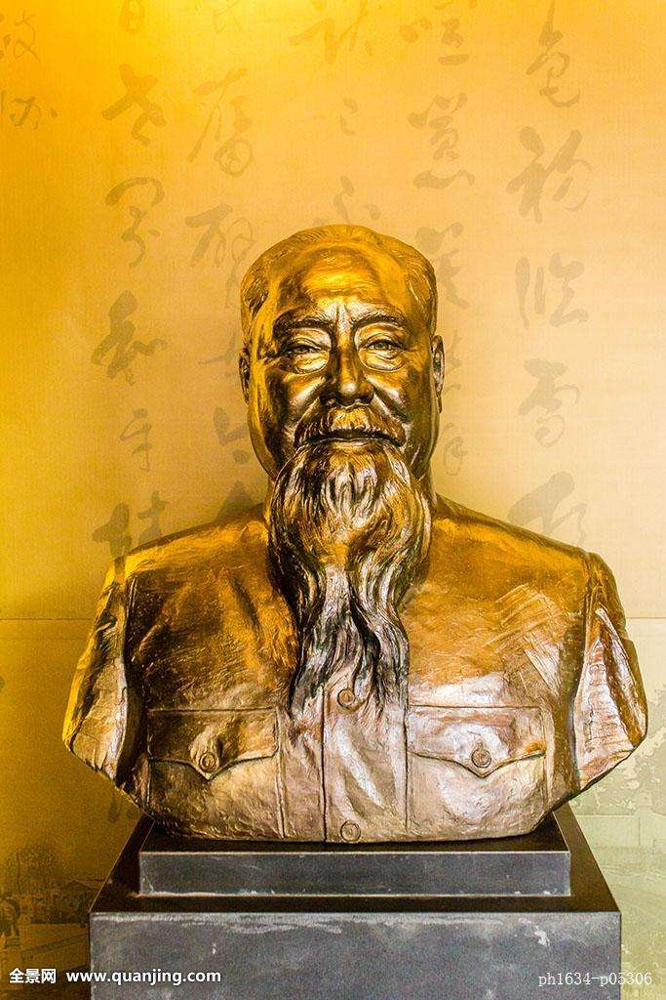

【1989年4月16日】29年前的今天，仅仅6天，就将上海工商业全部收归国有的胡厥文逝世

胡厥文（1895年10月7日－1989年4月16日），今上海嘉定人，实业家。支持淞沪抗战，在全面抗战爆发后，率先把工厂迁往内地。抗战胜利后，因大量工厂订单被取消，愤而建立中国民主建国会，支持共产党。从此以后，他长期活跃在中国政界、商界几十年，是“坚定不移跟党走，尽心竭力为四化”的常青树。

在立社六十五周年纪念.jpeg)

（1982年5月，胡厥文在中华职教社六十五周年纪念会上）

【上海制造业的年轻领袖】

1895年10月7日，胡厥文出生于今上海市嘉定区。1914年（19岁），考入北京高等工业专门学校机械科。1918年，大学毕业后，到武汉的汉阳铁厂当工人。第二年，回到上海，在同济医工学校（同济大学）的实习工厂工作。

1921年（26岁），胡厥文变卖土地，创建了自己的第一家工厂——新民机器厂。随后的几年里，他先后创办了合作五金厂、长城砖瓦厂等四家工厂。

1927年（32岁），上海机器制造业举行同业集会，成立了上海商民协会机器同业公会，他被推选为公会主任。从此，他主持公会10年，公正无私地为大家服务，堪称业界领袖。

（胡厥文与妻子沈方成的结婚照）

【支持抗战的爱国企业家】

1932年（37岁），日军进攻上海，淞沪抗战爆发。胡厥文全力支持抗战，他说：“我虽不会打枪开炮，却可以造枪炮。”他动员组织起几十家企业，拆迁机器建立临时工厂，日夜赶造弹药，送往前线，是抗战的十九路军的坚强后盾。

1937年（42岁），抗日战争全面爆发。胡厥文作为上海企业家的代表之一，前往南京请愿，表示：“国家兴亡，匹夫有责。我们自愿把工厂迁到后方去，支援抗战。”他带头拆厂内迁，担任迁川工厂联合会理事长，在重庆、桂林、祁阳等地创办工厂。

（工厂中的胡厥文）

【抗战胜利的政府请愿】

在抗战期间，胡厥文接触到周恩来、董必武、王若飞等中共领导人，留下了深刻印象。

抗战胜利后，国民党政府宣布取消与国内各厂商签订的所有订货合同。如同晴天霹雳，一时工厂全部停顿，工人生活没有着落。胡厥文率领200多名工厂代表，到国民党政府行政院请愿未果。

周恩来多次到胡厥文家中探望，鼓励他坚持斗争，并送去小米和红枣；毛泽东到重庆参加国共谈判时，特地接见了胡厥文；胡厥文深受感动。

（周恩来与胡厥文握手）

【宣布“非法”的民建】

1945年12月16日（50岁），在重庆白象街实业大厦，胡厥文与黄炎培、章乃器等人发起成立了中国民主建国会。基本政治纲领是民主和建设；党员主要是工商企业家和文化教育界人士。民建是新中国排名第三的民主党派，后来曾任国家副主席的荣毅仁，就来自民建。

民建成立后，胡厥文返回上海，任新民机器厂总经理，创办《中国工业》杂志。不久，国共内战再次打响。1947年10月27日，国民党政府宣布民建为“非法团体”，对民建的主要成员，进行跟踪监视，民建被迫转入地下。

（胡厥文题词“中国民主建国会”）

【拥护共产党的商界领袖】

1949年5月27日，上海解放。6月2日，市长陈毅召集300多名上海工商界企业家座谈，胡厥文表示：“上海工商界过去受到不正确宣传的蒙蔽，对共产党确实抱有相当疑惧。但现在大家满怀希望，真诚拥护人民政府。”

9月，胡厥文以民建代表的身份，赴北京参与制订《共同纲领》，参加政协第一届全体会议。新中国成立后，民建的黄炎培被任命为政务院的副总理。

（胡厥文、陈云、荣毅仁在交谈）

【6天实现上海公私合营】

1953年10月（58岁），全国工商联举行第一届会员代表大会，宣告正式成立。胡厥文连续当选第一到第四届执委，第五届常委。他是工商联最有影响力的领袖之一。

1956年春，进行工商业的社会主义改造，在胡厥文等人的大力推动下，仅仅6天，上海就实现了数百个行业的公私合营。面对大家的疑虑，胡厥文说：“你们看过《西游记》没有？孙行者一路上想方设法去掉头上的紧箍儿，但一路上怎么也去不掉，后来到了西天，他问如来佛，我现在这个紧箍儿可以去掉了吗？如来佛说，你自己摸摸看。孙行者一摸自己头上，那个紧箍儿已经没有了。”

（1956年1月20日，上海市公私合营大会结束后，以荣毅仁、盛正华、胡厥文等代表步出会场）

【坚定不移的常青树】

此后，他一直活跃在中国的政治舞台上。在政协，他是第一、二、三、四届全国政协委员，第五届常委；在人大，他是第一届人大代表，第二、三届人大常委，第四、五、六届人大常委会副委员长。

（胡厥文夫妻结婚60周年合影）

1979年（84岁），他当选为民建中央主席。在党的十一届三中全会以后，他领导民建与全国工商联，提出“坚定不移跟党走，尽心竭力为四化”的行动纲领，为改革开放献计献策，做出了积极贡献。

1988年，退休。1989年4月16日，病逝于北京，终年94岁。

