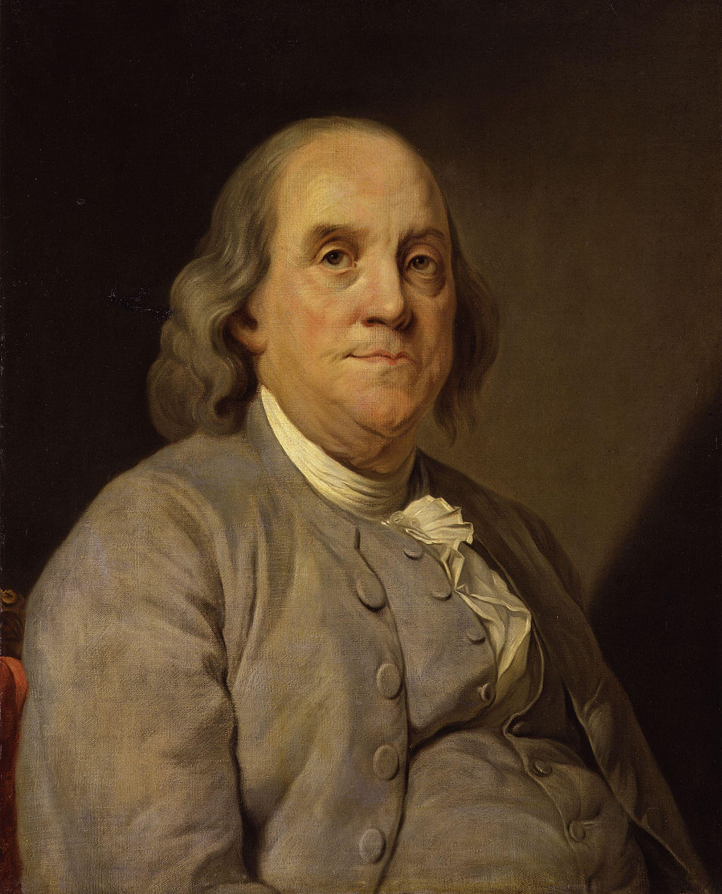
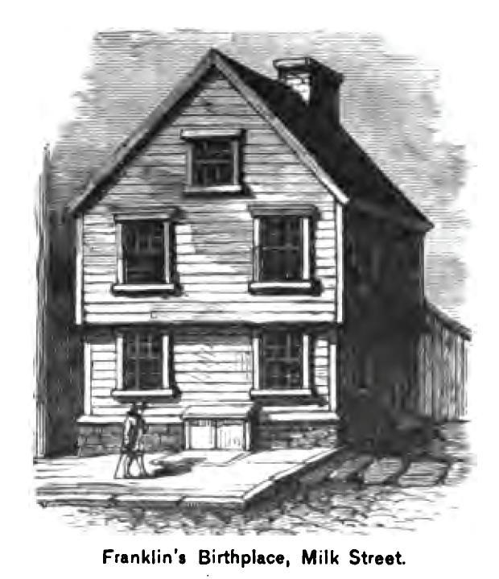
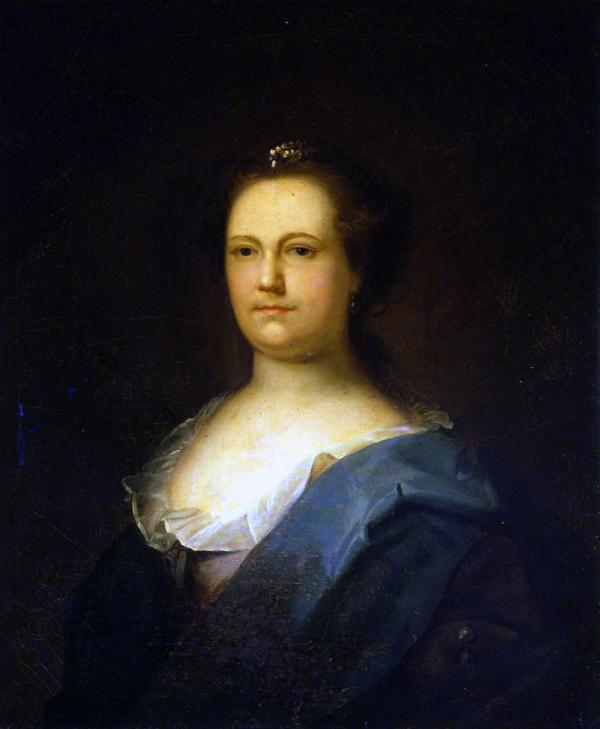
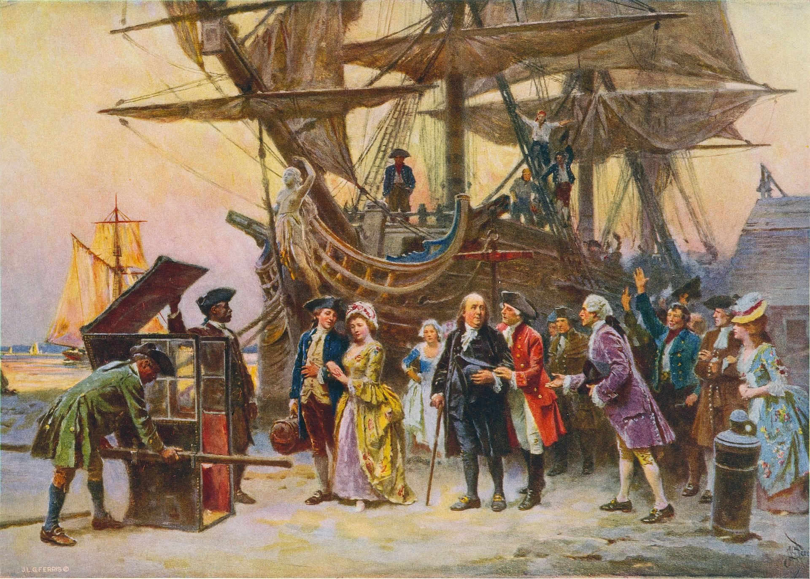
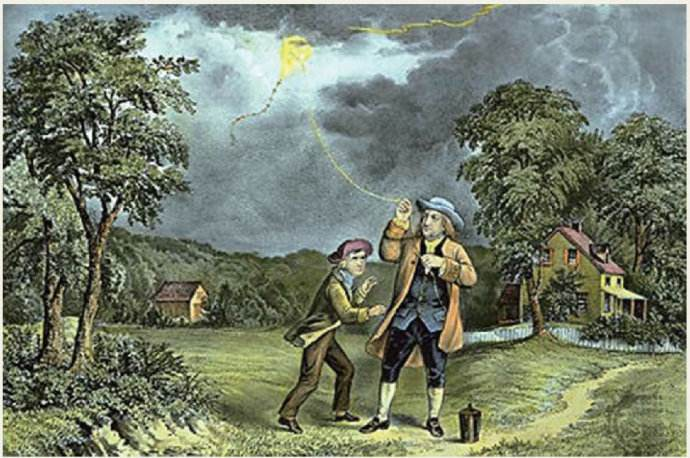
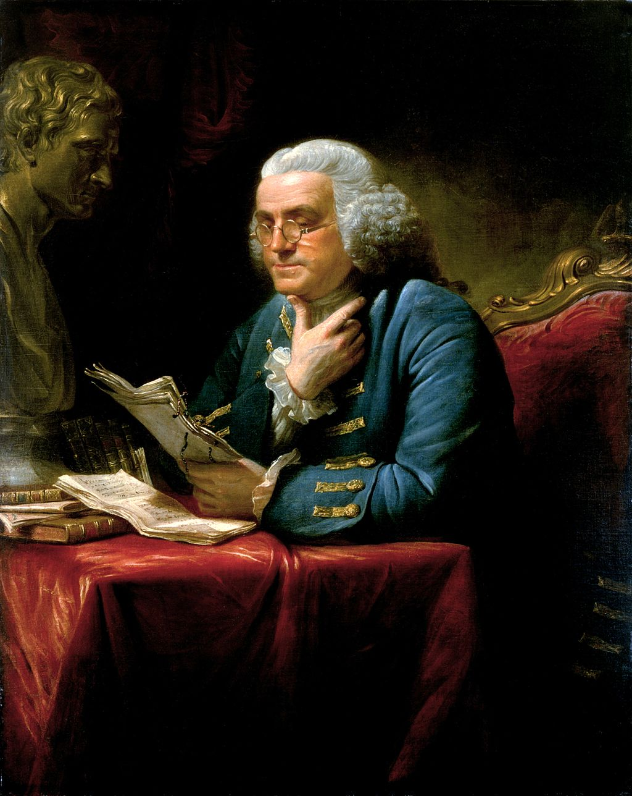

【1790年4月17日】228年前的今天，只上了两年学的美国精神之父富兰克林逝世

1790年4月17日夜里11点，参与起草美国《独立宣言》、美英《巴黎条约》、《美国宪法》，发明避雷针等，从事印刷业致富的富兰克林溘然逝去，享年84岁，他的墓碑刻着“印刷工富兰克林”。

（五巨头起草美国《独立宣言》）

一、奇特的家庭结构

1706年1月17日，富兰克林出生于波士顿。他的父亲原是英国漆匠，在1683年举家离开英格兰移居波士顿。富兰克林是他父亲17个孩子中最小的一个。12岁时，签订合约给哥哥当学徒，17岁前往费城，当了印刷工。

1730年（24岁），富兰克林与瑞得以事实婚姻结合。两人在6年前曾订过婚，因为女方家长反对，瑞得另嫁他人。但不久，瑞得被遗弃，丈夫不知去向。因此，富兰克林和瑞得无法结为合法夫妻。在两人结合前，富兰克林还有一个私生子。

（富兰克林的出生地）

（富兰克林的妻子瑞得Deborah Read）

二、美国梦的精神鼻祖

1724年（18岁），富兰克林前往伦敦，购买印刷设备。1726年，返回费城，在返美的船上，他写下了自己的人生计划，决定以“节俭、诚实、勤奋和得体”作为人生奋斗的信条。

到费城后，他从店员做起，兢兢业业，最终成为印刷店的老板。42岁时，富兰克林将自己的印刷店交给合伙人打理，自己拿股份分红实现了财富自由，转身走上了政治舞台。不久，他就当选为宾州议会议员。

他勤奋、节俭、诚实、热心公益。他以科学家、政治家、外交家、慈善家等多重身份而名声显赫。他是靠积极奋斗取得成功的“美国梦”的最佳代言人，影响了一代又一代人。

（在印刷机上工作的富兰克林）

三、美钞上的西方圣人

1754年（48岁），他作为宾州代表，出席了殖民地代表会议。1764年（58岁），他第二次赴伦敦，要求英王保护殖民地利益，没有结果；其后，英国与北美殖民地矛盾激化，富兰克林率先提出了“不联合就死亡”的口号，是美国联邦思想的发起之一。

（不联合就死亡，富兰克林的政治漫画）

1767年，富兰克林到了法国，受到法国人的热烈欢迎。1775年（69岁），他回到美洲，担任宾州治安委员会主席，主持地方军委，和潘恩共同起草了州宪法。随后，参加第二届大陆会议，作为五巨头之一，参与起草了美国《独立宣言》，并担任美国邮政总长。

1787年（81岁），在联邦宪法会议上，他作为宪法起草委员会委员，促成宪法通过。他提出的议会的两院制，成为美国的基本国家制度之一。

（美国宪法第4页）

他还担任“宾夕法尼亚促进废奴协会”主席，临去世前一年撰写《关于奴隶贸易》，致力于促进废除奴隶制。作为“他生活的时代和国家中最伟大和最出色的人”，富兰克林的头像印在美国的百元钞票上。

（100美元纸币上的富兰克林）

四、外交战线的老狐狸

1779年（73岁），在英强美弱的局势下，富兰克林奉命出使法国，争取美法结盟，共同对英作战。富兰克林通过与法国上流社会的交往，赢得了法国政府的信任。成功缔结美法同盟，使美国争取到了大量外援，确保了独立战争的胜利。

战后，他成为美国第一任驻法特命全权大使。1783年（77岁），他参加并主持英美议和谈判，签订了英美《巴黎和约》，英国承认北美13州独立，胜利完成了艰巨的外交使命。

（1785年，富兰克林重返费城）

五、百科全书似的科学家

1752年（46岁），富兰克林在费城进行电风筝试验，发明了避雷针。他在《电学实验与观察》上发表论文，揭示了雷电现象的本质，被誉为“第二个普罗米修斯”。

（曾选入小学课本的富兰克林放风筝插图）

他在光学、热学、声学、数学、海洋学、植物学等方面，也颇有研究，并创造发明了：新式火炉、避雷针、电轮、三轮钟、双焦距眼镜、自动烤肉机、玻璃乐器、高架取书器、新式路灯等。

1753年（47岁），他获得英国皇家学会颁发的科普利奖章，获得哈佛大学和耶鲁大学的荣誉学位。1756年（50岁），当选为英国皇家学会会员。1772年（66岁），当选为法兰西科学院的外国院士。1789年（83岁），当选为彼得堡科学院的外国院土。

（富兰克林发表关于龙卷风的论文插图）

六、自学成才的文学家

富兰克林一生只在学校读了两年书，但他的自学从未间断。他阅读的范围很广，并通过大量的仿写不断提高写作水平。21岁时，他在费城创办了北美第一个青年自学团体“共读社”（美利坚哲学会的前身）。

25岁时，他在费城创办了北美第一个公共图书馆。1746年（40岁），发表《平凡的真理》，51岁发表《致富之路》（《老者亚伯拉罕的讲话》），65岁开始写自传，79岁重续自传（1785—1786年）。

《富兰克林自传》成为两个多世纪以来的最优秀的畅销书之一、是成功学的经典著作，被认为是改变了无数人命运的“美国精神读本”。

（富兰克林画像）

