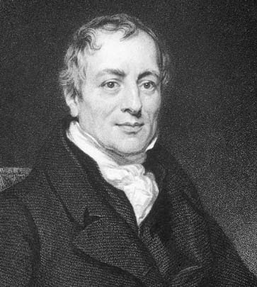
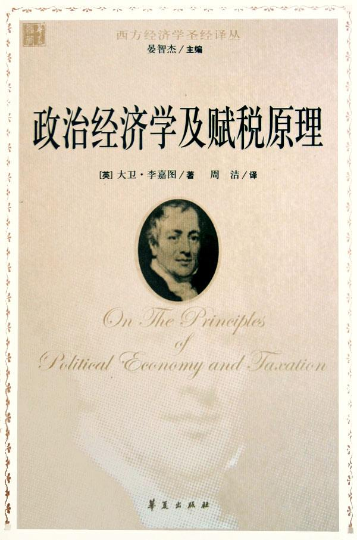
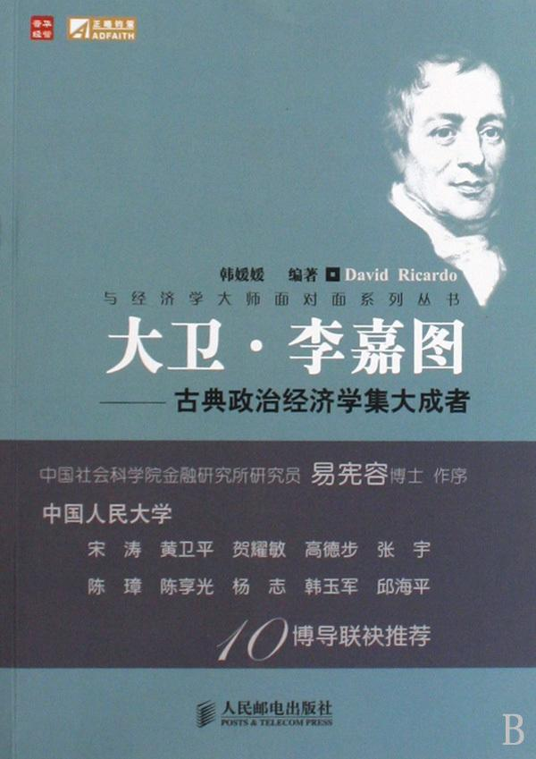

（万象特约作者：春风化雨）

【1772年4月18日】246年前的今天，为女人而私奔的、最有钱的经济学大师李嘉图出生

【为女人而离家私奔】

1772年4月18日，李嘉图出生于英国伦敦的一个犹太富商家庭。按照现在的标准，妥妥的富二代。14岁时，李嘉图被父亲送到荷兰学习，两年后返回英国跟随父亲从事证券交易。

年青时的李嘉图是一个爱美人不爱江山的多情种。21岁时，他与一个信仰基督教的姑娘坠入爱河，两人私奔结婚。因此，李嘉图被信奉犹太教的父母赶出家门，失去了在家族事业的股份。他母亲甚至为他举办了葬礼，以示从此没有这个儿子。

【800英镑发家的奇迹】

失去了富商父亲的支持，怀揣着仅有的800英镑，年仅21岁的李嘉图反倒开了挂，迅速走上人生巅峰。凭借过人的天赋和出色的能力，李嘉图赢得了当时英国银行家的鼎力支持。

他通过高周转的短期交易，短时间里就赚取了大量的财富。这种手法依赖于李嘉图敏锐的眼光和灵活性，虽然每次操作的单次利润率并不高，但是通过提高周转率，实现了财富的快速增值。

（高周转率这一手法在200年后被很多中国的地产大佬们异曲同工的使用，XXX地产一天出图论就是最典型的代表，从事地产设计工作的春风君表示苦不堪言啊）。

（19世纪的伦敦交易所）

【滑铁卢战役的最大胜利者】

李嘉图最出色的一次投资，是在滑铁卢战役前对英国公债的投资。1815年（43岁），滑铁卢战役前夕，胆怯的投资者纷纷清仓自己手中的债券，其中也包括李嘉图的挚友、著名的人口经济学大师马尔萨斯。

李嘉图展现了他过人的胆略，他大胆持仓，直到威灵顿将军战胜拿破仑的消息传来。这次投资，给李嘉图带来了上百万英镑的巨额回报。英国1830年的GDP为48300万英镑，这次投资回报占当年英国GDP的比例，很可能超过千分之二！这是个惊人的数值，以英国2017年的GDP折算就是61亿英镑。

李嘉图当之无愧是史上最富有的经济学家。

【启发马克思的经济学大师】

从投资成就来看，李嘉图简直就是移动的印钞机！但更难能可贵的是，他并非一个单纯的挣钱机器，和一般商人沉迷金钱游戏不同，李嘉图对学术研究有着广泛的兴趣。他在数学、化学、地质学、矿物学等方面，均有所涉猎。

27岁时，李嘉图读了亚当.斯密的《国富论》，对经济学原理和经济政策产生了浓厚兴趣。37岁，他发表了第一篇经济学论文，引起学界关注，从此一发不可收拾。

1817年（45岁），他发表了著名的《政治经济与赋税原理》。书中他阐述了劳动价值论，对后来马克思的剩余价值理论产生了重要影响；同时提出了比较优势理论，构成了现代贸易理论的基石；从而也奠定了李嘉图的古典经济学大师地位。

【耳朵感染了的大方人】

李嘉图除了从事学术研究，还积极参与经济政策的制定。李嘉图眼光宏大，并不局限于自身利益。如李嘉图本人是英国当之无愧的大地主，却主张废除保护本国地主利益的谷物法。他主张自由贸易，深远影响了英国的政策，也影响了整个世界。

天才的离去也必须是那么拉风。1823年9月11日，年仅51岁的李嘉图因为一个小小的耳病引发的感染离世。按照遗嘱，李嘉图慷慨地把自己的财产，馈赠给了所有亲朋好友。

无论是对经济学理论的贡献，还是实际投资的成就来看，李嘉图都是当之无愧的大师。

（本文是万象历史·人物传记写作营的第2篇作品，是营员“春风化雨”的第1篇作品）

