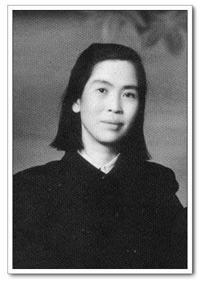
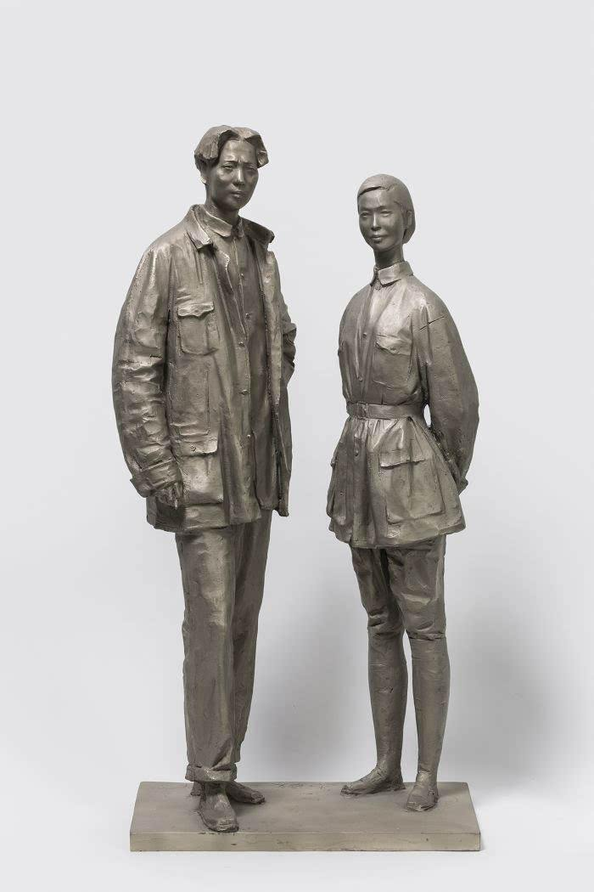
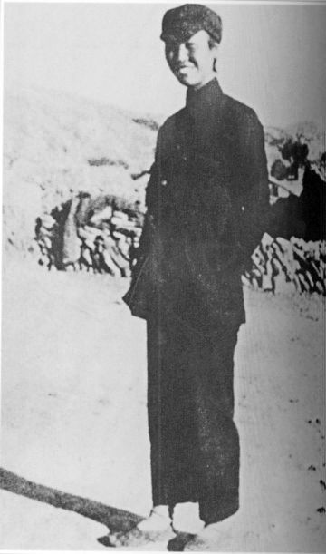
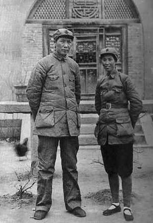
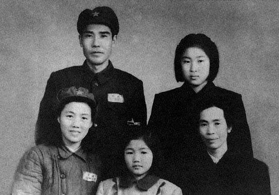
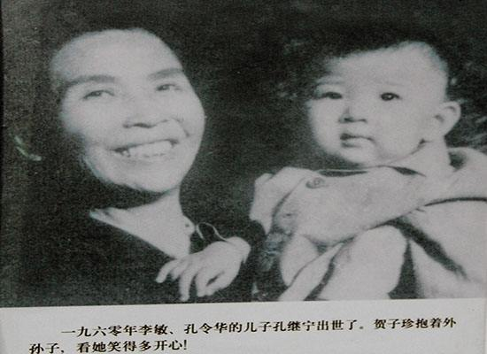
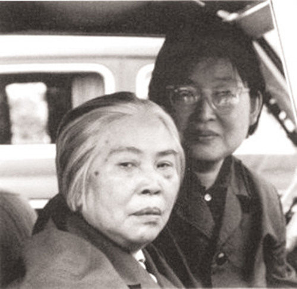
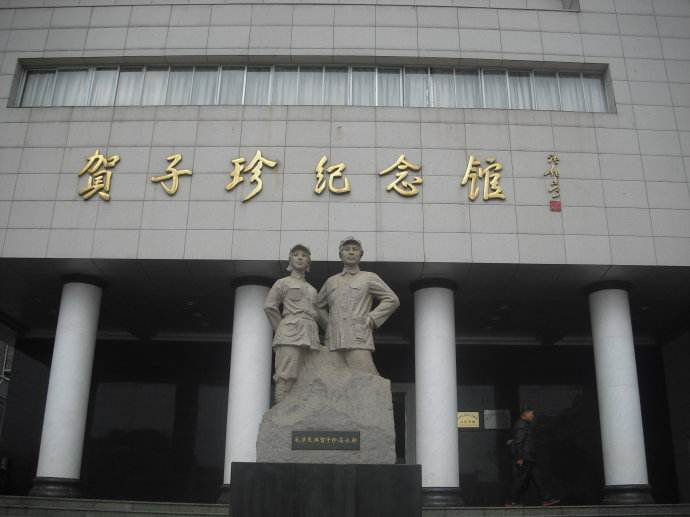

（万象特约作者：隔壁老孙）

【1984年4月19日】34年前的今天，长征负伤17处，与毛泽东终生难以相见的贺子珍逝世

1984年4月19日，贺子珍逝世，葬于八宝山革命公墓。

1909年9月28日，贺子珍出生于江西永新。人们能熟悉贺子珍这个名字，主要是因为她是新中国最重要的伟人——毛泽东的妻子。

他们的相遇，是在1928年秋收起义失败后，毛泽东败走井冈山时发生的。时年三十三岁的毛泽东正孤身一人，性格刚烈、做事雷厉风行、巾帼不让须眉、笑起来像花一样的贺子珍的突然出现，深深的吸引了他。

毛泽东对贺子珍说：“你是个好同志，好姑娘，我很喜欢你！”就这样一个“湖南佬”和一个“江西妹”他们走到了一起。没有正式的婚礼，没有亲朋好友的祝福，只有“红色赤匪”袁文才做了一顿简单的饭菜，同志们热闹了一下，他们就这样完婚了。那一年他33岁，她，18岁！

两人的婚姻虽然只持续了十年，可这十年却是毛泽东最重要的十年。可以说是荣辱与共，患难相随。

在长征途中，遵义会议后，毛泽东率红军四渡赤水，神奇地突破敌人的重重包围，扭转了被动局面。可谁知道一场突如其来的灾难降临在他的妻子贺子珍头上。

1935年4月23日中午，在贵州盘县的一个小山村里，天空突然响起了轰鸣的飞机声，警卫员紧忙让贺子珍隐蔽起来。就在这时，飞机投下了炸弹，贺子珍头上，胸脯上，两肩上，都被弹片炸的鲜血淋淋，倒在了血泊里。经医生检查，发现她身上一共负伤17处！

（毛泽东与贺子珍在延安）

贺子珍一生生过6个孩子，可只有李敏一个人活到了新中国成立。其他的五个子女都在那最动荡、最低迷的十年里不幸夭折了。

也许是太在意，也许是性格使然，从大革命年代的“井冈之恋”，到红色根据地的“模范夫妇”，贺子珍和毛泽东二人在政治风雨中荣辱与共，在长征路上艰苦相依，却没想到在延安，突然发生婚变，贺子珍在延安窑洞“神秘失踪”。从此，一对患难中的革命夫妻彼此分离。

（1949年，贺子珍（右一）与亲人合影）

1937年，伤病体弱的贺子珍没有理会毛泽东的召唤和中央的指示，毅然离开延安，随共产国际的代表去了苏联。在苏联，贺子珍母女俩和杨开慧所生的两个儿子——毛岸英和毛岸青真情相处，享受着异国的一份亲情欢乐。

在苏联，她痛失了最后一个孩子。十几年的异国他乡生活，其实是灰色的。她已经不是中国共产党最高领导人的夫人，而只是一个普通人！在她的余生里，只和毛泽东见过一次面，当中的心酸无奈，无法言表！

（李敏（左）与贺子珍（中））

1979年，当她第一次来到北京，来到毛主席纪念堂时，她曾经挚爱的毛泽东已经离世三年了！1984年4月19日，她也永远的离开了这个世界。经邓小平同意，贺子珍被安葬在最高规格的八宝山革命公墓。

贺子珍陪伴毛泽东一起度过了中国革命历史上最艰难的阶段！她是千万革命先辈中，一位平凡而又伟大的女性！愿天堂里没有烦恼！

（1979年，贺子珍和李敏第一次到北京）

（贺子珍纪念馆）

（本文是万象历史·人物传记写作营的第3篇作品，是营员“隔壁老孙”的第1篇作品）

