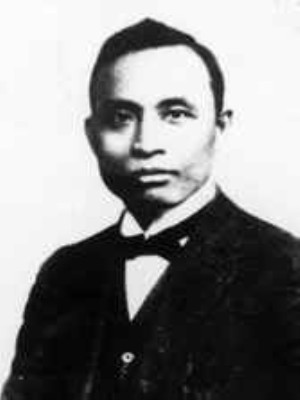
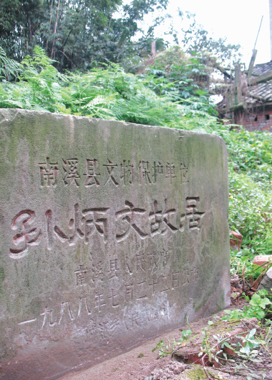
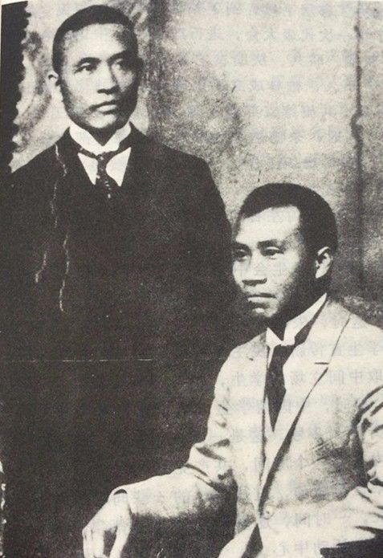
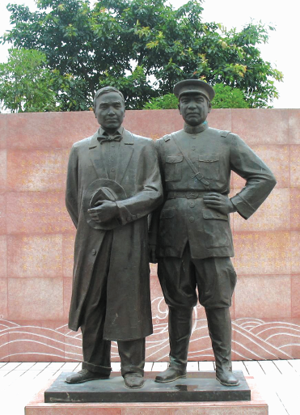
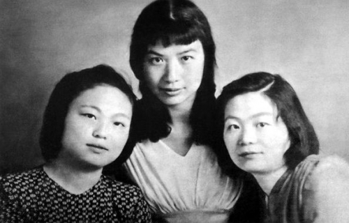

0420孙炳文

91年前的今天，朱德的莫逆之交、女儿被周恩来认作干女儿的孙炳文英勇就义 

【被开除的大学生】

1885年，孙炳文生于四川省南溪县。1893年（8岁），到县城读私塾。不久，父亲去世，家人分居，孙炳文由在县城经商的八哥资助，去叙府（即今宜宾）读书。

1908年（23岁），孙炳文考入北京京师大学堂学习。他经常阅读《民报》，逐步接受了资产阶级民主革命思想，并加入了同盟会。

1910年，因在作文试卷中抨击学校是“叶公好龙”、“尸位素餐”，孙炳文竟被学校开除。次年，辛亥革命爆发，京师大学堂改为北京大学。新任校长严复听亲自调阅了他的试卷，认为他反封建的斗争精神值得赞扬，应该恢复学籍。

【朱德的莫逆之交】

1913年，改组同盟会的宋教仁被暗杀，袁世凯到处张榜捉人，孙炳文只得偕妻儿回到家乡四川。1917年，经人介绍，他认识了滇军将领朱德。朱德对德才双全的孙炳文很是敬佩，特请孙炳文任旅部参谋。从此，孙炳文与朱德两人朝夕相处，成为莫逆之交。

两人反复讨论国内政治形势，最后决定离开滇军，去马克思故乡德国寻找革命道路。到达德国后，37岁的孙炳文和36岁的朱德，经小自己十余岁的周恩来介绍，加入中国共产党。

和孙炳文在泸州.jpg)

（1918年，孙炳文（右）和朱德（左）在泸州）

【回国参加革命】

1925年，“五卅”运动后，孙炳文于8月离开德国，转道莫斯科回到中国。不久，他接受国民革命军总政治部主任邓演达等人电邀，到广州任职。孙炳文就任国民革命军总政治部上校秘书兼广东大学教授，讲授政治经济学。

1926年6月，孙炳文调任总政治部秘书长，与周恩来、郭沫若、邓演达等人交往密切。随着北伐军的节节胜利，1926年12月5日，广州国民政府北迁武汉，广州设政治分会，孙炳文任总政治部后方留守主任。

他应邀出席中央军事政治学校（即黄埔军校）召开的特别党员大会，在演讲中指出：“在国民党内左派是革命的，右派是反革命的。”他提出打倒一切反革命派是革命党人的任务。

（朱德和孙炳文（左））

【被旧识出卖惨遭杀害】

1927年4月，孙炳文应邓演达邀请前往武汉，由于粤汉铁路不畅，孙炳文决定改由香港，乘船经上海，顺长江去武汉。在法国轮船上，他遇到了一个叫褚民谊的旧识，没想到此人竟借法轮电台，向蒋介石告了密。

4月16日，法轮一到上海，孙炳文就被法国巡捕带走，并被引渡到龙华淞沪警备司令部看守所。敌人对孙炳文诱以高官厚禄，遭到严正拒绝。4月20日凌晨，孙炳文被秘密杀害了。

孙炳文殉难后，《民国日报》以醒目的标题登载《孙炳文同志在沪遇害》的消息，强烈谴责和揭露蒋介石。曾与孙炳文患难与共的朱德，惊闻噩耗，失声痛哭。郭沫若作了《怀亡友》一诗以示悼念。

（四川南溪的孙炳文（左）与朱德（右）塑像）

【“红色公主”孙维世】

孙炳文牺牲后，周恩来和邓颖超认了其女儿孙维世为干女儿。

孙维世从苏联学习戏剧回来后，成为新中国戏剧奠基人、新中国三大导演之一，有“红色公主”之称。代表作品有《保尔·柯察金》、《钦差大臣》、《万尼亚舅舅》等。文化大革命期间遭迫害致死，年仅47岁。

（1945年7月，在莫斯科孙维世（中）与林伯渠的两个女儿合影）

有一次聊天，邓颖超对周恩来侄女周秉德说：“我和你伯伯只有三个干女儿，而她们的命运都是非常苦的。一个是叶挺将军的女儿叶扬眉，与父母一起搭乘那架后来坠毁的飞机，很小的年纪就去世了，另外一个是他在南开时的同学谌小岑的女儿，在延安因为窑洞坍塌而被砸死。”还有一个就是孙维世，她有幸活到解放后，但是在文革中却不明不白的被迫害致死。”

.jpg)

（孙维世与周恩来、邓颖超合影）

