## nnnn姓名（资料）

适合所有人的历史读物。每天了解一个历史人物、积累一点历史知识。三观端正，绝不戏说，欢迎留言。  

### 成就特点

- ​
- ​

### 生平

张春桥（1917年2月1日－2005年4月21日），山东菏泽巨野人，“四人帮”之一。

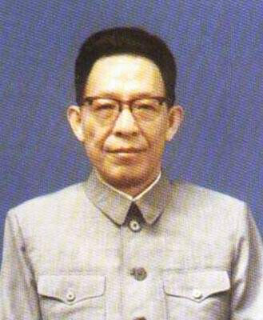

【中学生组织的法西斯】

1917年2月1日，张春桥出生于山东菏泽巨野。1932年（15岁），进入山东济南私立正谊中学读书。这时的张春桥是个文艺活跃分子。第二年，济南高级中学的学生李树慈和张春桥，一同发起一个文学组织“华蒂社”，即英文"WHAT"。

文革期间，1967年，李树慈交代说，他当年其实是国民党复兴社分子，即支持蒋介石的蓝衣社；华蒂社的意思是“中华法西斯蒂”。“四人帮”被捕后，这段证词成为指证张春桥是“国民党特务”的重要证据。

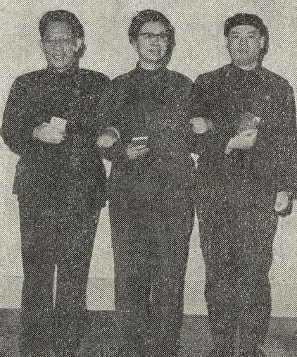

（文革期间，张春桥、江青、姚文元的合影）

【疯狂攻击鲁迅的狄克】

1935年（18岁），张春桥到上海谋生。这一年，周扬、夏衍等人认为“左联”存在关门主义和宗派主义，将左联解散，成立新的“中国文艺家协会”。鲁迅对此非常抵触，而年轻的张春桥加入了协会。

1936年3月15日，张春桥以笔名“狄克”在《大晚报》的副刊“火炬”上发表文章《我们要执行自我批评》，支持周扬提出的“国防文学”，批评作家田军（萧军的笔名）写的《八月的乡村》不够接地气。4月16日，鲁迅写了《三月的租界》维护田军，攻击狄克。

到1949年时，当时《大晚报》副刊“火炬”的主编崔万秋，被证实是军统特务。在“四人帮”被捕后，张春桥被指责为“服务于特务崔万秋麾下，从事文化运动，化名狄克疯狂攻击鲁迅”。

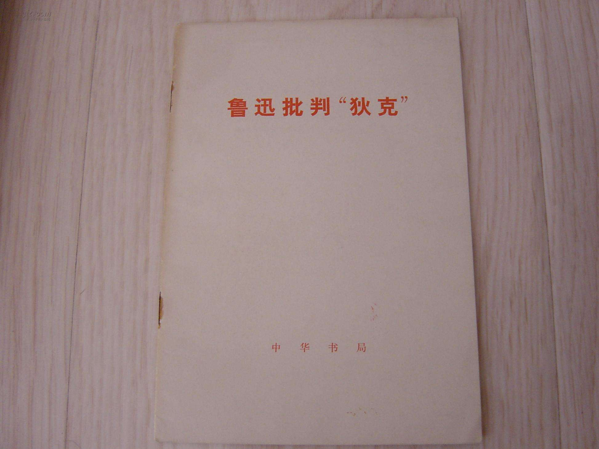

【参加冒充共产党的委员会】

1936年（19岁），部分和党组织失去联系的共产党员，组织了一个中共预备党员委员会。张春桥加入委员会，成为共产党员。后来和中共取得了联系，委员会明令解散。因此，后来张春桥到达延安时，没有材料证明他已经入党，于是再次入党。

在“四人帮”被捕后，有人指责张春桥“参加了叛徒组织的一个冒充共产党的委员会”。

【潜入根据地的特务】

1937年8月（20岁），日军进攻上海，张春桥离开上海，返回济南，暂住在父亲的同事赵福成家中。12月，张春桥离开武汉，经武汉郭沫若的“政治部第三厅”里的一个熟人介绍，第二年到达延安。

赵福成是复兴社特务。1950年，他交代：“我知张，张不知我。”在“四人帮”被捕后，赵福成改口供，说接到上级密令，因此特别关照张春桥。因此，有人指责张春桥：“奉复兴社特务之命，伺机潜入我根据地”

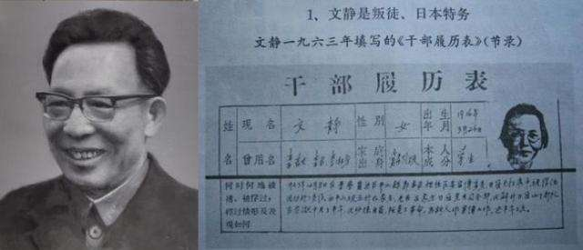

（姚文元和妻子文静）

【新中国的媒体人】

1940年后，张春桥历任《晋察冀日报》副总编辑、《石门日报》社长、《石家庄日报》社长等职。1949年，随解放军进入上海。

共和国成立后，任华东新闻出版局副局长。1951年11月，任上海《解放日报》社副总编辑、社长，1955年（38岁）任总编辑。

1958年，他写的一篇《破除资产阶级法权思想》的文章，深为毛泽东赞赏。1959年1月起，张春桥任中共上海市委常委。1963年3月，任中共上海市委宣传部部长。1965年3月，任中共上海市委书记处书记，分管宣传文化工作。1966年5月起任中共中央华东局委员、华东局宣传部部长。

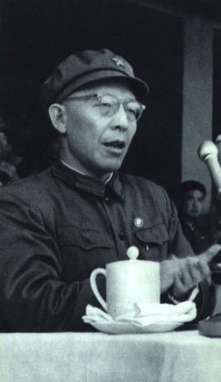

（1967年4月20日，张春桥在北京市革命委员会成立会上）

【拉开阶级斗争的序幕】

1966年5月，任中央文化革命领导小组副组长。1967年1月1日（50岁），《人民日报》、《红旗》杂志发表了题为《把无产阶级文化大革命进行到底》的元旦社论，提出新的一年“将是全国开展阶级斗争的一年”。

张春桥与姚文元、王洪文一道，积极响应，1月4日起，夺取了《文汇报》、《解放日报》的控制权。1月6日，以全市各造反组织名义，召开“打倒市委大会”，把全市几百名局级以上干部，拉到会场批斗。中共上海市委、人民委员会被迫停止办公。

张春桥等人夺权，成为上海的实际领导者，史称“一月革命”。这是中国大陆文化大革命期间的重要事件，在毛泽东的认可下，进一步推动了全国的夺权运动。山西（1月14日）、山东（2月3日）、黑龙江（1月31日）、贵州（1月25日）等省纷纷夺权，全国一片混乱，大批干部遭到迫害。

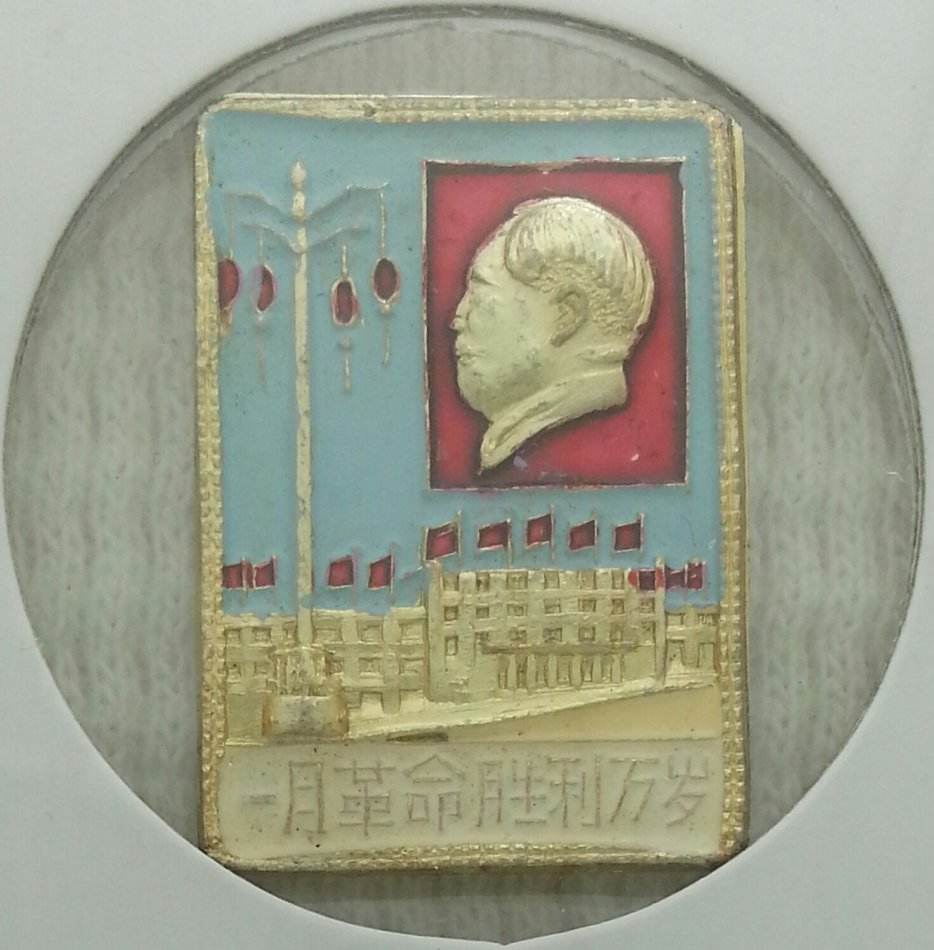

【共产主义的第四个里程碑】

此后，张春桥平步青云，同时兼任多项重要职位。1967年，任上海市革命委员会主任、上海警备区第一政委、南京军区党委第一书记。1969年起，任中共中央政治局委员、中共中央军委委员。1971年，任上海市委第一书记。1973年，任中央政治局常委。1975年，任国务院副总理、中共中央军委常委。

1975年，他发表《论对资产阶级的全面专政》，印成单行本全国发行。一时间出现大量文章，宣传“张春桥思想”，说他“创造性”地发展了“毛泽东思想”，将成为继马克思主义、列宁主义，毛泽东思想之后的“第四个里程碑”。

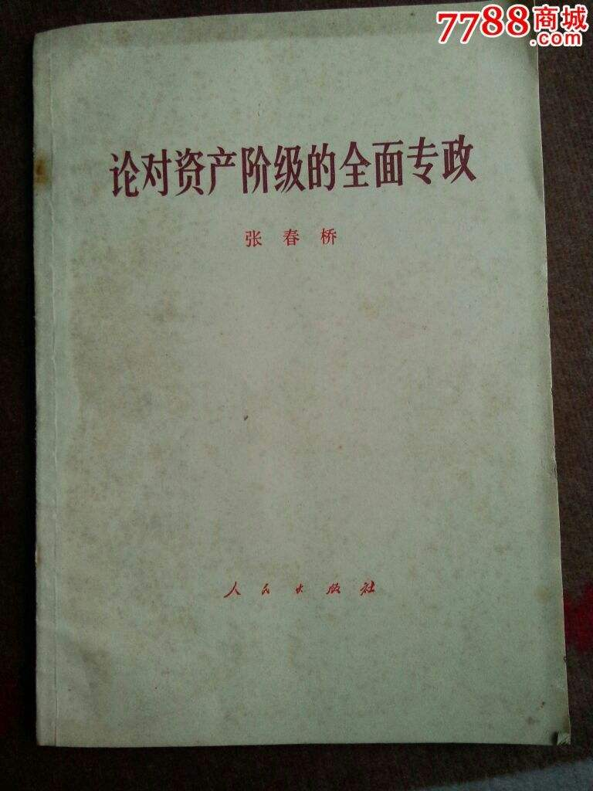

【得以善终的四人帮】

1976年（59岁），毛泽东去世；10月6日，张春桥等人在中南海怀仁堂被捕，史称“怀仁堂事变”。“四人帮”出人意料地被捕后，张春桥在法庭上的表现，特别引人注目，他一直一言不发，漠视法庭。

1981年1月25日，最高人民法院宣布，张春桥作为“林彪、江青反革命集团案”的主犯，判处死刑，缓期两年执行，剥夺政治权利终身。1983年1月25日，减为无期徒刑。1997年12月，减为有期徒刑18年。1998年1月，因病送北京复兴医院保外就医。2005年4月21日（88岁），病逝，算是得以善终。

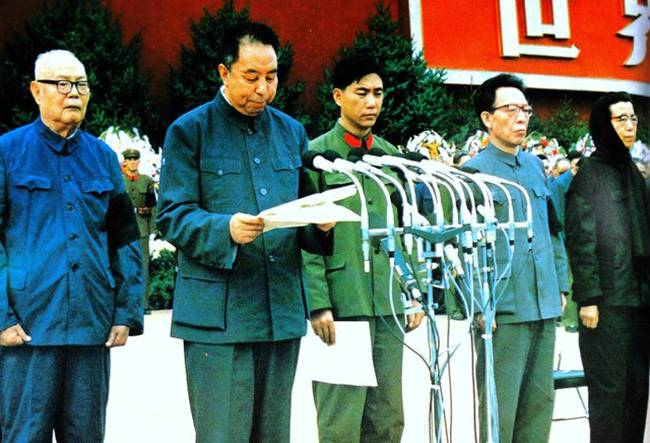

（1976年9月18日，毛泽东追悼大会上的叶剑英、华国锋、王洪文、张春桥、江青）

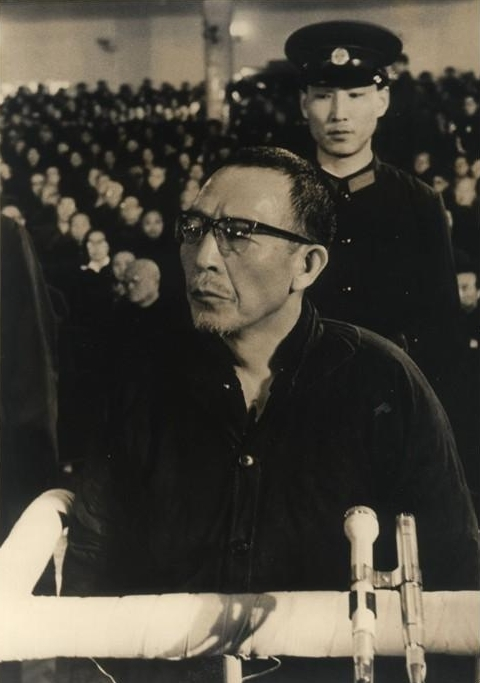

（被告席上的张春桥）

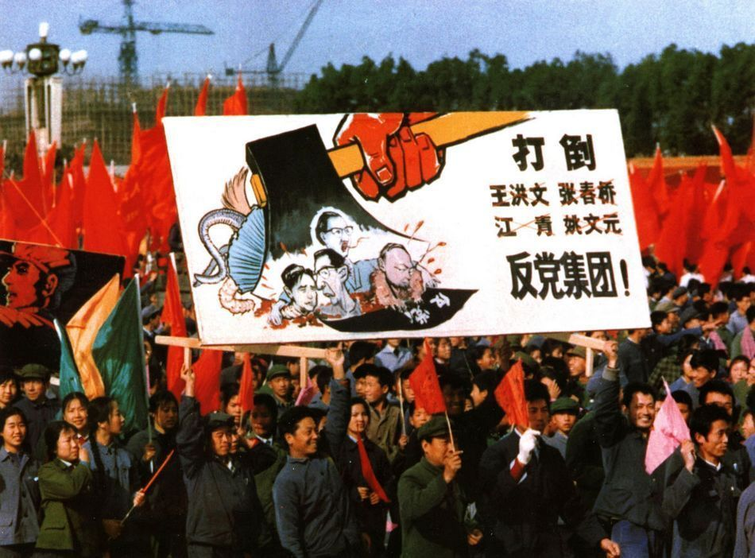

【】

### 照片

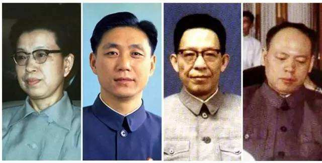

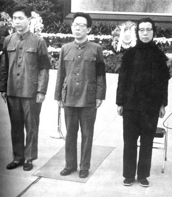

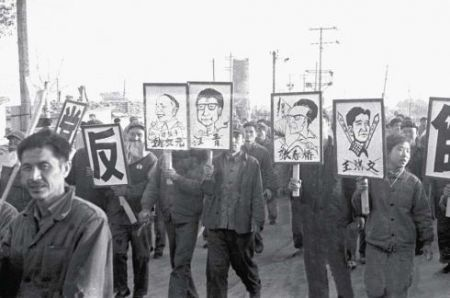

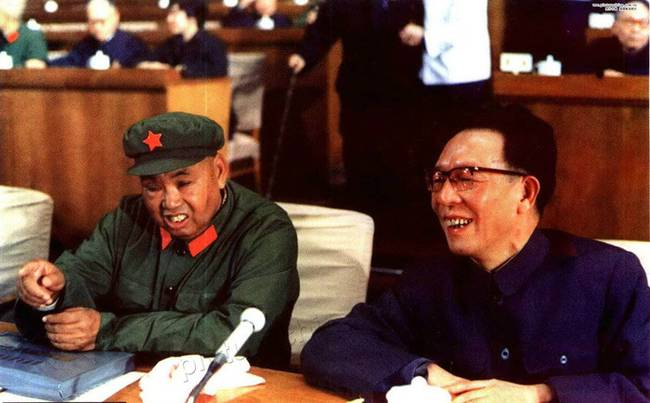

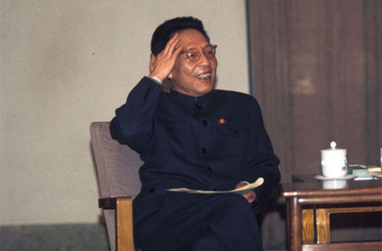

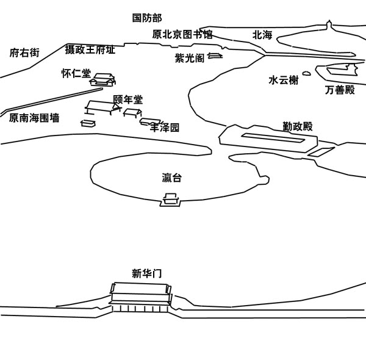