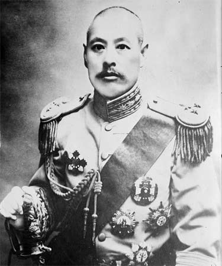
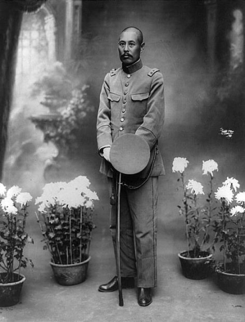
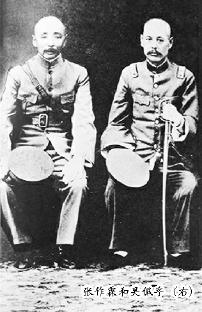
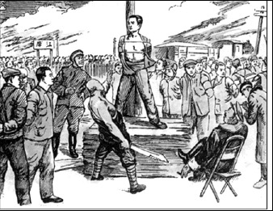
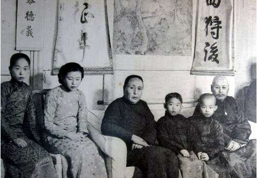
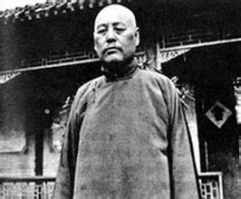
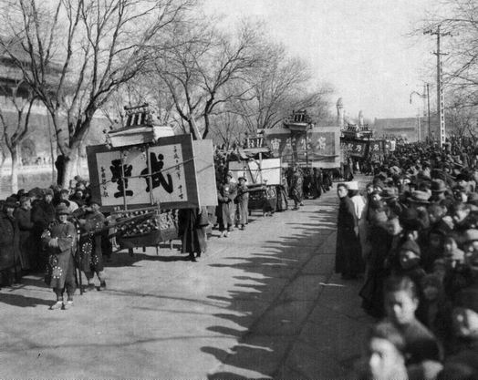
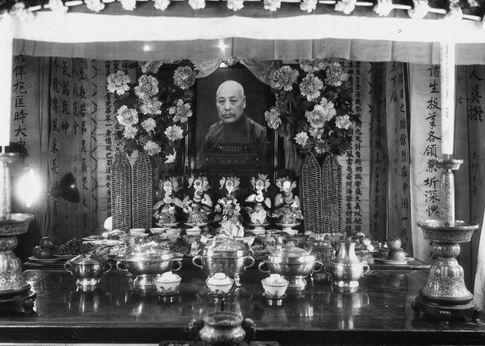
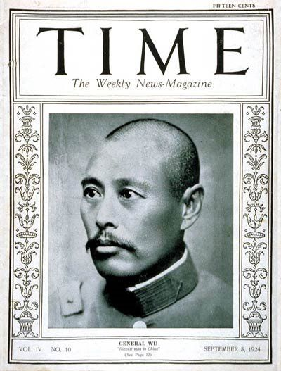

（万象特约作者：雪爪淤泥）

【1874年4月22日】144年前的今天，离家出走的算命先生、没有子嗣的中国第一大丈夫吴佩孚出生

【东成西就秀才当兵，南征北战卦师成帅】

1874年4月22日，吴佩孚出生，山东蓬莱县人，字子玉。小时候读私塾，22岁考中秀才。25岁，因与乡绅吵架，离家出走，到北京，以占卜、卖字写春联为生。不久，走投无路的吴佩孚报名参加了淮军。

1904年，日本和俄国为抢夺东北的控制权而发生战争，吴佩孚被派任日方间谍，化装成肩挑小贩，冒险混入俄军占领的地区刺探情报，立了功，被后来成为北洋军阀头子之一的曹锟看上。1906年，任北洋陆军曹锟部管带，后升任旅长。

1917年7月，任讨逆军西路先锋，参加讨伐张勋复辟；紧接着任第三师代理师长兼前敌总指挥，南下讨伐护法军政府。1919年，五四运动爆发，吴佩孚曾多次通电反对在巴黎和约上签字。他豪迈宣言：军人卫国，责无旁贷，共做后盾，愿效前驱。

1919年12月，冯国璋病死，曹锟、吴佩孚成为直系军阀的首领。1920年，以段祺瑞为首的皖系军阀和直系军阀，在京津地区进行大战。直系联合奉系击败了皖系，段祺瑞下台，直奉两系共同把持北京政府。

1922年4月，第一次直奉战争爆发，吴佩孚率领直军击败奉军，奉军败退到关外。吴佩孚成为北洋军阀的首要人物，操纵政局，黎元洪授予他“孚威上将军”称号。

【镇压大罢工留恶名，打压冯玉祥遭政变】

1923年2月4日，京汉铁路总工会一声令下，全路开始了大罢工。7日，吴佩孚实行了大规模的镇压，史称二·七惨案。京汉路牺牲的“二七”烈士52人，被捕60余人，1000余人被工厂开除，流亡在外。

1924年，第二次直奉战争爆发，吴佩孚任讨逆军总司令，出古北口迎战奉军。10月22日午夜，任“讨逆军”第三军总司令的冯玉祥突然率部返京，发动北京政变，软禁曹锟，驱赶溥仪，邀请孙中山北上。

冯玉祥的北京政变，使直奉战争的形势急转直下，直军军心大乱，迅速溃败。吴佩孚大败，退入鄂豫交界的鸡公山。

1925年10月，孙传芳在江苏发动反奉战争，吴佩孚前往武汉，通电全国，就任讨贼联合军总司令。

1926年下半年，北伐军挥师北上，直抵武汉。吴佩孚的主力在汀泗桥、贺胜桥、武昌等战役中被歼灭。吴佩孚只好率残部投奔四川军阀。

（吴佩孚（右一）全家合影）

【生未忘复旧山河，终不失为大丈夫】

吴佩孚蛰居四川白帝城时，日本军方曾派人向他表示：愿意提供武器弹药被服银元若干，支持吴佩孚东山再起。吴佩孚回敬说：“我过去有枪何止十万，有钱何止百万，我还是失败了，由此可知天下事的成败利钝，绝不在于有多少枪和多少钱啊！我们中国人自己家里的事，应该由中国人自己来管，日本人的好意，我吴佩孚敬谢不敏了。”

1932年1月，吴佩孚到达北平，居东城什锦花园。1932年3月，在日本的策动下，以溥仪为“执政”的“满洲国”在长春成立。吴佩孚立即以个人名义，通电声讨溥仪。

1937年，抗日战争全面爆发后，华北地区沦陷，日军利诱吴佩孚出任北平维持会长。吴佩孚予以拒绝。

他曾为他的军队写了一首《登蓬莱阁歌》：“到而今，倭寇任纵横，风云恶。甲午役，土地削；甲辰役，主权堕，江山如故，夷族错落。何日奉命提锐旅，一战恢复旧山河。”

1939年，吴佩孚吃馄饨时，被肉馅里的骨头刺伤，突患牙疾，高烧不退。12月4日，经日本牙医施行手术后，于当晚暴卒，时年65岁。他一生取了四位妻子，但最终没有子嗣，只有一个过继的嗣子。国民政府追认他为陆军一级上将。

近代史上，很多人有再造中华强国之志，却不合潮流，最终失败，吴佩孚便是其中之一！1924年9月8日（50岁），领兵十万的吴佩孚成为亮相《时代周刊》封面的首位中国人，标题为“GENERAL WU：Biggest man in China”（吴将军：中国第一大丈夫！）。

（本文是万象历史·人物传记写作营的第6篇作品，是营员“雪爪淤泥”的第2篇作品）

