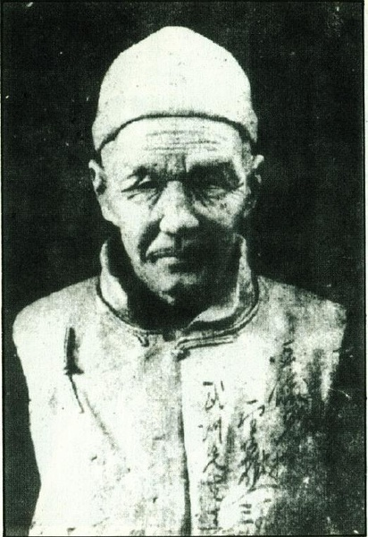
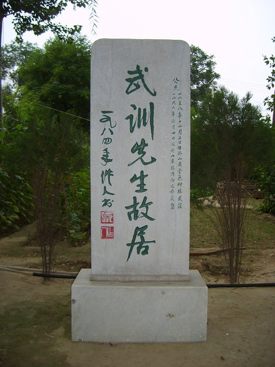
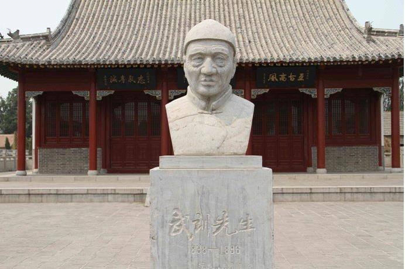
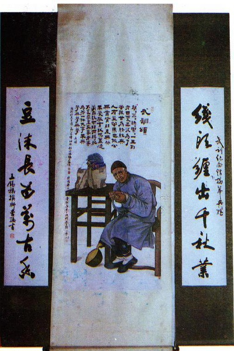
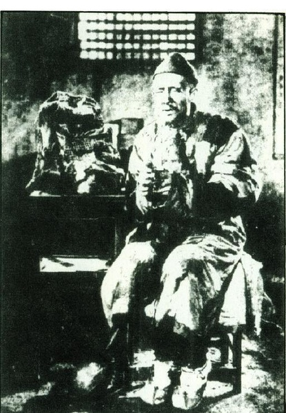
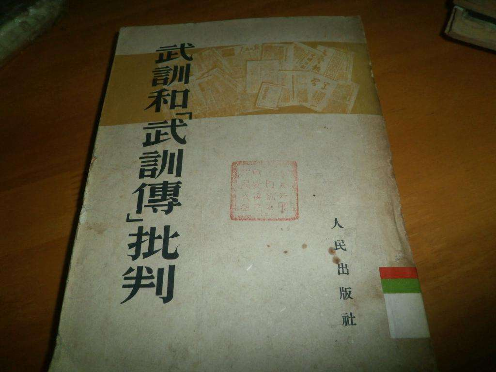
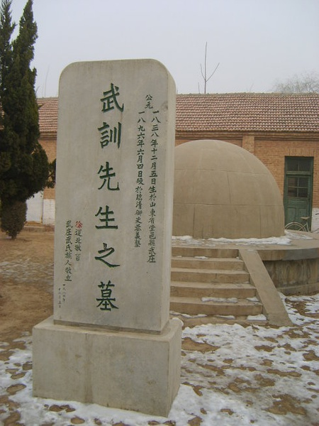

（万象特约作者：东西望）

【1896年4月23日】122年前的今天，赏赐黄马褂的千古奇丐武训逝世，死后被挫骨扬灰

（武训半身塑像）

【没有上过学的穷乞丐】

1838年，武训出生于今山东冠县柳林镇。家境贫苦，排行第七，所以就叫武七。7岁，父亲去世。16岁，母亲送他到馆陶县的远房姨夫家，做长工。两年后，姨夫欺负他没读过书，不会算数，克扣工钱，并将他赶出门去。从此，武训只好以乞讨为生，被亲戚朋友所唾弃。

在之后30多年的乞讨生涯里，武训的足迹遍及山东、河北、河南、江苏等省。为了讨到更多的钱，他设计了一些奇特的造型来吸引目光：他卖掉辫子，剃光右边的头发；后来又剃光左边，在右边又留起一撮头发。他表演“拿大顶”、“蝎子爬”，给人当马骑…………

【一所不要钱的学校】

1888年，50岁的武训积蓄了3800余吊钱，他回到家乡柳林镇，买了230亩田地作为学田，创办了一所不要钱的学校——崇贤义塾。学校建成后，他到当地的进士、举人家里，跪请他们任教；又到贫寒人家，跪求他们送孩子免费上学。

当年，崇贤义塾就招收了50多名学生。学生学费全免，办学经费从他置办的学田中支出。以后每逢开学第一天，武训都要先拜老师，次拜学生，持续了许多年。

【赏穿黄马褂的平民教育家】

1890年（52岁），武训在馆陶县（今临清市）创办了第二所义学——杨二庄义塾。1896年（58岁），武训在馆陶县创建了第三所义学——御史巷义塾（今临清武训实验小学）。

山东巡抚张曜，知道他的义举后，下令免征学田的钱粮和徭役，并捐银200两。取“垂训于世”之意，他替武七改名为武训。他同时奏请光绪帝，颁给他“乐善好施”的匾额，授予“义学正”名号，赏穿黄马褂。从此，武训声名大振。

（武训纪念堂中央挂像）

【不置家产不娶老婆的先驱】

武训一生劳苦，又十分节俭，终于积劳成疾。1896年4月23日，在他建立的御史巷义塾中，他听着孩子朗朗的读书声，睁着眼含笑去世。武训被葬于崇贤义塾东侧，上万名群众送葬，沿途人山人海，师生哭声震天，乡民纷纷落泪。

受武训的影响，民国时期一大批教育家致力于普及教育。陶行知在《武训颂》中写道：“朝朝暮暮，快快乐乐。一生到老，四处奔波。为了苦孩，甘为骆驼。与人有益，牛马也做。公无靠背，朋友无多。未受教育，状元盖过。当众跪求，顽石转舵。不置家产，不娶老婆。为著一件大事来，兴学，兴学，兴学。”

【一部电影引发的悲剧】

1950年，电影《武训传》上映，成为大家热议的焦点。有人认为，武训是“永垂不朽值得学习的榜样”，也有人认为“武训不足为训”。1951年，《人民日报》先后发表毛泽东的两篇文章，批评《武训传》反历史唯物主义，进而引发了全国性的政治大批判。新中国的电影创作，也因此陷入低谷，1951年全国只拍摄了一部电影。

在文化大革命中，武训被扣上“劳动人民的叛徒、大流氓、大债主、大地主”等帽子。1966年夏天，山东冠县红卫兵砸开坟墓，把武训的遗骨抬出游行。之后他的尸骨被红卫兵用锤子砸碎、挫骨扬灰，连同棺木一同烧毁。

直到1989年，武训墓才得以重建，然而只是一座空墓。

（本文是万象历史·人物传记写作营的第7篇作品，是营员“东西望”的第3篇作品）

