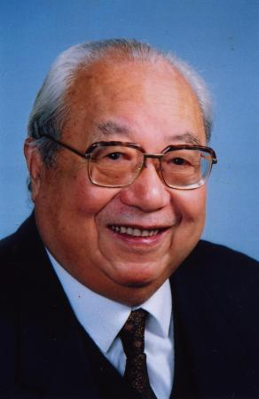
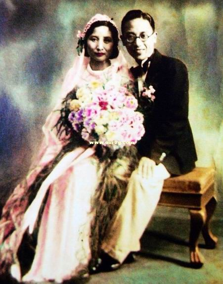
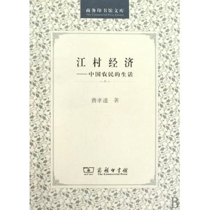
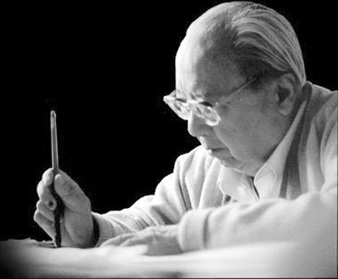
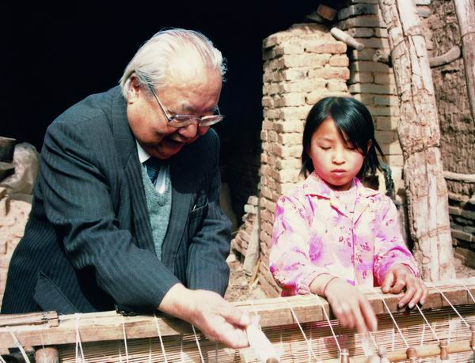
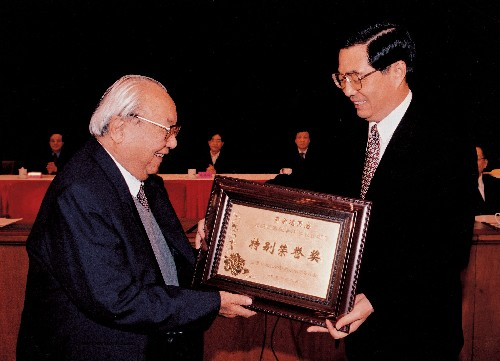

（万象特约作者：南山南）

【2005年4月24日】13年前的今天，帮助中国经济崛起的社会学五大右派之一费孝通逝世

【女校里的男学生】

1910年11月2日，费孝通出生于江苏省吴江县，父亲是公费留学日本的留学生，母亲在开办了吴江的第一所幼儿园。费孝通自幼身体弱，母亲便把他送到朋友开办的振华女校，成为女校中仅有的几名男生。在这里他认识了著名作家杨绛。

1928年（18岁），毕业后进入东吴大学医学预科。两年后，放弃医学，转学到燕京大学，改学社会学。1933年，他进入清华大学社会学系，得到著名社会学家吴文藻（作家冰心的丈夫）的指导。

（1935年，费孝通与王同惠的结婚照）

【获最高奖的博士论文】

1936年，毕业后，取得公费留学资格，前往英国伦敦大学学习。1938年（28岁），完成了博士论文《江村经济》。

这篇论文被誉为“人类学实地调查和理论工作的里程碑”。论文所研究的位于苏州吴江的、以桑蚕为生的“开弦弓村”，从此成为研究中国农村的首选之地。费孝通也因此在1981年获得了英国皇家人类学会授予的人类学界的最高奖：赫胥黎奖。费孝通被誉为中国社会学和人类学奠基人之一。 

【回到抗战中的中国】

1938年夏（28岁），费孝通返回正值抗战的中国，在云南大学开办社会学系，继续对中国社区进行系统调查。1944年，在号称“清华四哲人”之一的潘光旦的介绍下，加入中国民主同盟，参与到民主爱国运动中。

1945年起，费孝通进入清华大学社会学系任教。1950年起，在贵州和广西地区，进行民族识别工作。在十多年的工作中，费孝通学术成就显著，先后出版了《乡土中国》、《生育制度》、《美国人的性格》等重要专著。

【被迫害的五大右派之一】

1957年3月24日（47岁），他在《人民日报》上发表了《知识分子的早春天气》一文，引发争议，被划为右派。两年后，摘掉“右派”的帽子，参与中印、中阿、中巴划界工作。

1966年，文化大革命爆发，费孝通再次首当其冲。他曾说过“失去知识分子就等于失去民心”，因此遭到严重迫害。他与吴泽霖、潘光旦、黄现璠、吴文藻，被称为民族学界、社会学界的五大右派。

1967年（57岁），当恩师潘光旦去世时，他抱着潘光旦，感叹道：“日夕旁伺，无力拯援，凄风惨雨，徒呼奈何！”1969年，他被下放到沙洋干校劳动改造。1972年，回到中央民族学院。

（1957年5月，费孝通（右）在开弦弓村）

【中国崛起的推手】

1979年（69岁），社会科学院院长胡乔木，要求费孝通到大学里重建社会学。他访问了国外10所重点大学，成立了社会学研究会，被选为会长。1980年，中国社会科学院成立社会学研究所，古稀之年的费孝通当选为所长。

费孝通一生，九访江村、八访甘肃，走遍了全国各地，提出了苏南模式、温州模式的发展方式，提出了中国农村工农一体发展的草根经济模式，为中国改革开放的崛起做出了重大贡献。

2005年4月24日，费孝通去世，享年95岁，在国家蒸蒸日上之际，走完了自己的一生。

（胡锦涛给费孝通颁奖）

 （本文是万象历史·人物传记写作营的第8篇作品，是营员“南山南”的第1篇作品）

