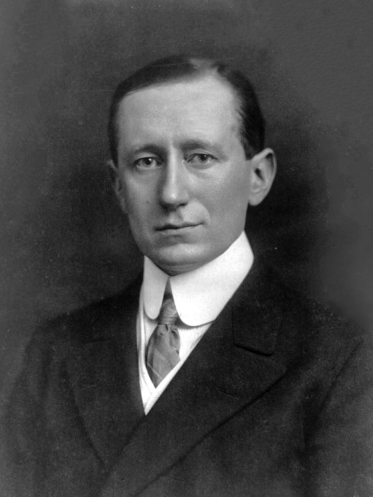
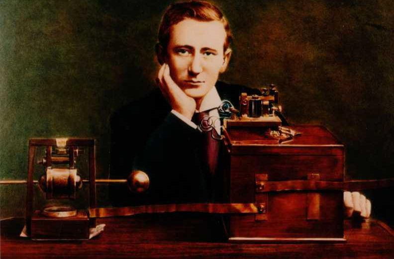
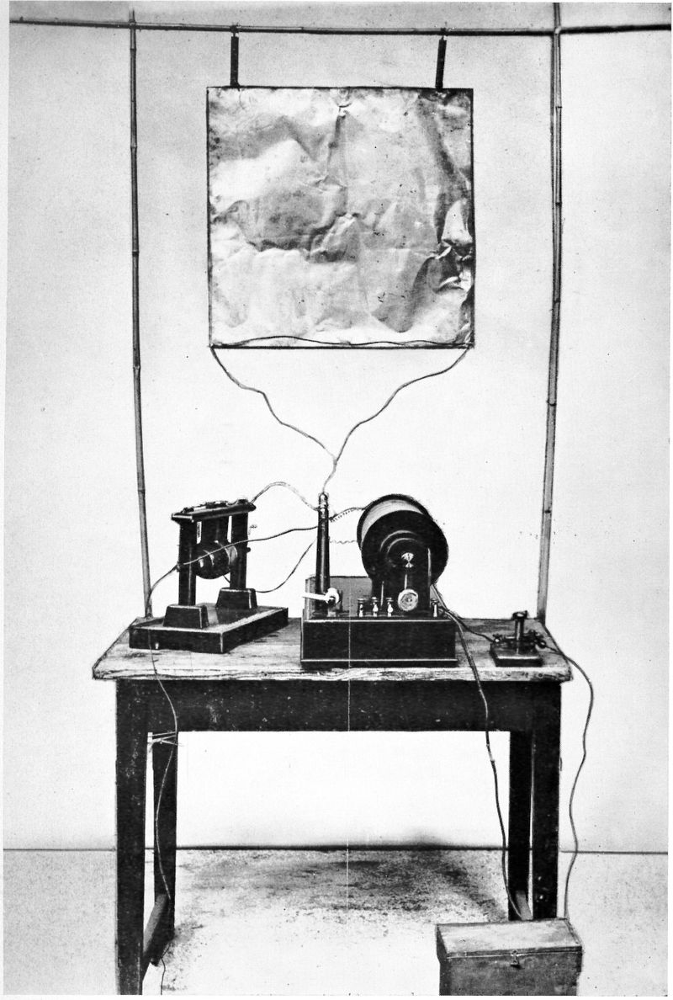
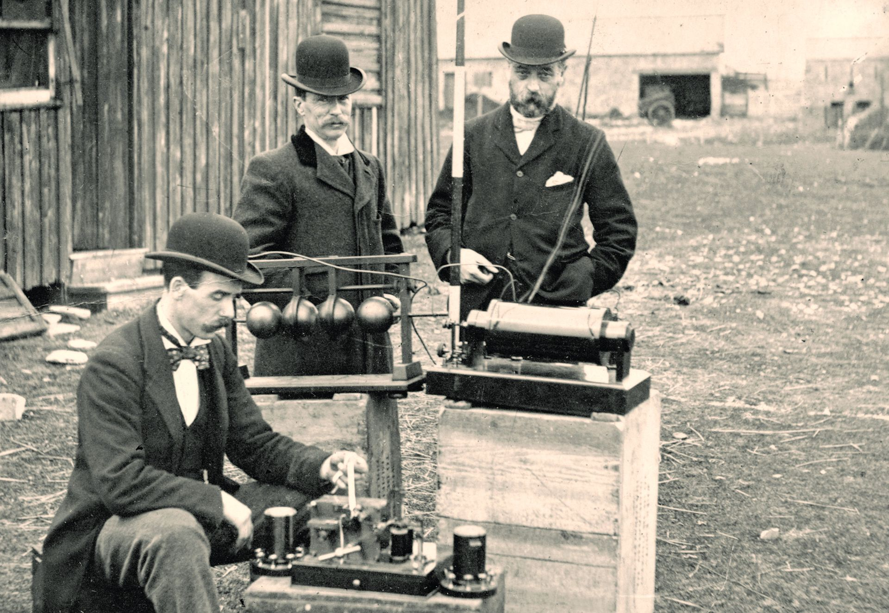
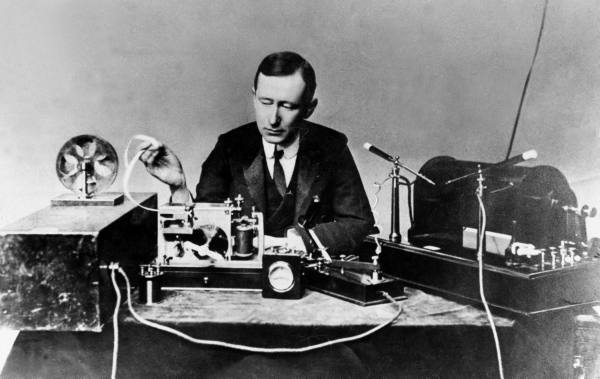
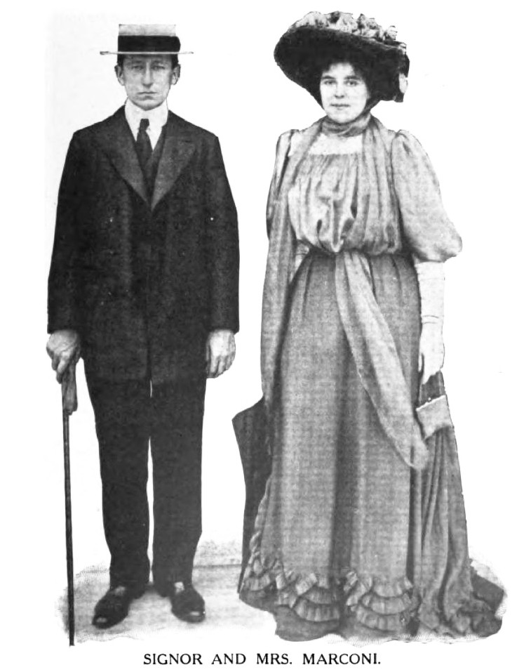
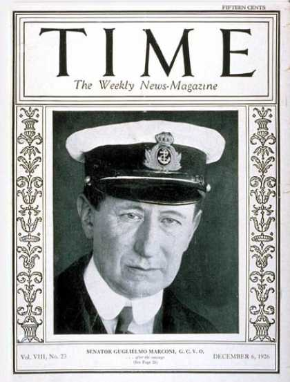
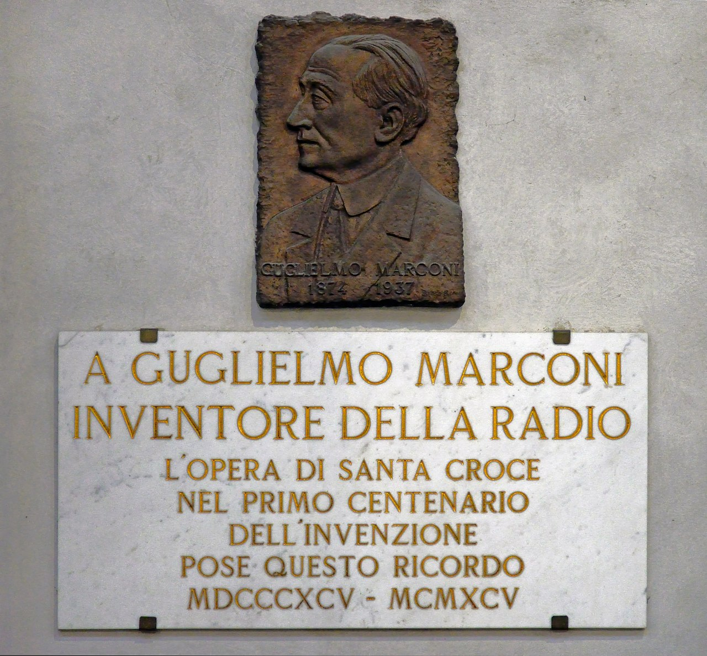

（万象特约作者：蓦然回首）

【1874年4月25日】144年前的今天，发明无线电“黑”科技的马可尼诞生

1837年，人类发明了电报。30年后的1876年，又发明了电话。信息传播的速度，从飞奔的快马，一下跃升到了光速。世界似乎突然间就变小了。但在当时，有点麻烦的是，必须要在两个地方架设电线，才能实现通讯。几十年后，一种不需要电线的无线电通讯技术发明出来了。这种毫无限制的“黑”科技，简直亮瞎了大家的眼睛。到底是谁搞出了这样的发明呢？

他就是马可尼！

1874年4月25日，马可尼出生于意大利博洛尼亚市的一个富裕的农庄主家庭。1894年，20岁的马可尼从电气杂志上，读到德国物理学家赫兹的实验：他在几米外测出了电磁波！马可尼心想，只要有足够灵敏的检波器，就可以在更远的地方测出电磁波。

从小就喜欢摆弄线圈、电铃的马可尼，便一头钻进了电磁波的研究中。经过多次的失败，他终于迈出了可喜的第一步。他在家中的楼上安装了发射电波的装置，楼下放置了检波器，检波器与电铃相接。他在楼上一接通电源，楼下的电铃就响了起来。

（马可尼的第一台发射机）

他父亲看到这个可以遥控的“神奇”装置时，简直惊呆了。他再也不叫他“不切实际的空想家”，而开始给儿子经济资助，让他一心搞实验。马可尼信心大增，他收集大量资料，耐心阅读，仔细分析，想尽办法改进自己的机器。

（位于瑞士的“马可尼石”曾是1895年实验无线电波的现场）

第二年秋天，他把一只煤油桶展开，变成一块大铁板，作为发射的天线；把接收机的天线高挂在一棵大树上，增加接收的范围；又改进检波器，把玻璃管中的空气排除，加入少量的银粉，大大增强灵敏度。

他把发射机放在一座山岗的一侧，接收机安放在山岗另一侧的家中。当助手按下电钮，2.7公里外的接收机收到信号，带动电铃发出了清脆的响声。对马可尼而言，这响声就像是悦耳动听的交响乐。

（1897年5月13日，英国邮政工程师在检查马可尼的无线电设备）

1896年（22岁），他在英国成功演示了他“神奇”的无线电装置。受到鼓舞，马可尼立即成立了一个公司，推广他的产品。

1899年（25岁），他发送的无线电信号穿过了英吉利海峡。1901年，他发射的无线电，从英格兰传到加拿大的纽芬兰省，成功地穿越大西洋。

（1901年，马可尼演示无线电设备）

1909年（35岁），在一场灾难事故中，无线电的价值得到戏剧化的体现。这年，共和国号汽船由于碰撞，遭到毁坏而沉入海底。在无线电的帮助下，仅6人遇难，其他人都得以救出。马可尼的声名，从而享誉全球。同年，马可尼获得诺贝尔奖物理学奖。

1910年，他发射的无线电信号成功穿越六千英里，从爱尔兰传到阿根廷。

（1910年，马可尼和妻子的合影）

这时，世界顶尖的科学家为无线电的专利，展开了激烈的竞赛，马可尼也卷入其中。一场专利大战展开。1915年（41岁），马可尼同美国科学家特斯拉对簿公堂，最终大获全胜。从此，用于商业的无线电广播开始普及，成为人们生活不可或缺的一部分。

（1926年，《时代周刊》封面上的马可尼）

1937年7月20日，马可尼与世长辞，享年63岁。意大利罗马近万人为他送葬，同时，英国所有无线电报、无线电话、广播电台停止工作2分钟，向这位无线电领域的伟大人物致哀。

当你此时此刻，拿起手机、打开电视、收听广播，你可知道，那便是马可尼留给世界的奇迹！

（意大利佛罗伦萨圣十字教堂的纪念匾）

 （本文是万象历史·人物传记写作营的第9篇作品，营员“蓦然回首”的第1篇作品）