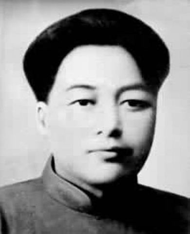
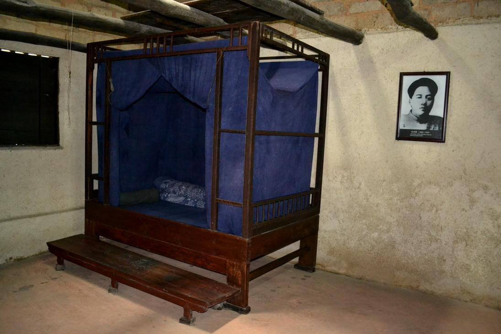
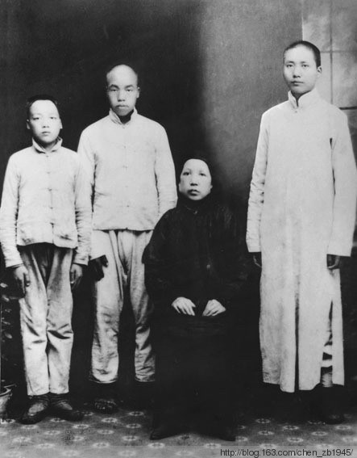
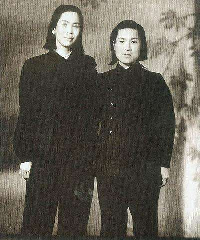
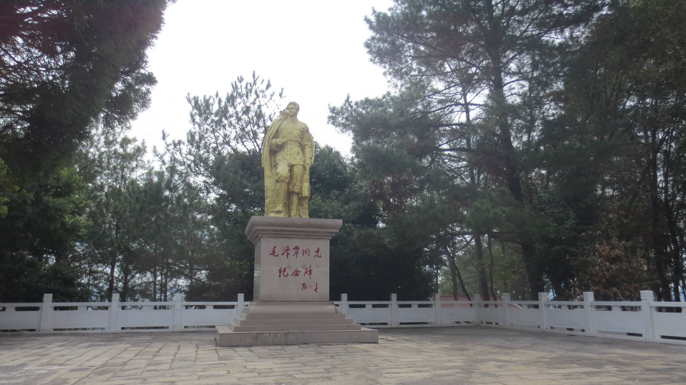
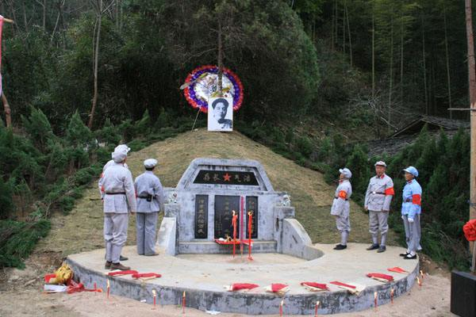

（万象特约作者：隔壁老孙）

【1935年4月25日】83年前的今天，娶一对姐妹的革命兄弟，毛泽东的弟弟毛泽覃牺牲

毛泽覃！听到这个名字，大家马上就会联想到另一个人，新中国最伟大的领路人：毛泽东！没错，他是毛泽东最小的弟弟。

毛泽覃出生于1905年9月25日，字润菊，湖南湘潭韶山冲人。8岁进私塾读书，13岁他离开韶山，来到长沙投靠了大哥毛泽东。他先后进入长沙一师附小、协均中学学习，成绩名列前茅。毛泽东非常喜爱这个既聪明，又有胆量的弟弟，毛泽覃也深受大哥影响。

（韶山毛泽东故居中的毛泽覃卧室）

（1919年，毛泽东、毛泽民、毛泽覃和母亲合影）

【跟着大哥闹革命】

1922年，任中共湖南区委书记的毛泽东，派17岁的毛泽覃去衡阳水口山铅锌矿区从事工人运动。毛泽覃担任工人俱乐部教育委员，领导工人罢工，取得了胜利！第二年，他加入了中国共产党，成为一支不可或缺的重要力量。

1927年（22岁），毛泽覃参加了南昌起义，任起义军第11军25师政治部宣传科科长。之后，他随工农革命军转战江西，在桥林乡建立起宁冈县第一个农村党支部，并亲自担任党支部书记。他打响了土地改革的第一枪，成为井冈山根据地的一面红旗。

,岳母周陈轩合影.jpeg)

（毛泽覃与前妻周文楠、岳母的合影）

【一对兄弟姐妹的姻缘】

1929年，红军进击赣南，毛泽覃腿部受了重伤。毛泽东安排妻子贺子珍的妹妹贺怡，负责照顾不能随军行动的毛泽覃。两人从此坠入爱河，1931年7月20日，经党组织批准，结为夫妻。一对兄弟和一对姐妹的姻缘，是中国革命史上的一段传奇。

1932年1月，苏区中央召开“宁都会议”，对毛泽东实行的战略战术进行批评，并逼毛泽东交出军权。紧接着，毛泽覃被撤销职务，妻子贺怡也变成了“反动”分子家属！毛泽东对贺子珍说道：“项庄舞剑 ，意在沛公！谁让他是我毛泽东的亲人呢！”

（贺子珍与妹妹贺怡在一起）

【此地一别，便是永别】

1934年8月（29岁），第五次反围剿失败，红军主力突围长征。时任红军独立师师长的毛泽覃，留守根据地，转战闽赣边境。这时，贺怡怀有身孕，北去赣州从事地下工作。毛泽覃把贺怡与其父母护送到码头，没想到此地一别，便是永别！

1935年4月25日，毛泽覃率领的独立师被打散。黄昏时，大家退到瑞金县一个叫黄田坑的村子。第二天凌晨，敌人包围了村子，毛泽覃掩护队员们往后山撤，因寡不敌众，被敌人乱枪打死。毛泽覃牺牲了！牺牲时，他只有30岁！毛泽覃牺牲后，敌人按惯例将其尸体抬到瑞金县拍照，邀功请赏！

（邓小平题字的毛泽覃纪念碑）

【革命夫妻的天堂重逢】

1935年10月，中央红军到达陕北的第七天，二哥毛泽民从电台中听说了毛泽覃牺牲的消息！他急忙赶往大哥毛泽东住处。毛泽东听说此事后，沉默了许久，没有说话！

后来，毛泽东和周恩来，朱德等人回忆红军反围剿时，曾说：“三弟天性机灵，淘气，胆子大，脾气暴躁，天王老子都不怕，老虎屁股摸不得！他是个坚定的共产主义战士！”

1949年11月，贺怡乘坐一辆吉普车到赣南，寻找毛泽东、贺子珍长征前留下的孩子小毛。最终却没能找到。11月21日，贺怡乘车从赣南返回吉安，途中发生车祸，贺怡当场身亡，年仅38岁。这对年轻的革命夫妻，在天堂重逢……

（毛泽覃墓）

（本文是万象历史·人物传记写作营的第9篇作品，是营员“隔壁老孙”的第2篇作品）

