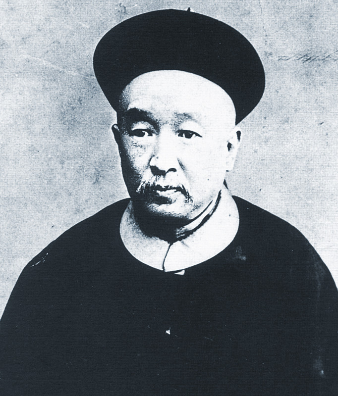
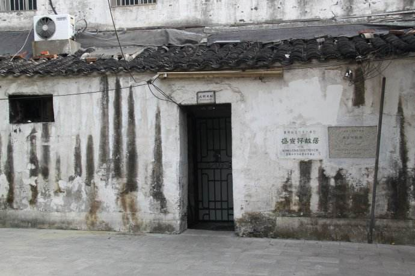
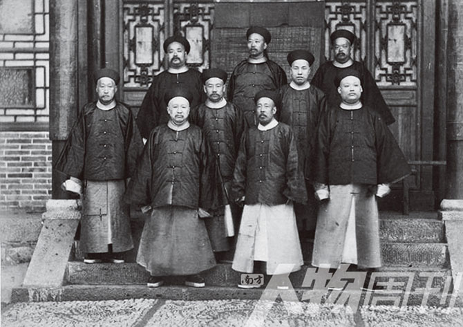
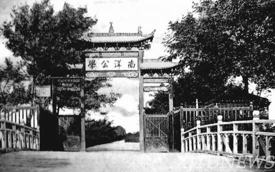
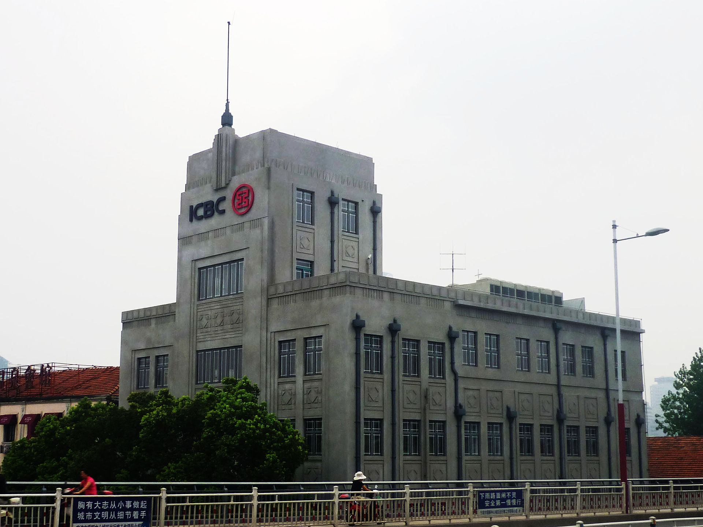
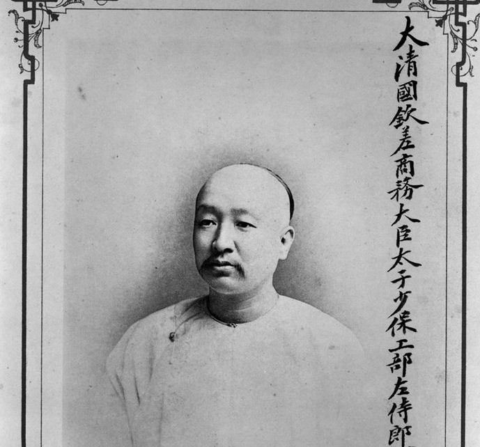
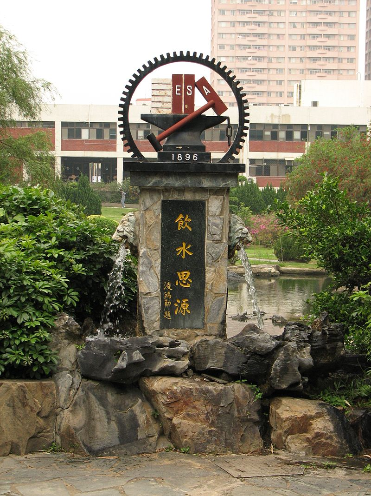
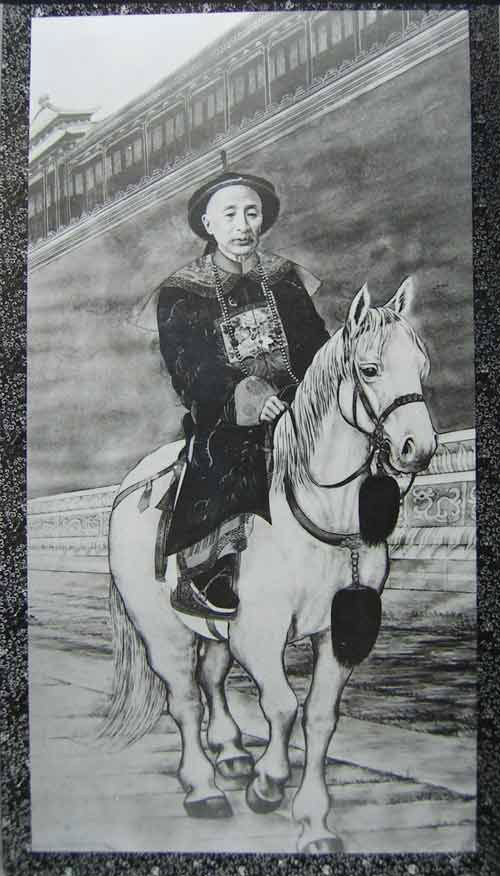
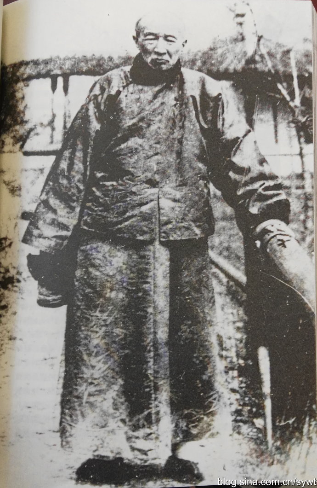
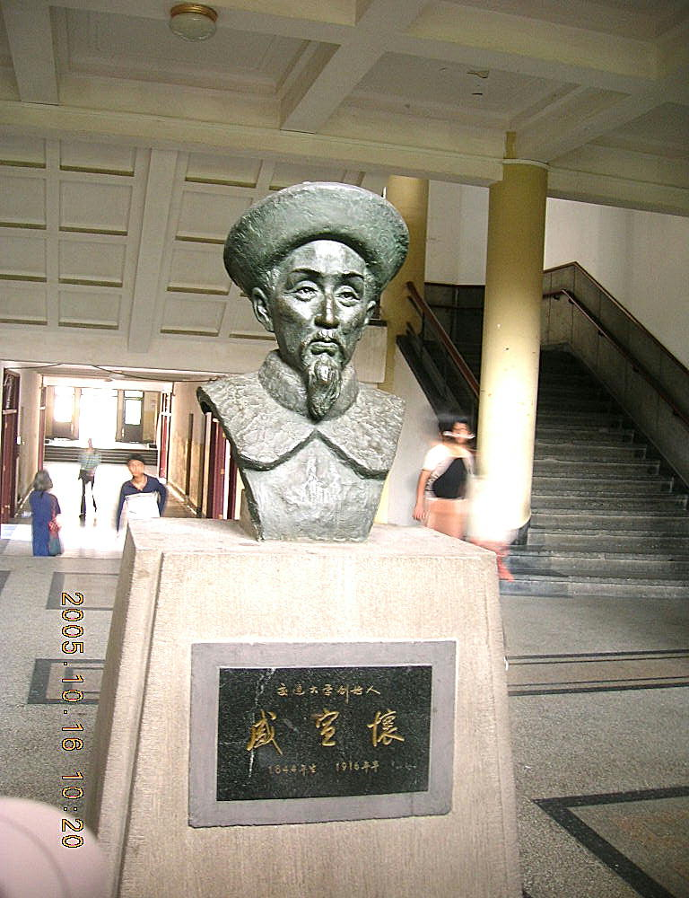

（一一的第3篇）0427盛宣怀

【1916年4月27日】102年前今天，开创中国11个第一的洋务运动核心人物盛宣怀去世

【轮船航运的中国第一人】

1844年11月4日，盛宣怀出生于江苏常州。父亲是清朝官员，与李鸿章有交情。1870年（26岁），被李鸿章招为幕僚，不久升任知府。

1872年（28岁），盛宣怀奉命办理中国第一家轮船航运企业——轮船招商局。第二年，轮船招商局正式营业，盛宣怀担任会办。在他的经营下，招商局船只林立，与怡和、太古等外国企业，在长江上并驾齐驱，蔚为壮观。盛宣怀也从此成为清末洋务运动的核心人物。

【电报通讯的第一人】

1881年，盛宣怀被任命为津沪电报陆线的总办，从此中国进入了电讯业时代。他相继建立了上海至广州、宁波、福州、厦门等地的电报线，阻止了外国企业对电报网的垄断。

电报网的建立，对清朝起到了重要作用。1882年，朝鲜发生兵变，清朝快速反应，阻止了日本控制朝鲜，电报起到了关键作用。后来的中法战争，清朝能与号称“世界第二”的法国较量，不相上下，电报功不可没。

【高等教育的第一人】

1895年，盛宣怀通过直隶总督奏请建立新式学堂，得到光绪帝的批准，定名为北洋大学堂。这是中国近代史上最早的官办大学，也就是今天天津大学的前身。

第二年，盛宣怀在上海创办了南洋公学，任督办。该校对中国影响巨大，知名学生有：蔡锷、蔡元培、黄炎培、李叔同、邵力子、邹韬奋、茅以升等等。

民国时期称为国立交通大学。1958年，战败逃到台湾的国民党政府，在新竹复校，建立国立交通大学。1959年，新中国在学校原址，重组建立上海交通大学，部分迁往西安，成为西安交通大学。“饮水思源”正是这几所学校的精神象征。

【铁路银行的第一人】

1892年，盛宣怀在上海督办纺织业，开办华盛纺织总厂。1896年，盛宣怀负责督办铁路，修建了第一条铁路干线京汉铁路。

他先后接办湖北汉阳铁厂、萍乡煤矿；12年后，他将汉阳铁厂、大冶铁矿和萍乡煤矿合并，成立中国第一家钢铁煤联合企业——汉冶萍煤铁厂矿公司。

1897年，盛宣怀在上海成立中国第一家银行——中国通商银行。随后，在北京、天津、汉口、广州等地开办分行。这是中国金融业迈向现代化的标志。

【开启地方军阀的联络人】

1900年，打着“扶清灭洋”口号的义和团运动兴起，北方一片混乱。在盛宣怀的联络下，长江流域的督抚们与列强签定了《东南互保条约》。从此，南方各省成为地方军阀，脱离中央，是军阀时代的开始！盛宣怀起了举足轻重的作用。

由于盛宣怀所管理的电报、矿业、海关、铁路等，是清廷的主要收入来源。清朝政府对他无可奈何，反而褒奖他保护了长江流域的和平，加封他为太子太保。

【红十字会的中国第一人】

1905年，他将铁路大权让给唐绍仪，这也就是北洋政府初期权力巨大的交通系的开始。

早在1904年，茶商沈敦和在上海租界，创立了民间组织上海万国红十字会。在日俄战争中，救援了几十万人。1910年，盛宣怀将其改名为大清红十字会，转型为官办组织，担任会长。这就是中国红十字会的前身。

【辛亥革命的导火索】

1911年，盛宣怀任邮传部大臣，他建议将各省自建的铁路、邮政，收归中央，遭到各地反对。四川、广东、湖南和湖北等地，发生了保路运动。盛宣怀命令镇压。

1911年10月10日，计划派往四川镇压保路运动的新军，发动了武昌起义，辛亥革命爆发。盛宣怀被清政府革职，永不再用，随后逃亡日本。

【“中国第一”盛大的葬礼】

1912年秋，在袁世凯的支持下，盛宣怀回到上海，继续主持轮船招商局和汉冶萍公司。二次革命时，他支持袁世凯，帮助他获胜。袁世凯也投桃报李，发还了盛宣怀被没收的财产。

1916年4月27日，盛宣怀病逝上海。他的葬礼极其盛大，耗资30万两白银，送葬队伍从斜桥弄（吴江路）一直排到了外滩。

盛宣怀创造了11项“中国第一”：第一个民营股份制企业轮船招商局；第一个内河小火轮公司；第一个电报局中国电报总局；第一所近代大学北洋大学堂；第一所高等师范学堂南洋公学；第一条铁路干线京汉铁路；第一个钢铁联合企业汉冶萍公司；第一家银行中国通商银行；第一个勘矿公司；第一座公共图书馆；还创办了中国红十字会。

他被誉为“中国实业之父”、“中国商父”、“中国高等教育之父”。

（本文是万象历史·人物传记写作营的第10篇作品，是营员“一一”的第3篇作品）

