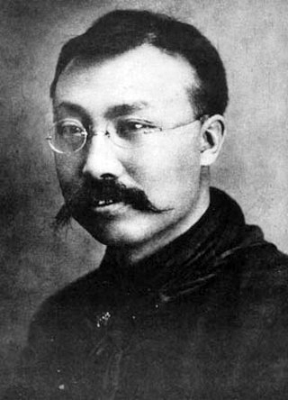
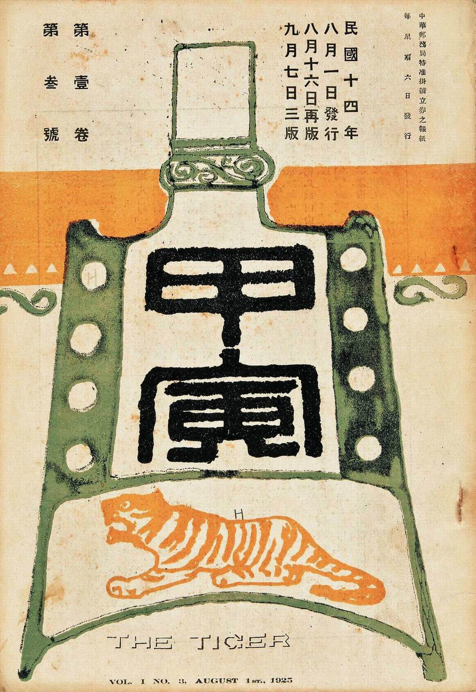
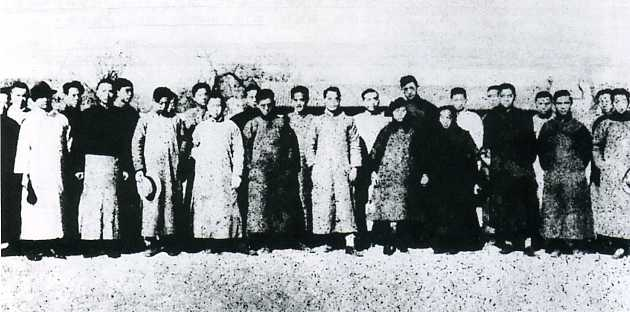

（万象特约作者：东西望）

【1927年4月28日】91年前的今天，给中国带来马克思主义、促成国共合作的李大钊被绞死

【1927年4月28日】91年前的今天，支持苏联，国共合作、抗议八国通牒的李大钊被绞死

【起义的中国社会党】

1889年10月29日，李大钊出生于河北乐亭。1907年（18岁），进入天津北洋法政专门学校学习。在校期间，加入中国社会党，任天津支部干事。

中国社会党是1911年11月由江亢虎在上海创立的中国早期马克思主义政党，是中国的第一个社会党，也是第一个以“党”命名的政治团体。号称党员人数52万，知名成员包括顾颉刚、叶圣陶等人。

1913年（24岁），李大钊从学校毕业，到北平活动。这时，宋教仁在上海遇刺，社会党总干事陈翼龙，决心配合孙中山反袁，准备在京、津发动起义。8月，起义失败，陈翼龙被杀，袁世凯政府通电全国，取缔中国社会党。

【反袁世凯的流亡人士】

李大钊仓皇逃离北平，回到家乡，躲在祥云岛上避难。不久得到资助，奔赴日本，入读早稻田大学政治科。在日本，他组织神州学会，继续反袁世凯。

1915年5月9日，北洋政府宣布接受日方《二十一条》的部分要求。消息传出，举国震怒。北京20万人到中央公园（今北京中山公园）集会，表示反对。

李大钊以留日学生总会名义，发出《警告全国父老》通电，号召国人以“破釜沉舟之决心”誓死反抗。随后，袁世凯下令以每年5月9日为国耻纪念日。第二年，袁世凯称帝，登基83天后退位，不久死去。

【传播马克思主义的先驱】

1916年，李大钊回国，先后在《晨钟报》、《甲寅日刊》担任编辑，推动新文化运动的发展。1918年，他在北京大学任图书馆主任兼经济学教授。

十月革命一声炮响，俄国社会主义革命的胜利，极大地鼓舞了李大钊。他以《新青年》和《每周评论》为阵地，相继发表了《法俄革命之比较观》、《庶民的胜利》、《布尔什维主义的胜利》、《我的马克思主义观》、《再论问题与主义》等著名文章，成为中国最早传播马克思主义的先驱。

【一南一北的遥相呼应】

1920年初，李大钊与陈独秀相约，分别在北京和上海活动，筹建中国共产党。3月，李大钊在北京大学组织中国第一个马克思学说研究会，成员包括邓中夏、张国焘等人。李大钊多次会见共产国际代表，商讨筹建中国共产党。他领导建立了社会主义青年团、共产主义小组，与在上海的陈独秀遥相呼应。

1921年7月，中国共产党第一次全国代表大会在上海召开，宣告中国共产党成立。李大钊没有参加这次会议，北京派出的代表是张国焘。李大钊负责党在北方的全面工作，在党的三大和四大上，当选为中央委员。

（1921年11月，北京马克思学说研究会成员合影）

【支持苏联的国共合作】

这段时间，李大钊多次与孙中山会谈，达成国共合作。1924年1月，李大钊作为大会主席团五位成员之一，出席了国民党第一次全国代表大会。他个人身份加入国民党，当选为国民党中央执委。他在大会上发言：“本人原为苏联党员、第三国际共产党员……”

李大钊直接担负国共两党在北方的实际领导工作，他公开向北洋政府请愿，要求正式承认苏联政府，并且支持苏军驻兵外蒙古。1925年1月，发动北京政变后的冯玉祥率军入驻张家口，与李大钊相识。

（孙中山和李大钊）

【反对八国通谍的惨案】

1925年5月30日，由国民党策划领导的第一个重大群众运动——五卅运动在上海爆发。李大钊与赵世炎等人在北平组织5万余人示威支援。北洋政府以李大钊“假借共产学说，啸聚群众，屡肇事端”，下令通缉。李大钊只好逃入东交民巷的苏联兵营避难。

1926年3月，冯玉祥国民军与奉军作战期间，两艘日本军舰护卫奉系军舰进入大沽口，与国民军发生冲突。日、英、美等八国，依据《辛丑条约》“海口不得设防”，发布“最后通牒”，并且军舰云集大沽口，武力威胁北洋政府。

李大钊发动近万名群众学生，在天安门前集合，召开“国民大会”，反抗“八国通谍”。这是国共两党共同发起的一次大规模学生运动。结果遭到北洋政府的武力镇压，称为三·一八惨案，死者包括大家熟知的刘和珍君。李大钊也负了伤，被迫转移到苏联大使馆。

（在天安门前举行的反对八国最后通牒的国民大会）

【里通外国罪名下的绞刑】

不久，奉军击败国民军，段祺瑞下台，张作霖成为北洋政府最后一任统治者。1927年4月6日，在西方驻华公使团的授权下，张作霖派军警突袭搜查苏联大使馆，逮捕了李大钊全家。

张作霖给前方将领如张学良、张宗昌、孙传芳等六位发电征询意见，除阎锡山没有回复，其余将领都主张立即正法。刚刚在上海发动四一二政变的蒋介石，发来密电，建议“速行处决，以免后患。”

1927年4月28日，李大钊等20名国民党和共产党人员，被以“和苏俄里通外国”为罪名绞刑处决，时年38岁。

【死固无恨，生者何堪】

由于家属缺钱，李大钊被处决后，灵柩多年停放在宣武门外的一个庙宇内。直到1933年，北京大学为其葬礼举行捐款，汪精卫一人就捐了1000元。葬礼这才得以举行，安葬于香山万安公墓。

在北平地下党组织的安排下，李大钊的出殡成了一场声势浩大的政治示威。送葬队伍的最前面是一副巨大挽联，上联是“为革命而奋斗，为革命而牺牲，死固无恨”，下联是“在压迫下生活，在压迫下呻吟，生者何堪”，横批是“李大钊先烈精神不死”。

1983年，万安公墓中辟出了李大钊烈士陵园，以供中国共产党党员宣誓和游人瞻仰。

