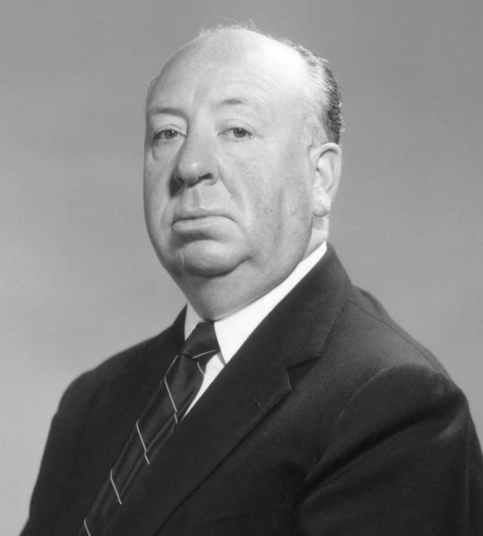
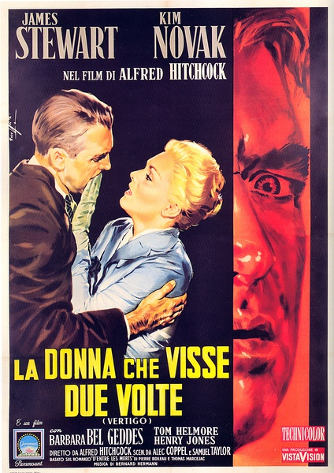
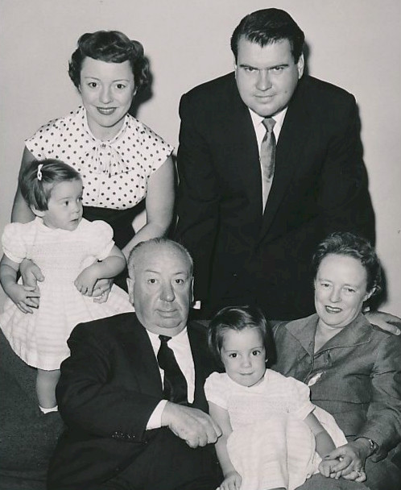
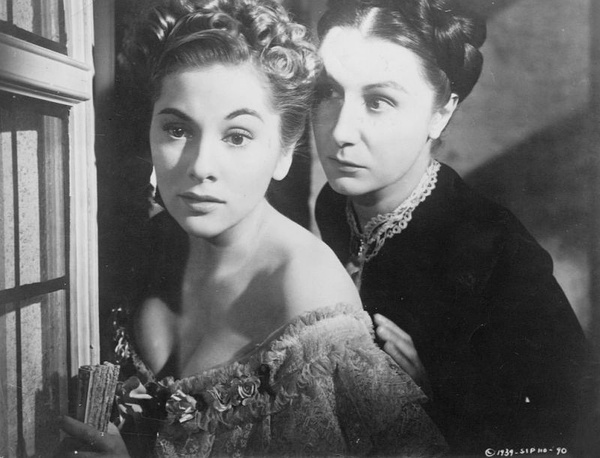
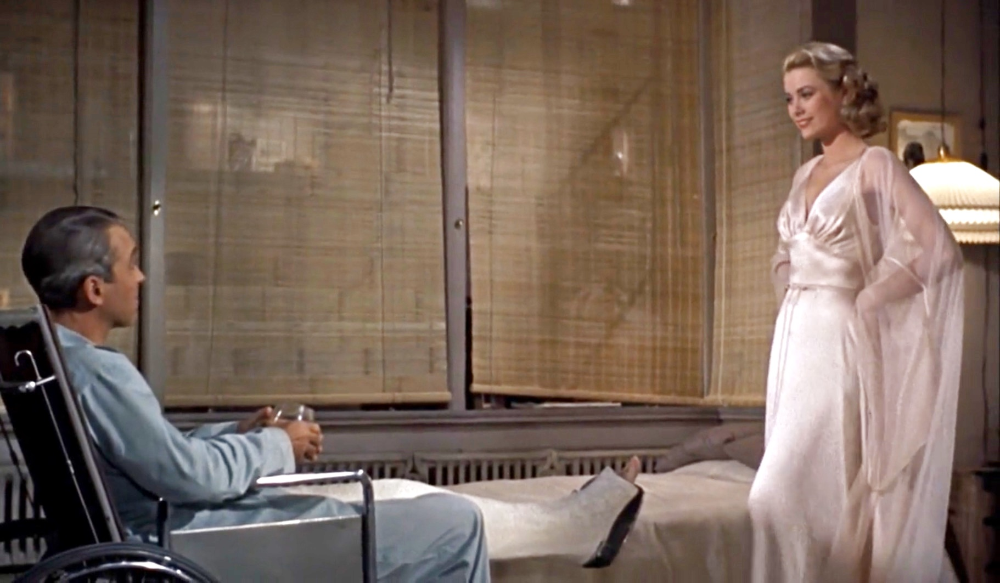
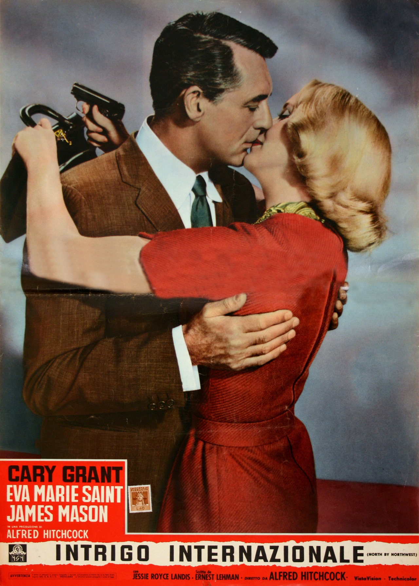
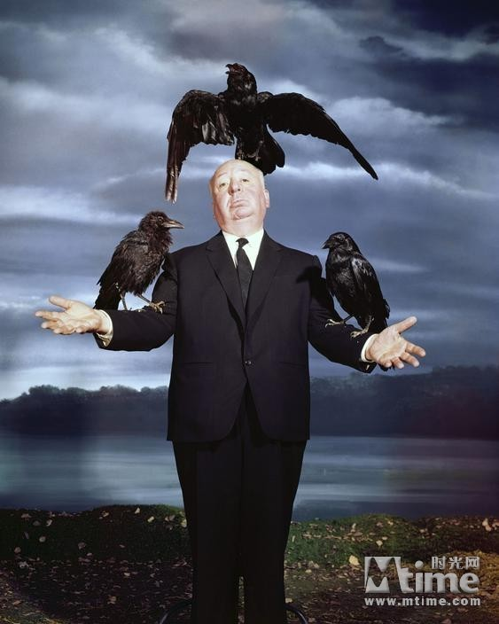

（万象特约作者：雪爪淤泥）

【1980年4月29日】38年前的今天，电影史上最伟大的惊悚悬疑大师希区柯克逝世

2007年，英国权威电影杂志《Total Film》选出了“史上百位伟大导演”，排名第一的导演名叫希区柯克。他一生导演了59部电影，300多部电视系列剧，每一部都充满诡异、紧张的气氛，令人窒息。

（最伟大的悬疑电影《迷魂记》海报）

【恐惧：童年生活的阴影】

1899年8月13日，希区柯克生于英国伦敦。年幼时因为调皮，爸爸让他给警察局长送去一封信，警察局长看了那封信后，就把他关进了拘留所。从此他对警察产生了终身恐惧症。童年的心理阴影，是他偏好焦虑、窥探、恐惧、原罪、错位等“希区柯克主题”的重要原因。

1920年，他以字幕设计员的身份进入电影界。第二年，在一次拍摄中，希区柯克和电影剪辑师艾尔玛，两人乘船穿越海峡时，碰上了暴风雨。艾尔玛吓坏了，蜷缩在船里，一动也不敢动。在极度恐惧的场景下，希区柯克抓住机会，向她求婚，取得了成功。

（希区柯克的一家人）

【悬疑：炸弹怎么还没有爆炸？】

希区柯克说：“我终身都对悬念作品有着浓厚的兴趣，这是一种特殊的虔诚和痴迷。”

1929年，他拍摄了英国首部有声电影《讹诈》。1935年，《三十九级台阶》为间谍惊悚片的奠定了基础，紧张的剧情、快节奏的剪接、扣人心弦的悬念，不断推进着剧情，“快走！下一个就是你”！

1939年，希区柯克移居到美国洛杉矶，执导了他在好莱坞的首部电影《蝴蝶梦》。庄园的女主人公一开始便已死去，却处处音容宛在，似乎通过她的奴仆、情夫继续控制着庄园，直至影片最后将庄园烧毁。

（《蝴蝶梦》剧照）

1945年，《电话谋杀案》是一部家庭惊悚片。丈夫怀疑妻子不忠，而心生杀机。当妻子快被勒死时，丈夫故意在电话另一边，收听她最后的残喘之声，谁知妻子挣开绳索，“以其人之道，还治其人之身”。

1960年，《惊魂记》标志着心理惊悚片成为恐怖电影。整部电影，没有一个尖刀入肉的场景，却极其紧张恐怖中。一个有强烈的恋母情节的精神病患者，偷窥女房客，用母亲的身份杀死每一位对自己有威胁的人。他整个心灵被母亲占据，令人胆寒地沉迷、胜利地微笑！

（《惊魂记》海报）

【道德：也许并不道德】

1946年，在《美人计》中，希区柯克将长达三分钟的吻戏拆分为15次，以蔑视当时电影审查部门对影片“接吻不能超过三秒”的限制。

1954年，在《后窗》中，主人公的眼睛成为观众的眼睛：露台上晒日光浴的夫妇、穿着裸露的女舞蹈家、寂寞的单身女人和音乐家、每天争吵的推销员夫妇……主人公窥视着邻居们，观众窥视着主人公的“窥视”，似乎人人都有“偷窥”的癖好。当主人公揭露邻居杀妻事件，一个不道德的偷窥者变成了英雄。

（《后窗》剧照）

1958年，在《迷魂记》中，男主角对一个女人的欲望，并不是想脱光她的衣服，而是为她穿上衣服，为她染金头发，给她打起发髻，让她成为另一个人…………该电影被评选为百年来最伟大的悬疑电影。

1959年，《西北偏北》是一部关于弄错身份的经典影片。一名有点幽默感的广告商，被错认为间谍而被追杀。他机智性感，险象环生，最终胜利。精彩台词“没有谎言，只有不得已的夸张”，是这部电影的真实写照。本片各种经典的夸张，启迪了所有间谍片的导演。

（《西北偏北》海报）

【荣誉：这只是一部电影！】

1979年，他获得美国电影艺术学院终身成就奖。1980年1月1日，被英国女王伊丽莎白二世授予爵士封号。同年4月29日，获奖无数的希区柯克因肾功能衰竭在美国洛杉矶逝世。

童年时代父权的恐惧，被希区柯克在电影中无限放大，紧紧抓住了每一个观众的心。希区柯克说：“最紧张的不是死亡，而是死亡之前的气氛。”

 （本文是万象历史·人物传记写作营的第12篇作品，是营员“雪爪淤泥”的第3篇作品）