（万象特约作者：隔壁老孙）

【1945年4月30日】73年前的今天，第二次世界大战的发动者希特勒，在新婚3天后自杀身亡！ 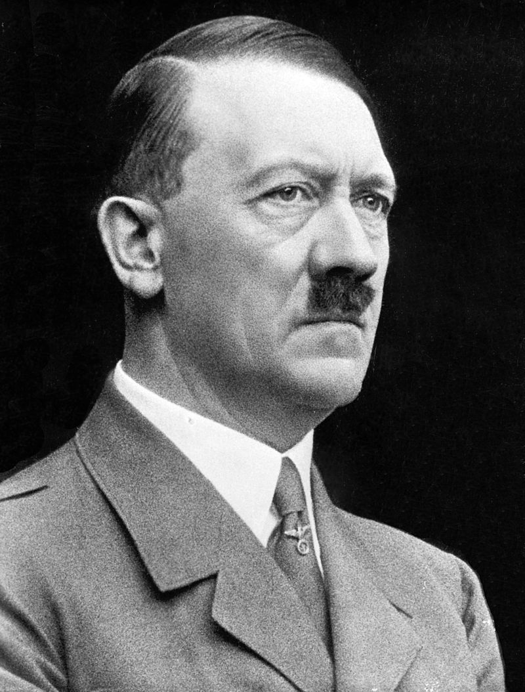

 【流浪街头的小乞丐】

1889年4月20日，希特勒出生在奥地利。他是一个海关职员在第3次婚姻中生的第3个孩子！年幼时，随父亲加入天主教成为信徒。他曾梦想当一名牧师！但他的父亲一直想让他当一名衣食无忧的公务员，可那时他的梦想已经变成了一名画家！

16岁时，他总是埋头在书堆里，最喜欢德国历史和神话，他成了一个狂热的日耳曼民族主义者。他两度报考维也纳艺术学院被拒绝。不久父母双亡，希特勒的生活日益窘迫，他从慕尼黑流浪到维也纳，在街头行乞，以卖画、打零工为生。

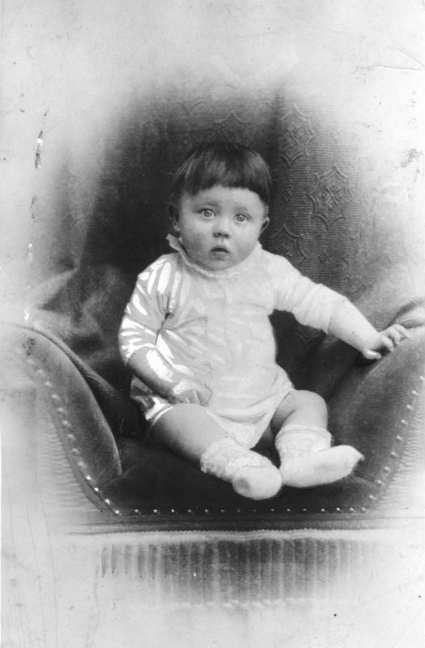

【一次大战的勇敢战士】

1914年8月（25岁），第一次世界大战爆发，希特勒参加了德国巴伐利亚预备步兵团，在西线与英法联军作战，因作战勇敢获得一枚“一级铁十字勋章”和一枚“二级铁十字勋章”。

在1916年的索姆河战役，大腿被炮弹炸伤（传说被炸掉了一只睾丸）。德国向协约国宣布投降后，1919年，希特勒加入“德国工人党”，从此他的人生就开了挂。

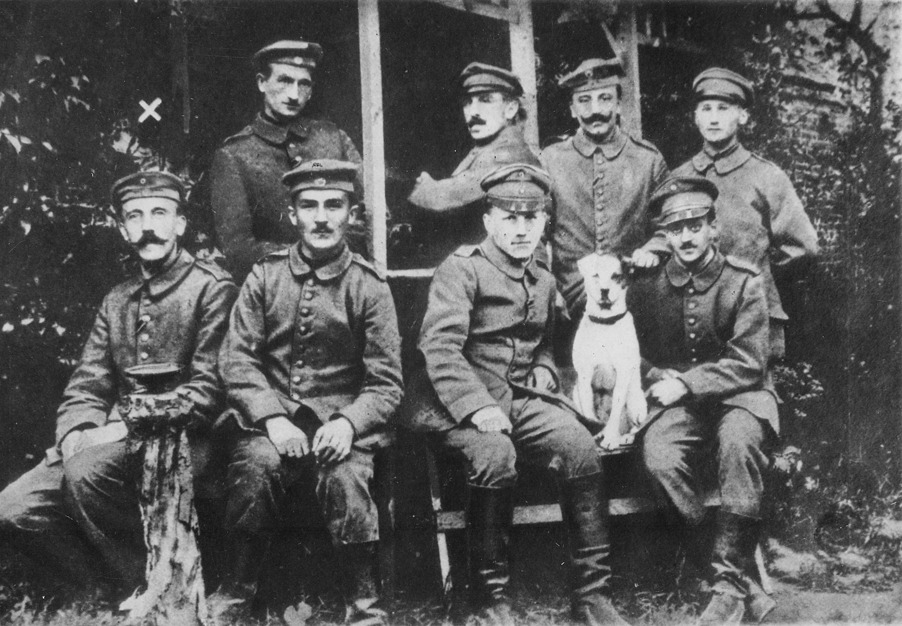

（一战时的希特勒（前排左一））

【善于演讲的纳粹党魁】

希特勒极其善于演讲，煽动性极强，迅速拉拢了一大批追随者。德国工人党的老大，对他刮目相看，力排众议将他任命为“宣传部长”。

希特勒利用当时盛行的民族主义和社会主义两股潮流，将德国工人党正式改名为“国家社会主义德国工人党”，这便是纳粹党。

纳粹党迅速壮大起来。1921年（32岁），希特勒成为纳粹党的党首。这时，他心中的偶像是意大利的独裁者墨索里尼，有趣的是不久他们将对调角色。

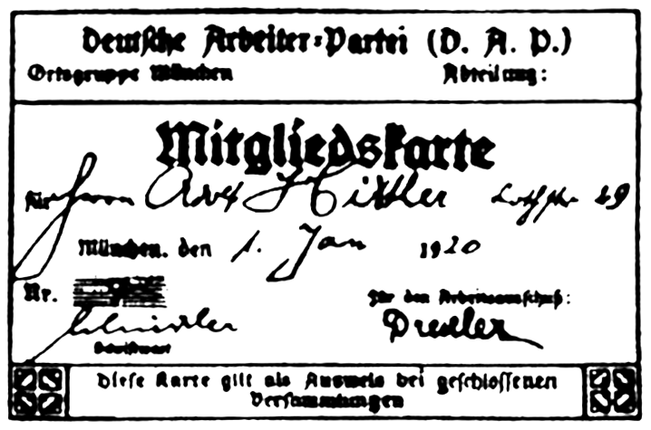

（希特勒的德国工人党党证）

【被捕入狱后的东山再起】

1923年（34岁），希特勒发动“啤酒馆暴动”，被捕入狱，纳粹党也被政府下令禁止。1925年，希特勒出狱，承认错误，保证今后一定遵纪守法。之后纳粹党正式重建，希特勒任元首。

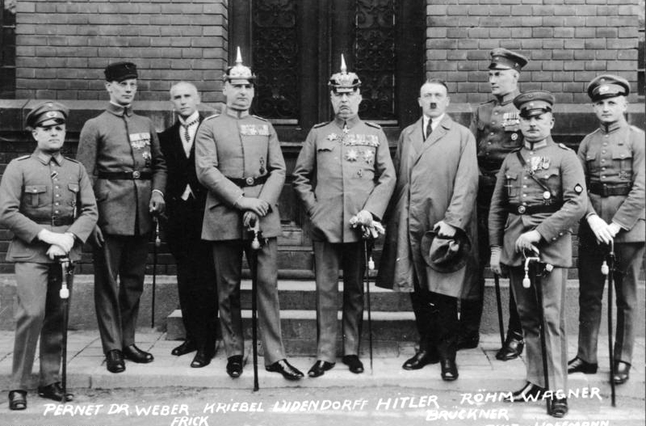

（1924年，希特勒和纳粹党成员合照）

1928年（39岁），希特勒把纳粹党几十万人的冲锋队，改制为武装团体，任务是保护纳粹党的集会。随后又建立了宣誓效忠于他个人的党卫军。

1929年，希特勒任德意志第三帝国的元首。他声称要“复兴德国”！他受到无数女性的追捧，可是他对这些狂热的追求者们总是不予理睬，甚至有人对他的性取向表示怀疑。

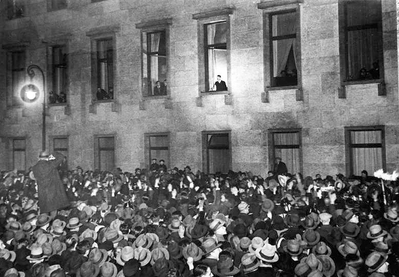

（希特勒当选德国总理，在窗边向支持者致意）

【一张废纸的凡尔赛和约】

1934年（45岁），希特勒下令，将国防军由10万扩充到30万。这公开违反了《凡尔赛和约》，法、英各国都提出了抗议，但只是停留在纸面上。

于是，1936年希特勒悍然宣布废除《洛迦诺公约》，派出3万德军开进莱茵非军事区，沿德国西部边界建立起防御工事。法、英各国依然只提出了抗议，没有任何切实措施。希特勒就更加胆大妄为，加快了向外扩张的步伐！

1936年，在德国举行了盛大的第11届奥运会！第二年，德、意、日三国正式结成法西斯集团，三国轴心正式形成！

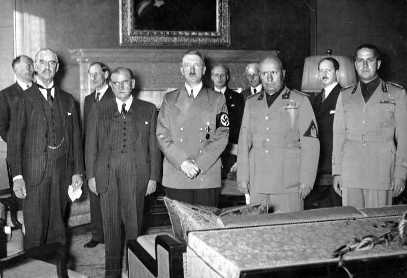

（慕尼黑会议中的希特勒）

【得寸进尺的二战爆发】

1938年（49岁），希特勒兵不血刃占领了奥地利，走出了他在中欧侵略扩张的第一步。英法两国依然听之任之。

1938年9月30日，英、法、德、意四国首脑签署了臭名昭著的《慕尼黑协定》，一枪未发，占据了苏台德地区！第二年，希特勒又撕毁《慕尼黑协定》，兵不血刃地占领了捷克斯洛伐克全境。英法继续口头抗议。

1939年8月，与苏联签订了《苏德互不侵犯条约》，去掉了两线作战的心病。9月，希特勒宣称德国遭到了波兰的入侵，闪击波兰。英法两国被迫对德宣战，第二次世界大战全面爆发。

（1938年10月，希特勒穿过捷克苏台德区）

【横扫欧洲的和平奖提名】

10月，德军攻占了丹麦、挪威。到第二年5月，攻占了荷兰、比利时和卢森堡，并大举入侵法国。6月22日，法国在贡比涅车站签署了投降书，搞笑的是，20年前正是在这里，德国签署了一战的投降书。

在这段迅速膨胀的期间，他主演了三部电影，写了两本书！并被提名为诺贝尔和平奖，只是最终没能荣获！

1940年夏，希特勒制定了入侵苏联的“巴巴罗萨计划”。在进攻苏联之前，希特勒己占领了欧洲的14个国家，并且把罗马尼亚、匈牙利、保加利亚、南斯拉夫变为自己的附属国。

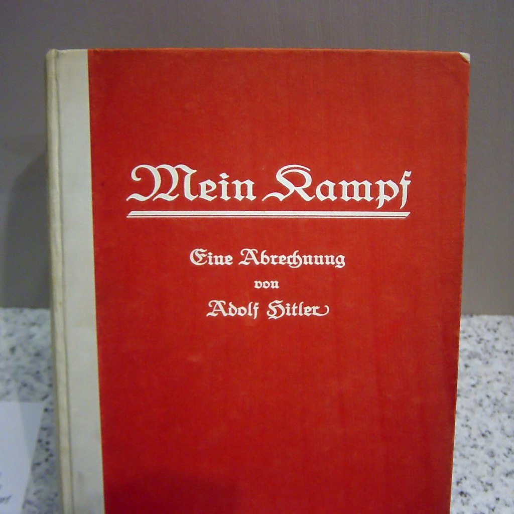

（希特勒的自传《我的奋斗》）

【三个月灭亡苏联的狂言】

1941年6月22日，德军发动进攻，狂言三个月灭亡苏联。虽然由于苏军有效地组织了防御，德军进展很慢。但在两个月后，德军还是完成了合围，歼灭了苏军30万人。

1941年9月30日，莫斯科会战中，苏联赢得了胜利，德军损失了50多万人和大量装备。不可一世的纳粹德国第一次受到重大损失，“三个月灭亡苏联”的狂言彻底破灭。12月7日，日本偷袭珍珠港，希特勒被迫向美国宣战。

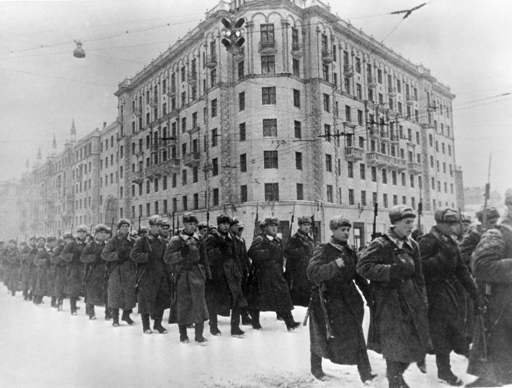

（1941年12月，从莫斯科奔赴前线作战的苏联红军）

1942年7月起，在伏尔加河畔的斯大林格勒，双方展开旷日持久的大会战。双方投入的总兵力在300万人以上，最终德军战败，节节败退。

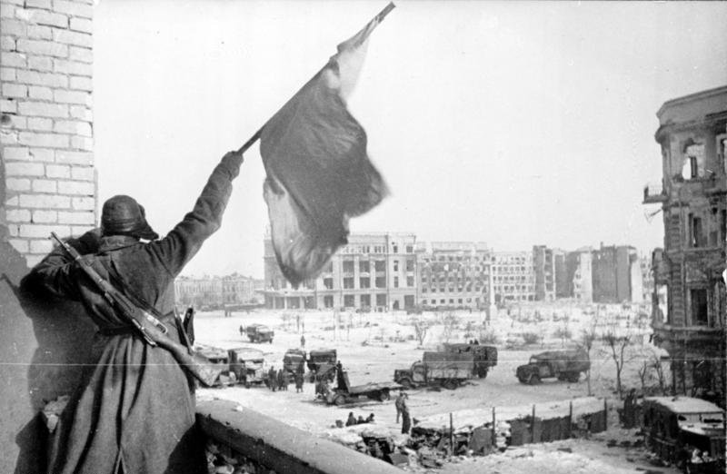

（1943年，获胜的苏军在斯大林格勒城中挥动旗帜）

【一切都是合法的“恶魔”】

1945年4月（56岁），苏军围攻柏林，希特勒大梦初醒，悲鸣道：“战争打败了，我将留在柏林，只要时刻一到，我就用手枪结束我的生命。”

1945年4月28日，希特勒和小他23岁的情妇爱娃正式结为夫妇。4月30日，苏军攻入柏林，希特勒的总理府已进入射程，希特勒回到地下室，开枪自杀，妻子爱娃服毒自尽。两人的尸体被军毯包上，抬到总理府的花园里，浇上汽油，在熊熊大火中化为灰烬，骨灰被埋进一个炮弹坑！

（希特勒与爱娃共同遛狗）

希特勒使大约3500万人失去了生命，600万犹太人惨遭杀害。然而，著名的黑人民权运动领袖马丁·路德·金说：“我们永远不应忘记，希特勒在德国所做的一切都是合法的！”

这句话让人玩味，令人震惊！我只能心里默念四个字：世界和平！

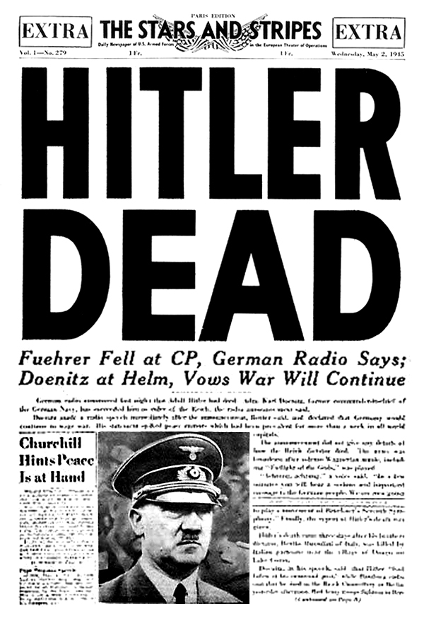

（美国报纸刊登希特勒的死讯）

（本文是万象历史·人物传记写作营的第13篇作品，是营员“隔壁老孙”的第3篇作品）