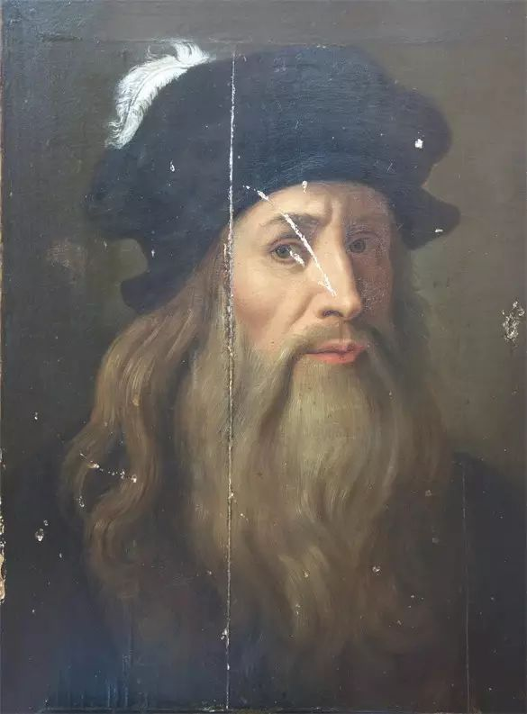
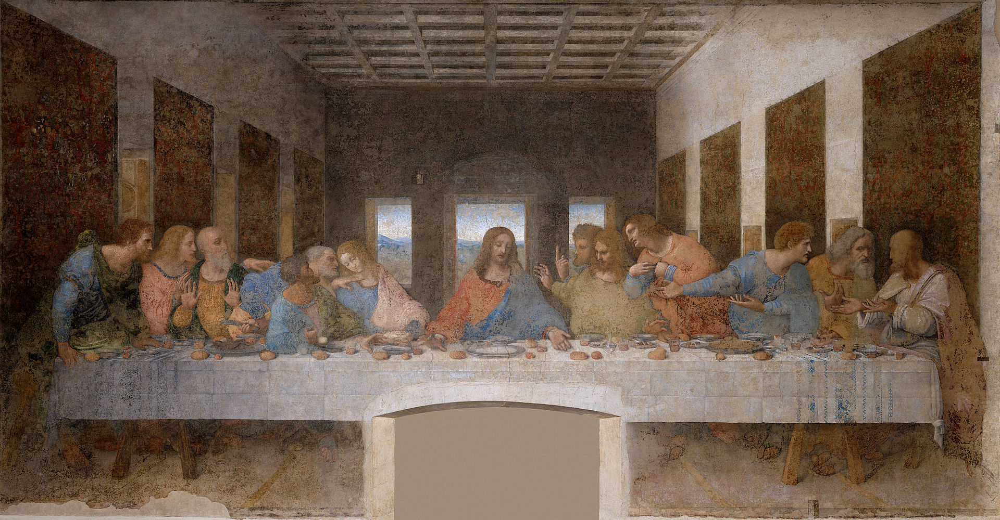
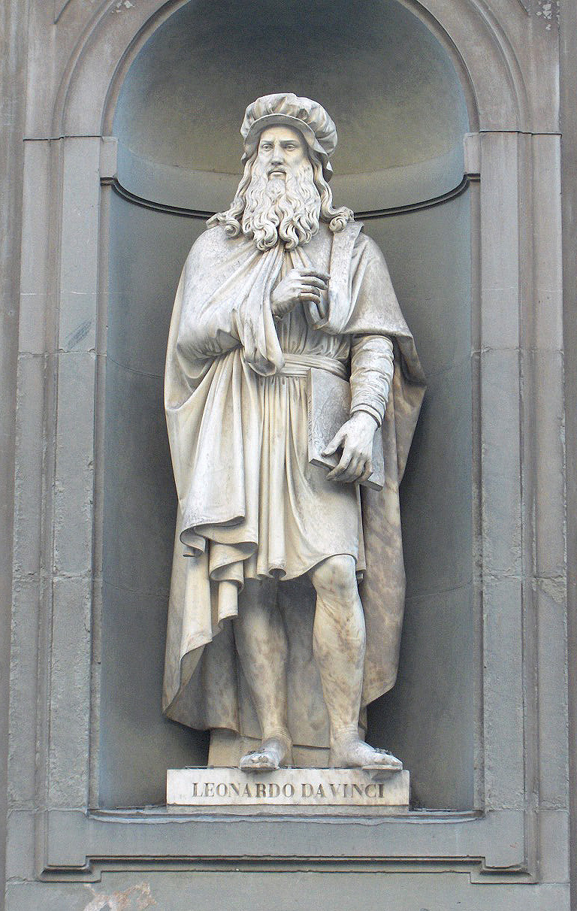
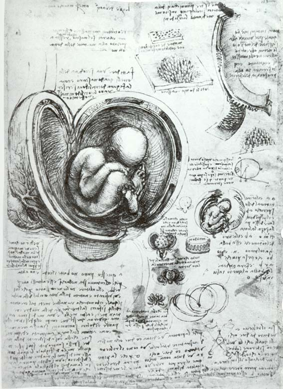
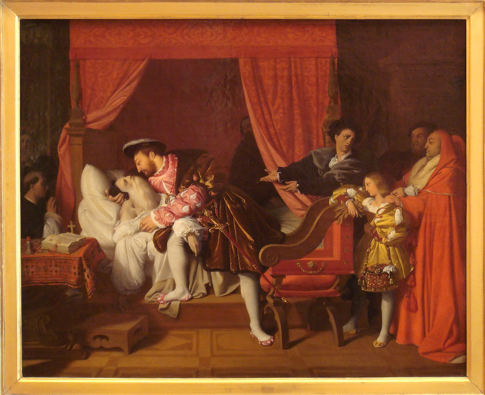

（万象特约作者：蓦然回首）

【1519年5月2日】499年前的今天，文艺复兴最完美的代表，绝无仅有的全才达芬奇逝世

达芬奇是欧洲文艺复兴最完美的代表，他简直是一位天才，他对艺术、科学等当时几乎所有已知领域，都有卓越的贡献，堪称人类历史上绝无仅有的全才。他的绘画杰作《蒙娜丽莎》、《最后的晚餐》，让无数人为之着迷。

（达芬奇画作：《最后的晚餐》）

【吓父亲一大跳的妖怪】

1452年4月15日，达芬奇出生于意大利佛罗伦萨附近的一个海滨小镇，现在名叫芬奇镇。父亲是佛罗伦萨有名的公证人，家庭很富有。孩童时代的达芬奇聪明伶俐，兴趣广泛，他歌唱得很好、会弹七弦琴、吹奏长笛，尤其喜爱绘画。

（意大利佛罗伦斯的达芬奇雕像）

14岁时，父亲受一个贵族委托，要画一幅家族的徽标，这个任务交给了达芬奇。一个月后，充满想象力的达芬奇，画了一个吓人的妖怪美杜莎。

父亲走进房间，光线透过半开的窗帘，正好落在面目狰狞的妖怪身上。父亲吓得尖叫起来。从此，父亲确信达芬奇有非凡的绘画天赋，将他送到佛罗伦萨，请著名的画家韦罗基奥，系统教他造型艺术。

（达芬奇绘制的完美人体比例）

【让人害怕和渴望的黑暗】

韦罗基奥的工作坊是当时佛罗伦萨最著名的艺术中心。在这里，达芬奇结识了一大批知名的画家、科学家和人文主义者。 到20岁时，达芬奇在绘画、雕刻方面已经有了很高的艺术造诣。

有一次，他在山里迷了路，走进一个漆黑的山洞。他说：“我突然产生了两种情绪——害怕和渴望。既对黑暗感到害怕，又渴望探索黑暗的秘密。”他的一生都沉浸在这两种情绪中，对各个领域都充满好奇，并超出常人。

（达芬奇的《胚胎研究》手稿）

【英俊帅气的艺术家】

我们一说起达芬奇，浮现的就是他的那幅著名的自画像：一个哲学家般的睿智长者。其实，年轻时代的达芬奇是佛罗伦萨闻名遐迩的美男子！据说，韦罗基奥雕塑的俊美非凡的青铜大卫像，就是以达芬奇为模特。

1482年，30岁的达芬奇，由于七弦琴拉得不错，作为一个音乐家来到米兰。在米兰的17年里，他无与伦比的艺术才能，受到米兰大公的青睐。

（红色粉笔画的肖像画，被认为是达芬奇的自画像）

【蒙娜丽莎的迷人微笑】

1500年（58岁），他回到佛罗伦萨，创作了《蒙娜丽莎》。之后，他再去米兰，服务于米兰宫廷。

1513年（61岁），他到了罗马，见到了米开朗基罗等人。这时，他热衷于研究类似于魔法的小把戏，以至于罗马人当他当成了巫师。

（达芬奇画作：蒙娜丽莎）

【用左手绘画的宫廷画师】

1516 年（64岁），达芬奇来到法国，担任宫廷画师，有着丰厚的收入。不久，他右手因为中风开始麻痹，于是他便改用左手，进行绘画和设计。

1519年5月2日（67岁），达芬奇与世长辞，被安葬在法国国王行宫的教堂里。

（画作：法国国王探望临终的达芬奇）

【绝无仅有的博学大师】

他去世时，留下了大量笔记手稿，内容包括数学、几何学、解剖学、生理学、动物学、植物学、天文学、气象学、地质学、地理学、物理学、光学、力学，几乎无所不包，令人叹为观止。

为纪念达芬奇，1981年发现的小行星3000被命名为“列奥纳多”，这是达芬奇真正的名字。

（达芬奇绘制的超巨型弩）

（本文是万象历史·人物传记写作营的第15篇作品，是营员“蓦然回首”的第2篇作品）