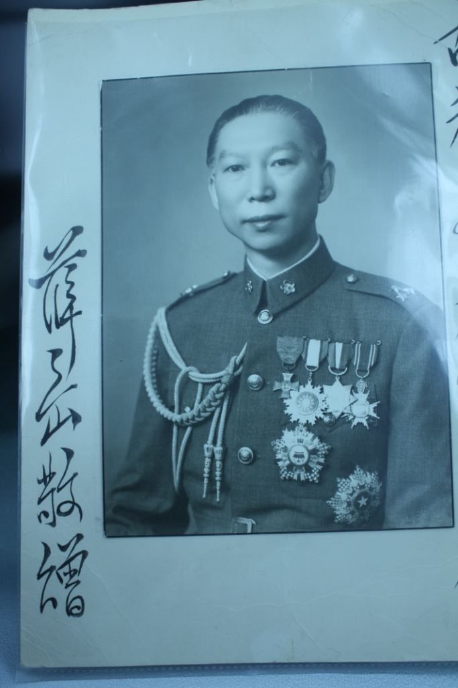
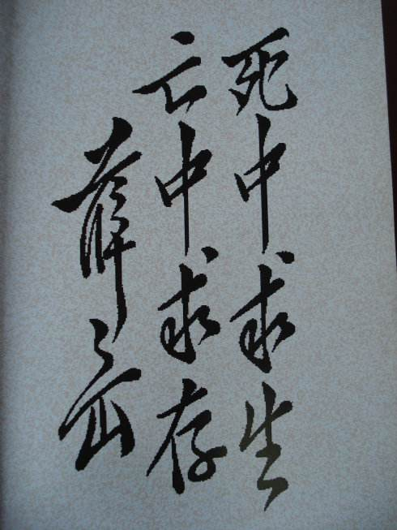
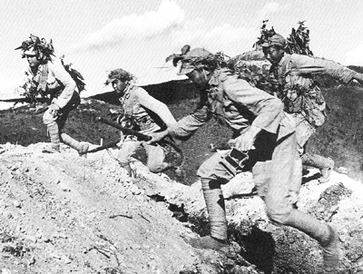
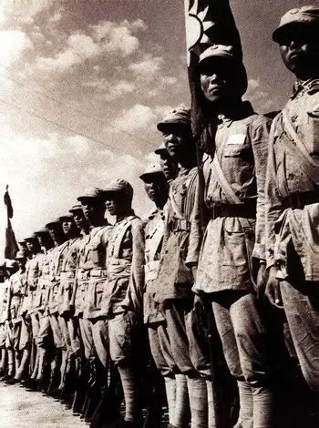
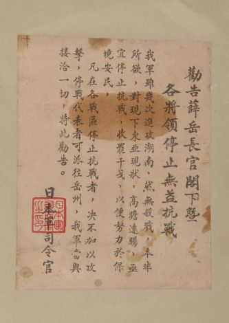
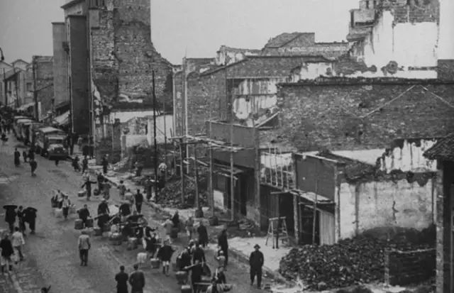
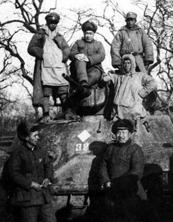

（万象特约作者：东西望）

【1998年5月3日】20年前的今天，效法岳飞，两天失守长沙的抗日战神薛岳逝世

【效法岳飞的孙中山警卫营长】

1896年12月27日，薛岳出生于广东与湖南交界处的韶关乐昌，客家人。当时，中日甲午战争战败，父亲给他取名“仰岳”，希望他效法岳飞成为民族英雄。后来，他改名为为薛岳，表示不仅仰慕岳飞，更要身体力行。

1909年，年仅15岁的他，加入了中国同盟会。1912年，考入黄埔陆军小学。1917年（21岁），进入保定陆军军官学校。第二年，尚未毕业便南下广东，参加孙中山新建立的援闽粤军，后任孙中山警卫团第一营营长。

1922年，陈炯明炮轰总统府，薛岳保护宋庆龄安全脱险。1926年，国民革命军开始北伐，他任第一军第一师师长。

【红军长征的头号敌人】

1927年，蒋介石发动清党，局势异常复杂，薛岳离开蒋介石的第一军，回到广东出任有“铁军”之称的第四军新编第二师师长。共产党在南昌起义后，12月又发动广州起义。薛岳挥师入城，彻底镇压了这次广州城里的暴动。

1930年（34岁），中原大战中，粤军第四军倒向桂系，与李宗仁、白崇禧一起反蒋。结果桂系战败，第四军被迫归顺蒋介石，实行中央化，薛岳则顶替张发奎，当上了第四军军长。

1934年（38岁），红军反围剿失败，被迫长征。薛岳是追剿红军的主力，在11月的湘江战役中，薛岳军追上红军大战六天，8万多人的红军只剩下不到3万，被红军视为“长征头号敌人”！

【日军不敢承认的大捷】

1937年（41岁），抗日战争全面爆发。1938年10月，在武汉会战中，薛岳指挥第九战区军队，几乎全歼日军第101师团与第106师团，取得万家岭大捷。这一战阻止了日军南下，意义非凡。

日军伤亡达3万人，只有1500人逃脱。此役后日本神社的祭拜人数暴增，日方一时不敢承认。直到2000年，日本战史才公开承认。

叶挺曾评万家岭大捷说：“挽洪都于垂危，作江汉之保障，并与平型关、台儿庄鼎足三立，盛名当永垂不朽。”

（参加万家岭战役的国民革命军）

【没有俘虏的大胜仗】

1939年9月（43岁），在湖南北部，日军与薛岳军交战后，并未进攻长沙就撤离。薛岳声称，国军成功守住了长沙，也因此称为第一次长沙会战。此役薛岳称日军伤亡3万，而据日方资料的记载，则不过几千人。

随后，第九战区参谋长吴逸志让人编了一出现代京剧《新战长沙》。剧中，薛岳头戴帅盔，身后大旗大大地写了一个“薛”字，两厢的龙套打着“精忠报国”的旗子，俨然以“岳飞”自居。吴逸志头戴纶巾，手持羽扇，身着八卦衣，俨然就是“诸葛亮”。

一场败仗竟变成了一场大胜利！有记者问：“你们打了这样大的胜仗，有没有俘虏？”回答：“没有！”

（薛岳为《第一次长沙会战纪实》一书题词）

【仍然没有俘虏的大胜仗】

1941年9月（45岁），日军发动了历时一个月的第二次长沙会战。日军不断突进，28日攻占长沙。日军认为“作战已达到目的”，3天后从长沙撤离。随后，薛岳军收复长沙。

蒋介石对薛岳十分不满：“像这次长沙会战，我们有这样雄厚的兵力……即使没有一万俘虏，也总应该有一千！一千没有，总要有一百！一百没有，少而言之，也应该有十人！……丢尽了党国军人的脸面。”

.jpg)

（第九战区司令长官薛岳(中)）

【振奋人心的大胜仗】

1941年12月（45岁），日军发动第三次长沙会战。薛岳以“天炉战法”对抗日军，成功守住了长沙，日方遭受惨重损失。薛岳报告歼敌5万，国军战报修正为2万多，日方资料则不到1万。

当时日军偷袭珍珠港，陆军席卷东南亚，同盟国军屡战屡败，长沙的胜利则成为政治上的强心针，引起世界媒体的广泛关注。

（参加第三次长沙会战的第9战区士兵）

【两天和四十七天】

1944年5月（48岁），日军发动第四次长沙会战。薛岳指挥4个集团军共约40万人，一触即溃，兵败如山倒。6月16日，日军攻到长沙城下。仅仅两天，长沙陷落。

日军继续南下。方先觉指挥的第十军，以攻城日军十分之一的兵力，惨烈坚守衡阳47天，震惊世界，被誉为“东方的莫斯科保卫战”。日方也称之为“中日八年作战中，唯一苦难而值得纪念的攻城之战”。

（日军给薛岳的劝降书）

（1945年，衡阳保卫战之后的衡阳市区）

【不断败退的一级上将】

抗日战争结束，国共内战爆发，薛岳出任徐州绥靖公署主任，驻军华东。1947年1月，在鲁南战役中，号称“国军精华”的国军第一快速纵队，在薛岳的指挥下全军覆灭。蒋介石以“指挥无力，名声低落”，将薛岳撤职。

1949年，薛岳回到广东乐昌老家，接受代总统李宗仁任命为广东省保安司令，打算建立粤、桂、闽、湘四省联盟。10月，解放军发动广东战役，薛岳败退到海南，任海南防卫总司令官，构筑防线。

1950年4月，海南岛战败，薛岳撤出，回到台湾，不久升任一级上将。后隐居于台湾嘉义县竹崎乡农村大宅，深居简出。1998年5月3日逝世，享寿102岁。

（1947年1月，鲁南战役后，新四军司令员陈毅在缴获的坦克前留影）

（本文是万象历史·人物传记写作营的第16篇作品，是营员“东西望”的第5篇作品）