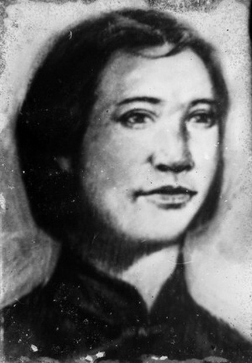
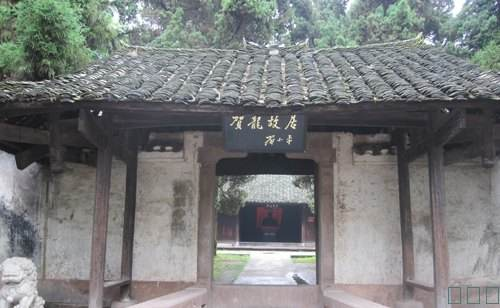
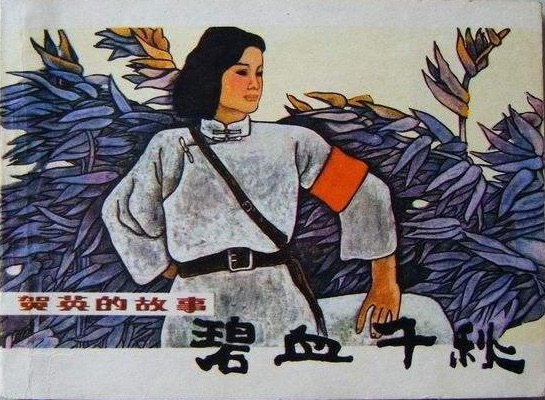
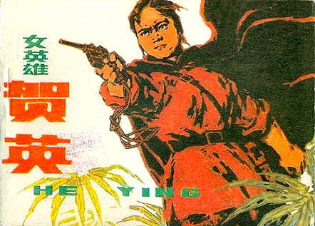
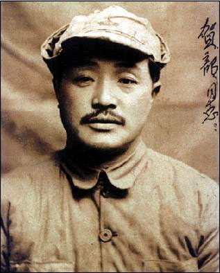
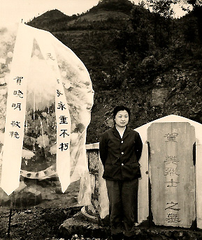

（万象特约作者：隔壁老孙）

【1933年5月5日】85年前的今天，光棍会的压寨夫人、贺龙的亲姐姐贺英惨遭肢解示众

【穷人家的大姐大】

1886年，贺英出生于湖南省桑植县。贺英兄弟姐妹7人，她是大姐，下有4个妹妹，两个弟弟。贺龙是大弟弟，比她小10岁。

穷人的孩子早当家！她从小没读过书，在家里帮忙干活，照顾弟弟妹妹。她在姊妹兄弟中威信很高。谁要是互相打闹，惹事生非，只要说一声“我向大姐告状去！”，大家立即停手，鸦雀无声。

【不包脚的压寨夫人】

贺英长到十三四岁，按照旧时代的习俗应当包脚了。贺英坚决不同意，父母也拿她没办法。她还跟着当地农民组织的“光棍会”，一起耍刀习武，玩枪使棒。

1906年，20岁的贺英与“光棍会”的龙头大哥、表兄谷绩庭结婚，成了“压寨夫人”。他们组建起一支专门劫富济贫的土著武装，队伍发展到300多人、200多枝枪，以鱼鳞寨为堡垒，在湘西很有影响。

【两把菜刀闹革命的弟弟】

1914年，弟弟贺龙参加了孙中山的中华革命党。1916年，在贺英的支持下，贺龙组织了二十多人深夜攻打石门县，赶走知县，杀人抢枪，捣毁盐局，走上了革命道路。

1917年，贺龙组织农民武装，参加援鄂战争，因受上级猜忌被解除武装。在返乡途中，他手持两把菜刀袭击慈利县长的卫兵，夺枪两支，重新拉起队伍。

【天天打仗的女司令】

1922年，丈夫被害后，贺英从“压寨夫人”，改担当起“司令”的角色。她凡事亲力亲为，事事为别人着想。这些大老爷们，对这位“司令”心服口服，言听计从！

1926年，贺龙率部加入国民革命军，任第九军第1师师长，通电参加北伐战争。1927年，蒋介石、汪精卫先后发动清党，贺龙参与领导了八一南昌起义。9月，贺龙在瑞金加入中国共产党。

当地军阀派兵围捕贺英。贺英奋起反抗，她联络桑植县民军，攻克桑植县城，赶走县长。她带领队伍边打边走，29天打了32仗！

【全力支持的革命事业】

1928年，贺龙回到家乡，他受中共中央指派，到湘鄂西开展斗争。贺英全力支持弟弟，她率领部属1000人参加“洪家关聚义”，把全部人马交给了贺龙。对于弟弟的革命事业，她几乎有求必应，给予了巨大的支持。

1930年，贺龙率主力红军与红六军在湖北会师，成立红二军团，湘鄂西根据地成立了！

【壮烈牺牲的贺龙姐姐】

1932年秋，国民党军队对苏区实行围剿，贺英率游击队在湘鄂边根据地坚持游击战。

1933年5月5日，游击队被敌人包围，贺英在激战中壮烈牺牲。牺牲后，贺英和妹妹尸体被敌人残酷肢解，悬挂在四门示众。

贺英牺牲了，她不是共产党员，而是贺龙的姐姐。向姐姐致敬！

（贺龙女儿贺晓明在贺英烈士墓前）

（本文是万象历史·人物传记写作营的第18篇作品，是营员“隔壁老孙”的第4篇作品）

