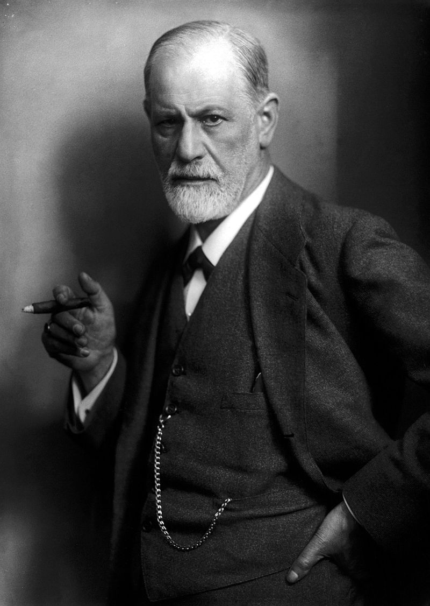
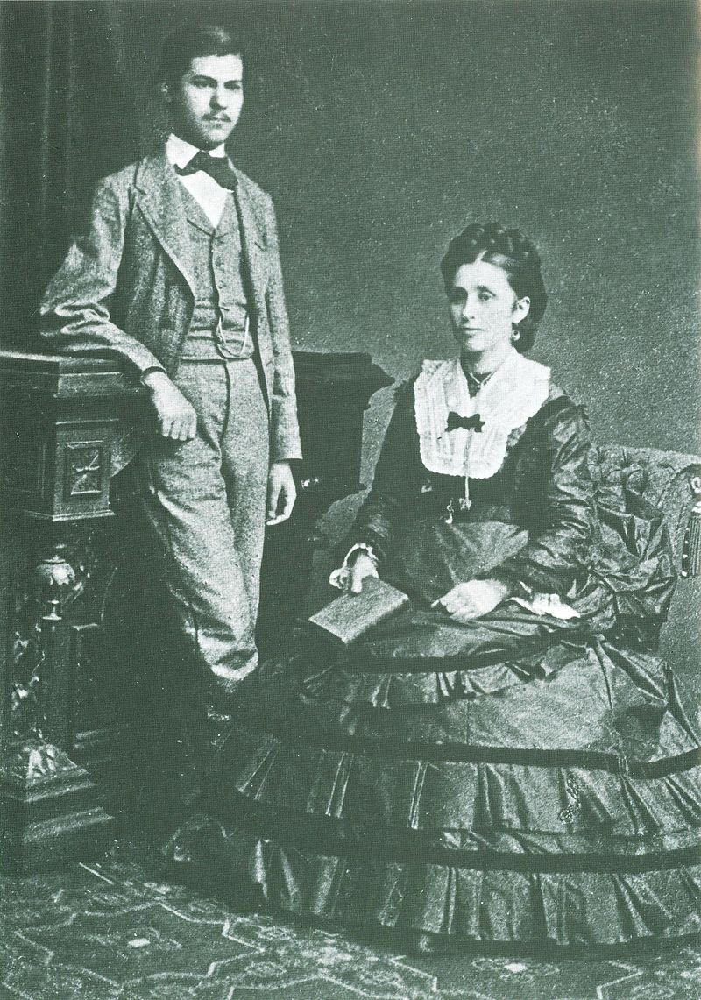
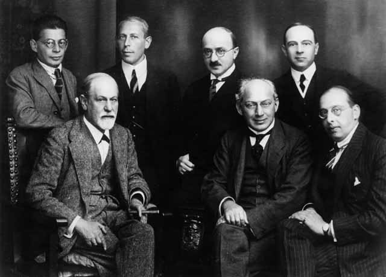

（万象历史特约作者：蓦然回首）

【1856年5月6日】162年前的今天，质疑人类理性的解梦大师弗洛伊德出生

【神经病和精神病】

1856年5月6日，弗洛伊德出生于奥匈帝国的一个犹太家庭。他是一位医生、心理学家，是著名的精神分析学的创始人。

1873年（17岁），弗洛伊德进入维也纳大学的医学专业，深受达尔文进化论思想的影响。1881年（25岁），获医学博士学位。

1886年（30岁），他以神经病医师的身份开业行医。在巴黎期间，他的兴趣从人体转向心理，从一个神经学家转变为一名精神病理学家。

（1872年，16岁的弗洛伊德和他的母亲）

【每天半小时的解梦】

1895年（39岁），他与布洛伊尔共同出版了《歇斯底里症研究》。书中，他第一次使用了“精神分析”这个概念，为精神分析学的创立奠定了理论基础。

1897年以后，他开始使用精神分析法，每天对自己分析半小时，主要方法是分析自己的梦。他得出结论：一个人的心理障碍，大多是由于性紧张累积而引起的。

1899年，他写成了《梦的解析》，他的结论震惊了世界。在长达上百年的时间里，这本书一直是知识青年人手一本的畅销书。

（弗洛伊德进行心理分析的沙发）

【潜意识是真正的原动力】

他的精神分析理论认为，潜意识是人类一切活动的真正原动力，而不是理性！

在潜意识中，被压抑的性本能是最最重要的。除了性之外，其他器官的欲望冲动，也无时无刻在起作用，并最终决定了一个人的心理成长。他以身体不同部位获得满足为标准，将人格发展分为 5 个阶段: 口唇期，肛门期，性器期，潜伏期，生殖期。

精神分析运动迅速发展起来。在他周围聚集了一批年轻的学者，成立了“星期三心理研究小组”。1902年，发展成立心理分析协会。参与者包括阿德勒、兰克、费登、荣格等，这些人后来都成为杰出的精神分析学家。

（弗洛伊德心理理论图解）

【被接受的“歪理学说”】

然而，这种“歪理学说”人们一时无法接受。

直到10年后，1909年，美国克拉克大学邀请弗洛伊德参加20周年校庆，授予他名誉博士学位，并与美国心理学界的学者会晤。这标志着精神分析理论终于赢得了国际承认。

1913年（57岁），他出版了《图腾与禁忌》。他通过对乱伦恐惧、情感矛盾等研究，声称发现了三大真理：1、梦是无意识欲望和儿时欲望的伪装的满足；2、俄狄浦斯（恋母）情结是人类普遍的心理情结；3、儿童具有性爱的意识和动机。

（1909年，弗洛伊德（前排左一）在克拉克大学前合影）

（1922年，弗洛伊德（前排左一）与心理学大师合影）

【被质疑的人类理性】

他一生致力于精神分析学说的完善和发展。1919年，他创办了一家出版公司，专门出版发行精神分析学方面的杂志和书籍，直到1938年被纳粹查封。

1939年9月23日，弗洛伊德在伦敦去世，享年83岁。

他开创的精神分析法，让人脑洞大开，也使得人们对人类引以自豪的理性思维，提出了严重质疑。难道我们不过是潜意识控制下、直立行走的动物？？

（弗洛伊德的骨灰）

（本文是万象历史·人物传记写作营的第19篇作品，是营员“蓦然回首”的第3篇作品）