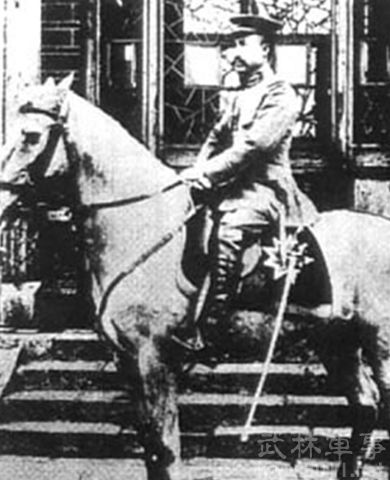
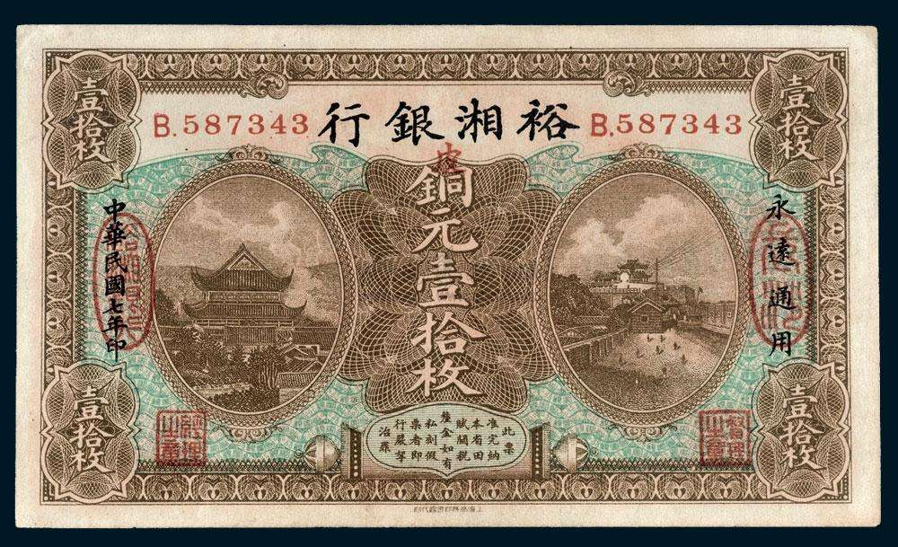
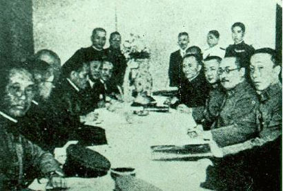

（万象特约作者：南山南）

85年前的今天，得罪毛泽东、蒋介石的汉奸军阀张敬尧，被蓝衣社暗杀

【少年杀人犯，投身行伍】

1881年， 张敬尧出生于安徽霍邱。张敬尧从小放荡不羁，后来当盗贼，又杀人犯法，逃亡在京津冀一带。

1896年（15岁），张敬尧参加袁世凯的北洋新军，投身行伍。1906年（25岁），从保定军官学校第一期毕业，在北洋军中任职。

【效命袁世凯，皖系军阀】

从此，他在袁世凯的麾下，先后参加过打击武昌起义、反对二次革命、围剿白朗悍匪、攻击蔡锷护国军等战争，成为袁世凯的得力干将。

1916年，袁世凯称帝，不久死去。第二年，辫帅张勋复辟。张敬尧跟随段祺瑞，领兵进京，打跑了张勋，成为皖系军阀的一支重要力量。1918年（37岁），他被任命为湖南督军兼省长。

【张氏尧舜禹汤，虎豹豺狼】

在张敬尧率军进驻湖南前，原驻守湖南的桂军在撤退时，将湖南银行洗劫一空，导致湖南财政崩溃。张敬尧主政后，创建裕湘银行，试图进行整改。然而，不久便大肆印刷裕湘现洋，滥发纸币，市场变得更加混乱，民众怨声载道。

张敬尧的军阀本性也暴露无遗。他横征暴敛，纵兵劫掠，为所欲为，被称为“张毒”。他占有大量田产和房屋，娶有一妻十二妾。他的三个弟弟敬舜、敬禹、 敬汤，更是仗势欺人，无恶不作。当时有童谣：“堂堂乎张, 尧舜禹汤。 一二三四，虎豹豺狼。”

对于四兄弟的名字而言，这真是莫大的讽刺啊！

【毛泽东的重拳，驱张运动】

1919年，五四运动爆发，张敬尧下令镇压学生运动，并查封了毛泽东组织的《湘江评论》和湖南学生联合会，极大地激发了毛泽东的反抗情绪。

11月，在毛泽东的领导下，湖南省学联恢复，开始组织“驱张运动”。不久，湖南各学校宣布罢课，各行业宣布罢工，共同声讨张敬尧。一时间，全国各地响应，张敬尧顿时臭名昭著，地位岌岌可危。

（《湘江评论》旧址）

屋漏偏逢连夜雨。1920年，直系的吴佩孚有意撤出部分守军，让湖南当地军阀谭延闿的军队长驱直入，击溃了张敬尧。6月，张敬尧不得不撤离湖南。

毛泽东的这记重拳——“驱张运动”，被称为“湖南的五四运动”。

【日本人的走狗，可耻汉奸】

离开湖南之后，张敬尧先后投靠张作霖、吴佩孚、张宗昌等军阀。1925年（44岁），张宗昌被北伐军击败后，张敬尧逃往大连隐居。

1931年，九一八事变，日军进占东北。1932年（51岁），张敬尧投身伪满洲国，开始为日本人效力，被日本关东军任命为“平津第二集团军总司令”，试图在京津地区组织傀儡政府。

1933年，张敬尧化名为常石谷，住在北平的六国饭店，四处收买旧部，试图策反中国军人。

（六国饭店）

【蒋介石的重拳，暗杀行动】

蒋介石知道后，非常气愤，命令戴笠刺杀张敬尧。具体刺杀行动由黄埔系骨干组成的蓝衣社执行。特务处处长戴笠和副处长郑介民，亲自以富商身份住进六国饭店，侦查张敬尧的生活习惯。

5月7日凌晨，北平站行动员白世维对正在洗脸的张敬尧，连开三抢，张敬尧应声倒下。刺杀成功后，白世维因“锄奸有功”受到嘉奖，晋升为中校军衔，提拔为北平站行动组组长，并保送到中央陆军大学深造。

 

（刺杀张敬尧的白世维）

【一时的和平，暗杀的开端】

张敬尧死后，日军进入北平的野心受挫。 5月15日，日本关东军宣布休战。5月31日，国民党政府与日军签订了《塘沽协定》。《塘沽协定》一方面承认了日本对满洲、热河的占领，另一方面也暂时终结了“九一八”事变以来中日的军事对立。

而刺杀张敬尧的成功，也让蒋介石更加相信“暗杀”的力量，蓝衣社（复兴社）逐渐发展壮大成为后来的军统。

面对两位毛泽东、蒋介石的先后两记重拳，张敬尧轰然倒地，死有余辜！

（签订《塘沽协定》的华北停战会议）

（本文是万象历史·人物传记写作营的第20篇作品，是营员“南山南”的第3篇作品）