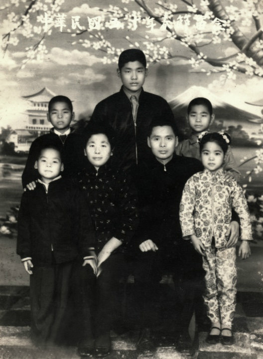
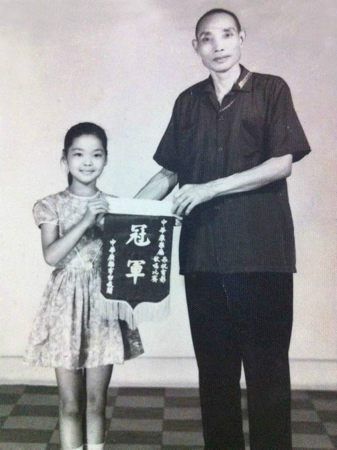
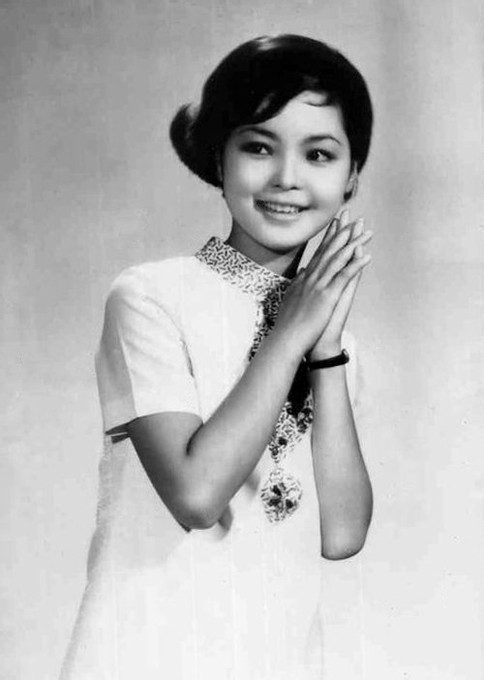
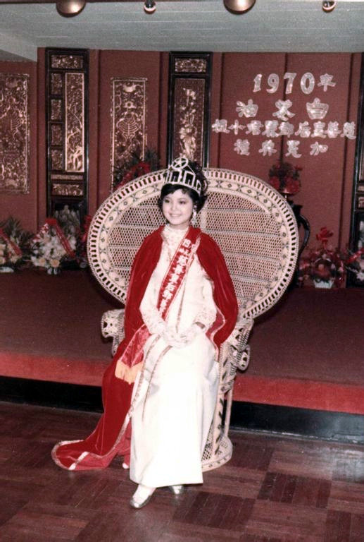
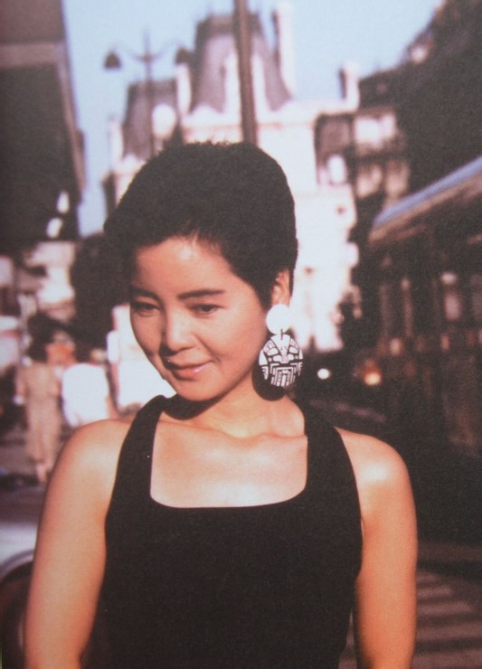
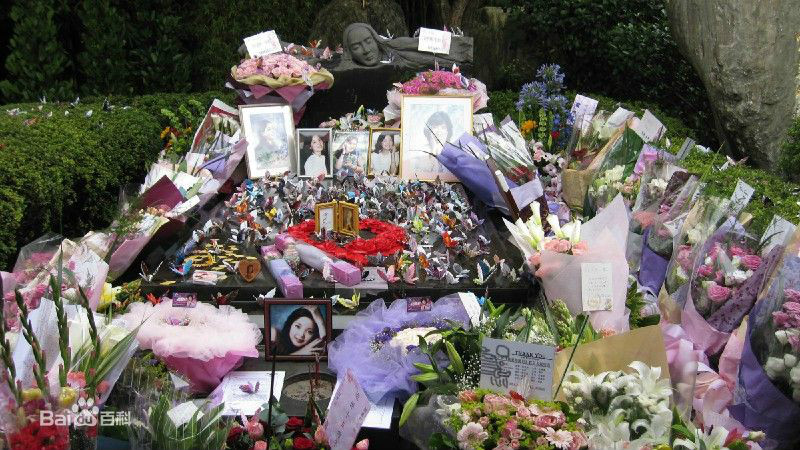
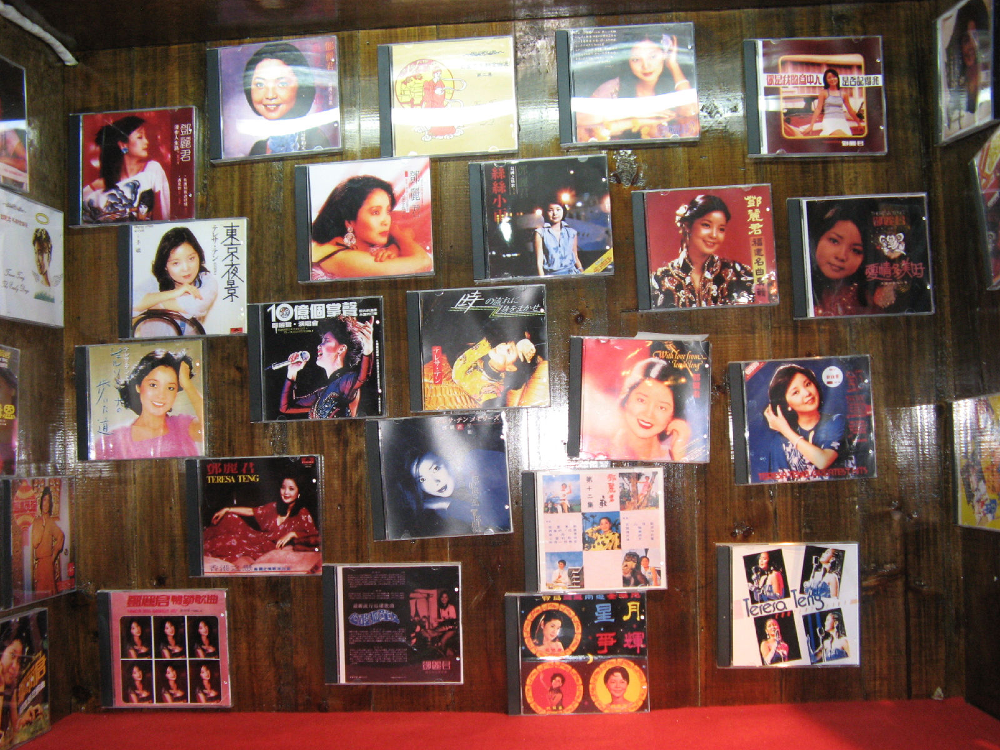

（万象特约作者：东西望）

【1995年5月8日】23年前的今天，甜歌飞越海峡两岸的台湾“军中情人”邓丽君逝世

【念错别字的家人】

1953年1月29日，邓丽君出生于台湾，父亲是跟随国民党，从大陆跑到台湾的国军军官。本名邓丽筠[yún]，同“云”音，但家人错念成“均”，这便有了后来的艺名邓丽君。

1959年，父亲退役后，全家住入安置军人的眷村。邓丽君从小就有唱歌的天分，时常展露头角，参加劳军表演。她学习成绩一般，没能考入理想的公立中学，进入私立金陵女中。

（1961年，邓丽君（右一）全家合影）

【影视三栖的慈善皇后】

1964年（11岁），邓丽君参加广播电台举办的黄梅调歌唱比赛，一举夺得冠军。从此，她经常参加晚会演出，并被一个歌厅邀请驻唱，招牌歌曲是“一见你就笑”。

1967年（14岁），邓丽君正式休学，成为歌厅、夜总会、酒店等争相邀演的歌手。她加盟宇宙唱片，发行个人第一张专辑《邓丽君之歌第一集·凤阳花鼓》。1969年，中国电视公司开播，邀请她主持晚间黄金时间节目《每日一星》，并为电视连续剧《晶晶》主唱同名主题曲。

同年，她参演电影《谢谢总经理》，片中她唱了十首青春活泼的歌曲。她参加台风赈灾义演，并到新加坡参加慈善晚会。1970年，香港《华侨日报》加冕她为“慈善皇后”。邓丽君一下子就成为影视三栖明星，家喻户晓。

【何日君再来的日本】

1974年（21岁），邓丽君在母亲陪同下前往日本发展，取艺名为テレサ・テン（英文名Teresa Teng）。她努力学习日语，去夜总会和歌舞厅演唱。尝试发了两张日语单曲，荣获日本唱片大奖新人奖。

1975年7月，邓丽君签约香港宝丽金唱片公司，在日本发行《岛国之情歌》系列专辑。1977年，发表《月亮代表我的心》、《何日君再来》、《夜来香》等，空前轰动，荣获“香港第一届金唱片颁奖礼”金唱片得主。

1979年2月（26岁），因台湾护照审查严厉，邓丽君便持印尼护照入境日本。事件被曝光后，日本法务省裁决将邓丽君驱逐出境一年。邓丽君便去美国进修，期间发行《小城故事》和《甜蜜蜜》等歌曲。

这时，中国大陆刚刚改革开放，立刻为邓丽君的歌声而迷醉，响遍了神州大地。

【不去大陆的军中情人】

1980年，台湾当局以参加劳军和义演活动为条件，对护照事件不予追究。她参加国父纪念馆义唱，演唱会中主持人问她，有没有大陆邀她前往演唱的事。邓丽君表示没有人来联系，并说：“当我在大陆演唱的那一天，就是我们三民主义在大陆实行的那一天。”后来，邓丽君果然一辈子也没有在大陆演唱过。

1981年8月，邓丽君跑遍台湾各地军营，劳军一个月，被称为“军中情人”。同时，台视制作了《君在前哨》电视特辑，广为传播。1982年，她所灌5张个人大碟同时获白金唱片，勇破历届金唱片记录。

1983年（30岁），她赴拉斯维加斯“凯撒皇宫大赌场”演唱，是首位在此签约演唱的华籍女歌手。同年，她当选为“十大杰出女青年”，在香港红勘、东南亚等地举行十五周年巡回演唱会。她推出的粤语大碟《漫步人生路》，风靡一时，妇孺皆知。

【世界十大最受欢迎的女歌星】

1984年，她重返日本乐坛，推出《偿还》专辑，立即打入日本唱片流行榜，停留榜内接近一年，刷新日本乐坛历史记录，获奖无数。

1985年，凭借新歌《爱人》（日文情人的意思）连续14周蝉联日本有线点播榜冠军，入选日本“第36回红白歌合战”。12月，在日本NHK大会堂举行演唱会，命名为《唯一一次》。一语成谶，这是邓丽君在日本‘唯一一次’大型演唱会。

1986年，她凭借单曲《我只在乎你》，连续三年拿到日本有线大奖和全日本有线放送大赏，入选日本“第37回红白歌合战”。她被美国时代杂志选为世界七大女歌星和世界十大最受欢迎女歌星。

【我的家在山的那一边】

1987年后，她处于半退休状态，除了慈善演出，很少在公众场合露面。1989年5月27日，她支持天安门事件的学生，不顾亲友反对，参加了香港跑马地的《民主歌声献中华》活动。她脖子上挂着手书“反对军管”的牌子，演唱歌曲《我的家在山的那一边》。

1990年，她旅居法国，与小她15岁的法国摄影师保罗相恋。1995年4月底，她与保罗入住泰国清迈梅坪酒店的总统套房。5月8日，保罗外出时，邓丽君气喘病发作，她奔出房间求救，不断呼叫“妈妈、妈妈”，最后在柜台前不支倒地。在送往医院急救途中，停止了呼吸。邓丽君的家人和保罗都不同意进行解剖验尸，因此真实死因无法确认。

【白天听老邓，晚上听小邓】

5月28日，中华民国总统府颁发褒扬令，并在她的灵柩上覆盖青天白日党旗和青天白日满地红国旗，安葬于特意为她建造的金宝山筠园墓园。

在80年代，她是流行音乐的标志，她柔美的歌声穿透了海峡两岸。邓丽君和邓小平一起成为中国老百姓熟悉的名字，一度流传着“白天听老邓，晚上听小邓”的美谈。

（本文是万象历史·人物传记写作营的第20篇作品，是营员“东西望”的第6篇作品）