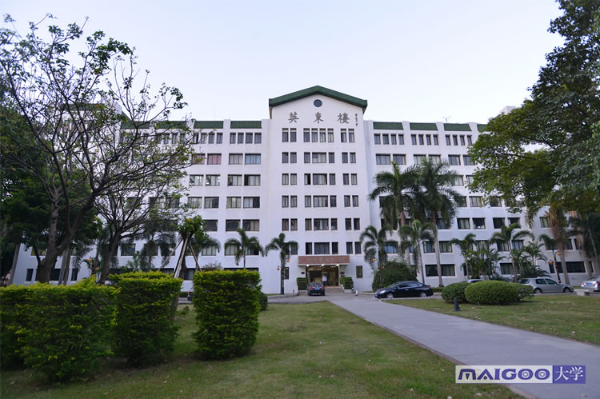
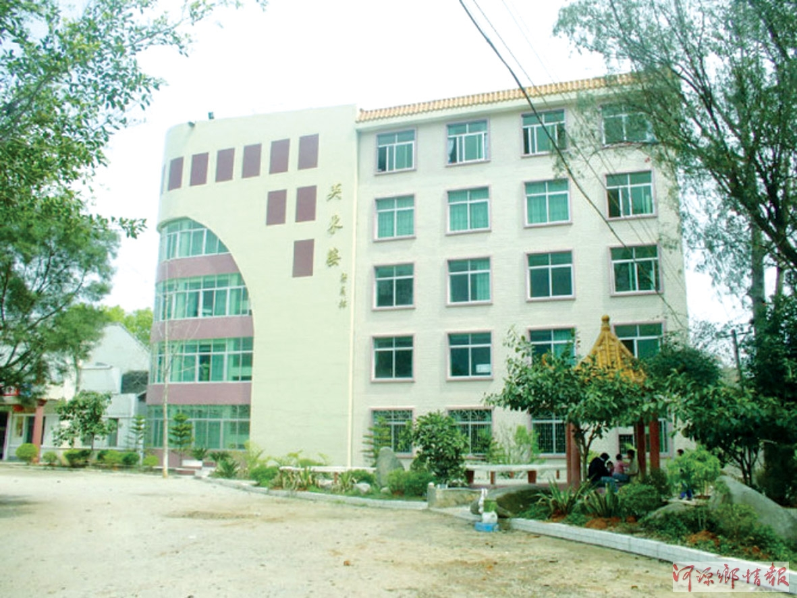
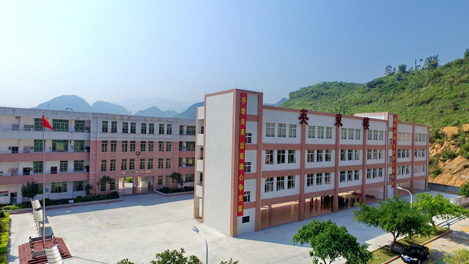
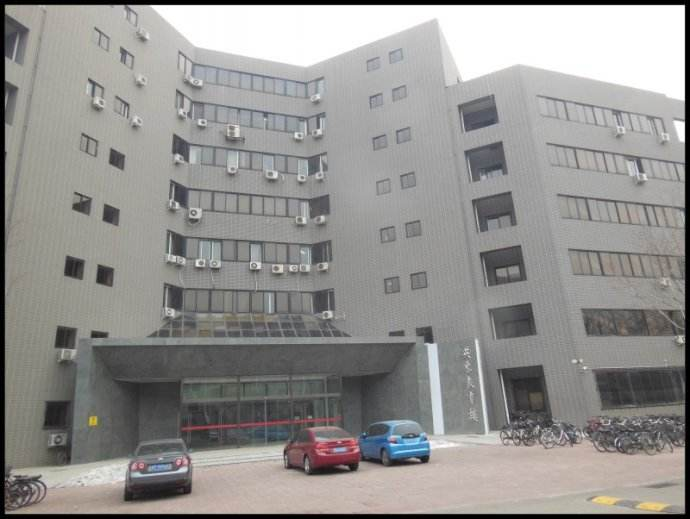
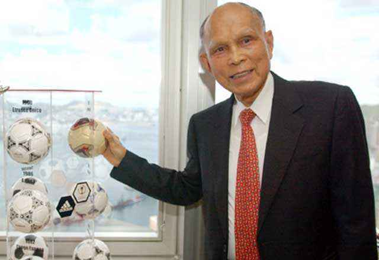
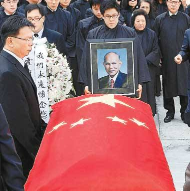

（万象特约作者：隔壁老孙）

【1923年5月10日】95年前的今天，朝鲜战争赚取第一桶金的爱国港商霍英东出生

【贫民窟里长大的小孩】

1923年5月10日，霍英东出生于香港。从小家里特别穷，一家人住在贫民窟里。7岁时，父亲去世，母亲一个人拉扯3个孩子，生活更加艰苦。但无论过得多苦，母亲都咬着牙把学费省出来，送霍英东去读书。霍英东也很争气，小学毕业时以优异的成绩考进香港著名学府——皇仁书院。

然而，抗日战争爆发，霍英东不得不辍学。他先后当过船上的烧煤工、糖厂的学徒、修建机场的苦力，有点积蓄后开了一间小杂货店。

（仲恺农业工程学院的英东楼）

【朝鲜战争的第一桶金】

1948年，敢想敢干的霍英东和朋友合作做打捞海草生意，不久做起了海上运输业务。

1950年，朝鲜战争爆发，霍英东已经有了一家小型修船厂。当时，欧美国家联手对中国进行物资封锁，霍英东凭借胆识、不顾危险在香港组织了颇具规模的船队，多次将“违禁物资”偷偷运往中国内地。他赚到了人生的第一桶金，也有力地支援了抗美援朝。

（和平县四联中学的英东楼）

【香港澳门的经济推手】

50年代后，香港人口巨增、工商业兴起。他眼光独到，创立了立信置业有限公司，开始经营房地产业。他首创分层预售“楼花”和分期付款的经营方式，对香港房地产业的蓬勃发展意义巨大。

他又进军海底采沙业，投身填海造地事业，并收购了美国人的太平岛船厂，开创了中国人收购外国公司的先例。他组织香港地产建设商会，连任20年会长。创办澳门旅游娱乐有限公司，成为澳门经济主要支柱。

（乳源鲜明八一希望学校的英东楼）

【改革开放的爱国港商】

1979年，内地开始改革开放，他是最早到内地投资的“港商”之一。他在广州南沙建设“海滨新城”，呕心沥血十几年！他与广东省合作兴建的广州白天鹅宾馆，成为我国第一家由中国人自己设计、施工和管理的大型现代化酒店。

他倾力支持教育事业，捐出巨款建成了大批教学设施，捐赠累计达7.6亿港元。北京师范大学的英东教育楼，便是他捐赠五百万美元资助的。

（北京师范大学的英东教育楼）

他不遗余力地支持国家的体育事业，捐款高达10多亿港元。在他的努力下，中国恢复了在亚洲足球联合会的席位。他为北京主办第十一届亚运会和2008年奥运会也作出了重大贡献。

【与内地沟通的桥梁】

改革开放20多年来，他通过自己创立的霍英东基金会、霍英东体育基金会、霍英东番禺建设基金会等机构，在内地兴建了数百个项目，总支出90多亿港元。他说：“我们在内地多方投资、捐赠，目的只有一个，就是希望国家兴旺、民族富强。我始终没有忘记自己是一个中国人……”

 2005年，他荣获民政部、中华慈善总会颁发的“中华慈善奖”。 2006年10月28日，霍英东在北京因病逝世，享年84岁。

他被港人誉为“与内地沟通的桥梁”。著名的跳水皇后郭晶晶是他的孙媳妇！

（本文是万象历史·人物传记写作营的第21篇作品，是营员“隔壁老孙”的第4篇作品）

