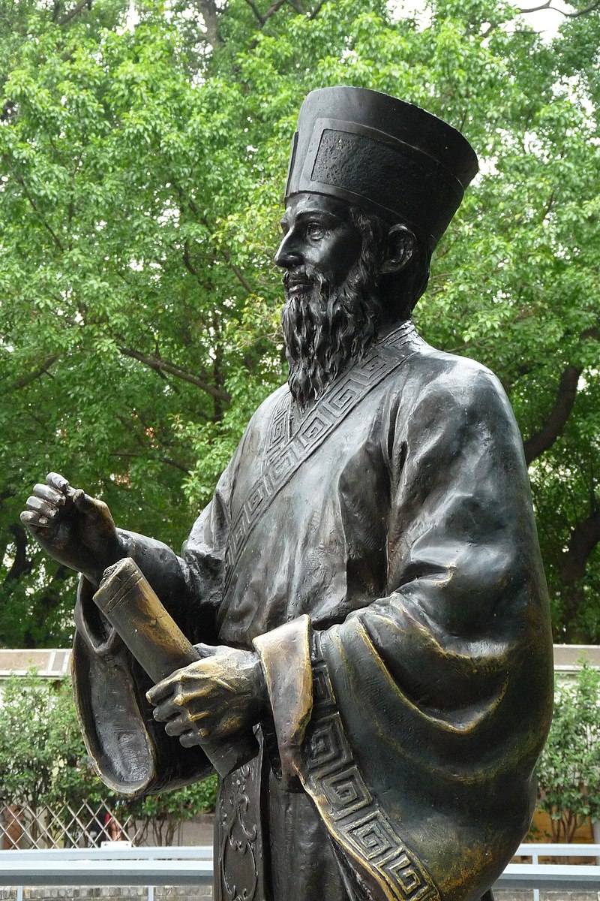
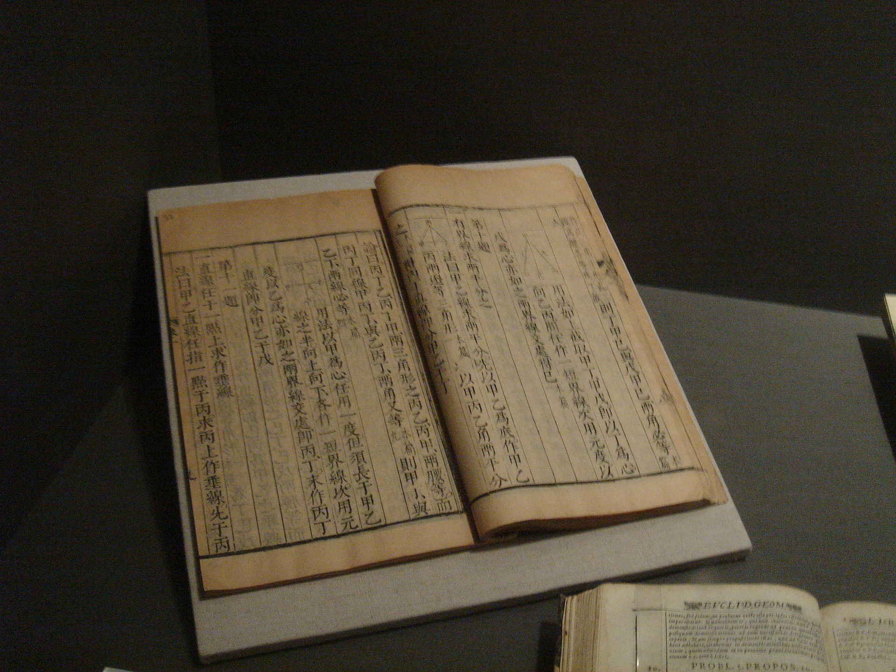
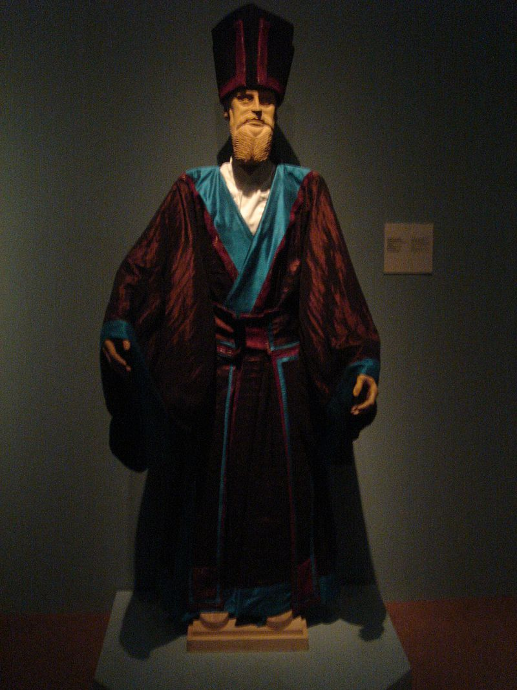
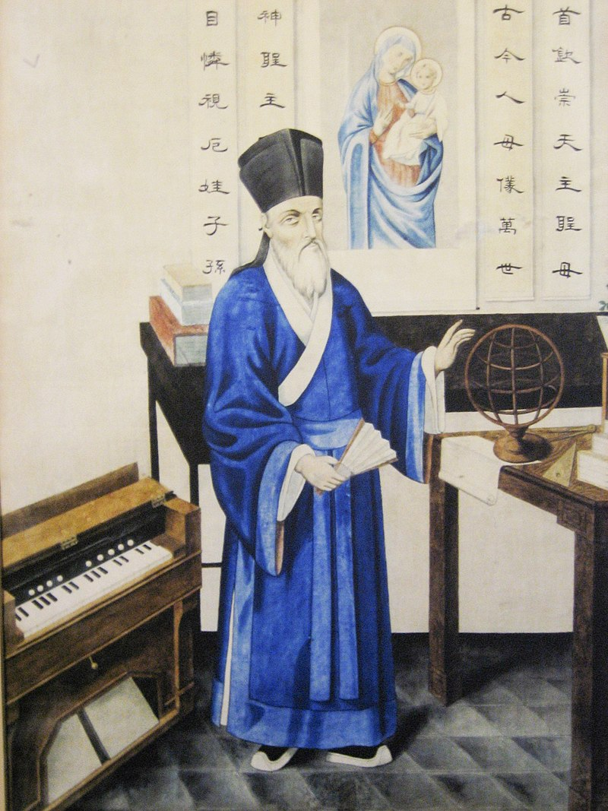
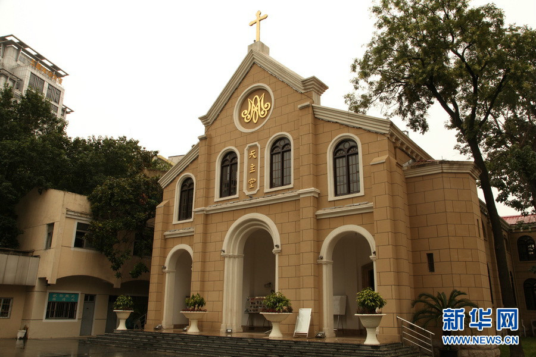
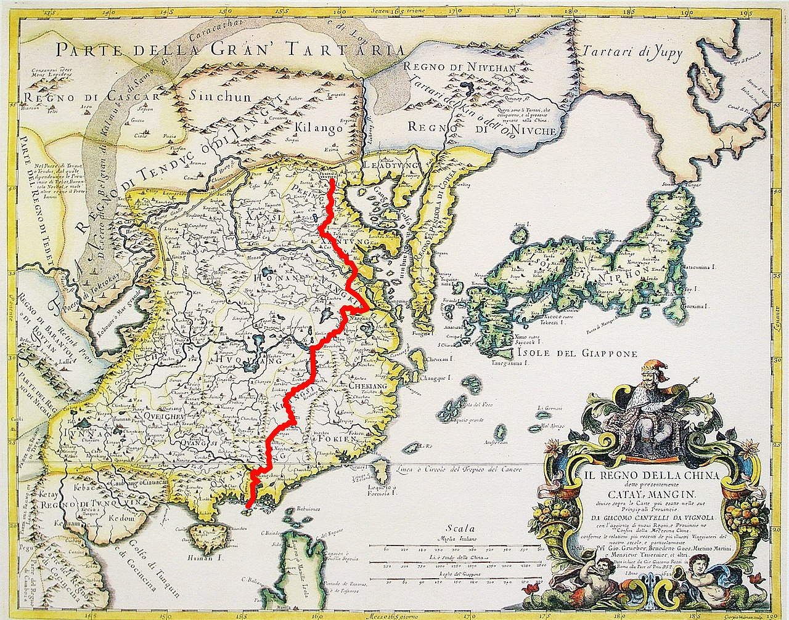
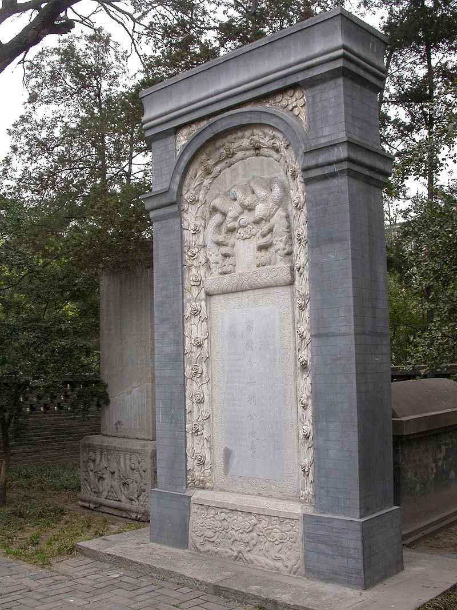

（万象特约作者：东西望）

【1610年5月11日】408年前的今天，让中国人第一次看到世界的天主之仆利玛窦逝世

【意大利的耶稣会】

我叫利玛窦，这是我的中国名字。1552年10月6日，我出生于基督教的教宗国，也就是意大利。那时的教宗国地方很大，不像现在，只剩下一个巴掌大的梵蒂冈。

因此，我从小便在浓郁的宗教氛围下长大。1571年8月15日，这一天是圣母升天节，19岁的我“光荣”地加入了耶稣会。耶稣会的宗旨是绝对效忠天主教会和教皇，降服一切“异端”！

在耶稣会的学校里，我学神学，学算术，学拉丁语，学希腊语……我学会了好多好多东西。

所编的《葡汉辞典》手稿.png)

（利玛窦编写的《葡汉辞典》手稿）

【印度的传教士】

26岁时，我获准去印度传教。我坐了6个月船，绕过好望角，历经艰辛，才到达印度。我是幸运的，船上的400名黑奴，死掉了10多个。

到了印度，我才发现上当了。耶稣会的创始人、号称历史上最伟大的传教士沙勿略，把印度描绘得像天堂一样，令人神往。可现实却是非常的糟糕，但我还是决定留下来，因为我是耶稣会的人！

（澳门的利玛窦雕像）

【广州的世界地图】

1582年，30岁的我被推荐去中国传教。我先到了澳门，开始学习汉语，看到那神秘的东方文字，我兴奋极了，真是不可思议。

然后，我到了广州，认识了来自南京的礼部王尚书。王尚书看到我随身带的世界地图《坤舆万国全图》，非常惊讶，说从来没见过，我就送给他一本。没想到王尚书就成了中国第一个看到世界地图的人。后来，地图还传到了日本。日本人也惊呆了。

2.jpg)

（《坤舆万国全图》）

【肇庆的仙花寺】

随后，我到了肇庆。两广总督和肇庆知府都接见了我。我说，我来自天竺，因为仰慕中国，希望可以留下。他们居然以为我是佛教徒，就同意了。我也没有说破，免得他们反悔了。

我在肇庆建了一座仙花寺。我穿上了佛教僧侣的衣服，这倒和神父的装束也相差不大。我挂上了圣母玛利亚的画像，居然有许多中国人前来跪拜，真是让我兴奋！但我担心，他们会以为上帝是女性，只管生孩子，便又改挂了基督像。

6年后，广东新任总督发现了我传教的事。他封了仙花寺，把我赶出了肇庆。在肇庆这几年，我认识一个叫瞿汝夔的信徒，他帮我把欧几里得《几何原本》的第一卷，翻译成了中文。

（中文版《几何原本》，藏于罗马中央国立图书馆）

【韶关的四书】

离开肇庆，我去了韶州，也就是今天的韶关，那里有几个传教士。然而几年后，他们要么死了，要么回了欧洲，就只剩下我一个人。

在这里，我开始读儒家经典《四书》，并翻译成拉丁文。这时候，我才知道，在中国佛教僧侣其实没什么地位，有地位的是儒家的士大夫。1594年，42岁的我，开始留长头发和胡子，穿上了儒士的服装。

（利玛窦在韶州时所穿的儒服，藏于意大利马切拉塔艺术学院）

【南昌的日食】

我开始和许多中国官员交往。第二年，有位官员的儿子生病了，我就去南京给他看病。回来时，我留住在南昌。1596年9月22日，我成功预测了日食，令大家惊叹不已。我一下子就成了名人。当地的王爷特地请我吃饭，还请我到白鹿洞书院讲学。

于是，我就成了中国教区的负责人。我想，应该去北京见皇帝，说说传教的事才好。正好王尚书也要去北京，就带我一起。1598年9月，我到了北京。不巧的是，正好日本进攻朝鲜，明朝抗日援朝，北京城里不准外国人长期逗留。一个月后，我只好回到南京。

（利玛窦像）

【南京的天主教堂】

在南京，我认识了许多高官名士，最有名的是一个叫徐光启的官员。他后来帮我翻译了《几何原本》的前6卷。

我还和大报恩寺的一名和尚，进行了一场辩论。我是经过专业逻辑训练的，自然是说的他哑口无言。

我还建了几座天主教堂，从此南京就成了中国最主要的天主教中心。

（南京石鼓路天主堂）

【北京的皇帝】

1601年，经过半年行程，我带着给皇帝的礼物，再次抵达北京。这次，我终于见到了这个神秘帝国的皇帝——万历皇帝。皇帝很喜欢我的礼物，允许我长期住在北京。

在北京，我认识了更多的士大夫官员。几年里，我发展了几百个人信奉了天主教。

1610年5月11日，58岁的我生病了，然后去见了上帝。经过皇帝的恩准，将我埋葬在今天的阜成门外。这里也就成了传教士的公墓，先后埋葬了数百名西方传教士。

（利玛窦从澳门到北京的路线图）

【天主教的仆人】

过了290年后，1900年，义和团把我们的墓地全部砸毁。后来，清政府重修了墓地，还立了一块道歉的石碑。过了60多年，又一群年轻人，把我们的墓地给砸了。后来再修，墓地就只剩下三块墓碑。

幸好我的墓碑还在，上面写着：“利先生，讳玛窦，号西泰，大西洋意大里亚国人。自幼入会真修，明万历壬午年航海首入中华行教。万历庚子年来都，万历庚戌年卒，在世五十九年，在会四十二年。”

1984年，天主教给了我“天主之仆”称号，我想我受之无愧。

（北京阜成门外的利玛窦墓碑）

（本文是万象历史·人物传记写作营的第21篇作品，是营员“东西望”的第7篇作品）